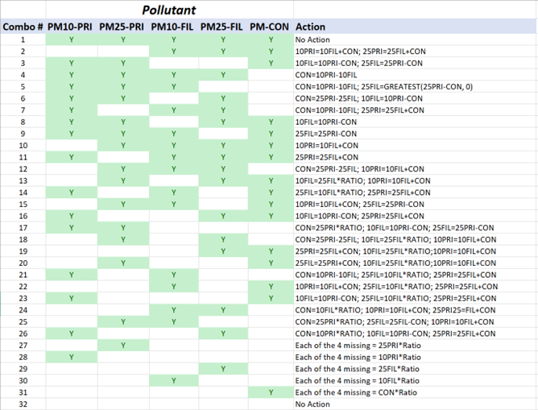

```{r, include=FALSE}
library(readxl)
library(knitr)
library(kableExtra)
library(readr)
library(ggplot2)
library(dplyr)
library(scales)
library(glue)
```

# 2023 NEI contents overview {#overview}

## What are EIS sectors?

First used for the 2008 NEI, EIS Sectors continue to be used for all 2023 NEI data categories. The sectors were developed to better group emissions for both CAP and HAP summary purposes. The EIS sectors are a grouping of emissions by the emissions process as indicated by the SCC. In building this list, we gave consideration not only to the types of emissions sources our data users most frequently ask for, but also to the need to have a relatively concise list in which all sectors have significant emissions for at least one pollutant. The SCC-EIS Sector cross-walk used for the summaries provided in this document is available for download from the ["Source Classification Codes"](https://ofmpub.epa.gov/sccwebservices/sccsearch/) (SCCs) website. No changes were made to the SCC-mapping or sectors used for the 2023 NEI except where SCCs were retired, or new SCCs were added. 

Some of the sectors include the nomenclature “NEC,” which stands for “not elsewhere classified.” This simply means that those emissions processes were not appropriate to include in another EIS sector and their emissions were too small individually to include as its own EIS sector.

Since the 2008 NEI, the inventory had been reported and compiled in EIS using five major data categories: point, nonpoint, onroad, nonroad and events. The event category was used to compile day-specific data from prescribed burning and wildfires. While events could be other intermittent releases such as chemical spills and structure fires, prescribed burning and wildfires had been a focus of the NEI creation effort and were the only emission sources contained in the event data category. However, starting with the 2020 NEI, we have aggregated the wildfires and prescribed burning emissions into county-level estimates and loaded these into the nonpoint data category. Table \@ref(tab:EISsector-EISdatacategory) shows the EIS sectors or source category component of the EIS sector in the left most column. EIS data categories -Point, Nonpoint, Onroad, and Nonroad- that have emissions in these sectors/source categories are also reflected.

As Table \@ref(tab:EISsector-EISdatacategory) illustrates, many EIS sectors include emissions from more than one EIS data category because the EIS sectors are compiled based on the type of emissions sources rather than the data category. Note that the emissions summary sector “Mobile – Aircraft” is reported partly to the point and partly to the nonpoint data categories and “Mobile – Commercial Marine Vessels” and “Mobile – Locomotives” are reported to the nonpoint data category. NEI users who aggregate emissions by EIS data category rather than EIS sector should be aware that these changes will give differences from historical summaries of “nonpoint” and “nonroad” data unless care is taken to assign those emissions to the historical grouping. 

```{r, include=FALSE}
df <- read_excel("./tables/Section-2/EISsector-EISdatacategory.xlsx")
df[is.na(df)] <- ""
```

```{r EISsector-EISdatacategory, tidy=FALSE, echo=FALSE, booktabs = TRUE}
kableExtra::kbl(
  df, longtable = TRUE, booktabs = TRUE,
  caption = 'EIS sectors/source categories with EIS data category emissions reflected.'
) %>%
kable_styling(full_width = FALSE, position = "center", latex_options = c("repeat_header", "hold_position"))
```

## How is the NEI constructed?

Data in the NEI come from a variety of sources. The emissions are predominantly from S/L/T agencies for both CAP and HAP emissions. In addition, the EPA quality assures and augments the data provided by states to assist with data completeness, particularly with the HAP emissions since the S/L/T HAP reporting is voluntary. 

The NEI is built by data category for point, nonpoint, nonroad mobile, and onroad mobile. Each data category contains emissions from various reporters in multiple datasets which are blended to create the final NEI “selection” for that data category. Each data category selection includes S/L/T data and numerous other datasets that are discussed in more detail in each of the following sections in this document. In general, S/L/T data take precedence in the selection hierarchy, which means that it supersedes any other data that may exist for a specific county/tribe/facility/process/pollutant. In other words, the selection hierarchy is built such that the preferred source of data, usually S/L/T, is chosen when multiple sources of data are available. There are exceptions to this general rule, which arise based on quality assurance checks and feedback from S/L/Ts that we will discuss in later sections. 

The EPA uses augmentation and additional EPA datasets to create the most complete inventory for stakeholders, for use in such applications as AirToxScreen, air quality modeling, national rule assessments, international reporting, and other reports and public inquiries. Augmentation of S/L/T data, in addition to EPA datasets, fills in gaps for sources and/or pollutants that are often not reported by S/L/T agencies. The basic types of augmentation are discussed in the following sections.

### Toxics Release Inventory Data

The ["Toxics Release Inventory"](https://www.epa.gov/tri) (TRI) is an EPA database containing data on disposal or other releases including air emissions of over 650 toxic chemicals from 21,000 facilities. One of TRI’s primary purposes is to inform communities about toxic chemical releases to the environment. Data are submitted annually by U.S. facilities that meet TRI reporting criteria.

The EPA used air emissions data from the 2023 TRI to supplement point source HAP and NH3 emissions provided to EPA by S/L/T agencies. For 2023, all TRI emissions values that could reasonably be matched to an EIS facility with some certainty and with limited risk of double-counting nonpoint emissions were loaded into the EIS for viewing and comparison if desired. This totaled 8,263 facilities, covering over 95% of emissions in the TRI dataset. In most cases, TRI data is only included in the 2023 NEI for those pollutants that were not reported anywhere at the EIS facility by the S/L/T agency; a common exception to this practice is when we believe S/L/T data are in error, or include zero emissions where we believe TRI estimates are more appropriate. The point section of this TSD provides more information on how TRI data was used to supplement the point inventory.

### Chromium Speciation

With the retirements of Chromium Trioxide (pollutant code = 1333820) and Chromic Acid (VI) (pollutant code = 7738945) in 2022, the 2023 reporting cycle included 3 valid pollutant codes for chromium, as shown in Table \@ref(tab:Cr-speciation).

```{r, include=FALSE}
df <- read_excel("./tables/Section-2/Cr-speciation.xlsx")
df[is.na(df)] <- ""
```

```{r Cr-speciation, tidy=FALSE, echo=FALSE, booktabs = TRUE}
kableExtra::kbl(
  df, longtable = TRUE, booktabs = TRUE,
  caption = 'Valid chromium pollutant codes.'
) %>%
kable_styling(full_width = FALSE, position = "center", latex_options = c("repeat_header", "hold_position"))
```

In the above table, chromium III and chromium (VI) are considered speciated, and so for clarity, chromium (pollutant 7440473) is referred to as “total chromium” in the remainder of this section. Total chromium could contain a mixture of chromium with different valence states. Since one key inventory use is for risk assessment, and since the valence states of chromium have very different risks, speciated chromium pollutants are the most useful pollutants for the NEI. Therefore, the EPA speciates S/L/T-reported and TRI-based total chromium into hexavalent chromium and non-hexavalent chromium. Hexavalent chromium, or Chromium (VI), is considered high risk and other valence states are not. Most of the non-hexavalent chromium is trivalent chromium (Chromium III); therefore, the EPA characterized all non-hexavalent chromium as trivalent chromium. The 2023 NEI does not contain any total chromium, only the speciated pollutants shown in Table \@ref(tab:Cr-speciation).

This section describes the procedure we used for speciating chromium emissions from total chromium that was reported by S/L/T agencies. 

We used the EIS augmentation feature to speciate S/L/T agency reported total chromium. For point sources, the EIS uses the following priority order for applying the factors:

  1)	By Process ID
  2)	By Facility ID
  3)	By County
  4)	By State
  5)	By Emissions Type (for NP only)
  6)	By SCC
  7)	By Regulatory Code
  8)	By NAICS
  9)	A Default value if none of the others apply

If a particular emissions source of total chromium is not covered by the speciation factors specified by any of the first 8 attributes, a default value of 34 percent hexavalent chromium, 66 percent trivalent chromium is applied.

For the 2023 chromium augmentation, only the “By Facility ID” (2), “By SCC” (6), and “By Default” (9) were used on S/L/T-reported total chromium values. For TRI dataset chromium, the “By NAICS” (8) option was primarily used, although a small number of “By Facility” (2) occurrences were used rather than NAICS. The EIS generates and stores an EPA dataset containing the resultant hexavalent and trivalent chromium species. For all other data categories (e.g., nonpoint, onroad and nonroad), chromium speciation is performed at the SCC level.

This procedure generated hexavalent chromium (Chromium (VI)) and trivalent chromium (Chromium III), and it had no impact on S/L/T agency data that were provided as one of the speciated forms of chromium. The sum of the EPA-computed species (hexavalent and trivalent chromium) equals the mass of the total chromium (i.e., pollutant 7440473) submitted by the S/L/T agencies.

The EPA then used this dataset in the 2023 NEI selection by adding it to the data category-specific selection hierarchy and by excluding the S/L/T agency unspeciated chromium from the selection through a pollutant exception to the hierarchy. 

Most of the speciation factors used in the 2023 NEI are SCC-based and are the same as were used in 2011 through 2020 NEI, based on data that has long been used by the EPA for air toxics analyses. However, some values are updated with every inventory cycle. New data may be developed by EPA during rule development or SLT HAP emissions review process. The speciation factors are accessed in the EIS through the reference data link “Augmentation Profile Information.” A chromium speciation “profile” is a set of output multiplication factors for a type of emissions source. The profile data for chromium are stored in the same tables as the HAP augmentation factors. The speciation factors are a specific case of HAP augmentation whereby the “output pollutants” are always hexavalent chromium and trivalent chromium, and the “input pollutant” is always chromium. There are 3 main tables and a summary table. The summary table excludes the metadata and comments regarding the derivation of the factors and assignment to SCCs; to learn more of the derivation of the factor or assignment of “profile” to a source, the main tables (not summary table) should be consulted.

The three main tables are:

- Augmentation Profile Names and Input Pollutants – general information about the profile and source of the profile names and factors.
- Augmentation Multiplication Factors – provides the output pollutants and multiplication factors associated with a given Augmentation Profile and input pollutant.
- Augmentation Assignments – provides the assignment of the profile to the data source (the list of 9 items above).

These tables are provided in the file “Chromium_Speciation_2023NEI_17apr2026.zip” on the ["2023 NEI supplemental data FTP site"](https://gaftp.epa.gov/Air/nei/2023/doc/supporting_data/).

### HAP Augmentation

The EPA supplements missing HAPs in S/L/T agency-reported data. HAP emissions are calculated by multiplying appropriate surrogate CAP emissions by an emissions ratio of HAP to CAP emission factors. For the 2023 NEI, we augmented HAPs for the point and nonpoint data categories. Generally, for point sources, the CAP-to-HAP ratios were computed using uncontrolled emission factors from the ["WebFIRE database"](https://www.epa.gov/electronic-reporting-air-emissions/webfire) (which contains primarily ["AP 42"](https://www.epa.gov/air-emissions-factors-and-quantification/ap-42-compilation-air-emissions-factors-stationary-sources) emissions factors). For nonpoint sources, the ratios were computed from the EPA-generated nonpoint data, which contain both CAPs and HAPs where applicable.

HAP augmentation is performed on each emissions source (i.e., specific facility and process for point sources, county and process level for nonpoint sources) using the same EIS augmentation feature as described in chromium speciation. However, unlike chromium speciation, there is no default augmentation factor so that not every process that has S/L/T CAP data will end up with augmented HAP data.

HAP augmentation input pollutants are S/L/T-submitted VOC, PM10-PRI, PM25-PRI, SO2, and PM10-FIL. The resulting output can be a single output pollutant or a full suite of output pollutants. Not every source that has a CAP undergoes HAP augmentation (i.e., livestock NH3 and fugitive dust PM25-PRI). The sum of the HAP augmentation factors typically does not equal 1 (100%) because not all the VOC or PM mass will be HAP. We try to ensure that the sum of HAP-VOC factors is less than 1 because it can’t be more, but it is sometimes close or equal to 1. HAP augmentation factors based on PM mass are typically much less than 1 for almost all SCCs. HAP augmentation factors are grouped into profiles that contain unique output pollutant factors related to a type of source. Assigning these profiles to the individual sources depends on the source attributes, commonly the SCC.

There are business rules specific to each data category discussed in the point and nonpoint sections of the TSD. The goal is to prevent double-counting of HAP emissions between S/L/T data and the EPA HAP augmentation output, and to prevent, where possible, adding HAP emissions to S/L/T-submitted processes that are not desired. NEI developers use their judgment on how to apply HAP augmentation to the resulting NEI selection. 

_Caveats_

HAP augmentation has limitations; HAP and CAP emission factors from WebFIRE do not necessarily use the same test methods. In some situations, the VOC emission factor is less than the sum of the VOC HAP emission factors. In those situations, we normalize the HAP ratios so as not to create more VOC HAPs than VOC. We are also aware that there are many similar SCCs that do not always share the same set of emission factors/output pollutants. We do not apply ratios based on emission factors from similar SCCs other than for mercury from combustion SCCs. We would prefer to get HAPs reported from S/L/T agencies or from facility reports to the Toxics Release Inventory, but HAP augmentation is used as the last available option. Compliance test data does not usually provide an annual emissions total.

Because most AP-42 factors are 20+ years old, many incremental edits to these factors have been made over time. We have removed some factors based on results of various air toxics assessments. For example, we discovered ethylene dichloride was being augmented for SCCs related to gasoline distribution. This pollutant was associated with leaded gasoline which is no longer used. Therefore, we removed it from our HAP augmentation between 2011 NEI v2 and 2014. We also received specific facility and process augmentation factors resulting from Air Toxics analyses. More discussion of the underlying data used for the 2023 NEI Point inventory is discussed in the point section of the TSD.

For point sources, HAPs augmentation data are not used when S/L/T air agency data exists at any process at the facility for the same pollutant. That means that if a S/L/T reports a particular HAP at some processes but misses others, then those other processes will not be augmented with that HAP. The HAP Augmentation Profile Names with input pollutants, multiplication factors, and profile assignments are provided in the file “HAP_Augmentation_2023NEI_17apr2026.zip” on the ["2023 NEI supplemental data FTP site"](https://gaftp.epa.gov/Air/nei/2023/doc/supporting_data/).

### Particulate Matter Augmentation

Particulate matter (PM) emissions species in the NEI are primary PM10 (pollutant code PM10-PRI in the EIS and NEI) and primary PM2.5 (PM25-PRI), filterable PM10 and filterable PM2.5 (PM10-FIL and PM25-FIL) and condensable PM (PM-CON). The EPA needs to augment the S/L/T agency PM components for the point and nonpoint inventories to ensure completeness of the PM components in the final NEI. In general, emissions for PM components missing from S/L/T agency inventories were calculated by applying factors to the PM emissions data supplied by the S/L/T agencies.

PM Augmentation is only run in EIS for point and nonpoint sources. Unlike the PM calculator/Augmentation tool used in the 2017 and previous NEIs, EIS PM Augmentation only gap-fills missing PM components, and does not overwrite existing S/L/T PM data, which already undergoes rudimentary EIS QA checks as the data is being loaded into EIS. 

The complete set of conditional logic statements used in EIS PM Augmentation are displayed in Figure \@ref(fig:PM-aug). The PM Augmentation Profile Names with input pollutants, multiplication factors, and profile assignments are provided in the file “PM_Augmentation_2023NEI_17apr2026.zip” on the ["2023 NEI supplemental data FTP site"](https://gaftp.epa.gov/Air/nei/2023/doc/supporting_data/).

```{r PM-aug, fig.cap="PM Augmentation computations based on S/L/T submitted pollutants", fig.alt="This figure shows PM Augmentation computations based on S/L/T submitted pollutants.",  out.width = if (knitr::is_latex_output()) "\\linewidth" else "100%", echo=FALSE}

```

### Other EPA Datasets

In addition to TRI, chromium speciation, HAP and PM augmentation, the EPA generates other data to produce a complete inventory. Starting with the 2020 NEI, as part of the NEI selection process, EIS generates speciated PM2.5 emissions for all sources with PM emissions. These PM species are a result of speciation where the NEI PM25-PRI emissions are split into five PM2.5 species: elemental (also referred to as “black”) carbon (EC), organic carbon (OC), nitrate (NO3), sulfate (SO4), and the remainder of PM25-PRI (PMFINE). In addition, a copy of PM25-PRI and PM10-PRI from mobile source diesel engines, relabeled as DIESEL-PM25 and DIESEL-PM10, respectively, are also generated. 

Examples of other EPA data for point sources include landfills, railyards, electric generating units (EGUs), and aircraft. 

### Data Tagging

S/L/T agency data generally is used first when creating the NEI selection. When S/L/T data are used, then the NEI would not use other data (primarily EPA data from stand-alone datasets or HAP, PM or TRI augmentation) that also may exist for the same process/pollutant. Thus, in most cases the S/L/T agency data are used; however, for several reasons, sometimes we need to exclude, or “tag out” S/L/T agency data. Examples of these "S/L/T tags” are when S/L/T agency staff alert the EPA to exclude their data (because of a mistake or outdated value), or when EPA staff find problems with submitted data. Another example is when S/L/T emissions data are significantly less than TRI and are presumed to be incomplete, which can happen for S/L/T that use automated gap-filling procedures for facilities that do not voluntarily provide HAP emissions. These automated procedures gap-fill only for processes that have emission factors and miss processes/pollutants that may have been reported to TRI using other means besides published emission factors.

In previous NEI years data tagging had also been used to avoid double-counting emissions by using emissions from more than one dataset because the two datasets were at different levels of granularity and thus not able to be integrated to the full process level of detail required by the standard selection hierarchy software. The primary example of this is the TRI dataset, which provides facility-total emissions rather than individual process-level emissions. Because the TRI emissions must be stored to a single emission process that is not the same as that used by the S/L/T agency, the standard hierarchy selection software would use both. Thus, tagging was used to “block” any TRI values where the S/L/T had reported the same pollutant at any process(es) within the same facility. Since the 2017 NEI, a series of additional rules were added to the selection hierarchy to avoid such tagging. Point source datasets are identified as being either Process-level, Unit-level, or Facility-level granularity, and the selection software now uses those identifications to avoid double-counting, avoiding the need for those types of tags.

### Inventory Selection

Once all S/L/T and EPA data are quality assured in the EIS, and all augmentation and data tagging are complete, then we use the EIS to create a data category-specific inventory selection. To do this, each EIS dataset is assigned a priority ranking prior to running the selection with EIS. The EIS then performs the selection at the most detailed inventory resolution level for each data category. For point sources, this is the process and pollutant level. For nonpoint sources, it is the process (SCC)/shape ID (i.e., ports) and pollutant level. For onroad and nonroad sources, it is process/pollutant. At these resolutions, the inventory selection process uses data based on highest priority and excludes data where it has been tagged. Selection rules are also applied to each data category selection; these are discussed in detail within each TSD section for these categories: Section 3 for Point sources, Section 4 for Nonroad Mobile, Section 5 for Onroad, and Section 6 for Nonpoint sources. The EPA then quality assures this final blended inventory to ensure expected processes/pollutants are included or excluded. The EIS uses the inventory selection to also create the SMOKE Flat Files, EIS reports, and data that appear on the NEI website.

## What are the sources of data in the 2023 NEI?

This section shows the contributions of S/L/T agency data to total emissions for the point and nonpoint data categories. Figure \@ref(fig:Contribution-to-point) shows the proportion of CAP, select HAPs, and HAP group emissions from various data sources in the NEI for point data category sources. Except for PM2.5 and PM10, most point CAP emissions come from S/L/T-submitted data. PM augmentation, which is based off incomplete S/L/T submittals of PM, accounts for a significant portion of PM point emissions. The data sources shown in the figure are described in more detail in the point section of the TSD.

```{r, include=FALSE}
df <- read_csv("./figures/Section-2/NEI2023_Section2_US_dcat_group_Figs_PT.csv")
# Explicitly set the order of the groups
df$Pollutant <- factor(df$Pollutant,levels= c("CO","NH3","NOX","PM10","PM2.5","SO2","VOC","Lead","Mercury","Acid-Gases","HAP-Metal","HAP-VOC"))
df <- df %>%
  group_by(Pollutant) %>%
  mutate(Proportion = Value / sum(Value))
```

```{r Contribution-to-point, fig.cap="Relative contributions for various data sources of Point emissions for CAPs and select HAPs", fig.alt="Weighted bar chart of pollutants by source.", echo=FALSE}
p <- ggplot(df, aes(x = Pollutant, y = Proportion, fill = Source)) +
  geom_bar(stat = "identity", position = "fill") +
  scale_y_continuous(labels = percent_format()) +
  scale_fill_brewer(palette = "Dark2") +  # Use a Brewer2 palette
  theme_minimal() +
  theme(axis.text.x = element_text(angle = 45, hjust = 1))
print(p)
ggsave("figures/Section-2/NEI2023_Section2_US_dcat_group_Figs_PT.png",plot=p,width=6,height=4,bg="white")
```
<a href="figures/Section-2/NEI2023_Section2_US_dcat_group_Figs_PT.png" download="figures/Section-2/NEI2023_Section2_US_dcat_group_Figs_PT.png" class="btn btn-primary">Download Figure</a>

Figure \@ref(fig:Contribution-to-nonpoint) shows the proportion of CAP, select HAPs, and HAP group emissions from various data sources in the NEI for nonpoint data category sources. Biogenic sources, all EPA data, are not included in this table. Acid Gases include the following pollutants: hydrogen cyanide, hydrochloric acid, hydrogen fluoride, and chlorine. HAP VOC emissions consist of dozens of VOC HAP species, that in-aggregate, should be less than VOC in our QA checks. HAP metal emissions consist of the following compound groups: Antimony, Arsenic, Beryllium, Cadmium, Chromium, Cobalt, Lead, Manganese, Mercury, Nickel and Selenium. More than 50% of nonpoint pollutant totals come from some type of EPA source; however, as discussed in Section 6, S/L/T-submitted nonpoint activity data is absorbed into EPA nonpoint tools and are therefore classified as “EPA” data. Nonpoint NH3 is dominated by the agricultural livestock waste and fertilizer application sectors. The large “EPA Nonpoint” bars for PM10 and PM2.5 are predominantly fires and dust sources from unpaved roads, agricultural dust from crop cultivation, and construction dust.

```{r, include=FALSE}
df <- read_csv("./figures/Section-2/NEI2023_Section2_US_dcat_group_Figs_NP.csv")
# Explicitly set the order of the groups
df$Pollutant <- factor(df$Pollutant,levels= c("CO","NH3","NOX","PM10","PM2.5","SO2","VOC","Lead","Mercury","Acid-Gases","HAP-Metal","HAP-VOC"))
df <- df %>%
  group_by(Pollutant) %>%
  mutate(Proportion = Value / sum(Value))
```

```{r Contribution-to-nonpoint, fig.cap="Relative contributions for various data sources of Nonpoint emissions for CAPs and select HAPs.", echo=FALSE}
p <- ggplot(df, aes(x = Pollutant, y = Proportion, fill = Source)) +
  geom_bar(stat = "identity", position = "fill") +
  scale_y_continuous(labels = percent_format()) +
  scale_fill_brewer(palette = "Set1") +  # Use a Brewer2 palette
  theme_minimal() +
  theme(axis.text.x = element_text(angle = 45, hjust = 1))
print(p)
ggsave("figures/Section-2/NEI2023_Section2_US_dcat_group_Figs_NP.png",plot=p,width=6,height=4,bg="white")
```
<a href="figures/Section-2/NEI2023_Section2_US_dcat_group_Figs_NP.png" download="figures/Section-2/NEI2023_Section2_US_dcat_group_Figs_NP.png" class="btn btn-primary">Download Figure</a>

We did not compute relative contributions of emissions from nonroad and onroad data categories because of the nature in how emissions are created for these sources - via a mix of S/L/T and EPA activity data and processed through the MOVES model. California, which uses its own onroad and nonroad mobile models, was the only state that provided emissions rather than inputs for EPA models (this is in accordance with the AERR). All other states were required to provide inputs to the EPA models. Onroad and nonroad mobile data categories use the MOVES emissions model, and the EPA primarily collected model inputs from S/L agencies for these categories and ran the models using these inputs to generate the emissions. The S/L agencies that provided inputs are presented in the nonroad and onroad sections of the TSD.

##	What are the top sources of some key pollutants?

Table \@ref(tab:EISsector-Totals) provides a summary of CAP and total HAP emissions for all EIS sectors, including the biogenic emissions from vegetation and soil. Emissions in federal waters and from vegetation and soils have been split out and totals both with and without these emissions are included. Emissions in federal waters include offshore drilling platforms and commercial marine vessel emissions outside the typical 3-10 nautical mile boundary defining state waters. All emissions values are bounded by the caveats and methods described by this documentation.

```{r, include=FALSE}
df <- read_excel("./tables/Section-2/EISsector-Totals.xlsx")
df[is.na(df)] <- ""
df_fmt <- df %>%
  mutate(across(where(is.numeric), ~ {
    x <- .
    out <- as.character(x)

    zero <- !is.na(x) & x == 0
    out[zero] <- "0"

    tiny <- !is.na(x) & x > 0 & x < 1e-3
    if (any(tiny)) {
      s <- format(signif(x[tiny], 3), scientific = FALSE, trim = TRUE, digits = 15)
      s <- sub("(\\.\\d*?)0+$", "\\1", s)
      s <- sub("\\.$", "", s)
      out[tiny] <- s
    }
    out
  }))
align <- ifelse(sapply(df, is.numeric), "r", "l")
```

```{r EISsector-Totals, tidy=FALSE, echo=FALSE, warning=FALSE, message=FALSE}
kableExtra::landscape(
  kableExtra::kbl(df_fmt, booktabs  = FALSE,
    longtable = TRUE, caption   = "EIS sectors and associated 2023 CAP and total HAP emissions (thousands of tons/year)",
    align = align,  na  = ""
  ) |>
    kableExtra::kable_styling(
      full_width = FALSE,
      position = "center",
      latex_options = c("hold_position", "repeat_header", "scale_down"),
      font_size = 8))
```
1: Total HAP does not include diesel PM, which is not a HAP listed by the Clean Air Act.

##	How does this NEI compare to past inventories?

Many similarities exist between the 2023 NEI approaches and past NEI approaches, notably that the data are largely compiled from data submitted by S/L/T agencies for CAPs, and that the HAP emissions are augmented by the EPA to differing degrees depending on geographical jurisdiction because they are a voluntary contribution from the partner agencies. In 2023, S/L/T participation was again somewhat more comprehensive than the previous NEI. The NEI program continues with the 2023 NEI to work towards a complete compilation of the nation’s CAPs and HAPs. The EPA provided feedback to S/L/T agencies during the compilation of the data on critical issues, such as potential outliers, missing SCCs, missing mercury (Hg) data and coke oven data, as has been done in the past, collected responses from S/L/T agencies to these issues, and improved the inventory for the release based on S/L/T agency feedback. In addition to these similarities, there are some important differences in how the 2023 NEI has been created and the resulting emissions, which are described in the following two subsections.

### Differences in approaches

With any new inventory cycle, changes to approaches are made to improve the process of creating the inventory and the methods for estimating emissions. The key changes for the 2023 cycle are highlighted here. 

To improve the process, we learned from the prior triennial inventories (for 2008, 2011, 2014, 20217, and 2020) compiled with the EIS. We made changes to state-county Federal Information Processing Series (FIPS) codes, SCC codes, and refined quality assurance checks and features that were used to assist in improvements to nonpoint data category activity data input templates. We retained the Nonpoint Survey functionality used in the 2020 NEI (introduced for the 2014 NEI) to assist with S/L/T and EPA data reconciliation for the nonpoint data.

In addition to process changes, we added estimates for the first time for several source categories and improved emissions estimation methods for several source categories. We summarize the differences in approaches by data category in the following sections.

#### Point data category

For point sources, there were no major methodology or process changes for 2023 NEI. We did, however, incorporate additional TRI facility matches into EIS. Additionally, a point source HAP review was conducted and corrections to data were received. More information on point source improvements and approaches is available in the point section of this TSD.

#### Nonpoint data category

We made a significant process update and method improvements for several stationary nonpoint sectors. The EPA creates and provides emissions estimation tools for two purposes: 1) as tools for S/L/T agencies to use themselves, and 2) to backfill emissions values where not provided by S/L/T agencies.

For all nonpoint categories, we updated the activity data to use the newest data available, at the time, to represent the 2023 inventory year; in most cases, this is year-2023 activity data. Most emission changes for all nonpoint sources not otherwise discussed in this section resulted from these activity data updates -be they from EPA or provided directly from S/L/Ts.

_Process Improvements_

As part of the 2017 NEI development process, we introduced “Input Templates” for S/L/Ts to provide activity data for several nonpoint data category tools. By providing templates where S/L/Ts can review the previous year’s data, the data source, and easily update values at a county or state level, that then feeds into EPA’s emissions estimation tools, assures that the calculations and methods are identical. EPA provides default Input Templates to S/L/T inventory developers for them to review and submit their own estimates if they have more local or higher quality data. We encourage S/L/Ts to submit activity data inputs rather than direct emission submittals for many nonpoint categories. EPA downloads all inputs, EPA and S/L/T-submitted, periodically during the NEI development process to generate draft emission estimates prior to finalizing the NEI.

For the 2023 NEI, we integrated the templates directly into EIS, where reporting agencies can view and edit in EIS directly or bulk download, edit, and upload to EIS. Building the templates into EIS also allows for automated quality assurance of agency submitted data versus EPA default estimates, and immediate feedback on potential critical errors. In the 2020 NEI, these templates were stored on a shared website where version control and data integrity and timely feedback were significant challenges. 

Other than minor SCC changes and adding new source categories that EPA estimates for the 2023 NEI, no changes were made to the Nonpoint Survey, first introduced for the 2014 NEI development cycle. 

_Method Improvements_

**Road Dust**: Road dust emissions are one of the largest sources of primary particulate matter emissions in the United States. In the 2023 NEI, EPA leveraged telematics data to update and better reflect vehicular miles traveled on paved and unpaved roads at the county-level. This update led to a significant decline in estimated primary particulate matter emissions from road dust in the 2023 NEI when compared to the 2020 NEI.

**Cooking**: By leveraging meat consumption statistics provided by the U.S. Department of Agriculture, EPA was able to better reflect the true activity of commercial cooking and subsequent emissions. In total, estimated emissions from commercial cooking in the 2023 NEI are significantly lower when compared to the 2020 NEI. In addition, methodological updates were implemented to better estimate emissions from residential cooking.

**Roofing Asphalt**: Nationwide default estimates of emissions from roofing asphalts, which include asphalt cements and emulsions used in the manufacturing of asphalt shingles, asphalt sealant, and roof tar, were introduced for the first time in the 2023 NEI.

**Residential Wood Combustion**: We used Residential Energy Consumption Survey (RECS) microdata analysis to better allocate state level wood consumption from urban to rural counties. Emission factors are distribution profiles for woodstoves were also updated. Nationally, PM2.5 emissions are similar to the 2020 NEI; however, emissions are distributed more realistically to rural counties than urban counties compared to the 2020 NEI.

**Structure Fires and Motor Vehicle Fires**: A new source category that EPA estimates for the 2023 NEI, we leveraged U.S. Fire Administration (USFA) National Fire Incident Reporting System (NFIRS) data with fuel loading and emission factor assumptions from a 2022 study [[ref 1](#overview_references)]. We also accounted for the August 2023 wildfire urban interface Lahaina (Maui County Hawaii) fires [[ref 2](#overview_references)]. While CAP emissions are very small nationally, due to the type of materials combusted for these sources, air toxics such as polycylic aromatic hydrocarbons (PAHs) are more significant and impact national trends for the “Miscellaneous” tier.

**Campfires**: A new source category that EPA estimates for the 2023 NEI, campfires data from U.S. Campgrounds provide most public campground and campsite data and combined with assumptions on burn rates and existing emissions factors, yield a modest approximately 14,000-ton contribution to national PM2.5 estimates.

**Other Ammonia**: These are a new set of sources that EPA estimates for the 2023 NEI that includes direct ammonia (NH3) from dog, cat, and deer waste, and human processes such as respiration, perspiration, cigarette smoke, and infant diaper waste. In previous NEIs, these sources were estimated by only a couple states. Nationally, these sources contribute approximately 128,000 tons of NH3, a small portion of the more than 4 million tons of overall NH3 (dominated by livestock waste and fertilizer application); however, these sources are concentrated more in urban areas.

**Oil and Gas Exploration and Production**: Year 2023 saw large increase in feet drilled for oil and gas wells compared to low drilling year in year 2020. The estimated number of feet drilled in 2023 was 425 million feet while only 100 million feet were drilled in year 2020. Year to year changes in feet drilled are not unusual, however 2020 was an unusually low year for drilling activity. This resulted in a moderate increase in NOX for this sector for the 2023 NEI when compared to the 2020NEI with most of the increase occurring in the Permian basin.

**NH3 from soils and vegetation**: Prior to the 2023 NEI, these estimates were classified entirely as anthropogenic “Agricultural fertilizer application” NH3 emissions. While the methodology for computing these estimates is unchanged for the 2023 NEI, the air quality model (CMAQ v5.4) used to estimate the NH3 estimates was modified to output non-agricultural land biogenic NH3 emissions separately from agricultural land emissions. Therefore, while the national total NH3 from this model is approximately 1.8 million tons of NH3 in both 2020 and 2023, for 2023, approximately 0.7 million tons are now classified as biogenic, with the remaining 1.1 million tons being agricultural land. This impacts national NH3 trends for both agriculture fertilizer (Miscellaneous Tier) and biogenics, despite national total NH3 for these sum processes being similar in 2020 and 2023.

**Soil NOX**: Prior to the 2023 NEI, the nitric oxide (NO) emissions output from the Biogenic Emission Inventory System (BEIS) model as strictly biogenic. Starting with the 2023 NEI, BEIS output for NO is separated between vegetation on non-agricultural lands (biogenic) versus that related to fertilizer application on agricultural lands. Therefore, while the underlying model methodology is unchanged and overall NOX (NO) estimates from BEIS are very similar, 1.03 million tons in both the 2020 and 2023 NEI, where these emissions were entirely “biogenic” in the 2020 NEI, the 2023 now apportions approximately 589,000 tons as anthropogenic agricultural fertilizer application sector (Miscellaneous Tier), and only 442,000 tons as biogenic.

**Fires**: Emissions from wildland fires are variable from year to year but are typically a significant source of primary particulate matter (PM) in the United States. In the 2023 NEI emission factors for PM increased nationwide resulting in comparable total PM emissions to the 2020 NEI despite 2023 having substantially lower US fire activity. The 2023 NEI also introduced region and landcover specific SCCs rather than aggregate SCCs. Additionally, two new fire sources were added for the 2023 NEI: pile burns and agricultural ditch burns.

Similar to the 2020 NEI, all fires data are included in the nonpoint data category for the 2023 NEI. This is simply a format issue as the underlying methodology for computing wildland fires (wildfires and prescribed burning) are still developed using satellite data for location and day-specific fires, but for the NEI, are subsequently aggregated to the county-level. 

#### Onroad and nonroad data categories

For mobile sources, onroad methodology used an updated version of the MOVES model (MOVES5) with updated mobile source activity data such as vehicle miles travelled (VMT), age distributions, and fuel type mix, and improved idling computations; we also received new telematics data from StreetLight Data, Inc. For both onroad and nonroad, we relied on model inputs provided by S/L/T agencies and other sources, except for California and Tribes, who submitted emissions estimates. A key improvement for onroad mobile sources is NH3 emission factor updates and new vehicle registration data. Nonroad mobile methods are essentially unchanged from those in the 2020 NEI. The nonroad mobile onroad mobile sections of this TSD provide more detail on these improvements.

###	Differences in emissions between 2023 and 2020 NEI

This section presents a comparison from the 2020 NEI to the 2023 NEI. Table \@ref(tab:2023v2020CAP) compares CAP emissions for the 2023 minus 2020 NEI for seven highly aggregated emission sectors. Table \@ref(tab:2023v2020HAP) compares emissions for select HAPs for the 2023 minus 2020 NEI for the same seven highly aggregated emission sectors. Emissions from the biogenic (natural) sources are excluded, and the wildfire sector is shown separately for CAPs and HAPs. While Pb is a CAP for the purposes of the NAAQS, due to toxic attributes and inclusion in previous national air toxics assessments, it is reviewed here with the HAPs. The HAPs selected for comparison are based on their national scope of interest as defined by air toxics screening assessments. With a couple of notable exceptions, CAP emissions are lower overall in 2023 than in 2020. Some specific sector/pollutants increased in 2023 from 2020. 

The increase from fuel combustion for VOC is driven by new emission factors for residential wood combustion. Conversely, the decrease in coal-fired electric generating unit (EGU) emissions account for the decrease in overall NOX and SO2 fuel combustion. 

Increases from oil and gas exploration and production, particularly those in the Permian basin, account for the increase in NOX and VOC industrial processes. 

Miscellaneous NOX increase is entirely driven by the aforementioned change in accounting of the biogenic model soil nitric oxide (NO) emissions output from the Biogenic Emission Inventory System (BEIS) from strictly biogenic in the 2020 NEI to those related to fertilizer application on agricultural lands. The underlying model methodology is unchanged and overall NOX (NO) estimates from BEIS are very similar, 1.03 million tons in both the 2020 and 2023 NEI; however, these emissions were entirely “biogenic” in the 2020 NEI and the 2023 now apportions approximately 589,000 tons as anthropogenic agricultural fertilizer application sector (broad sector “Miscellaneous”), and only 442,000 tons as biogenic. In contrast, the large decrease in Miscellaneous NH3 are primarily the result of agricultural fertilizer application estimates now separating out NH3 emissions to reflect the component from non-agricultural land biogenic NH3 emissions in the 2023 NEI.

Increases in nonroad mobile CO and SO2 are driven primarily by post-pandemic increased aircraft and commercial marine vessel activity. 

There were comparatively less wildfire activity in 2023 than 2020, more than offsetting the increase in PM emission factors in the 2023 methodology, explaining the significant decreases in wildfire emissions for 2023.

```{r, include=FALSE}
df <- read_excel("./tables/Section-2/2023v2020CAP.xlsx")
df[is.na(df)] <- ""
```

```{r 2023v2020CAP, tidy=FALSE, echo=FALSE, booktabs = TRUE}
kableExtra::kbl(df, longtable = TRUE, booktabs   = TRUE,
  caption = "2023 and 2020 NEI CAP emissions and broad sector changes (2023 minus 2020) in tons.",
  digits = 0, na = "" 
) %>%
  kable_styling(full_width = FALSE, position = "center", font_size = 10, latex_options = c("repeat_header", "hold_position")
  ) %>%
  kableExtra::column_spec(1, latex_column_spec = "p{3cm}") %>%
  kableExtra::column_spec(2, latex_column_spec = "p{1.5cm}") %>%
  kableExtra::column_spec(3, latex_column_spec = "p{1.5cm}") %>%
  kableExtra::column_spec(4, latex_column_spec = "p{1.5cm}") %>%
  kableExtra::column_spec(5, latex_column_spec = "p{1.5cm}") %>%
  kableExtra::column_spec(6, latex_column_spec = "p{1.5cm}") %>%
  kableExtra::column_spec(7, latex_column_spec = "p{1.5cm}") %>%
  kableExtra::column_spec(8, latex_column_spec = "p{1.5cm}")
```

```{r, include=FALSE}
df <- read_excel("./tables/Section-2/2023v2020HAP.xlsx", guess_max = Inf)
cols2 <- c("Ethylene Oxide", "Hexavalent Chromium")
df <- df %>%
  mutate(across(all_of(cols2), ~ suppressWarnings(parse_number(as.character(.x)))))
digits <- rep(0, ncol(df))
names(digits) <- names(df)
digits[intersect(cols2, names(df))] <- 2
options(scipen = 999) 
```

```{r 2023v2020HAP, tidy=FALSE, echo=FALSE, booktabs = TRUE}
kableExtra::kbl(df, longtable = TRUE, booktabs = TRUE,
  caption = "2023 and 2030 NEI select HAP emissions and broad sector changes (2023 minus 2020) in tons.",
  digits = digits, na = "") %>%
  kable_styling(full_width = FALSE, position = "center", font_size = 10,
                latex_options = c("repeat_header", "hold_position")) %>%
  kableExtra::column_spec(1, latex_column_spec = "p{3cm}") %>%
  kableExtra::column_spec(2, latex_column_spec = "p{1.5cm}") %>%
  kableExtra::column_spec(3, latex_column_spec = "p{1.5cm}") %>%
  kableExtra::column_spec(4, latex_column_spec = "p{1.5cm}") %>%
  kableExtra::column_spec(5, latex_column_spec = "p{2cm}") %>%
  kableExtra::column_spec(6, latex_column_spec = "p{2cm}") %>%
  kableExtra::column_spec(7, latex_column_spec = "p{1.5cm}")
```

## How well are tribal data and regions represented in the 2023 NEI?

Two tribes submitted data to the EIS for 2023 as shown in Table \@ref(tab:participation). In this table, a “CAP, HAP” designation indicates that both criteria and hazardous air pollutants were submitted by the tribe. Facilities on tribal land were augmented using TRI, HAPs and PM in the same manner as facilities under the state and local jurisdictions, as explained in Section 3. Fourteen additional tribal agencies, shown in Table \@ref(tab:Tribal-Facilities), which did not submit any data, are represented in the point data category of the 2023 NEI due to the emissions added by the EPA. The emissions for these facilities are from the EPA gap fill datasets for airports, EGUs, landfills, and TRI data. Furthermore, many nonpoint datasets included in the NEI are presumed to include tribal activity. Most notably, the oil and gas nonpoint emissions have been confirmed to include activity on tribal lands because the underlying database contained data reported by tribes.

```{r, include=FALSE}
df <- read_excel("./tables/Section-2/participation.xlsx")
df[is.na(df)] <- ""
```

```{r participation, tidy=FALSE, echo=FALSE, booktabs = TRUE}
kableExtra::kbl(
  df, longtable = TRUE, booktabs = TRUE,
  caption = 'Tribal participation in the 2023 NEI.'
) %>%
kable_styling(full_width = FALSE, position = "center", latex_options = c("repeat_header", "hold_position"))
```

```{r, include=FALSE}
df <- read_excel("./tables/Section-2/Tribal-Facilities.xlsx")
df[is.na(df)] <- ""
```

```{r Tribal-Facilities, tidy=FALSE, echo=FALSE, booktabs = TRUE}
kableExtra::kbl(
  df, longtable = TRUE, booktabs = TRUE,
  caption = 'Facilities on Tribal lands with 2023 NEI emissions from EPA only.'
) %>%
kable_styling(full_width = FALSE, position = "center", latex_options = c("repeat_header", "hold_position")) %>%
    kableExtra::column_spec(1, latex_column_spec = "p{8cm}") %>%
    kableExtra::column_spec(2, latex_column_spec = "p{4cm}")
```

## What does the 2023 NEI tell us about mercury?

The NEI documentation includes this Hg section because of the importance of this pollutant and because the sectors used to categorize Hg are different than the sectors presented for the other pollutants. The Hg sectors primarily focus on regulatory categories and categories of interest to the international community; emissions are summarized by these categories at the end of this section, in Table \@ref(tab:Hg-Trends).

A summary of all data sources used to create the 2023 Hg inventory is shown in Figure \@ref(fig:Hg-by-category).

```{r, include=FALSE}
df <- read_csv("./figures/Section-2/NEI2023_Section2_Hg_by_category.csv")
# Explicitly set the order of the groups
df$Pollutant <- factor(df$Pollutant, levels = c("Point","Nonpoint","Onroad","Nonroad"))
```

```{r Hg-by-category, fig.cap="Data sources of Hg emissions (tons) in the 2023 NEI, by data category.", echo=FALSE, fig.pos='H', fig.align='center'}
p <- ggplot(df, aes(x = Pollutant, y = Value, fill = Source)) +
  geom_col() +  # stacked by default; shows totals in tons
  scale_y_continuous(labels = scales::comma) +
  scale_fill_brewer(palette = "Dark2") +
  labs(x = NULL, y = "Tons of Mercury") +
  theme_minimal() +
  theme(axis.text.x = element_text(angle = 45, hjust = 1))
print(p)
ggsave("figures/Section-2/NEI2023_Section2_Hg_by_category.png",plot=p,width=6,height=4,bg="white")
```
<a href="figures/Section-2/NEI2023_Section2_Hg_by_category.png" download="figures/Section-2/NEI2023_Section2_Hg_by_category.png" class="btn btn-primary">Download Figure</a>

Mercury emission estimates in the 2023 NEI sum to 29.3 tons, with 28.9 tons from stationary sources and 0.4 tons from mobile sources (including aircraft, commercial marine vessels and locomotives). In the above figure the “EPA mobile” accounts for all EPA datasets in the onroad mobile and nonroad mobile data categories: onroad mobile and nonroad equipment sources; this does not include emissions from commercial marine vessel and locomotive (also referred to as rail) emissions which reside in the EPA Nonpoint dataset.

Due to large decreases of emissions from sources within the regulated categories, most of the emissions are from sources other than the regulated categories. The “other” includes but is not limited to, landfills, primary and secondary metal production, gas turbines, chemical manufacturing processes, production of gypsum and other mineral products, flash steam geothermal power plants, petroleum refineries, human cremation, residential fuel combustion, and fluorescent lamp breakage. Of the regulatory categories trended, the three with highest emissions in the 2023 NEI are: electric arc furnaces (4.3 tons), coal -fired EGU with units larger than 25 megawatts (MW) (2.7 tons), Portland cement production (1.5 tons), and boilers and process heaters (1.3 tons). Since the 2017 NEI, coal-fired EGUs no longer comprise the largest portion of the mercury emissions in NEI. 

Mercury emissions from coal and oil-fired electric generating units subject to the Mercury and Air Toxics Standards (MATS) [[ref 3](#overview_references)] originate from SLT submitted mercury emissions estimates. A very small fraction originates from the TRI dataset. An insignificant fraction is derived from HAP augmentation.

In addition to Figure \@ref(fig:Hg-by-category), Table \@ref(tab:Hg-emissions) lists the emissions by data source with the above data sets further broken out. More information on these datasets are available in the point, nonroad mobile, onroad mobile, and nonpoint ssections of this TSD.

```{r, include=FALSE}
df <- read_excel("./tables/Section-2/Hg-emissions.xlsx")
cols2 <- c("Hg Emissions (tons)")
df <- df %>%
  mutate(across(all_of(cols2), ~ suppressWarnings(parse_number(as.character(.x)))))
digits <- rep(0, ncol(df))
names(digits) <- names(df)
digits[intersect(cols2, names(df))] <- 2
options(scipen = 999) 
df[is.na(df)] <- ""
```

```{r Hg-emissions, tidy=FALSE, echo=FALSE, booktabs = TRUE}
kableExtra::kbl(df, longtable = TRUE, booktabs  = TRUE,
  caption = "2023 NEI Hg emissions (tons) for each dataset type and group.",
  digits = digits,  na = ""
) %>%
kable_styling(full_width = FALSE, position = "center", latex_options = c("repeat_header", "hold_position")) %>%
    kableExtra::column_spec(1, latex_column_spec = "p{3cm}") %>%
    kableExtra::column_spec(2, latex_column_spec = "p{4cm}") %>%
    kableExtra::column_spec(3, latex_column_spec = "p{5cm}") %>%
    kableExtra::column_spec(4, latex_column_spec = "p{2cm}")
```

The point and nonpoint data category datasets are described in more detail in their respective sections of this TSD, and we highlight some key datasets here.

For point sources, we gap-filled Hg that was not reported by S/L/Ts in the same way as other HAPs – including use of the TRI, EPA HAP Augmentation or “HAP Aug” in the figure, and other EPA data developed for gap filling. Electric arc furnaces (EAFs) were gap filled using HAP Aug and TRI only. The HAP augmentation used facility specific augmentation factors developed so that the resultant emissions would be the same as computed in the NEI since 2014. This approach was used to provide a more automated approach than to submit the same emissions year after year, that would (via the use of CAPs) account for changes in activity. The 2014 estimates were developed by applying a 34% reduction to 2011 NEI emissions (process level). The 2011 NEI emissions were based on data developed for the National Emission Standards for Hazardous Air Pollutants (NESHAP) for Area Sources: Electric Arc Furnace Steelmaking Facilities (subpart YYYYY). The 34% value was the average reduction from a limited 3 facility test program in 2016 (the range was 11-70%) -based on personal communication with Donna Lee Jones, EPA lead for the NESHAP. We have used the same approach since the 2014 NEI for using TRI data associated EAFs in that we excluded S/L/T estimates at non-EAF processes if they were significantly lower than the TRI Hg value. The largest contribution to total EAF emissions is S/L/T data which sum to about 3.33 tons. The sum of TRI Hg for EAFs is about 0.78 tons. EAF emissions from HAP Augmentation is about 0.15 tons. 

The nonpoint non-combustion-related and cremation categories used the same or very similar approaches as were used since the 2014 NEI, though activity data was updated. These nonpoint non-combustion mercury methodologies are described in Section 15. EPA estimates for these categories are included in the “2023EPA_NONPOINT” (along with other EPA nonpoint category estimates) shown in Figure \@ref(fig:Hg-by-category) and Table \@ref(tab:Hg-emissions). Some of these categories have a point contribution, though the specific categories do not exactly line up between the nonpoint and point data categories. They are summarized below:

- switches and relays – emissions from the shredding and crushing of cars containing Hg components at auto crushing yards, SCC = 2650000002: Waste Disposal, Treatment, and Recovery; Scrap and Waste Materials; Scrap and Waste Materials; Shredding (1.39 tons nonpoint; 14.4 lbs point)
- landfill “working face” emissions associated with the release of mercury via churning/crushing of new material added to the landfill, SCC= 2620030001: Waste Disposal, Treatment, and Recovery; Landfills; Municipal; Dumping/Crushing/Spreading of New Materials (working face) (0.914 tons nonpoint, total point landfill Hg is 0.20 tons)
- thermometers and thermostats – the portion that emit mercury prior to disposal at landfills or incinerators, SCC=2650000000:	Waste Disposal, Treatment, and Recovery; Scrap and Waste Materials; Scrap and Waste Materials; Total: All Processes (0.118 tons nonpoint)
- dental amalgam – emissions at dentist offices and from evaporation in teeth, SCC=2850001000: Miscellaneous Area Sources; Health Services; Dental Alloy Production; Overall Process (0.45 tons nonpoint)
- general laboratory activities, SCC = 2851001000: Miscellaneous Area Sources; Laboratories; Bench Scale Reagents; Total (0.052 tons nonpoint)
- fluorescent lamp breakage, SCC= 2861000000: Miscellaneous Area Sources; Fluorescent Lamp Breakage; Non-recycling Related Emissions; Total (0.947 tons nonpoint)
- fluorescent lamp recycling, SCC= 2861000010: Miscellaneous Area Sources; Fluorescent Lamp Breakage; Recycling Related Emissions; Total (less than 0.1 lb nonpoint, point sum of breakage and recycling less than 0.01 lbs)
- animal cremation, SCC= Miscellaneous Area Sources; Other Combustion; Cremation; Animals (4.49 lbs nonpoint, 80.0 lbs point)
- human cremation – emissions primarily due to mercury in dental amalgam, SCC=2810060100: Miscellaneous Area Sources; Other Combustion; Cremation; Humans (2.82 tons nonpoint, 264.8 lbs point). This is a 22% increase from 2020 emissions.

Since mercury is a HAP, it is reported voluntarily by S/L/T agencies. For the point data category of the 2023 NEI, 48 states and 6 local agencies reported mercury emissions. Table \@ref(tab:pt-emissions-by-agency) provides the tons of emissions from EPA, the SLT, and the resulting percent of emissions for the point data category.

```{r, include=FALSE}
df <- read_excel("./tables/Section-2/pt-emissions-by-agency.xlsx")
num_or_parse <- function(x) {
  if (is.numeric(x)) x else suppressWarnings(parse_number(as.character(x)))
}
cols_lbs <- c("From EPA (lbs)", "From Agency (lbs)", "Total (lbs)")
df <- df %>%
  mutate(across(all_of(cols_lbs), num_or_parse))
if ("Percent from Agency" %in% names(df)) {
  df <- df %>%
    mutate(`Percent from Agency` = {
      p <- num_or_parse(`Percent from Agency`)
      out <- rep(NA_character_, length(p))
      ok  <- !is.na(p)
      vals <- ifelse(p[ok] <= 1, p[ok] * 100, p[ok])  # handle 0–1 or 0–100 inputs
      out[ok] <- sprintf("%.2f%%", vals)
      out
    })
} else {
  if (all(c("From Agency (lbs)", "Total (lbs)") %in% names(df))) {
    p <- with(df, `From Agency (lbs)` / `Total (lbs)`)
    df$`Percent from Agency` <- ifelse(
      is.na(p), NA_character_,
      sprintf("%.2f%%", p * 100))}}
digits <- rep(0L, ncol(df))
names(digits) <- names(df)
digits[intersect(cols_lbs, names(df))] <- 2L
df <- df %>% mutate(across(all_of(cols_lbs), ~ round(.x, 2)))
options(scipen = 999)  # discourage scientific notation
```

```{r pt-emissions-by-agency, tidy=FALSE, echo=FALSE, booktabs = TRUE}
kableExtra::kbl(
  df, longtable = TRUE, booktabs = TRUE, na = "",
  caption = 'Point inventory emissions by reporting agency.'
) %>%
kable_styling(full_width = FALSE, position = "center", latex_options = c("hold_position")) %>%
    kableExtra::column_spec(1, latex_column_spec = "p{2cm}") %>%
    kableExtra::column_spec(2, latex_column_spec = "p{4cm}") %>%
    kableExtra::column_spec(3, latex_column_spec = "p{2cm}") %>%
    kableExtra::column_spec(4, latex_column_spec = "p{2cm}") %>%
    kableExtra::column_spec(5, latex_column_spec = "p{2cm}") %>%
    kableExtra::column_spec(6, latex_column_spec = "p{2cm}") %>%
    kableExtra::column_spec(7, latex_column_spec = "p{2cm}")
```

Nine states (CA, MD, MN, NC, OH, OK, TX, VA, and WV) and two local agencies (Knox County, TN and Washoe County, NV) reported Hg to the nonpoint data category. 

Table \@ref(tab:Hg-Trends) and Figure \@ref(fig:mercury-trends-plot) show the 2023 NEI mercury emissions for the key categories of interest in comparison to other triennial inventory years and the baseline HAP inventory of 1990. The 2005 data are from the MATS ["2005 modeling platform"](https://www.epa.gov/air-emissions-modeling/2005-version-43-platform). Data used for appending 2023 NEI estimates to these key categories is provided in the “2023NEI Hg Cat for TSD.xlsx” workbook in the zip file “2023NEI_supplemental_data_Hg_Section2_TSD_18may26.zip” on the ["2023 NEI supplemental data FTP site"](https://gaftp.epa.gov/Air/nei/2023/doc/supporting_data/). Specifically, the sheet “2023 XWALK ProcID-Category” provides the category assignments for each 2023 EIS process ID, and “2020NP NEI categories + new2023” the crosswalk for matching nonpoint and mobile SCCs to categories. The previous triennial NEI (2020 NEI) was used as a starting point, and then supplemented with manual assignments considering SCC, NAICS, facility category codes, regulatory codes, emission factor information (e.g., fuel combusted), and facility names. 

```{r, include=FALSE}
df <- read_excel("./tables/Section-2/Hg-Trends.xlsx")
align <- ifelse(sapply(df, is.numeric), "r", "l")
```

```{r Hg-Trends, tidy=FALSE, echo=FALSE, warning=FALSE, message=FALSE}
kableExtra::landscape(
  kableExtra::kbl(df, booktabs = FALSE, longtable = TRUE,
    caption = "Trends in NEI mercury emissions – 1990, 2005, 2008v3, 2011v2, 2014v2 NEI, 2017 NEI, 2020 NEI, 2023 NEI", align = align, digits = 2, na = "") |>
    kableExtra::kable_styling(full_width = FALSE, position = "center",
      latex_options = c("hold_position", "repeat_header", "scale_down"), font_size = 10)) %>%
  kableExtra::column_spec(1,  latex_column_spec = "p{3cm}") %>%
  kableExtra::column_spec(2,  latex_column_spec = "p{1.5cm}") %>%
  kableExtra::column_spec(3,  latex_column_spec = "p{1.5cm}") %>%
  kableExtra::column_spec(4,  latex_column_spec = "p{1.5cm}") %>%
  kableExtra::column_spec(5,  latex_column_spec = "p{1.5cm}") %>%
  kableExtra::column_spec(6,  latex_column_spec = "p{1.5cm}") %>%
  kableExtra::column_spec(7,  latex_column_spec = "p{1.5cm}") %>%
  kableExtra::column_spec(8,  latex_column_spec = "p{1.5cm}") %>%
  kableExtra::column_spec(9,  latex_column_spec = "p{1.5cm}") %>%
  kableExtra::column_spec(10, latex_column_spec = "p{4cm}")
```

```{r, include=FALSE}
df <- read_csv("./figures/Section-2/NEI2023_Section2_US_Hg_trends.csv")
df <- df %>%
  mutate(Year = factor(Year, levels = c(1990, 2005, 2008, 2011, 2014, 2017, 2020, 2023)))
```

```{r mercury-trends-plot, fig.cap="Trends in NEI Mercury emissions", fig.alt="Trends in NEI Mercury emissions.", echo=FALSE}
p <- ggplot(df, aes(x = Year, y = Value, fill = Source)) +
  geom_col() +  # stacked totals
  scale_y_continuous(labels = comma) +
  scale_fill_brewer(palette = "Dark2") +
  labs(x = NULL, y = "Tons of Mercury") +
  theme_minimal() +
  theme(axis.text.x = element_text(angle = 45, hjust = 1))
print(p)
ggsave("figures/Section-2/NEI2023_Section2_US_Hg_trends.png",plot=p,width=6,height=4,bg="white")
```

<a href="figures/Section-2/NEI2023_Section2_US_Hg_trends.png" download="figures/Section-2/NEI2023_Section2_US_Hg_trends.png" class="btn btn-primary">Download Figure</a>

As shown in Table \@ref(tab:Hg-Trends), 2023 Hg emissions are essentially unchanged in 2023 versus 2020, and about 3 tons lower than in the 2017. While EGU emissions continued to decrease in 2023 (2.7 tons vs 3.6 tons in 2020), emissions for electric arc furnaces and “Other” sources (i.e., human cremation) increased slightly, essentially offsetting the decrease in EGU estimates. For EGUs, the decrease is a combination of fuel switching to natural gas, the installation of Hg controls to comply, and the co-benefits of Hg reductions from control devices installed for the reduction of SO2 and PM.

## References for 2023 inventory contents overview {#overview_references}

1. Holder, A.L., A. Ahmed, J.M. Vukovich, and V. Rao. Supplementary data Table S-2 PNAS Nexus, Volume 2, Issue 6, June 2023, pgad186. “Hazardous air pollutant emissions estimates from wildland urban interface”, https://doi.org/10.1093/pnasnexus/pgad186.
2. https://doi.org/10.60752/102376.26858962 
3. U.S. Environmental Protection Agency, 2018. ["Residual Risk Assessment for the Coal- and Oil-Fired EGU Source Category in Support of the 2019 Risk and Technology Review Proposed Rule"](https://www.regulations.gov/document?D=EPA-HQ-OAR-2018-0794-0070), Office of Air Quality Planning and Standards, Docket No. EPA-HQ-OAR-2018-0794-0070, December 2018.