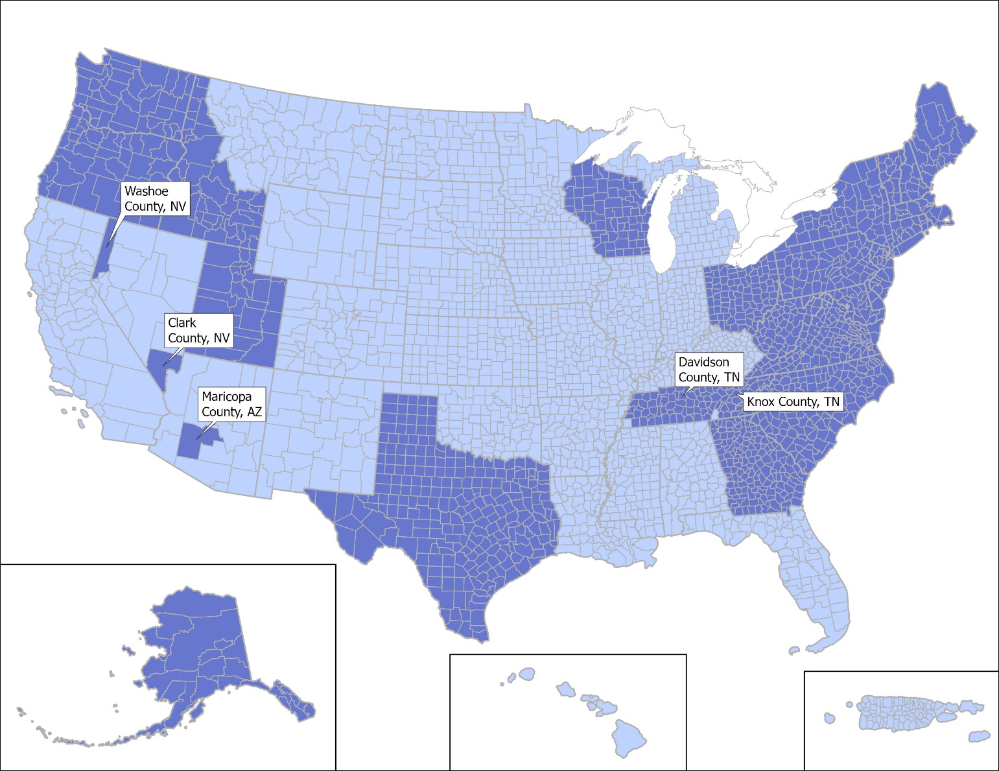
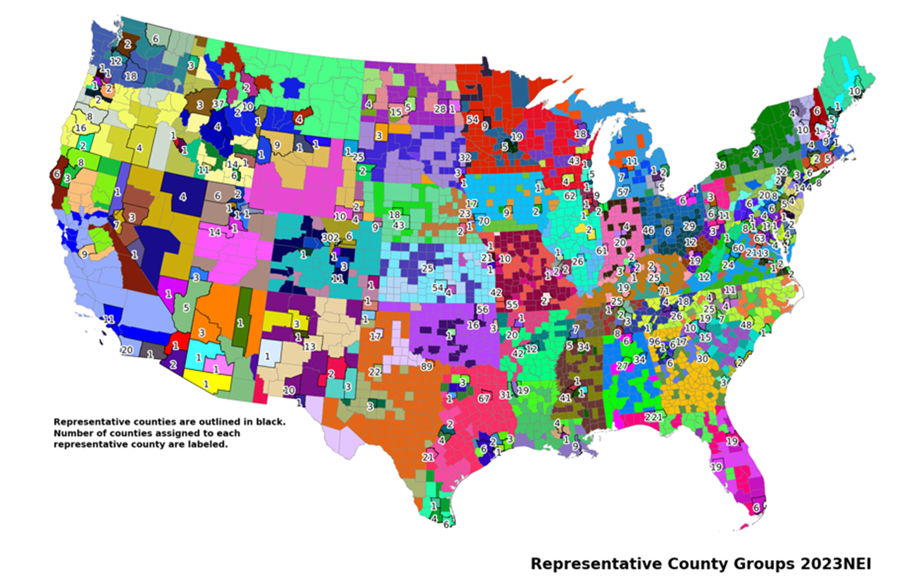

```{r, include=FALSE}
library(readxl)
library(knitr)
library(kableExtra)
library(readr)
library(ggplot2)
library(dplyr)
library(scales)
library(glue)
```

# Onroad Mobile - All Vehicles and Refueling {#onroadmobile}

## Sector Description

Onroad mobile sources include emissions from motorized vehicles that normally operate on public roadways. This includes passenger cars, motorcycles, minivans, sport-utility vehicles, light-duty trucks, heavy-duty trucks, and buses. MOVES categorizes vehicles into 13 source type identification (ID) codes shown in Table \@ref(tab:onroadmobile-table1). The sector includes emissions generated from parking areas, emissions from short-duration idle during pickups/deliveries, emissions from vehicles when they start, and emissions while the vehicles are moving. The sector also includes “hoteling” emissions, which refers to the time spent idling in a diesel long-haul combination truck during federally mandated rest periods of long-haul trips.

Onroad emissions in the 2023 NEI are comprised of emission estimates calculated based on version 5 of EPA’s MOtor Vehicle Emission Simulator (MOVES5). MOVES5 is run with State, local, and Tribal (S/L/T)-submitted activity data and other MOVES inputs when provided, except for California and tribes, for which the NEI includes submitted emissions. In cases where S/L/T submitted data are not provided, EPA developed default activity based on data from the Federal Highway Administration (FHWA) and other data sources. EPA also developed default data for all other inputs required by MOVES which are used where S/L/T data of sufficient quality are not available.

```{r, include=FALSE}
df <- read_excel("./tables/Section-5/Table_01_MOVES-sourcetypeIDs-and-names.xlsx",
  col_types = rep("text"))
df[is.na(df)] <- ""
```

```{r onroadmobile-table1, tidy=FALSE, echo=FALSE,warning=FALSE, message=FALSE}
kableExtra::kbl(
  df, 
  booktabs = TRUE,
  longtable = TRUE,
  caption = 'MOVES Source Type IDs and Names'
) %>%
kable_styling(
  full_width = FALSE, 
  position = "center", 
  latex_options = c("scale_down","repeat_header")#,
  #font_size = 11
  )
```

## Overview of Input Data Sources for 2023

EPA received MOVES county database (CDB) submittals (1,425 databases) from S/L/T agencies and 2023 vehicle registration data from S&P Global Mobility (SPGM), which EPA adapted to compute vehicle populations, vehicle age distributions, and fuel type fractions. FHWA provided vehicle-miles traveled (VMT) data by county and road type. EPA downloaded 2022 Travel Monitoring Analysis System (TMAS) traffic volume data, which EPA transformed into VMT distributions by month. EPA also received 2022 and 2023 vehicle telematics data from StreetLight Data, Inc. (StreetLight), which EPA transformed into MOVES- and SMOKE-ready input files describing the distributions of vehicle speeds and fractions of VMT by hour and day of week. The S/L/T CDBs, for 2023 along with the vehicle registration data, informed an analysis to identify counties with similar fleet characteristics to create representative county groups. Like the 2020 NEI, age distributions for representative counties are a population-weighted average of the member county age distributions. The 2023-specific vehicle speed and VMT distributions were used directly in SMOKE at the individual county level; therefore, these data are not considered for the representative county selection for MOVES runs. The CDBs and representative county groups are discussed in Sections \@ref(onroadmobile-agencymovesinputs) and \@ref(onroadmobile-repcounties), respectively. 

### EPA Default 2023 Vehicle Populations, VMT, Age Distributions, and Fuel Type Mix {#onroadmobile-defaultvehiclepop}
In areas where there is no acceptable S/L/T data available, the 2023 NEI onroad sector is based on 2023 vehicle population data from SPGM and 2023 VMT data from FHWA. To develop 2023 vehicle population data, EPA purchased a snapshot of vehicles in operation across the nation as of July 1, 2023, from SPGM. EPA processed the vehicle registration summary to develop inputs for both MOVES (i.e., the CDB tables for vehicle population, age distributions, and fuel type fractions) and SMOKE (vehicle populations by Source Classification Code (SCC) and county). SPGM receives the registration records from each state’s Department of Motor Vehicles (DMV) and decodes vehicle identification numbers (VINs) to assign each vehicle a MOVES source type code. The database SPGM provided to EPA did not identify individual vehicles but rather was a summary of the population in each county by parameters including vehicle make, model, model year, gross vehicle weight (GVW) class, and other descriptive information. EPA performed data cleanup on the SPGM’s MOVES source type assignments of the vehicle populations by reclassifying improperly categorized vehicles as follows:

- Combination Unit Trucks changed to Single-Unit, where body style was “STRAIGHT TRUCK.”
- Single-Unit Trucks changed to Other Bus, where the body style was “BUS NON SCHOOL.”
- Single-Unit Trucks changed to Combination Unit, where the body style was “TRACTOR TRUCK” and the gross vehicle weight rating (GWVR) was a Class 6 or higher.
- Source types 41 (Other Bus) and 42 (Transit Bus) were reclassified/reapportioned as the original distinctions for these two were not meaningful.
- Several Light-Duty Truck source type designations Passenger Car (source type 21) where the make/models were any of the following: Acura ZDX, Buick Encore, Chrysler PT Cruiser, Honda Element, Kia Soul, Nissan Juke, Suzuki XL7, or Toyota Scion XB.
- Vehicles with missing model year data were removed.
-	Vehicles with missing fuel type data were assigned to the most-common fuel type for the class and model year.
-	Vehicles with fuel types presenting combinations that cannot be modeled in MOVES were updated as follows:
    -	CNG-fueled Light-Duty source types were reassigned to Diesel
    -	E85-fueled Heavy-Duty source types were reassigned to Gasoline
    -	Non-gasoline fueled Motorcycles were reassigned to Gasoline
    -	Fuel cell (fuel type 9, engine technology ID 40) Light-Duty source types were reassigned to Battery Electric (fuel type 9, engine technology type 30)
-	EPA compared total school bus counts to another data source (School Bus Fleet Fact Book) and the totals compared well. Based on the data tracking well with this source, EPA elected not to reassign vehicles with a body style of “BUS SCHOOL” to the MOVES source type for school buses (source type 43) based on the data check and the known fact that some school buses are used for work-day transportation (e.g., agricultural work) and these uses do not fit the MOVES definition of source type 43 (vehicles used for pupil transportation).
-	EPA reapportioned Short-Haul vs. Long-Haul fractions for the Single Unit Truck (source types 52 vs. 53) and Combination Unit Trucks (source type 61 vs. 62) according to Table \@ref(tab:onroadmobile-table2), because this distinction is based on usage patterns and is not related to registration data. The approach for Single Unit trucks was unchanged from the 2020 NEI and earlier.  The approach for Combination Unit trucks was updated for the 2023 NEI based on the 2021 federal Vehicle Inventory and Use Survey (VIUS2021) based on the data value for the field “CABDAY,” where a value of “Day Cab” was interpreted as short-haul and “Sleeper Cab” was long-haul.

```{r, include=FALSE}
df <- read_excel("./tables/Section-5/Table_02_truck-population-fractions.xlsx",
  col_types = rep("text"))
df[is.na(df)] <- ""
```

```{r onroadmobile-table2, tidy=FALSE, echo=FALSE,warning=FALSE, message=FALSE}
kableExtra::kbl(
  df, 
  booktabs = TRUE,
  longtable = TRUE,
  caption = 'Short-haul vs. Long-haul Truck Population Fractions used in the 2023 NEI'
) %>%
kable_styling(
  full_width = FALSE,
    position = "center",
    latex_options = c("scale_down","repeat_header")#,
    #font_size = 11
  )%>%
  column_spec(1, width = "4cm") %>%
  column_spec(2, width = "4cm")%>%
  column_spec(3, width = "3cm") %>%
  column_spec(4, width = "3cm")
```
(A) Single-Unit fractions were the same as 2020 NEI and earlier (based on Freight Analysis Framework)
(B) Combination Unit fractions relied on state-level VIUS2021 data, new for 2023 NEI. 
(C) State level Combination Truck fractions of short/long haul may be found in VIUS2021_state_cabday.csv.

Following the data cleanup steps to reassign MOVES source types, EPA assigned fuel type IDs and engine technology IDs according to SPGM’s fuel type records as shown in Table \@ref(tab:onroadmobile-table3).

```{r, include=FALSE}
df <- read_excel("./tables/Section-5/Table_03_mapping-SPGM-fuel-types.xlsx",
  col_types = rep("text"))
df[is.na(df)] <- ""
```

```{r onroadmobile-table3, tidy=FALSE, echo=FALSE,warning=FALSE, message=FALSE}
kableExtra::kbl(
  df, 
  booktabs = TRUE,
  longtable = TRUE,
  caption = 'EPA’s mapping of SPGM Fuel Type to MOVES fuelTypeID and engTechID'
) %>%
kable_styling(
  full_width = FALSE, 
  position = "center", 
  latex_options = c("scale_down","repeat_header")#,
  #font_size = 11
  )
```

EPA also assigned a regulatory class ID on the basis of mostly SPGM’s reported GVWR. EPA assigned all motorcycles to regClassID 10, all passenger cars to regClassID 21, and all light-duty trucks to regClassID30 if they either (1) had a GVWR of 1, 1a, 2, 2a, blank, or (2) a fuel type of E-85 (fuelTypeID 5). EPA assigned heavy-duty regulatory class IDs according to Table \@ref(tab:onroadmobile-table4).

```{r, include=FALSE}
df <- read_excel("./tables/Section-5/Table_04_assign-SPGM-heavy-duty-vehicles.xlsx",
  col_types = rep("text"))
df[is.na(df)] <- ""
```

```{r onroadmobile-table4, tidy=FALSE, echo=FALSE,warning=FALSE, message=FALSE}
kableExtra::kbl(
  df, 
  booktabs = TRUE,
  longtable = TRUE,
  caption = 'EPA’s assignment of SPGM Heavy-Duty Vehicles to regClassID'
) %>%
kable_styling(
  full_width = FALSE, 
  position = "center", 
  latex_options = c("scale_down","repeat_header")#,
  #font_size = 11
  )
```

After assigning fuelTypeID, engTechID, and regClassID, EPA transformed the data into MOVES-ready inputs of individual county level SourceTypeYear, SourceTypeAgeDistribution (in MOVES5 format, covering ageID 0 to 40), and AVFT (Alternative Vehicle and Fuel Technology).  EPA compared state-level population totals to the FHWA MV-1 table and state submittals and made further adjustments to the SPGM populations for Motorcycles and Light-Duty Vehicles.

Of the 30 S/L/T agencies that participated in the data submittal process, 24 of these provided both LDV populations (MOVES 'SourceTypeYear' table) and age distributions (MOVES 'SourceTypeAgeDistribution' table) based on 2023 registration data, which was a requirement for comparison with the 2023 SPGM data. Other agencies were excluded from the adjustment factor analysis because they provided only one type of local data (e.g., population but no age distribution) or data with outdated (e.g., year 2020) or unknown registration data draw dates. For the 24 areas that could be included in the analysis, EPA first combined the populations of passenger cars (source type 21) and light-duty trucks (source types 31 and 32) at the county level to remove the uncertainty of VIN decoding personal passenger vehicles as cars vs. light-duty trucks. EPA then allocated each county’s LDV total source type population to vehicle model years for comparison with SPGM and found that the SPGM populations for 2023 were higher than the state data by 10.7 percent. Similar to prior years’ comparisons, EPA again found that the discrepancies in the 2023 data between SPGM and states are larger for older vehicles. Table \@ref(tab:onroadmobile-table5) shows the LDV adjustments EPA made to the 2023 SPGM data prior to its use in the NEI.

EPA calculated the adjustment factors representing the fraction of population remaining in every model year, with two exceptions. The model year range from 2015 to 2023 received no adjustment and the model years 1993 and earlier received a capped adjustment that equals the adjustment for model year 1994. The adjustment factors in Table \@ref(tab:onroadmobile-table5) were applied to the 2023 SPGM data to create the EPA Default set of population and age distributions for the NEI.

```{r, include=FALSE}
df <- read_excel("./tables/Section-5/Table_05_older-LDV-adjustments.xlsx",
  col_types = rep("text"))
df[is.na(df)] <- ""
```

```{r onroadmobile-table5, tidy=FALSE, echo=FALSE,warning=FALSE, message=FALSE}
kableExtra::kbl(
  df, 
  booktabs = TRUE,
  longtable = TRUE,
  caption = 'Older LDV adjustments showing the fraction of SPGM vehicle populations to retain for 2023 NEI'
) %>%
kable_styling(
  full_width = FALSE, 
  position = "center", 
  latex_options = c("scale_down","repeat_header")#,
  #font_size = 11
  )%>%
  column_spec(1, width = "5cm") %>%
  column_spec(2, width = "7cm")
```

EPA also compared motorcycles (MC) between SPGM and pooled submitted populations from 24 agencies and found that the agency submittals were approximately half (54 percent) the population reported by SPGM for the group of counties. EPA then compared the SPGM MC population summarized by state to the FHWA’s MV-1 table for all states except Idaho and New York because these had data quality problems in MV-1 at the time of analysis (early June 2025). Like the pooled NEI submittals, MV-1 table also showed lower MC populations than SPGM. The national total (excluding ID and NY) MC population from MV-1 values was just 63 percent of the SPGM values which would be a 37 percent reduction if EPA had used a national adjustment to correct motorcycles in the SPGM set. Instead, EPA opted to use the state resolution from MV-1 to correct SPGM MC populations by state, and these values ranged from zero (0) to 60 percent reductions by state. EPA opted to use MV-1 for the correction not only due to complete data for all states but also because the comparison by model year to the 24 agencies showed no trend in the differences by age. EPA attempted to compare MV-1 populations to SPGM for heavy-duty vehicles (HDVs), but it was not possible to remove light-duty trucks from the MV-1 “Truck” category, and therefore no comparison was possible. States without any CDB submittals received EPA Default populations and age distributions based on the adjusted SPGM data, and some states with submittals were overridden, decided on a case-by-case basis. Section \@ref(onroadmobile-sourcesofdataandselection) lists the submitted data that was accepted vs. replaced with EPA age distribution data for the 2023 NEI.

In addition to removing the MCs and older LDVs from the SPGM data, EPA also removed outlier age distributions that showed excessively “new” fleets. In the past, this situation where the registration data reflects a young fleet occurs when the headquarters of a leasing or rental company owns a large fraction of the vehicles in the county. We dealt with these cases by preferentially excluding them from the representative county calculation of age distribution. For counties that were the only county in the representative county group, we made a substitution with an age distribution for the same source type from another county in the same metropolitan statistical area (MSA). EPA believes that these new vehicles do not represent the county’s operating vehicle fleet, and the clean-up step avoids regions of artificially low LDV emissions in the NEI. The list of counties receiving this substitution was the same as it was for the 2022v2 platform and is shown in Table \@ref(tab:onroadmobile-table6).

```{r, include=FALSE}
df <- read_excel("./tables/Section-5/Table_06_young-fleet-outlier-age-distributions.xlsx",
  col_types = rep("text"))
df[is.na(df)] <- ""
```

```{r onroadmobile-table6, tidy=FALSE, echo=FALSE,warning=FALSE, message=FALSE}
kableExtra::kbl(
  df, 
  booktabs = TRUE,
  longtable = TRUE,
  caption = 'Young Fleet Outlier Age Distributions and Substitutions for the 2023 NEI'
) %>%
kable_styling(
  full_width = FALSE, 
  position = "center", 
  latex_options = c("scale_down","repeat_header")#,
  #font_size = 11
  )%>%
  column_spec(1, width = "4cm") %>%
  column_spec(2, width = "4cm") %>%
  column_spec(3, width = "6cm")
```

In some states where submitted vehicle population data were accepted for NEI, the relative populations of cars vs. light-duty trucks were reapportioned (while retaining the magnitude of the light-duty vehicles from the submittals) using the county-specific percentages from the SPGM data. In this way, the categorization of cars versus light trucks is consistent with EPA Default methods and avoids incorrectly categorizing the light-duty fleet as mostly passenger cars. The county total light-duty vehicle populations were preserved through this process. The S/L agencies receiving reapportioned cars vs. light-duty trucks included TX, NH, PA, and RI.

### EPA Default 2023 Month VMT Distributions

In areas where S/L/T data were not available, month VMT distributions were previously derived from Travel Monitoring Analysis System (TMAS) traffic volume data for the 2022v1 platform and carried over to both the 2022v2 platform and the 2023 NEI. EPA downloaded the TMAS dataset for 2022 from the website https://geodata.bts.gov/datasets/travel-monitoring-analysis-system-class/about. The data contains station level, hourly traffic volume counts with detail available by the 13 FHWA vehicle classes, which EPA mapped to MOVES source type as described in 2022v1 documentation. TMAS data analysis removed incomplete stations as needed, and traffic volumes were transformed into state-level month VMT fractions.

### EPA Default 2023 Vehicle Speeds and Hour/Day VMT Distributions

EPA purchased county-level telematics data from StreetLight for characterization of vehicle speed profiles and VMT temporal distributions for 2022 and some months of 2023 (January through May) available at the time of purchase. EPA purchased this data because the prior data from StreetLight was specific to 2020 and reflected strong variation in monthly speeds that tracked with stay-at-home orders. The 2022 and 2023 data reflect the new normal patterns of VMT and hourly distributions of speeds by road type and county across the US. EPA transformed the summaries of vehicle distance, time, and speed to create temporal profiles of VMT and speed distributions by road type by month, day of week, and hour. Vehicle types included personal, commercial medium-duty, and commercial heavy-duty. While EPA received and examined the data by month, it was observed that the distributions did not significantly vary by month and therefore EPA opted to prepare annual average speed distributions by hour, day type, source type, and road type, which was standard practice before the 2020 NEI.

StreetLight data sources have evolved over time but currently uses connected vehicle data for personal vehicles and in-vehicle Global Positioning System (GPS) data for medium- and heavy-duty commercial trucks. These data are aggregated such that personal information is not revealed. StreetLight performs data processing in-house to pin the location and time data to a roadway network to calculate summaries of travel distance, travel time, and speed.

In areas where S/L/T data were not available or of lower quality/resolution than StreetLight, EPA used telematics-based data for the hour and day VMT fractions as well as the speed distributions available from StreetLight. Because the StreetLight dataset did not cover Alaska, Hawaii, the U.S. Virgin Islands, or Puerto Rico, EPA made substitutions using data from other areas. EPA assigned statewide averages for Montana to Alaska, and national averages of StreetLight to Hawaii, U.S. Virgin Islands, and Puerto Rico. In addition to the substitutions for the outlying areas, EPA performed other gap filling described in Section \@ref(onroadmobile-streetlighttransformation).

## Sources of Data and selection heirarchy {#onroadmobile-sourcesofdataandselection}

EPA calculated the onroad emissions for 2023 for all states using the most recent version of MOVES, MOVES5.0.0, with a copy of the default database movesdb20241112 renamed to movesdb20241112_nonoxadj to signify that engine-out NOX adjustments based on ambient humidity were turned off. In the NEI and modeling platform process, the MOVES humidity-based adjustments to nitrogen oxide species (NO, NO2, HONO, and NOX) are applied inside the Sparse Matrix Operator Kernel Emissions (SMOKE) at the grid cell level using gridded meteorology, instead of MOVES applying adjustments at runtime. The sources of MOVES input data for the NEI vary by area, representing a mix of local data, EPA defaults, and some MOVES defaults. The S/L/T agencies that submitted data for 2023 are listed below in Section \@ref(onroadmobile-supportingdata). EPA used programs within the SMOKE modeling system that use data output from MOVES to generate the emission inventories in all 50 states for each hour of the year. These emissions are summed over all hours and across road types to develop the emissions for the NEI. For the state of California, EPA used onroad emissions provided by California based on the [EMFAC](https://arb.ca.gov/emfac/) model. Pollutants submitted by California were retained to the extent possible, while any missing pollutants were estimated using a combination of data from MOVES and CARB.

The data selection hierarchy for 2023 favored local input data over EPA-developed information. For areas that did not submit a MOVES CDB for this NEI, EPA used a 2023 CDB containing EPA defaults (e.g., SPGM registration data and StreetLight telematics data) and some MOVES defaults, as described in Section \@ref(onroadmobile-vmtandotherinfo).  The selection definition for the onroad category in EIS is shown in Table \@ref(tab:onroadmobile-table7).

```{r, include=FALSE}
df <- read_excel("./tables/Section-5/Table_07_onroad-data-category-selection-hierarchy.xlsx",
  col_types = rep("text"))
df[is.na(df)] <- ""
```

```{r onroadmobile-table7, tidy=FALSE, echo=FALSE,warning=FALSE, message=FALSE}
kableExtra::kbl(
  df, 
  booktabs = TRUE,
  longtable = TRUE,
  caption = 'Onroad Data Category Selection Hierarchy for 2023 NEI'
) %>%
kable_styling(
  full_width = FALSE, 
  position = "center", 
  latex_options = c("scale_down","repeat_header")
  )%>%
  column_spec(1, width = "2cm") %>%
  column_spec(2, width = "3cm") %>%
  column_spec(3, width = "6cm")
```

## California-submitted onroad emissions

California is the only state agency for which an onroad emissions submittal was used in the 2023 NEI. California uses their own emission model, [EMFAC2021](https://ww2.arb.ca.gov/msei-modeling-tools), ([EMFAC2021 Volume III Technical Document](https://ww2.arb.ca.gov/sites/default/files/2021-03/emfac2021_volume_3_technical_document.pdf)), which uses Emission Inventory Codes (EICs) instead of SCCs. For the 2017 NEI, EPA and California worked together to develop a code mapping to better match EMFAC’s EICs to EPA MOVES’ detailed set of SCCs that distinguish between off-network and on-network and brake and tire wear emissions. This level of detail is needed for modeling but not specifically for the NEI, because the NEI uses simplified/more aggregated SCCs than used in modeling. The mapping file was updated for the 2020 NEI by the California Air Resource Board (CARB) and applied to the EMFAC outputs prior to providing the data to EPA. 

California provided CAP emissions, excluding NH3, by county using EPA SCCs after applying the EIC to SCC mapping. For the 2023 NEI, we needed to add NH3, PAHs, and also onroad refueling emissions. For PAHs, due to differences in pollutants included in MOVES and those provided by CARB, PAH emissions were taken from MOVES rather than from CARB. Onroad refueling emissions are not part of the CARB submittal and were based on running MOVES with vehicle miles traveled (VMT) and vehicle population data provided by CARB.

NH3 was added to the California onroad emissions by setting the state-wide total of emissions to the value obtained using MOVES and then distributing the emissions to counties and SCCs using California-provided data from another pollutant. For NH3, CO from California was used. This way, the overall magnitude of emissions is based on MOVES, but the distribution of those emissions between counties and vehicles is based on California data. The factors used for these pollutants are computed by taking MOVES state total emissions divided by the CARB state total for CO or SO2. The emissions for these pollutants are computed as follows: 

<div style="text-align:center">
NH3 = CO &times; 0.0341
</div>

Manganese (MN) is an exception as it cannot be matched to speciation in MOVES and is therefore ratioed as follows:  

<div style="text-align:center">
MN = MOVES MN &times; CARB PM2.5/MOVES PM2.5
</div>

Hexavalent chromium was computed from CARB-provided total chromium as:

<div style="text-align:center">
Chromium VI = CARB Total Chromium &times; 0.00294840295
</div>

Another facet of the CARB data is that the SCC distributions are different in places from the original CARB submission. For instance, if the CARB data had emissions but no activity, or if they had emissions for non-MOVES fuel+vehicle type combinations (electric transit buses). In those cases, the emissions were apportioned to SCCs that could be mapped to SMOKE-MOVES. 

Table \@ref(tab:onroadmobile-table13) illustrates the data source used for California non-refueling onroad emissions by pollutant for the 2023 NEI.  

## Agency-submitted MOVES inputs {#onroadmobile-agencymovesinputs}

Many state and local agencies provided county-level MOVES inputs in the form of CDBs. This established format requirement enables EPA to more efficiently scan for errors and manage input datasets. EPA screened all submitted data using several quality assurance scripts that analyze the individual tables in each CDB to look for missing or unrealistic data values. EPA also reviewed submitted age distributions, road type VMT distributions, and monthly VMT distributions in consideration of whether to accept these data vs. county-specific EPA defaults.

### Overview of MOVES input submissions

State and local agencies prepare complete sets of MOVES input data in the form of one CDB per county. One way agencies can ensure a correctly formatted CDB is to use the MOVES graphical user interface (GUI) county data manger (CDM) importer. With a proper template created for a single county, a larger set of counties (e.g., statewide) can be updated systematically with county-specific information if the preparer has well-organized county data and familiarity with MariaDB queries. However, there is no requirement of MariaDB experience to prepare the NEI submittal because the user can instead rely on the CDM to help build the individual CDBs one at a time. Table \@ref(tab:onroadmobile-table8) lists the tables in each CDB and describes its content or purpose. Note that several of the tables are optional, which means that they may be left blank without consequence to a MOVES run’s completeness of results. If an optional CDB table is populated, the data override MOVES internal calculations and produce a different result that may better represent local conditions.

```{r, include=FALSE}
df <- read_excel("./tables/Section-5/Table_08_MOVES-CDB-tables.xlsx",
  col_types = rep("text"))
df[is.na(df)] <- ""
```

```{r onroadmobile-table8, tidy=FALSE, echo=FALSE,warning=FALSE, message=FALSE}
kableExtra::kbl(
  df,
  booktabs = TRUE,
  longtable = TRUE,
  caption = 'MOVES CDB tables'
) %>%
  kable_styling(
    full_width = FALSE,
    position = "center",
    latex_options = c("scale_down","repeat_header")#,
    #font_size = 10
  ) %>%
  column_spec(1, width = "4cm") %>%
  column_spec(2, width = "10cm") 
```

S/L/T agencies submitted a total of 1,425 CDBs for the 2023 NEI. Previously, agencies submitted 1,565 CDBs for the 2020 NEI, 1,693 for the 2017 NEI, 1,816 CDBs for the 2014 NEI, and 1,426 CDBs for the 2011 NEI. Agencies submitted data through the EPA Emissions Inventory System (EIS) and provided complete CDBs (i.e., each required table populated) along with documentation and a submission checklist indicating which of the CDB tables contained local data. Table \@ref(tab:onroadmobile-table9) summarizes these submission checklists, showing the number of counties within each submittal for which the information was local data, as opposed to a default. Empty slots in the table indicate that the state or county did not provide local data for that particular CDB table. The grand totals of counties across all states show that VMT, population, road type distribution, and month VMT fractions were the most commonly provided local data types. Note that Table \@ref(tab:onroadmobile-table9) is a select subsection of the list of CDB tables in Table \@ref(tab:onroadmobile-table8). Tables not included below are tables that do not contain state specific data. For example, Year, Zone, and ZoneRoadType just list the year and geographic entity (state in this case) for the run. 

Figure \@ref(fig:onroadmobile-figure1) shows the geographic coverage of CDB submissions where the state or local agency submitted data that was used for at least one table (dark blue). The light blue areas are counties for which the NEI uses EPA default 2023 CDBs. 

```{r onroadmobile-figure1, fig.align = "center", fig.pos="H",fig.cap="Counties for which agencies submitted local data for at least one CDB table (Submitting areas are shown in dark blue)", fig.alt="This figure shows counties for which agencies submitted local data for at least one CDB table.", echo=FALSE, out.width="75%"}

```

<a href="figures/Section-5/Figure_01_counties-with-local-data-submittals.png" download="figures/Section-5/Figure_01_counties-with-local-data-submittals.png" class="btn btn-primary">Download Figure</a>

```{r, include=FALSE}
df <- read_excel("./tables/Section-5/Table_09_number-of-counties-with-submitted-data2.xlsx",
  col_types = rep("text"))
df[is.na(df)] <- ""
```

```{r onroadmobile-table9,tidy=FALSE, echo=FALSE,warning=FALSE, message=FALSE}
kableExtra::landscape(
  kableExtra::kbl(
    df,
    booktabs = TRUE,
    caption = "Number of counties with submitted data, by S/L agency and select MOVES CDB tables"
  ) %>%
    kableExtra::kable_styling(
      position = "center",
      latex_options = c("repeat_header", "hold_position", "scale_down")
      ) %>%
     kableExtra::footnote(
      general = "*Partial Table Submitted (i.e., partly MOVES Default)",
      general_title = "",
      footnote_as_chunk = TRUE
    ) %>%
    scroll_box(width = "100%", height = "400px")
)
```

### QA checks on MOVES CDB Tables

EPA reviewed lists of CDB data errors and warnings flagged by the NEI quality assurance script packaged with MOVES5. The quality assurance script reports the potential errors by compiling a list into a summary Excel file. The list of potential errors includes the CDB name, table name, a numeric error code, and in some cases the suspect data value or sum of values. EPA reviewed all potential errors, identified which ones needed to be addressed, and then coordinated with the responsible state/local agency to clarify whether the data were correct or needed revision. 

The EPA MOVES team designed the NEI quality assurance script to identify errors that would cause MOVES to crash (e.g., missing or incorrectly formatted tables) or produce erroneous results. Aside from review of quality assurance script results, EPA prepared and reviewed graphs of submitted age distributions, month/day/hour VMT fractions, and speed distributions for consideration of where to override submittals with EPA default information specific to year 2023.
Many of the 1,425 submitted CDBs required one or more updates due to missing or incorrect data or incorrect table formatting which was removed prior to use. The missing or incorrect data included the following problems:

- Age distribution represented a different data year than 2023 (i.e., LDV recession “dip” shifted by several years)
- Age distribution did not extend out to 40 years; some submittals had 30-year age distributions
- Age distribution with missing source types
- Expected "County" CDB table was missing 
- Expected VMT tables (SourceTypeDayVMT, SourceTypeYearVMT, and HPMSVtypeDay) were missing
- Expected "AVFT" table required was missing
- Submittal documentation erroneously stated which data were local vs. default.

EPA resolved each of the above data problems by coordinating with state/local agencies individually. In some cases, the agency preferred to submit a corrected CDB, which EPA reviewed again to verify the intended correction. In other cases, the agency provided EPA with instructions for a spot correction to a table or simply accepted EPA’s proposed update. EPA also corrected minor formatting problems with the database tables. In some cases, tables had missing data fields and/or table keys; the missing fields did not house important content, but their presence is required for MOVES to run. EPA’s final decisions on the data source (submittal vs. EPA-developed information) for age distribution, speed distribution, and hourly VMT fractions can be found in the documentation spreadsheet [2023_Documentation_of_CDB_Input_Data_20251013.xlsx](https://gaftp.epa.gov/air/nei/2023/doc/supporting_data/onroad/2023_Documentation_of_CDB_Input_Data_20251013.xlsx) posted with the 2023 NEI supplemental data files.

EPA used CDBs constructed with EPA-generated data for counties where agencies did not submit input data. EPA developed new 2023 estimates of VMT, vehicle population, and hoteling at the county- and SCC-level for use in the subsequent SMOKE-MOVES processing step and inserted these data into the CDBs where states did not provide data. The SMOKE files contain this information at the resolution of SCC, which includes the source type, fuel type, and road type. When inserted into the CDB table for source type VMT (sourceTypeYearVMT), we sum over the fuel and road type. Similarly, for population, we sum over the SCC fuel type to aggregate population to the source type level for the CDB table containing population (sourceTypeYear). In contrast, the hoteling activity detail is much more disaggregated in the two MOVES tables (hotellingHours and hotellingActivityDistribution) compared to the SMOKE FF10 hoteling file. The script that inserts these data into the set of “all CDBs” (ReverseFF10_Script_20251008.plx) is listed in [or_scripts_2023.zip](https://gaftp.epa.gov/air/nei/2023/doc/supporting_data/onroad/or_scripts_2023.zip). States and counties with CDBs that included EPA-generated activity and projected CDBs are those indicated by light blue shading in Figure \@ref(fig:onroadmobile-figure1). Table \@ref(tab:onroadmobile-table10) below lists the sources of default information by MOVES CDB table. The spreadsheet “[2023 Documentation of CDB Input Data_20251013.xlsx](https://gaftp.epa.gov/air/nei/2023/doc/supporting_data/onroad/2023_Documentation_of_CDB_Input_Data_20251013.xlsx)” provides specific information about where state-supplied data were used versus default data. Additional detail on processing steps in the SPGM data to create "AVFT" and "SourceTypeAgeDistribution" is provided below in Section \@ref(onroadmobile-prepstystadavft). 

```{r, include=FALSE}
df <- read_excel("./tables/Section-5/Table_10_source-of-EPA-developed-information.xlsx",
  col_types = rep("text"))
df[is.na(df)] <- ""
```

```{r onroadmobile-table10, tidy=FALSE, echo=FALSE,warning=FALSE, message=FALSE}
kableExtra::kbl(
  df, booktabs = TRUE,
  caption = 'Source of EPA-developed information for key data tables in MOVES CDBs'
) %>%
kable_styling(full_width = FALSE, position = "center", latex_options = "scale_down")%>%
  column_spec(1, width = "5cm") %>%
  column_spec(2, width = "10cm") 
```

### Preparation of "SourceTypeYear", "SourceTypeAgeDistribution", and "AVFT" CDB Tables {#onroadmobile-prepstystadavft}

As mentioned above in Section \@ref(onroadmobile-defaultvehiclepop), national vehicle population data from SPGM for 2023 were used to derive updated population by source type (MOVES "sourceTypeYear" table), age distributions by source type (MOVES "sourceTypeAgeDistribution" table), and fuel type splits by source type and model year (MOVES "AVFT" table) for the CDBs. These data were computed at the county level for the set of individual CDBs for all 3,224 counties, and they were averaged over county groups for the set of representative CDBs used in the MOVES runs for the NEI. Vehicle populations were summed (not averaged) over member counties for each representative county group.  EPA performed the same averaging and summing for submitted data. As discussed in the data selection hierarchy, EPA preferred to use local data where they were found to be acceptable. Local data were used preferentially and supplemented with EPA-developed information where needed. In the EPA-developed data, the source registration data does not reliably distinguish between short-haul and long-haul activity, and so source types 52 and 53 (single unit trucks) have the same age distributions, as do source types 61 and 62 (combination unit trucks). In addition, all age distributions for long-haul trucks (source types 53 and 62) are a national average, because these vehicles are expected to travel long distances from the county where they are registered. Section \@ref(onroadmobile-defaultvehiclepop) discussed procedures to split truck populations into short- vs. long-haul use types in the EPA Default data.

### Transformation of StreetLight Telematics Data Summaries into Hour/Day Distributions of VMT and Speed Distribution inputs for MOVES and SMOKE {#onroadmobile-streetlighttransformation}

EPA purchased vehicle activity data for all months of 2022 and months January through May of 2023 from StreetLight and converted the information into MOVES and SMOKE model inputs. EPA leveraged prior work conducted for the 2017 and 2020 NEIs for the new data request to StreetLight and the data processing into NEI inputs. 

*Raw Data Format*

Table \@ref(tab:onroadmobile-table11) shows an example of five lines of data from StreetLight’s delivery to EPA. The table footnotes describe the scope of possible categories in each column. In total, StreetLight generated over 700 million rows of data in the format below. 

```{r, include=FALSE}
df <- read_excel("./tables/Section-5/Table_11_streetlight-vehicle-telematics-summary-data.xlsx",
  col_types = rep("text"))
df[is.na(df)] <- ""
```

```{r onroadmobile-table11, tidy=FALSE, echo=FALSE,warning=FALSE, message=FALSE}
kableExtra::kbl(
  df,
  booktabs = TRUE,
  longtable = TRUE,
  caption = 'Sample Rows of StreetLight Vehicle Telematics Summary Data'
) %>%
kable_styling(
    full_width = FALSE,
    position = "center",
    latex_options = c("repeat_header", "hold_position", "scale_down"),
    font_size = 10
  ) %>%
  column_spec(1, width = "1cm") %>%
  column_spec(2, width = "2cm") %>%
  column_spec(3, width = "2cm") %>%
  column_spec(4, width = "1cm") %>%
  column_spec(5, width = "1cm") %>%
  column_spec(6, width = "1cm") %>%
  column_spec(7, width = "1cm") %>%
  column_spec(8, width = "2cm") %>%
  column_spec(9, width = "2cm") %>%
  column_spec(10, width = "2cm")
```
(A) County FIPS: the numeric FIPS code for each county in the contiguous 48 states. 
(B) Vehicle Category: personal (PERS) vehicles, commercial medium-duty trucks (COMM-MD), or commercial heavy-duty trucks (COMM-HD).
(C) Road Type: the four MOVES road types, combination of Urban/Rural and Restricted/Unrestricted access.
(D) Year-Month: Year and month of analysis in YYYYMM format.
(E) Day Type: M, Tu, W, Th, F, Sa, Su.
(F) Hour of Day: 0 to 23, representing the hour of the day. 
(G) Speed Bin: 2.5, 5, 10, 15, …90, 95, 100+ miles per hour (mph). The first 16 bins correspond to MOVES speed bins, and the final 5 are for higher speeds above 75 mph up to 100+ mph.
(H) Cumulative travel distance for all vehicles traveling within the specific speed bin on roadway segments of the specified road type in the county, occurring in the month, day type of week, and hour.  Units are in feet, rounded to 2 decimal places.
(I) Time corresponding to the cumulative travel distance defined above. Units are in seconds, and values are reported in whole seconds (no decimals).
(J) Counts in the Combination refers to the number of unique road segments included on the data row.  It is an indicator of sample size but does not reflect vehicle volumes.

*Data Coverage and Quality Assurance*

Prior to transforming StreetLight data into model inputs, EPA reviewed the data to identify any unexpected data. The following data issues were found, and EPA’s solutions are listed for each:

- Sharp declines in peak afternoon hour VMT for commercial vehicles were observed in January–October 2022 data. These months were excluded from commercial vehicle hour/day VMT distribution calculations.
- Large dip in Wednesday day VMT for commercial heavy-duty observed in July 2022 data. July 2022 was substituted with August 2022 for commercial heavy-duty day VMT distributions.
- Higher average hourly speeds for personal vehicles were observed in January 2022 compared to all other months. January 2022 was excluded from personal vehicle speed distributions.
- Sparse data coverage for commercial medium-duty. Statewide averages were used for commercial medium-duty profiles. 

The vehicle telematics summary datasets included the lower 48 states. EPA substituted finished model-ready profiles of Montana statewide averages to cover the Alaska boroughs and nationwide averages to cover Hawaii, Puerto Rico, and the U.S. Virgin Islands.

*Gap Filling*

The nature of the SMOKE-MOVES and representative county approach to the on-road NEI requires that activity profiles exist for all categories (i.e., all road types, vehicle classes, hours, day types), even including freeways in counties that have minimal to no freeways, or urban roads in a rural county (or vice versa – rural roads in an urban county).

EPA established multiple gap filling procedures to improve profiles for areas with low data coverage and fill profiles with missing data. Separate processes were established for day VMT distributions, hour VMT distributions and speed distributions for each vehicle category defined in StreetLight. With the exception of commercial medium-duty profiles which used statewide averages, EPA generally preferred to let the local data from each county stand on its own, representing only itself, even in areas that may have missing hours of data. Missing data often occurred during overnight hours, when the sample size of vehicles driving on roads is typically lower. In areas with very low data or missing data across many hours, county profiles were substituted with another county in the same state with a similar road type distribution. For the VMT distributions with missing hours, EPA set those hours’ values to zero (0), interpreting the missing coverage as no vehicle activity. In contrast for the speed distributions, EPA did not allow any missing hours of data in the modeling profiles due to the potential for data loss in the SMOKE-MOVES system and representative county approach. Below is a summary of gap-filling steps:

- Hour VMT Fraction:
  1.	Group restricted and unrestricted road types (remove urban/rural distinction)
  2.	Group day types (remove weekday/weekend distinction, commercial heavy-duty only)
  3.	Group all road types
  4.	Substitute similar county/counties
- Day VMT Fraction:
  1.	Substitute another month
  2.	Group all months (annual average)
  3.	Group restricted and unrestricted road types (remove urban/rural distinction)
  4.	Group day types (remove weekday/weekend distinction, commercial heavy-duty only)
  5.	Group all road types
  6.	Substitute similar county/counties
- Average Speed Distribution:
  1.	Group restricted and unrestricted road types (remove urban/rural distinction)
  2.	Group all vehicle types
  3.	Substitute similar county/counties
  4.	Substitute another hour (to fill any missing hours)
  
EPA developed decision tree flowcharts that describe the gap-filling procedure in full detail. The decision flowchart is named [2022-2023_StreetLight_Grouping_Decision_Charts.pdf](https://gaftp.epa.gov/Air/nei/2020/doc/supporting_data/onroad/2020_StreetLight_Grouping_Decision_Charts.pdf) and is included with the supporting data listed in Table \@ref(tab:onroadmobile-table17).

### Default California emission standards {#onroadmobile-defaultcaemisstnd}

EPA populated an alternative MOVES database table ‘EmissionRateByAge’ in the CDBs for states that have adopted emission standards from California’s Low Emission Vehicle (LEV) program. Table \@ref(tab:onroadmobile-table12) shows states that adopted the California standards and the year the program began in each state. EPA developed these tables using built-in MOVES tools and guidance on LEV modeling. The LEV databases are included with [MOVES_Input_DBs.zip](https://gaftp.epa.gov/air/nei/2023/doc/supporting_data/onroad/MOVES_Input_DBs.zip) that is available with the supporting data described in Table \@ref(tab:onroadmobile-table17).

```{r, include=FALSE}
df <- read_excel("./tables/Section-5/Table_12_states-adopting-CA-LEV-standards-and-start-year.xlsx",
  col_types = rep("text"))
df[is.na(df)] <- ""
```

```{r onroadmobile-table12, tidy=FALSE, echo=FALSE,warning=FALSE, message=FALSE}
kableExtra::kbl(
  df, 
  booktabs = TRUE,
  longtable = TRUE,
  caption = 'States adopting California LEV standards and start year'
) %>%
kable_styling(
  full_width = FALSE, 
  position = "center", 
  latex_options = c("repeat_header", "hold_position", "scale_down")
  )
```
(A) Colorado LEV database for program start year 2022 was not created for 2023 NEI because 2017-2024 emission factors are the same between MOVES and LEV.
(B) Minnesota, Nevada, and New Mexico LEV databases were not created for 2023 NEI because the program start year happens in the future after year 2023.

In addition to California LEV standards adoption, several states participated in early adoption of the national low emission vehicle (NLEV) standards, including Connecticut, Delaware, Maryland, New Hampshire, New Jersey, Pennsylvania, Rhode Island, and Virginia.

## Calculation of Emissions

### Preparation of onroad emissions data for the continental U.S. {#onroadmobile-prepofconusemis}

The 2023 NEI includes onroad emissions for every county. The same approach was used for counties inside the continental U.S. and in the outlying states and territories: the first step is to run MOVES at the county level to produce “lookup” tables of emission rates for “representative counties,” using scripts designed to integrate MOVES with the SMOKE modeling system (i.e., SMOKE-MOVES). The SMOKE-MOVES approach adapted for NEI leverages gridded hourly temperature and relative humidity information available from meteorological modeling used for air quality modeling. This set of programs was developed by EPA and is also used by states and regional planning organizations to compute onroad mobile source emissions for regional air quality modeling. SMOKE-MOVES requires emission rate lookup tables generated by MOVES that differentiate emissions by process (running, start, vapor venting, etc.), vehicle type, road type, temperature, speed, hour of day, etc. 

To generate the MOVES emission rates for counties in each state across the U.S., EPA used an automated process to run MOVES to produce emission factors by temperature and speed for a set of representative counties to which every other county is mapped in SMOKE, as detailed below. Using the lookup tables of MOVES emission rates, SMOKE selected appropriate emissions rates for each county, hourly temperature, SCC, and speed bin and multiplied the emission rate by activity (VMT, vehicle population, or hoteling hours) to produce emissions. These calculations were done for every county, grid cell, and hour in the continental U.S. and aggregated by county and SCC for use in the 2023 NEI. The MOVES “RunSpec” files (that provide settings for the representative county MOVES runs) are provided in the supplementary materials (see 2023_RepCounty_Runspecs.zip in Table \@ref(tab:onroadmobile-table17)). MOVES was run with two special input databases: a LEV table (see Section \@ref(onroadmobile-defaultcaemisstnd)) and a database to keep MOVES from making adjustments to NOx based on humidity levels (see Section \@ref(onroadmobile-temphum) for more details). The databases are included in [MOVES_Input_DBs.zip](https://gaftp.epa.gov/air/nei/2023/doc/supporting_data/onroad/MOVES_Input_DBs.zip) as described in Table \@ref(tab:onroadmobile-table17).


SMOKE-MOVES tools are incorporated into recent versions of SMOKE and can be used with different versions of the MOVES model. For the 2023 NEI, EPA used the latest publicly released version at the time: MOVES5.0.0 with an adapted version of default database movesdb20241112_nonoxadj, included in MOVES_Input_DBs.zip. The adapted database differs only from the public release in that it has an empty "noxhumidityadjust" table to disable humidity-based NOX adjustment from being applied by MOVES. SMOKE instead applies these adjustments at a higher resolution using gridded meteorology.

Creating the NEI onroad mobile source emissions with SMOKE-MOVES requires numerous steps, as described in the sections below:

- Determine which counties will be used to represent other counties in the MOVES runs (see Section \@ref(onroadmobile-repcounties)).
- Determine which months will be used to represent other month’s fuel characteristics (see Section \@ref(onroadmobile-fuelmonths)).
- Create representative CDB inputs needed for the MOVES runs (see Section \@ref(onroadmobile-seededcdbs)). 
- Create inputs needed both by MOVES and by SMOKE, including a list of temperatures and activity data (see Section \@ref(onroadmobile-vmtandotherinfo)).
- Run MOVES to create emission factor tables (see Section \@ref(onroadmobile-runmoves)).
- Run SMOKE to apply the emission factors to activity data to calculate emissions (see Section \@ref(onroadmobile-runsmoke)).
- Aggregate the results at the county-SCC level for the NEI, summaries, and quality assurance (see Section \@ref(onroadmobile-postprocess)).
- Added DIESEL-PM10 and DIESEL-PM25 by copying the PM10 and PM2.5 pollutants (respectively; exhaust emissions only) as DIESEL-PM pollutants for all diesel SCCs. See Section \@ref(onroadmobile-postprocess)

Some things to note about the 2023 NEI that are also true of the 2020 NEI are: 

- SMOKE adjusts NOX emission factors to account for humidity impacts on the pollutant using the hourly, gridded met data. To support this feature, MOVES was run with relative humidity adjustments to NOX turned off (see movesdb20241112_nonoxadj from [MOVES_InputDbs.zip](https://gaftp.epa.gov/air/nei/2023/doc/supporting_data/onroad/MOVES_Input_DBs.zip) in Table \@ref(tab:onroadmobile-table17)).

- SMOKE reads in the distribution of vehicle speeds by 16 speed bins by 24 hours for weekday and weekend day types.

Some notes about the treatment of specific pollutants are as follows:

- Manganese/7439965 includes the brake and tire contribution. 
- Gasoline with 85 percent ethanol (E85) was tracked as a separate fuel.
- Brake and tire PM were tracked separately from exhaust processes, although all non-refueling processes were combined into broader SCCs prior to loading into EIS.

Onroad pollutants by source are listed in Table \@ref(tab:onroadmobile-table13).

```{r, include=FALSE}
df <- read_excel("./tables/Section-5/Table_13_onroad-pollutants-and-sources.xlsx",
  col_types = rep("text"))
df[is.na(df)] <- ""
```

```{r onroadmobile-table13, tidy=FALSE, echo=FALSE,warning=FALSE, message=FALSE}
kableExtra::kbl(
  df,
  booktabs = TRUE,
  longtable = TRUE,
  caption = 'Onroad pollutants and sources for 2023 NEI'
) %>%
  kable_styling(
    full_width = FALSE,
    position = "center",
    latex_options = c("repeat_header", "hold_position", "scale_down")#,
    #font_size = 9
  ) %>%
  column_spec(1, width = "2cm") %>%
  column_spec(2, width = "4cm") %>%
  column_spec(3, width = "4cm") %>%
  column_spec(4, width = "4cm")
```

### Representative counties and fuel months {#onroadmobile-repcountiesfuelmonths}
#### Representative counties {#onroadmobile-repcounties}

Although EPA develops a CDB for each county in the nation, we only run MOVES for a subset of these to mitigate the computation time and cost. The representative county approach is also supported by the concept that the majority of the important emissions-determining differences among counties can be accounted for by assigning counties to groups with similar properties such as fleet age, a shared I/M program, and shared fuel controls (e.g., low RVP for summer gasoline). The county used to provide emission rates covering other counties is called the “representative county.” The MCXREF file listed in Table \@ref(tab:onroadmobile-table17) provides the mapping of each county to its representative county. Usually, the same MCXREF file is used for all MOVES processes. 

In the SMOKE-MOVES framework, temperature- and speed-specific data from the representative county emission factor lookup tables are multiplied with the activity data for each of the counties within the corresponding county group. The activity data specific to individual counties in the inventory includes VMT, vehicle population, hoteling hours, hourly speed distributions, starts, and off-network idling hours (ONI).

EPA analyzed the 2023 submitted CDBs, the new 2023 age distributions derived from SPGM, and some MOVES data for non-submitting areas, to group similar counties and select representative counties for 2023. In line with previous modeling platforms, the MOVES input data considered for county grouping included state, altitude, fuel region, presence of an inspection and maintenance (I/M) program, and light-duty vehicle average age. 

__1.	State.__ Only counties within the same state were allowed to be in the same representative county group.

__2.	Altitude.__ The altitude of each county came from the MOVES database 'county' table. EPA assigned altitude values of low (most counties) or high, based on a barometric pressure cutoff of 25.8402 inches of mercury. Approximately 200 counties were considered high altitude by this metric. Only counties sharing the same altitude rating were grouped together.

__3.	Fuel Region.__ “Fuel region” refers to a region of counties sharing similar gasoline fuel properties. For example, those within a state’s reformulated gasoline (RFG) area. The data source was the MOVES5 default database movesdb20241112 except for Clark County, WA which used fuel properties of Multnomah County, OR.

__4.	IM Bin.__ The IM bin is a value of either “0” (no IM) or “1” (has IM) to indicate whether the county is part of an inspection & maintenance program area in 2023.  The data source for presence of an I/M program was primarily the 2023 submittals for the NEI. If a county did not positively identify an I/M program in a submittal or did not have a submittal, the yes/no determination comes from the MOVES database 'IMCoverage' table for year 2023.

__5.	Mean Light-Duty Age.__ The age distribution of light-duty vehicles (LDVs) including passenger cars, passenger trucks, and light commercial trucks, were combined into a single population-weighted average age by county, reflecting the number of years old of the average LDV in 2023. The mean age was then binned into the seven categories listed below. Only counties that share the same bin were allowed to be in the same representative county group. The source of the data was submitted age distributions that EPA accepted for use in NEI, supplemented elsewhere by the adapted 2023 SPGM data. 

* Bin 1: 0.0 ≤ Mean Age < 7.0
* Bin 2: 7.0 ≤ Mean Age < 9.0
* Bin 3: 9.0 ≤ Mean Age < 11.0
* Bin 4: 11.0 ≤ Mean Age < 13.0
* Bin 5: 13.0 ≤ Mean Age < 15.0
* Bin 6: 15.0 ≤ Mean Age < 17.0
* Bin 7: 17.0 ≤ Mean Age

__6.	State requests.__  In the past, several agencies provided comments to EPA on the selection of representative counties for their states; however, for the 2023 NEI only Georgia, Colorado, and North Carolina requested changes, which EPA implemented.

__7.  Select Representative County.__	After grouping similar counties, the county with the highest VMT in each group was selected as the representative county. Figure \@ref(fig:onroadmobile-figure2) displays a map of the representative counties by state and their corresponding county groups. The MCXREF file listed in Table \@ref(tab:onroadmobile-table17) provides the mapping of each specific county to its representative county and a map showing the visualization of the county groups is provided. A spreadsheet that includes the data used in the development of the representative counties is included with the supporting data (Table \@ref(tab:onroadmobile-table17)) described in ([2023_Representative_Counties_Analysis_20250530.xlsx](https://gaftp.epa.gov/air/nei/2023/doc/supporting_data/onroad/2023_Representative_Counties_Analysis_20250530.xlsx)). 

```{r onroadmobile-figure2, fig.align = "center", fig.pos="H", fig.cap="Representative County groups for the 2023 NEI", fig.alt="This figure shows representative county groups for the 2023 NEI.", echo=FALSE, out.width="75%"}

```

<a href="figures/Section-5/Figure_02_representative-county-groups.png" download="figures/Section-5/Figure_02_representative-county-groups.png" class="btn btn-primary">Download Figure</a>

#### Fuel Months {#onroadmobile-fuelmonths}

A “fuel month” indicates when a particular set of fuel properties should be used in a MOVES simulation. Similar to the representative county, the fuel month reduces the computational time of MOVES by using a single month to represent a set of months during which a specific fuel has been used in a representative county. Because there are winter fuels and summer fuels, EPA used January to represent October through April and July to represent May through September. For example, if the grams/mile exhaust emission rates in January are identical to February’s rates for a given representative county, and temperature (as well as other factors), then we use a single fuel month to represent January and February. In other words, only one of the months needs to be modeled through MOVES to obtain the necessary emission factors. The hour-specific VMT, temperature and other factors for February are still used to calculate emissions in February, but the emission factors themselves do not need to be created, since one month can sufficiently represent the other month. The fuel months used for each representative county are provided in the MFMREF file in the supplementary materials (see Table \@ref(tab:onroadmobile-table17) for access information).

#### Fuels {#onroadmobile-fuels}

For the 2023 NEI, fuel property information came from the MOVES5 default database movesdb20241112. The fuels information was derived from retail survey data. For a national inventory such as the NEI, this approach provides a more consistent and comprehensive result with respect to fuel use and fuel impacts on emission rates. More details on development of the MOVES fuel supply is available in this MOVES technical support document: [Fuel Supply Defaults: Regional Fuels and the Fuel Wizard in MOVES3](https://www.epa.gov/sites/default/files/2020-11/documents/420r20017.pdf).

For 2023 the nationwide fuel supply assumed 100% market share E10 ethanol blends in gasoline except for Alaska which assumes E0. All diesel was assumed to be 6 ppm sulfur, and onroad diesel was 100% market share B5 biodiesel blends nationwide.

### Temperature and humidity {#onroadmobile-temphum}

Ambient temperature can have a large impact on emissions. Low temperatures are associated with high start emissions for many pollutants. High temperatures and high relative humidity are associated with greater running emissions due to the increase in the heat index and resulting higher engine load for air conditioning. High temperatures also are associated with higher evaporative emissions.

The 12-km gridded meteorological input data for the entire year of 2023 covering the continental U.S. were derived from simulations of version 4.4.2 of the Weather Research and Forecasting Model (WRF), Advanced Research WRF core [[ref 1](#onroadmobile-references)]. The WRF Model is a mesoscale numerical weather prediction system developed for both operational forecasting and atmospheric research applications. The Meteorology-Chemistry Interface Processor (MCIP) [[ref 2](#onroadmobile-references)] was used as the software for maintaining dynamic consistency between the meteorological model, the emissions model, and air quality chemistry model.

EPA applied the SMOKE program Met4moves [[ref 3](#onroadmobile-references)] to the gridded, hourly meteorological data (output from MCIP) to generate a list of the maximum temperature ranges, average relative humidity, and temperature profiles that are needed for MOVES to create the emission-factor lookup tables. “Temperature profiles” are arrays of 24 temperatures that describe how temperatures change over a day, and they are used by MOVES to estimate vapor venting emissions. The hourly gridded meteorological data (output from MCIP) was also used directly by SMOKE (see Section \@ref(onroadmobile-runsmoke)).

The temperature lists were organized based on the representative counties and fuel months as described in Section \@ref(onroadmobile-repcountiesfuelmonths). Temperatures were analyzed for all the counties that are mapped to the representative counties, i.e., for the county groups, and for all the months that were mapped to the fuel months. EPA used Met4moves to determine the minimum and maximum temperatures in a county group for the January fuel month and for the July fuel month, and the minimum and maximum temperatures for each hour of the day. Met4moves also generated temperature profiles using the minimum and maximum temperatures and 5 °F intervals. In addition to the meteorological data, the representative counties and the fuel months, Met4moves uses spatial surrogates to determine which grid cells from the meteorological data have roads and uses the WRF temperature and relative humidity data from those areas. For example, if a county had a mountainous area with no roads, the grid cells with no roads would be excluded from the meteorological processing. The spatial surrogates used for the 2023 NEI were based on activity data such as annual average daily traffic from the Highway Performance Monitoring System (HPMS) for the year 2022, as well as NLCD land use for the year 2019, with the goal of better characterizing the spatial variability of the onroad mobile source emissions.

For the 2023 NEI, MOVES was run with the a copy of the public MOVES5 default database movesdb20241112_nonoxadj (part of [MOVES_Input_DBs.zip](https://gaftp.epa.gov/air/nei/2023/doc/supporting_data/onroad/MOVES_Input_DBs.zip) in Table \@ref(tab:onroadmobile-table17)) to prevent the model from making adjustments to NOx based on humidity levels. Instead, gridded hourly humidity values are used in SMOKE-MOVES to compute NOx adjustments to the unadjusted emissions output from MOVES.

Met4moves computes the range of temperatures needed by each representative county for each fuel month (i.e., 5-month summer season or 7-month winter season). When the emission factors are applied by SMOKE, the appropriate temperature bin and fuel month are used to compute the emissions. EPA used a 5 °F temperature bin size for RatePerDistance (RPD), RatePerVehicle (RPV), RatePerHour (RPH), RatePerHourONI (RPHO), and RatePerStart (RPS). 

Met4moves can be run in daily or monthly mode for producing SMOKE input. In monthly mode, the temperature range is determined by looking at the range of temperatures over the whole month for that specific grid cell. Therefore, there is one temperature range per grid cell per month. While in daily mode, the temperature range is determined by evaluating the range of temperatures in that grid cell for each day. The output for the daily mode is one temperature range per grid cell per day and is a more detailed approach for modeling the vapor venting RatePerProfile (RPP) based emissions. EPA ran Met4moves in daily mode for the 2023 NEI. The temperature data output from Met4moves ([2023NEI_RepCounty_Temperatures.zip](https://gaftp.epa.gov/Air/nei/2023/doc/supporting_data/onroad/2023NEI_RepCounty_Temperatures.zip)) are provided with the supporting data in Table \@ref(tab:onroadmobile-table17). The resulting temperatures for the representative counties are provided in the supplementary materials (see Table \@ref(tab:onroadmobile-table17) for access information). The gridded, hourly temperature data used are publicly available only upon request and with provision of a disk media to copy these very large datasets.

### VMT, vehicle population, speed, hoteling, starts, and ONI activity data {#onroadmobile-vmtandotherinfo}

The activity data used to compute onroad mobile source emissions for the 2023 NEI uses EPA-computed data where state/local agencies did not provide their own data or where provided data did not pass quality assurance checks. These “default” (but county-specific) data were derived from Federal Highway Administration Data (FHWA) information including the published [Highway Statistics 2023](https://www.fhwa.dot.gov/policyinformation/statistics/2023/) [[ref 4](#onroadmobile-references)], along with county-level VMT data that is then allocated to vehicle type, fuel type, and road type. Some additional data sources were also used. The development of the default data is described in detail in [2023 NEI_default_onroad_activity_approach.pdf](https://gaftp.epa.gov/Air/nei/2023/doc/supporting_data/onroad/2023NEI_default_onroad_activity_approach.pdf), which is listed with the supporting data in Table \@ref(tab:onroadmobile-table17).

As discussed above, SMOKE combines the MOVES emission factors for each representative county with county-specific VMT, population, and hoteling data to compute the emissions for each individual county. These activity data are provided to SMOKE in a flat file format, and the source of the data varies according to area of the country and depending on whether the state/local agency submitted data for the 2023 NEI. The final activity data used are a combination of submitted data and EPA-developed data and are provided with the supporting data in ([2023NEI_onroad_activity_final.zip](https://gaftp.epa.gov/air/nei/2023/doc/supporting_data/onroad/2023NEI_onroad_activity_final_20251010/)).

For the counties for which an agency submitted a CDB (the dark blue areas shown previously in Figure \@ref(fig:onroadmobile-figure1)), EPA ran scripts to extract the agency-submitted data from the CDBs and reformatted it into the flat file text file format that can be input to SMOKE (i.e., FF10). For the non-submitting areas of the U.S. (light blue areas in Figure \@ref(fig:onroadmobile-figure1)), the EPA VMT, population, and hoteling were used. The 2023 default speeds are from the StreetLight telematics data. The CDBs use a distribution of speeds specific to hour, vehicle and road type, and weekday/weekend day types. SMOKE uses these same data, but the 16 speed bin distributions are averaged by hour, SCC, county, and weekday/weekend days. The FF10 creation scripts that read submitted CDBs are described separately by activity type below.

#### VMT FF10 file creation {#onroadmobile-vmtff10}

The FF10-generation scripts read VMT flexibly from either the MOVES CDB table "sourceTypeYearVMT", which contains annual VMT organized by MOVES source type, or "HPMSVtypeYear", which contains annual VMT by groups of MOVES source types. The scripts disaggregate the VMT into fuel type, model year, and road type using a combination of other CDB tables as well as some MOVES default tables. First, the annual VMT is divided into model year using the CDB table with age distribution and the MOVES default database table containing relative annual mileage accumulation by age ("SourceTypeAge"). The scripts use these tables to create travel fractions for each source type and model year that sums to one (1) by source type. 

Next, the VMT is further divided into fuel type categories of gasoline, diesel, CNG, E85, and electric vehicles – preferentially by using submitted MOVES CDB tables "AVFT" to determine the split of engine-fuel types by model year and "FuelUsageFraction" to determine the percent of flex-fuel engines that actually use E85. Flex-fuel engines refer to those capable of operating on either E85 or conventional gasoline, the percentage of which could be a function of local availability of the alternative fuel. Because the AVFT and FuelUsageFraction tables are optional tables in a MOVES CDB, they were not always populated in a submitted database. In cases where data were not provided, the FF10-generation scripts automatically default to MOVES national distributions of fuel types and/or E85 availability, using the "SampleVehiclePopulation" and "FuelUsageFraction" tables of the model default database to fill the missing data. It is worth noting that several states do not have any VMT (or vehicle population) associated with flex-fuel vehicles because they submitted data indicating either no flex-fuel vehicle population or zero E85 fuel supply in the CDB tables. 

Finally, the FF10-generation scripts read the CDB table "RoadTypeDistribution" to further split VMT (by fuel type) into the four MOVES road types (urban and rural, restricted and unrestricted access). The scripts aggregate VMT across model years to the SCC level (i.e., MOVES source type, fuel type, and road type) and report annual and monthly VMT (using the "MonthVMTFraction" CDB table) for each SCC in each county into a consolidated list. Additional processing was performed to develop the final VMT data that includes both annual and monthly totals. First state-submitted monthly profiles were applied where they were available and valid (as obtained from the "MonthVMTFraction" table in the CDBs). Streetlight data were used elsewhere for all vehicle types except 62s, which were treated as flat monthly where state-submitted data were not used.

#### Population FF10 file creation

The FF10-generation script that creates the SMOKE vehicle population (i.e., VPOP) data operates similarly to the VMT script just described, except that the calculations do not use travel fractions to disaggregate population by model year. First, the script reads the CDB "SourceTypeYear" table, which contains 2023 population by MOVES source type and divides it into model years based on the submitted CDB "SourceTypeAgeDistribution" table. For each vehicle model year, the scripts apportion vehicle populations to fuel types using the submitted CDB tables "AVFT" and "FuelUsageFraction", or, if no data were provided, uses the national default corresponding data tables described in Section \@ref(onroadmobile-vmtff10).

The FF10 scripts then aggregate population from the model year level back up to the SCC level (MOVES source type and fuel type, and the road type 1). The CreateFF10 script and the Reverse FF10 script that pull activity data in and out of CDBs are included with the [or_scripts_2023.zip](https://gaftp.epa.gov/air/nei/2023/doc/supporting_data/onroad/or_scripts_2023.zip) file that is included with the supporting data described in Table \@ref(tab:onroadmobile-table17).

After the vehicle population and VMT data were finalized, the population and VMT were compared by county and source type to look for inconsistencies between the two datasets. Specifically, counties and source types with an unreasonably high miles per year per-vehicle average (VMT divided by VPOP) were identified and addressed. For counties and source types with a VMT/VPOP ratio above the threshold in Table \@ref(tab:onroadmobile-table14), the vehicle population was increased so that the new VMT/VPOP ratio would equal the maximum allowable ratio. The thresholds used were based on the 90th to 95th percentile of VMT/VPOP ratio for each source type. The vehicle populations were adjusted to produce reasonable VMT/VPOP ratios because MOVES can output unrealistic emission factors when the VMT/VPOP ratios are unreasonably high. EPA only needed to add VPOP for heavy-duty vehicles and motorcycles.

```{r, include=FALSE}
df <- read_excel("./tables/Section-5/Table_14_max-allowable-miles-per-year-per-vehicle-average.xlsx",
  col_types = rep("text"))
df[is.na(df)] <- ""
```

```{r onroadmobile-table14, tidy=FALSE, echo=FALSE,warning=FALSE, message=FALSE}
kableExtra::kbl(
  df, 
  booktabs = TRUE,
  longtable = TRUE,
  caption = 'Maximum allowable miles-per-year per-vehicle average by source type'
) %>%
kable_styling(
  full_width = FALSE, 
  position = "center", 
  latex_options = c("repeat_header", "hold_position", "scale_down")
  )
```

#### Speed FF10 file creation

SMOKE uses speed data for all counties to look up the appropriate VMT-based emission factors by speed bin and SCC. The FF10 “SPEED” input for SMOKE is one of two speed-related inputs; the other, described below, contains hourly speed distributions by SCC and county, separately for weekdays and weekends. The FF10 speed file for SMOKE contains a single daily average speed by SCC and county as an annual average.

Because the hourly speed distributions described in the next section cover all counties and SCCs, the FF10 “SPEED” input for SMOKE is not used as part of the emissions calculations. However, SMOKE still requires an FF10 SPEED file to exist, even if it is not used. Because of this, a new and complete FF10 SPEED file was not generated for 2023, and we instead used an older FF10 SPEED file in SMOKE processing. 

#### Speed Distribution

The SPDIST file is generated by reformatting the MOVES 'avgSpeedDistribution' CDB table into a form that can be accepted by SMOKE. The speed distribution (SPDIST) input for SMOKE is optional. Out of the three possible ways to model vehicle speeds in SMOKE, SPDIST provides the highest resolution to best match vehicle activity with the lookup tables of emission factors, which for the running processes are listed by MOVES 16 speed bins. The SPDIST file lists the fraction of time in each hour spent in each of the 16 speed bins, for weekday and weekend day types, by county, source type, and road type. MOVES provides distinct emission factors for each of the 16 speed bins, and the SPDIST tells SMOKE-MOVES how to weight each of the speed bins when computing the total emissions. For example, if the SPDIST specifies 55% of time is spent in speed bin 8 and 45% of time is spent in speed bin 9 for a particular county, hour/day, and SCC, the emission factors for those two speed bins are weighted according to those ratios. The SMOKE-MOVES calculations also take unit conversions into account, as the SPDIST fractions are per unit time, while RPD emission factors are per unit distance.

Speed data from the StreetLight dataset were used to generate hourly speed profiles by county, SCC, and month. The StreetLight data were converted into SMOKE format, gapfilled so that all counties and SCCs were covered, and modified as needed based on quality assurance checks. To cover gaps in speed distributions (missing hours on low-data-coverage road types in certain counties) EPA grouped across urban and rural roads within the county for a given roadway “access” type but never combining speed information to mix restricted (e.g., highways) with unrestricted (e.g., arterials and local roads). 

During quality assurance review of the grouped speed profiles, it was apparent that the speeds were sometimes too different between urban and rural roads within the same county. Instead of urban/rural grouping in these cases, data were substituted from adjacent months for the same MOVES road type and county. For example, if December data on rural restricted roads in a county was lacking, the November data for rural restricted roads were sometimes a better match than December urban+rural restricted roads. The judgement of what grouping decision was the "better match” was informed from review of average hourly speed profiles for all twelve months on a single plot, with separate plots for each road type and county. EPA substituted months of speed profiles as needed. This month substitution logic was only applied to speed distributions. VMT fractions are allowed to go to zero (0) for some hours in low-data situations, while speed data may not be zero from a modeling standpoint.

#### Hoteling FF10 file creation

Hoteling activity refers to the time spent idling in a diesel long-haul combination truck during federally- mandated rest periods for long-haul trips. Drivers may spend these rest periods with the main engine on, a smaller auxiliary power unit (APU) engine on, plugged into an electric source if available, or simply leave the engine off. MOVES tracks the emissions from hoteling using the main engine idling versus those from APUs separately. SMOKE reads each type of hoteling hours by SCC and matches them to the appropriate MOVES emission factor from the `RatePerHour’ lookup table.

Submitting agencies have the option to directly provide MOVES with the number of hoteling hours (via the ‘hotellingHours’ table) and the percent of trucks by model year that use APUs (the ‘hotellingActivityDistribution’ table). These CDB tables are optional. When they are present, the FF10-generation scripts read them and translate them into the FF10 formats for SMOKE. If they are empty, the FF10-generation scripts calculate the hoteling consistently with the methodology used internally to MOVES. Thus, the scripts multiply the VMT for diesel-fueled long-haul combination truck VMT on restricted access roads (urban and rural together) with the national average rate of hoteling. For the 2023 NEI, the national average rate of hoteling was estimated by EPA to be 0.007248 hours per mile. The scripts use the submitted fractions of APU usage where available and rely on MOVES defaults otherwise. 

For the 2023 NEI, EPA calculated all hoteling hours from the final VMT by SCC and county. These hoteling hours were inserted into the final set of “all CDBs” released with the modeling platform (see Section \@ref(onroadmobile-supportingdata)). The representative CDBs were not updated, nor do they need these data to generate hoteling emission factors. For the 2023 NEI, an adjustment to hoteling was made to address concerns raised by stakeholders about hoteling hours being artificially concentrated in areas with large amounts of combination truck VMT, but which were not necessarily areas that trucks stopped to take long rest breaks. This is particularly an issue in heavily traveled urban areas. The hoteling hours per county were compared to the number of truck stop spaces identified in the Shapefile on which the surrogate that spatially allocates hoteling emissions to grid cells is based. This Shapefile was created collaboratively with states during the development of the 2011 NEI and updated during subsequent NEI efforts. In the analysis, for each county, the maximum number of hoteling hours per year that could be supported by the number of specified parking spaces was computed using the formula: 

    max hours / year = number of spaces * 24 hours / day * 365 days / year

This assumes that all spaces are filled at all hours of the day. The maximum number of hours was subtracted from the number of hours assigned to that county to determine if the county was over-allocated with hoteling hours as compared to the known spots. For the remaining over-allocated counties, no analysis was performed and a factor to adjust the hoteling hours down to match the max hours per year for each county was computed and applied, although it was assumed that any county can support a minimum of 105,120 hoteling hours (i.e., 12 spaces’ worth). No adjustments to hoteling hours were made in counties for which hoteling hours were substantially under-allocated as compared to the number of available spots.  Ideally, hoteling hours would be properly allocated to counties by someone familiar with traffic patterns in the local area.  

#### Off-network idling hours FF10 file creation

After creating VMT inputs for SMOKE-MOVES, additional work needs to be done to generate Off-network idle (ONI) activity. ONI is defined in MOVES as time during which a vehicle engine is running idle and the vehicle is somewhere other than on the road, such as in a parking lot, a driveway, or at the side of the road. This engine activity contributes to total mobile source emissions but does not take place on the road network. Examples of ONI activity include: 

- light duty passenger vehicles idling while waiting to pick up children at school or to pick up passengers at the airport or train station, 
- single unit and combination trucks idling while loading or unloading cargo or making deliveries, and 
- vehicles idling at drive-through restaurants. 

Note that ONI does not include idling that occurs on the road, such as idling at traffic signals, stop signs, and in traffic—these emissions are included as part of the running and crankcase running exhaust processes on the other road types. ONI also does not include long-duration idling by long-haul combination trucks (hoteling/extended idle), as that type of long duration idling is accounted for in other MOVES processes. 
ONI activity is calculated based on VMT. For each representative county, the ratio of ONI hours to onroad VMT (on all road types) is calculated using the [MOVES ONI Tool](https://github.com/USEPA/EPA_MOVES_Model/blob/master/database/ONITool/InstructionsForONITool.pdf) by source type, fuel type, and month. These ratios are then multiplied by each county’s total VMT (aggregated by source type, fuel type, and month) to develop the ONI activity data. 

#### Starts FF10 file creation

The NEI accounts for start emissions separately from running emissions because the quantity and profile of the pollutants that vehicle engines generate are significantly different than when the running engine is fully warm. SMOKE uses the number of starts activity for all counties by SCC and matches it with the appropriate MOVES emission factor from the "RatePerStart" lookup table. The SMOKE FF10 file contains both an annual total and monthly values for the number of starts. EPA estimated the annual total starts by running MOVES in inventory mode at the county scale for all counties using vehicle population, age distribution, and fuel type mix consistent with the VPOP FF10 file for SMOKE. The MOVES run specification files to generate starts activity outputs included only Total Energy Consumption in the pollutant list for runtime efficiency. 

### Public release of the NEI county databases

Two sets of 2023 CDBs are available for download: (1) seeded CDBs, which have been altered to produce emission rates for all sources, roads and processes to account for represented counties that may have different distributions than their representative county, and (2) unseeded CDBs intended to be used with MOVES Inventory mode calculations. The unseeded CDBs are available for all U.S. counties, but the seeded CDBs are only available for the representative counties. See Table \@ref(tab:onroadmobile-table17) for access details.

### Seeded CDBs {#onroadmobile-seededcdbs}

The seeded county databases can be used with MOVES to generate emission factor lookup tables for SMOKE-MOVES. In order to create representative county CDBs for MOVES runs for SMOKE-MOVES modeling, EPA performed a “seeding” step, whereby values of zero (0) were updated to a small value of 1e-15. This seeding ensures that the lookup tables will be fully populated regardless of whether the representative county itself included activity for all of the categories covered. Seeding is necessary because counties mapping to the representative county may require an emission factor that would otherwise be missing. Note that the seeded CDBs each contain activity data for all of the counties represented by the CDB, not for a single county. The scripts used to develop the seeded CDBs are included in the [or_scripts_2023.zip](https://gaftp.epa.gov/air/nei/2023/doc/supporting_data/onroad/or_scripts_2023.zip) file described in Table \@ref(tab:onroadmobile-table17).

### Unseeded CDBs

In contrast to the seeded CDBs, the unseeded CDBs do not have any seeding performed on them and include activity data only for the individual county. This set of CDBs is true to the local conditions and could be used for MOVES inventory mode runs. The unseeded CDBs merge the databases that were agency-submitted with the default CDBs for 2023 that include updates based on FHWA, MOVES5, SPGM, and StreetLight telematics data. The unseeded CDB tables "SourceTypeYearVMT", "SourceTypeYear", "HotellingHoursPerDay", and "HotellingActivityDistribution", "monthVMTFraction", "idleMonthAdjust", and "startsMonthAdjust" are consistent with the SMOKE-ready files of 2023 VMT, population, hoteling, ONI, and starts. Because totals of ONI and starts in the SMOKE-ready files relied on MOVES5 defaults, the totals were not put back into the unseeded set of all CDBs; only their monthly variation was put into "idleMonthAdjust" for ONI and "startsMonthAdjust" for starts, because these relied on 2023 specific VMT data by month.  Activity data can be taken in and out of the unseeded individual county CDBs using the CreateFF10 and ReverseFF10 scripts included in the [or_scripts_2023.zip](https://gaftp.epa.gov/air/nei/2023/doc/supporting_data/onroad/or_scripts_2023.zip) file described in Table \@ref(tab:onroadmobile-table17).

### Run MOVES to create emission factors {#onroadmobile-runmoves}

EPA ran MOVES for each representative county using January fuels and July fuels for the range of temperatures spanned by the represented county group and set of months associated with each fuel set (January and July). A runspec generator script created a series of runspecs (MOVES jobs) based on the outputs from Met4moves temperature information for all months of the year. Specifically, the script used a 5-degree temperature bin with the minimum and maximum temperature ranges from Met4moves and used the idealized diurnal profiles from Met4moves to generate a series of MOVES runs that captured the full range of temperatures for the county group for the months assigned to each fuel. The MOVES runs resulted in six emission factor tables for each representative county and fuel month: rate per distance (RPD), rate per vehicle (RPV), rate per hour (RPH), rate per profile (RPP), rate per start (RPS), and rate per hour for ONI (RPHO). After the MOVES runs completed, the post-processor script Moves2smk converted the MySQL tables into emission factor (EF) files that can be read by SMOKE.  For more details on Moves2smk, see the SMOKE documentation [[ref 5](#onroadmobile-references)]. The post-processor scripts are available in [2023nei_or_postprocessing_jars.zip](https://gaftp.epa.gov/Air/nei/2023/doc/supporting_data/onroad/2023nei_or_postprocessing_jars.zip) as described in Table \@ref(tab:onroadmobile-table17).

### Run SMOKE to create emissions {#onroadmobile-runsmoke}

To prepare the NEI emissions, EPA first generated emissions at an hourly resolution using more detailed SCCs than are found in the NEI (i.e., by road type and aggregate processes). The SMOKE-MOVES program Movesmrg performs this function by combining activity data, meteorological data, and emission factors to produce gridded, hourly emissions. EPA ran Movesmrg for each of the sets of emission factor tables (RPD, RPV, RPH, RPP, RPS, and RPHO). During the Movesmrg run, the program used the hourly, gridded temperature (for RPD, RPV, RPH, RPS, and RPHO) or daily, gridded temperature profile (for RPP) to select the proper emissions rates and compute emissions. These calculations were done for all counties and SCCs in the SMOKE inputs, covering the continental U.S., as well as separate runs covering outlying areas (e.g., Alaska and Hawaii).

The emission processes in RPD model the on-roadway driving emissions. This includes the following emission processes: vehicle exhaust, evaporation, evaporative permeation, refueling, brake wear, and tire wear. For RPD, the activity data is monthly VMT, monthly speed (i.e., SMOKE variable of SPEED), and hourly speed distributions (i.e., SPDIST in SMOKE). The SMOKE program Temporal takes temporal profiles specific to vehicle type and road type and distributes the monthly VMT to day of the week and hour. Movesmrg reads the speed distribution data for that county and SCC and the temperature from the gridded hourly (MCIP) data and uses these values to look-up the appropriate emission factors (EFs) from the representative county’s EF table. It then multiplies this EF by temporalized and gridded VMT for that SCC to calculate the emissions for that grid cell and hour. This is repeated for each pollutant and SCC in that grid cell. The default diurnal and weekly VMT temporal profiles are based on StreetLight telematics data. 

The emission processes in RPV model the parked or “off-network” emissions other than exhaust emissions from vehicle starts. This includes evaporative and evaporative permeation emission processes. For RPV, the activity data is vehicle population (VPOP). Movesmrg reads the temperature from the gridded hourly data and uses the temperature plus SCC and the hour of the day to look up the appropriate EF from the representative county’s EF table. It then multiplies this EF by the gridded VPOP for that SCC to calculate the emissions for that grid cell and hour. This repeats for each pollutant and SCC in that grid cell.

The emission processes in RPH model the parked emissions for combination long-haul trucks (source type 62) that are hoteling. This includes the following modes: extended idle and APUs. For RPH, the activity data is monthly hoteling hours. The SMOKE program Temporal takes a temporal profile and distributes the monthly hoteling hours to day of the week and hour. Movesmrg reads the temperature from the gridded hourly (MCIP) data and uses these values to look-up the appropriate emission factors from the representative county’s EF table. It then multiplies this EF by temporalized and gridded HOTELING hours for that SCC to calculate the emissions for that grid cell and hour. This is repeated for each pollutant and SCC in that grid cell.

The emission processes in RPP model the parked emissions for vehicles that are key-off. This includes the mode vehicle evaporative (fuel vapor venting). For RPP, the activity data is VPOP. Movesmrg reads the gridded diurnal temperature range (Met4moves’ output for SMOKE). It uses this temperature range to determine a similar idealized diurnal profile from the EF table using the temperature min and max, SCC, and hour of the day. It then multiplies this EF by the gridded VPOP for that SCC to calculate the emissions for that grid cell and hour. This repeats for each pollutant and SCC in that grid cell.

The rate per start (RPS) emissions include start exhaust and crankcase start exhaust emissions. SMOKE used RPS emission factors (ignoring the duplicate starts information from the RPV table) and combines the RPS factors with STARTS activity by county and SCC. The rate-per-hour-off network idling (RPHO) represents emissions that occur idling during deliveries and the pick-up and drop-off of passengers. SMOKE used RPHO emission factors combined with off-network idle (ONI) activity by county and SCC. The result of the Movesmrg processing is hourly data as well as daily reports for each of the processing streams (RPD, RPV, RPH, RPP, RPS, and RPHO). The results include emissions for every county in the continental U.S.

#### Spatial Surrogates

For the onroad sector, the on-network (RPD) emissions were spatially allocated differently from other off-network processes (e.g., RPV, RPP, RPHO). Surrogates for on-network processes are based on AADT data and off network processes (including the off-network idling included in RPHO) are based on land use surrogates as shown in Table \@ref(tab:onroadmobile-table15). Emissions from the extended (i.e., overnight) idling of trucks were assigned to surrogate 205, which is based on locations of overnight truck parking spaces.  The total of the gridded emissions for each county and hour are summed to develop the NEI.

```{r, include=FALSE}
df <- read_excel("./tables/Section-5/Table_15_surrogates.xlsx",
  col_types = rep("text"))
df[is.na(df)] <- ""
```

```{r onroadmobile-table15, tidy=FALSE, echo=FALSE,warning=FALSE, message=FALSE}
kableExtra::kbl(
  df, 
  booktabs = TRUE,
  longtable = TRUE,
  caption = 'Off-network Mobile Source Surrogates'
) %>%
kable_styling(
  full_width = FALSE, 
  position = "center", 
  latex_options = c("repeat_header", "hold_position", "scale_down")
  )
```

### Post-processing to create an annual inventory {#onroadmobile-postprocess}

For the purposes of the NEI, EPA needed emissions data by county, SCC, and pollutant. EPA ran SMOKE-MOVES at a more detailed level including road type and emission processes (e.g., extended idle) and summed over road types and processes to create the more aggregate NEI SCCs. EPA developed and used a set of scripts to combine the emissions from the six sets of reports and from all days to create the annual inventory. The post processing scripts are named aq_cb6_saprc_20250821 and multipoll_20250821. They are available in the documentation (see Section \@ref(onroadmobile-supportingdata).  Emissions for the older Connecticut counties were reallocated to the new county equivalents using county-to-county translation factors supplied by Connecticut DEEP. For example, emissions from Fairfield County (09001) were translated to the three new county equivalents which overlap Fairfield County: Greater Bridgeport (09120), Naugatuck Valley (09140), and Western Connecticut (09190). VMT activity by town and by road type was used to calculate the reallocation factors. Road-type-specific county translation factors were applied to RPD emissions; translation factors specific to restricted highways were applied to RPH emissions; and non-road-type-specific translation factors were applied to other emission rates (RPP, RPV, RPS, and RPHO).

Five speciated PM2.5 pollutants (i.e., PEC, POC, PNO3, PSO4, and PMFINE) were added to the NEI data for summary purposes. Note that air quality modeling uses a finer breakdown of these pollutants. DIESEL-PM10 and DIESEL-PM25 were also added by copying the PM10 and PM2.5 pollutants (respectively) as DIESEL-PM pollutants for all diesel SCCs. See Section \@ref(onroadmobile-prepofconusemis) for more details.

## Summary of quality assurance methods

EPA performed a series of checks and comparisons against both the inputs and the resulting emissions to quality assure the onroad inventory. These checks are in addition to the ones described on the underlying CDBs. The following is a list of the more significant checks that were performed:

- Review of SPGM data prior to becoming EPA Defaults
  - EPA identified missing motorhomes and motorcycles, as well as misclassified trucks.
  - SPGM provided additional data to correct this.
  
- Review of StreetLight data prior to becoming MOVES inputs
  - EPA generated plots of monthly/daily/hourly VMT and average hourly speeds, comparing trends by month, vehicle type, hour, and day type. EPA performed limited gap-filling where necessary.
  - EPA found that some months of data showed irregular VMT patterns or high average speeds. Affected months were excluded from final calculations.  
  
- Review of S/L/T agency MOVES inputs
  - EPA created plots of age distributions to check that the distributions looked like year 2023 and that population totals reasonably matched with SPGM; where discrepancies existed, EPA contacted the S/L/T agency for clarification of the registration data year (age distributions) and/or revised population estimates. 
  - Previously discussed QA script and findings (Section 5.5.2).

- The 2023 NEI emissions were compared to the 2022v2 platform emissions to make sure that all SCCs, counties, and pollutants were covered and as a general quality assurance of the emissions.  

- Comparisons of 2023 with 2022v2 emissions were done using spreadsheets that compared emissions from the two years using various groupings, including but not limited to county-level, the first 6 digits of the SCC (fuel + MOVES source type), and grouping by light-duty and heavy-duty.

- Maps of county-level CAP emissions were prepared for each MOVES source type, including maps of the difference between 2023 emissions versus 2022v2 emissions. Similar plots of gridded CAP emissions were prepared for each rate (e.g., RPD), and of county-level emission rates (emissions divided by activity) for select CAPs by MOVES source type and rate.

The maps and spreadsheets helped to identify areas with suspect activity data or emission factors, and EPA followed up on any suspect areas to investigate further and resolve problems if any were found. Folders containing a number of QA maps, plots, and summaries are referenced as part of the supporting data in Table \@ref(tab:onroadmobile-table17). 

## Supporting data {#onroadmobile-supportingdata}

Onroad 2023 emissions were developed by EPA primarily using input data submitted by state and local agencies and secondarily using EPA-developed input data, except for the state of California. California-provided emissions were used for most pollutants. Table \@ref(tab:onroadmobile-table16) provides the submittal history of these county databases. The onroad scripts and data files used in the calculations are listed in Table \@ref(tab:onroadmobile-table17). The files and datasets listed are available on the [2023 NEI Supplemental Data FTP site](https://gaftp.epa.gov/Air/nei/2023/doc/supporting_data/onroad/).

```{r, include=FALSE}
df <- read_excel("./tables/Section-5/Table_16_submittal-history.xlsx",
  col_types = rep("text"))
df[is.na(df)] <- ""
```

```{r onroadmobile-table16, tidy=FALSE, echo=FALSE,warning=FALSE, message=FALSE}
kableExtra::kbl(
  df, 
  booktabs = TRUE,
  longtable = TRUE,
  caption = 'Agency submittal history for Onroad Mobile Inputs and emissions'
) %>%
kable_styling(
  full_width = FALSE, 
  position = "center", 
  latex_options = c("repeat_header", "hold_position", "scale_down"),
  font_size = 9
  )%>%
  column_spec(1, width = "4cm") %>%
  column_spec(2, width = "2cm") %>%
  column_spec(3, width = "2cm")%>%
  column_spec(4, width = "4cm")
```

```{r results='asis', echo=FALSE}
if (knitr::is_latex_output()) {
  # Add vertical space between tables in PDF
  cat("\\vspace{0.75\\baselineskip}\n")
} else {
  # Add vertical space between tables in HTML
  cat('<div style="height:0.75em;"></div>\n')
}
```

```{r, include=FALSE}
#library(knitr)

# Make Markdown links; only encode spaces and non-ASCII
md_link <- function(label, url) {
  paste0("[", label, "](", utils::URLencode(url, reserved = FALSE), ")")
}

# Helper that emits HTML <a> for HTML output, and \href for LaTeX/PDF
#md_link <- function(label, url) {
 # u <- utils::URLencode(url, reserved = FALSE)
  #if (knitr::is_latex_output()) {
   # sprintf("\\href{%s}{%s}", u, label)
  #} else {
   # sprintf('<a href="%s">%s</a>', u, label)
  #}
#}

df <- data.frame(
  `File Name` = c(
    paste0(
      "1. ",
    md_link("2023NEI_default_onroad_activity_approach.pdf",
            "https://gaftp.epa.gov/Air/nei/2023/doc/supporting_data/onroad/NEI2023_default_onroad_activity_approach.pdf")
    ),

    paste0(
      "2. Folder ", 
      md_link("CDBs_for_all_counties",
              "https://gaftp.epa.gov/Air/nei/2023/doc/supporting_data/onroad/CDBs_for_all_counties/"),
      " contains 2023_CDBs_stateXX.zip where XX is the two-digit state FIPS code"
    ),

    paste0(
      "3. Folder ",
      md_link("CDBs_for_rep_counties",
              "https://gaftp.epa.gov/Air/nei/2023/doc/supporting_data/onroad/CDBs_for_rep_counties/"),
      " contains 2023_RepCDBs_Seeded _18sep2025.zip"
    ),

    paste0(
      "4. Folder ",
      md_link("CDBs_for_rep_counties",
              "https://gaftp.epa.gov/Air/nei/2023/doc/supporting_data/onroad/CDBs_for_rep_counties/"),
      " contains 2023_RepCounty_Runspecs.zip"
    ),

    paste0(
      "5. Folder ",
      md_link("CDBs_for_rep_counties",
              "https://gaftp.epa.gov/Air/nei/2023/doc/supporting_data/onroad/CDBs_for_rep_counties/"),
      " contains 2023_RepCounty_ZMH_DBs.zip"
    ),
    paste0(
      "6. ",
    md_link("2023NEI_onroad_activity _final_20251010.zip",
            "https://gaftp.epa.gov/Air/nei/2023/doc/supporting_data/onroad/2023NEI_onroad_activity_final_20251010.zip")
    ),
    
    paste0(
      "7. ",
    md_link("2023NEI_RepCounty _Temperatures.zip",
            "https://gaftp.epa.gov/Air/nei/2023/doc/supporting_data/onroad/2023NEI_RepCounty_Temperatures.zip")
    ),
    paste0(
      "8. ",
    md_link("MFMREF_2023NEI_ 30may2025_v1",
            "https://gaftp.epa.gov/air/nei/2023/doc/supporting_data/onroad/MFMREF_2023NEI_30may2025_v1")
    ),
    paste0(
      "9. ",
    md_link("MCXREF_2023NEI _30may2025_v0_onroad _representative_counties _2023NEI.png",
            "https://gaftp.epa.gov/Air/nei/2023/doc/supporting_data/onroad/MCXREF_2023NEI_30may2025_v0_onroad_representative_counties_2023NEI.png")
    ),

    paste0(
      "10. The archive ",
      md_link("or_scripts_2023.zip",
              "https://gaftp.epa.gov/Air/nei/2023/doc/supporting_data/onroad/or_scripts_2023.zip"),
      " includes the FF10 generation scripts: 1_CreateFF10database_20250929.sql, 2_PopulateFF10_fromMOVES5CDB _20250929.sql, 3_Loop_StartsFF10 _20250616.plx, 4_MOVES_Starts_rev_updated _20250611_GA.sql, 5_MOVES_Starts_rev_updated _20250611.sql"
    ),

    paste0(
      "11. The archive ",
      md_link("or_scripts_2023.zip",
              "https://gaftp.epa.gov/Air/nei/2023/doc/supporting_data/onroad/or_scripts_2023.zip"),
      " contains the script and database: ReverseFF10_Script_20251008.plx, 'tmas_2022_monthvmtfraction' database"
    ),

    paste0(
      "12. Folder with ",
      md_link("QA_Review_Products",
              "https://gaftp.epa.gov/air/nei/2023/doc/supporting_data/onroad/QA_Review_Products/"),
      ": streetlight_plots, emissions plots,_and_activity_plots, and summaries"
    ),
    paste0(
      "13. ",
    md_link("2023_Documentation_of_CDB _Input_Data _20251013.xlsx",
            "https://gaftp.epa.gov/Air/nei/2023/doc/supporting_data/onroad/2023_Documentation_of_CDB_Input_Data_20251013.xlsx")
    ),
    paste0(
      "14. ",
    md_link("2023_Representative_Counties _Analysis _2020250530.xlsx",
            "https://gaftp.epa.gov/Air/nei/2023/doc/supporting_data/onroad/2023_Representative_Counties_Analysis_20250530.xlsx")
    ),
    paste0(
      "15. ",
    md_link("2022-2023_StreetLight_Grouping _Decision_Charts.pdf",
            "https://gaftp.epa.gov/Air/nei/2023/doc/supporting_data/onroad/2022-2023_StreetLight_Grouping_Decision_Charts.pdf")
    ),
    paste0(
      "16. ",
    md_link("2023nei onroad_hoteling_adjustments.xlsx",
            "https://gaftp.epa.gov/Air/nei/2023/doc/supporting_data/onroad/2023nei onroad hoteling adjustments.xlsx")
    ),

    paste0(
      "17. The archive ",
      md_link("2023NEI_or_postprocessing _jars.zip",
              "https://gaftp.epa.gov/Air/nei/2023/doc/supporting_data/onroad/2023NEI_or_postprocessing_jars.zip"),
      " includes the scripts: postprocess_aq_cb6_saprc_20250821.jar, postprocess_multipoll_20250821.jar, postprocess_invmode_cb6 _movesdb20241112_nonoxadj.jar, postprocess_invmode_roc _movesdb20241112_nonoxadj.jar"
    ),

    paste0(
      "18. The archive ",
      md_link("or_scripts_2023.zip",
              "https://gaftp.epa.gov/Air/nei/2023/doc/supporting_data/onroad/or_scripts_2023.zip"),
      " includes the script and meteorological data tables: UpdateMet_and_Fuels _20230926.plx, 2023nei_month_hour_for _nonroad"
    ),

    paste0(
      "19. The archive ",
      md_link("or_scripts_2023.zip",
              "https://gaftp.epa.gov/Air/nei/2023/doc/supporting_data/onroad/or_scripts_2023.zip"),
      " includes the representative county seeding scripts: seedCDBs_20250918.py"
    ),
    paste0(
      "20. ",
    md_link("2017NEI_California_onroad_HAP _augmentation_factors.csv",
            "https://gaftp.epa.gov/Air/nei/2017/doc/supporting_data/onroad/2017NEI_California_onroad_HAP_augmentation_factors.csv")
    ),

    paste0(
      "21. The archive ",
      md_link("MOVES_Input_DBs.zip",
              "https://gaftp.epa.gov/Air/nei/2023/doc/supporting_data/onroad/MOVES_Input_DBs.zip"),
      " includes databases LEV/lev_XX_20250106 (where XX is the two-digit state ID)"
    ),

    paste0(
      "22. The archive ",
      md_link("MOVES_Input_DBs.zip",
              "https://gaftp.epa.gov/Air/nei/2023/doc/supporting_data/onroad/MOVES_Input_DBs.zip"),
      " includes the database movesdb20241112_nonoxadj.jar"
    )
  ),
  Description = c(
    "Describes method used for EPA default VMT, VPOP, data used in counties for which data were not submitted by S/L/T agencies.",
    "“Unseeded” CDBs for all counties in the U.S. archived separately by state. These may not produce fully populated emission rates tables across all categories without “seeding”. Activity data and age distributions are specific to each county and not aggregated.",
    "“Seeded” CDBs for representative counties in the continental U.S. used to develop 2023 NEI. These should produce fully populated rates tables because values of zero in the MOVES input tables have been updated to small numbers (1e-15). Age distributions and AVFT are vehicle-population-weighted across all represented counties. VMT and population are summed across all represented counties.",
    "The MOVES5 run specifications (runspecs) for the representative counties for running MOVES in emissions rate mode for SMOKE-MOVES.",
    "The input databases containing the meteorology ZoneMonthHour (ZMH) table for each MOVES runspec.",
    "All six data types are in FF10 format for SMOKE and are a combination of EPA estimates, agency submittals, and corrections: (1) Vehicle population by county and SCC covering every county in the U.S.,  (2) VMT annual and monthly by county and SCC covering every county in the U.S., and  (3) Hoteling hours annual and monthly by county covering every county in the U.S. including hours of extended idle and hours of auxiliary power units for combination long-haul trucks only. (4) Off-network idle hours by county and SCC. (5) Starts by county and SCC. (6) Speed distributions by hour for weekend and weekday (SPDIST) in miles per hour, by county and SCC covering every county in the U.S.",
    "The temperature and relative humidity bins for running MOVES to create the full range of emissions factors necessary to run SMOKE-MOVES and the ZMH files used to run MOVES. Generated by running the SMOKE Met4moves program.",
    "Fuels cross reference (MFMREF) is a table that maps representative fuel months to calendar months for each representative county. The MFMREF file is an input to SMOKE.",
    "County cross reference file (MCXREF) is a table that shows every US county along with the representative county used as its surrogate. The MCXREF is an input to SMOKE.  A map showing the county groups is also available.",
    "FF10 generation scripts read CDB tables and produce SMOKE-formatted activity input files for use in SMOKE-MOVES. The SMOKE activity files include VMT, vehicle population, hoteling hours, and starts. Starts data has separate scripts (numbered 3 through 5) with different versions depending on whether the CDB has populated the startsPerDay optional tables (as in Georgia) or rely on the default MOVES method of starts generation (everywhere else).",
    "The reverse FF10 script populates individual CDBs from SMOKE-formatted activity files. The database 'tmas_2022_monthvmt' fraction is included because the Reverse FF10 script uses this data to backfill the MonthVMTFraction table where a county doesn’t have any VMT for a given source type.",
    "Plots, maps, and summaries for quality assurance and data visualization are available in several folders to assist interested parties in better understanding the data.",
    "Spreadsheet that shows how state-submitted and default data were merged together to prepare 2023 NEI.",
    "Spreadsheet of representative county characteristics.",
    "Documentation showing process to group data behind the VMT distributions and speed distributions.",
    "Spreadsheet documenting computation of adjustment factors applied to hoteling hours where there were more hours assigned than the available truck stop parking spaces could support.",
    "MOVES lookup table post-processing scripts that can create emission factor tables for various chemical mechanisms and purposes (e.g., the NEI).",
    "Perl script that inserts met data into set of “all CDBs” intended for inventory mode.  The representative CDBs do not use this data. The 2023 met data is listed in the MySQL database '2023nei_month_hour_for_nonroad' and is the same ZoneMonthHour table used in nonroad. This script also replaces any existing fuel supply, formulations, and E85 usage fractions with MOVES5 defaults, with exception of Clark County, WA which uses the fuel properties from Multnomah County, OR.",
    "These items can be used to seed a set of representative CDBs so that they produce complete lookup tables. SeedingScript_ERG.sql is a MySQL script that turns 0 values into small values of 1e-15. The MySQL database 'seed' is required by the script. The python script seedCDBs.py is a wrapper to run the MySQL script “SeedingScript_ERG.sql” on a batch of CDBs. This script also updates the version of the CDB name to the current date (YYYYMMDD format). The CDB naming convention is 'c01015y2023_YYYYMMDD' for county 1015 calendar year 2023.",
    "Factors used to augment the California Air Resources Board submitted criteria pollutant data with HAPs.",
    "Databases used when running MOVES include LEV/* that represents where California LEV rules apply.",
    "A copy of the public MOVES5 database that turns off humidity adjustments for rates runs. Instead, SMOKE applies these adjustments to NO, NO2, HONO, and NOx using gridded humidity."
  ),
  check.names = FALSE,
  stringsAsFactors = FALSE
)
```

```{r onroadmobile-table17, tidy=FALSE, echo=FALSE,warning=FALSE, message=FALSE}
#kableExtra::landscape(
kable(
  df, 
  booktabs = TRUE,
  #longtable = TRUE,
  #escape = FALSE,
  format  = "pipe",
  caption = "Onroad Mobile data file references for the 2023 NEI"
) #%>%
 # kable_styling(
  #  full_width = FALSE,
 #   position = "left",
 #   latex_options = c("hold_position", "scale_down","repeat_header")  
 # ) %>%
 # column_spec(1, width = "4cm") |>
 # column_spec(2, width = "6cm")
#)
#kbl(
#  df,
#  booktabs = TRUE,        # used for LaTeX/PDF
#  longtable = TRUE,       # paginate long tables in PDF
#  escape = FALSE,         # allow <a> or \href to render
#  caption = "Onroad Mobile data file references for the 2023 NEI"
#) |>
#  kable_styling(
#    full_width = FALSE,
#    position = "left",
#    latex_options = c("hold_position", "scale_down")  # helpful for PDF
#  ) |>
#  # Use cm (or in) so the same widths apply in both HTML (CSS accepts cm) and LaTeX
#  column_spec(1, width = "7cm") |>
#  column_spec(2, width = "9cm")

```

## References for onroad mobile {#onroadmobile-references}
1.	NCAR. 2022. [The Weather Research & Forecasting Model](https://www.mmm.ucar.edu/weather-research-and-forecasting-model). 2022. Jatin Kala, Louis Marelle, J. Shpund, Jordan Schnell, Robert Gilliam, Tim Juliano, and Maria Frediani, National Center for Atmospheric Research, Mesoscale and Microscale Meteorology Division, Boulder CO. August 2022. 
2.	Meteorology-Chemistry Interface Processor [(MCIP) version 5.3.3](https://github.com/USEPA/CMAQ/blob/main/PREP/mcip/docs/ReleaseNotes). 
3.	CMAS. 2025. User’s Guide for [SMOKE](https://www.cmascenter.org/smoke/), including MOVES integration tools. Center for Environmental Modeling for Policy Development (CEMPD) at the University of North Carolina at Chapel Hill. 2025.
4.	Federal Highway Administration. [Highway Statistics 2023](https://www.fhwa.dot.gov/policyinformation/statistics/2023/). 
5.	Scripts that interface between [SMOKE](https://www.cmascenter.org/smoke/documentation/4.5/html/ch05s02.html) and MOVES, [MOVES Utility Scripts](https://www.cmascenter.org/smoke/documentation/4.5/html/ch05s02.html) and [SMOKE-MOVES](https://github.com/CEMPD/SMOKE-MOVES).

