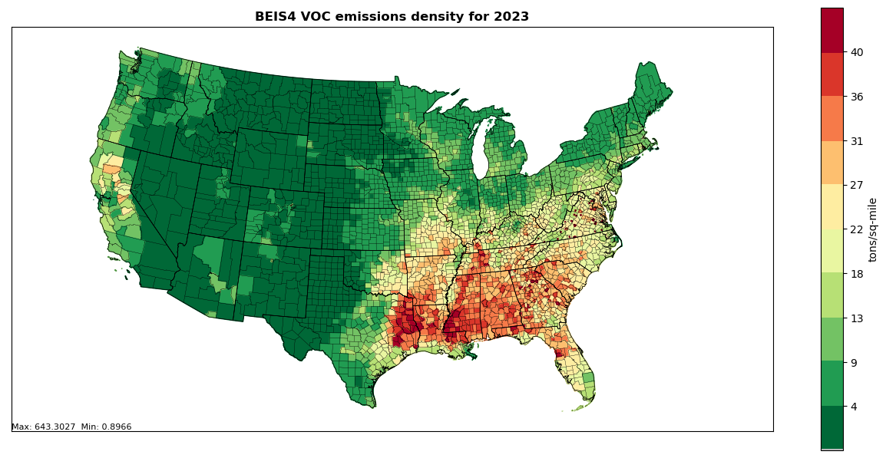
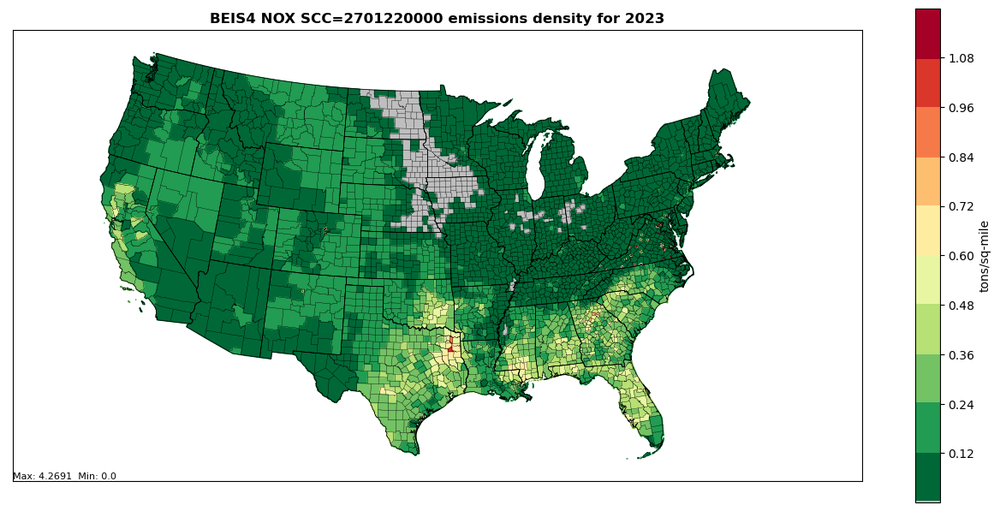
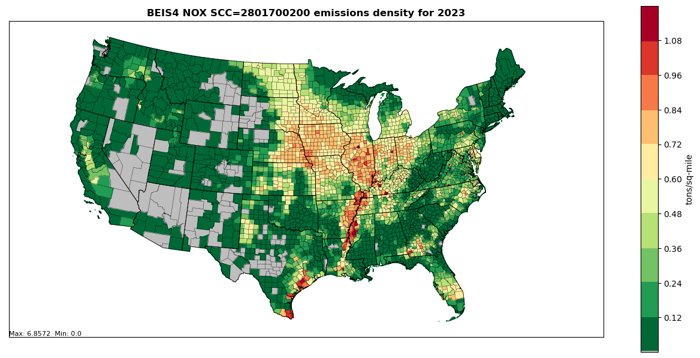
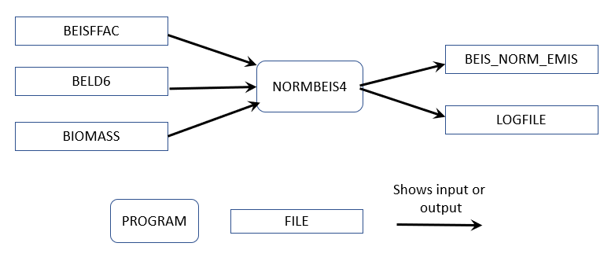
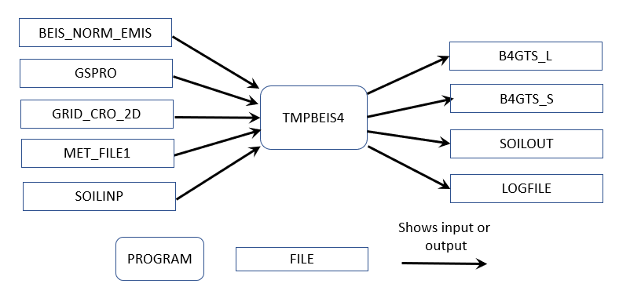
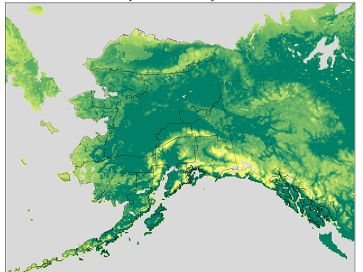
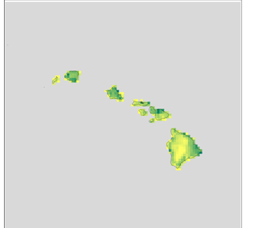
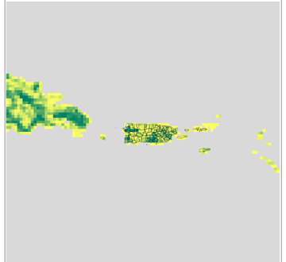

```{r, include=FALSE}
library(readxl)
library(knitr)
library(kableExtra)
library(readr)
library(ggplot2)
library(dplyr)
library(scales)
```

# Vegetation and Soils (BEIS) Emissions: CO, NO, and VOC {#biogenics}

Biogenic emissions are emissions that come from natural sources. They
need to be accounted for in photochemical grid models, as most types are
widespread and ubiquitous contributors to background air chemistry. In
the NEI, only the emissions from vegetation and soils are included.
Other relevant sources not included in the NEI are volcanic emissions
(geogenic), lightning oxides of nitrogen (NOx), and sea salt. Biogenic
emissions from vegetation and soils are computed using a model that
utilizes spatial information on vegetation, land use and environmental
conditions of temperature and solar radiation. The model inputs are
typically horizontally allocated (gridded) data, and the outputs are
gridded biogenic emissions, which can then be speciated and utilized as
input to photochemical grid models.

In the 2023 NEI, biogenic emissions are included in the nonpoint data
category, in the EIS sector "Biogenics -- Vegetation and Soil." Table \@ref(tab:bioscc) 
lists the three source classification codes (SCCs) used 
in the 2023 NEI that comprise this sector. These three SCCs have distinct pollutants:
SCC 2701220000 and 2801700200 have only NOX emissions, and SCC
2701200000 has emissions for carbon monoxide (CO), volatile organic
compounds (VOC) and three VOC hazardous air pollutants (HAPs):
formaldehyde, acetaldehyde and methanol. Note that there is a fertilizer
adjustment for soils on agricultural lands in the SCC 2801700200. In the
2020 NEI, all the soil nitric oxide emissions were included in one SCC,
2701220000.

```{r, include=FALSE}
df <- read_excel("./tables/Section-7/table1_biogenic_sccs.xlsx")
df[is.na(df)] <- ""
```

```{r bioscc, tidy=FALSE, echo=FALSE, booktabs = TRUE}
kableExtra::kbl(
  df, booktabs = TRUE,
  caption = 'SCCs for biogenic sources.',
) %>%
kable_styling(full_width = FALSE, position = "center", latex_options = c("hold_position", "scale_down"))
```

## EPA-developed emissions

### Conterminous U.S.

The biogenic emissions for the 2023 National Emissions Inventory (NEI)
were computed based on 2023 meteorology data from the Weather Research
and Forecasting (WRF) model version 4.4.2 (WRFv4.4.2) and using the
Biogenic Emission Inventory System, version 4 (BEIS4) model within the
[Sparse Matrix Operator Kernel Emissions (SMOKE) modeling system version
5.1](https://cmascenter.org/smoke/documentation/5.1/html/ch04s19.html).
The BEIS4 model creates gridded, hourly, model-species emissions from
vegetation and soils at 12-kilometer horizontal resolution. The
12-kilometer gridded hourly data are summed to monthly and annual level
and are mapped from 12-kilometer grid cells to counties using a standard
mapping file. Figures \@ref(fig:voc-dens), \@ref(fig:nox-dens), and \@ref(fig:nox2-dens) 
provide county emissions density maps
for all 3 SCCs.

```{r voc-dens, fig.cap="Annual VOC County emissions density map for year 2023 (tons per square mile) for SCC 270120000", fig.alt="This figure shows an annual VOC County emissions density map for year 2023 (tons per square mile) for SCC 270120000", echo=FALSE, out.width="75%", fig.pos="H"}

```
<a href="figures/Section-7/image1.png" download="figures/Section-7/image1.png" class="btn btn-primary">Download Figure</a>

```{r nox-dens, fig.cap="Annual NOX County emissions density map for year 2023 (tons per square mile) for SCC 2701220000", fig.alt="This figure shows an annual NOX County emissions density map for year 2023 (tons per square mile) for SCC 2701220000", echo=FALSE, out.width="75%", fig.pos="H"}

```
<a href="figures/Section-7/image2.png" download="figures/Section-7/image2.png" class="btn btn-primary">Download Figure</a>

```{r nox2-dens, fig.cap="Annual NOX County emissions density map for year 2023 (tons per square mile) for SCC 2801700200", fig.alt="This figure shows an annual VOC County emissions density map for year 2023 (tons per square mile) for SCC 2801700200", echo=FALSE, out.width="75%", fig.pos="H"}

```
<a href="figures/Section-7/image3.png" download="figures/Section-3/image1.png" class="btn btn-primary">Download Figure</a>

BEIS produces biogenic emissions for a modeling domain which includes
the contiguous 48 states in the U.S., parts of Mexico, and Canada. The
NEI uses the biogenic emissions from counties from the contiguous 48
states and Washington, DC. The model-species are those associated with
the Carbon Bond mechanism version 6 (CB6). The NEI pollutants produced
are CO, VOC, NOx, methanol, formaldehyde and acetaldehyde. VOC is the
sum of all biogenic species except CO and nitrogen oxide (NO). Mapping
of BEIS species to NEI pollutants is as follows:

* NO maps to NOx

* FORM maps to formaldehyde

* ALD2 maps to acetaldehyde
 
* MEOH maps to methanol

* VOC is the sum of all biogenic species except CO and NO

BEIS4 has some important updates from earlier versions of BEIS. These
include the incorporation of Version 6 of the Biogenic Emissions Landuse
Database (BELD6), the option to include seasonality of emissions using
the 1-meter soil temperature (SOIT2) instead of the BIOSEASON file, and
canopy temperature and radiation environments are now modeled using the
driving meteorological model's (WRFv4.4.2) representation of LAI rather
than the estimated LAI values just from BELD data. See
<https://github.com/USEPA/CMAQ/wiki/CMAQ-Release-Notes:-Emissions-Updates:-BEIS-Biogenic-Emissions>
for more technical information on BEIS4.

BEIS4 includes a two-layer canopy model. Layer structure varies with
light intensity and solar zenith angle. Both layers of the canopy model
include estimates of sunlit and shaded leaf area based on solar zenith
angle and light intensity, direct and diffuse solar radiation, and leaf
temperature [[ref 1](#biogenic_references)]. The new algorithm requires additional
meteorological variables over previous versions of BEIS. The meteorology
input data fields used by BEIS are shown in Table \@ref(tab:biomet).

```{r, include=FALSE}
df <- read_excel("./tables/Section-7/table2_biogenic_metvars.xlsx")
df[is.na(df)] <- ""
```

```{r biomet, tidy=FALSE, echo=FALSE, booktabs = TRUE}
kableExtra::kbl(
  df, longtable = TRUE, booktabs = TRUE,
  caption = 'Meteorological variables required by BEIS 4'
) %>%
kable_styling(full_width = FALSE, position = "center", latex_options = c("hold_position"))
```

The Biogenic Emissions Landcover Database
version 6 (BELD6) was used as the input gridded land use information in
generating 2023NEI estimates. The other input dataset change involved
updating the dry leaf biomass (grams/m2) values for various vegetation
types.

The BELD6 includes the following datasets:

-   High resolution tree species and biomass data from Wilson 2013a [[ref 2](#biogenic_references)] and 
 Wilson 2013b [[ref 3](#biogenic_references)] for which species names were changed
    from non-specific common names to scientific names.

-   Tree species biogenic volatile organic carbon (BVOC) emission
    factors for tree species were taken from the NCAR Enclosure database
    (Wiedinmyer 2001).

-   Agricultural land use from US Department of Agriculture (USDA) crop
    data layer
    (<https://www.nass.usda.gov/Research_and_Science/Cropland/SARS1a.php>)

-   Global Moderate Resolution Imaging Spectroradiometer (MODIS) 20
    category data with enhanced lakes and Fraction of Photosynthetically
    Active Radiation (FPAR) for vegetation coverage from National Center
    for Atmospheric Research (NCAR)
    (<https://www2.mmm.ucar.edu/wrf/users/download/get_sources_wps_geog.html>
    )

-   Canadian BELD land use
    (<https://www.epa.gov/sites/default/files/2019-08/documents/800am_zhang_2_0.pdf>).

The SMOKE-BEIS4 modeling system consists of two programs named: 1)
Normbeis4 and 2) Tmpbeis4. Normbeis4 uses emissions factors and BELD6
landuse and gridded biomass data to compute gridded normalized emissions
for chosen model domain (see Figure \@ref(fig:normbeis). The BEIS4 emissions factor
file (BEISFAC) contains leaf-area-indices (LAI), dry leaf biomass,
winter biomass factor, indicator of specific leaf weight, Agricultural
land type Yes/No (AG\_YN), and normalized emission fluxes for 35
different species/compounds. The BELD6 file is the gridded landuse for
200+ different landuse types. The output gridded domain is the same as
the input domain for the land use data. Output emission fluxes
(BEIS\_NORM\_EMIS) are normalized to 30°C, and isoprene and
methyl-butenol fluxes are also normalized to a photosynthetic active
radiation of 1000 µmol/m^2^s.

The normalized emissions output from Normbeis4 (BEIS\_NORM\_EMIS) are
input into Tmpbeis4 along with the MCIP meteorological data, chemical
speciation profile to use for desired chemical mechanism, and soil
moisture data file. Figure \@ref(fig:tmpbeis) illustrates the data flows for the
Tmpbeis4 program. The output from Tmpbeis includes gridded, speciated,
hourly emissions both in moles/second (B4GTS\_L) and tons/hour
(B4GTS\_S). Biogenic emissions output from Tmpbeis do not use an
emissions inventory and do not have SCCs assigned Please see the
SMOKEv5.1 User's Manual for more information on BEIS4 (
<https://cmascenter.org/smoke/documentation/5.1/html/ch04s19.html>).

```{r normbeis, fig.cap="Normbeis4 data flows for 2023NEI", fig.alt="This figure shows Normbeis4 data flows for 2023NEI", echo=FALSE, out.width="75%", fig.pos="H"}

```
<a href="figures/Section-4/image1.png" download="figures/Section-4/image1.png" class="btn btn-primary">Download Figure</a>

```{r tmpbeis, fig.cap="Tmpbeis4 data flow diagram for 2023NEI", fig.alt="Tmpbeis4 data flow diagram for 2023NEI", echo=FALSE, out.width="75%", fig.pos="H"}

```
<a href="figures/Section-5/image1.png" download="figures/Section-5/image1.png" class="btn btn-primary">Download Figure</a>

### Alaska, Hawaii, Puerto Rico and Virgin Islands

The 2023NEI also include biogenic emissions estimates for counties in
the states of Alaska and Hawaii, and for the territories of Puerto Rico
and Virgin Islands. The BEIS version 3.61 modeling system and WRFv4.4.2
meteorology data for year 2023 were used to produce gridded biogenic
emissions for 3 separate modeling domains at 9-km horizontal resolution.
BELD6 data was not available for these modeling domains so BEIS4 was not
used for these states/territories. The modeling domain for Alaska is
shown in Figure \@ref(fig:akdomain). The land use data used for generating input data
for BEIS3.61 included the MODIS 20 category dataset, and the FIA version
8.0 used for estimating biomass input information.

```{r akdomain, fig.cap="Alaska 9-km modeling domain", fig.alt="This figure shows the Alaska 9-km modeling domain", echo=FALSE, out.width="60%", fig.pos="H"}

```
<a href="figures/Section-6/image1.png" download="figures/Section-6/image1.png" class="btn btn-primary">Download Figure</a>

The modeling domains for Hawaii, Puerto Rico and Virgin Islands are
shown in Figure \@ref(fig:hidomain) and Figure \@ref(fig:prvidomain), respectively. Both Puerto Rico and
Virgin Islands territories are in the same 9-km modeling domain. The
MODIS 20 category land use dataset was the only dataset used for land
use/vegetation input into BEIS3.61.

```{r hidomain, fig.cap="Hawaii 9-km modeling domain", fig.alt="This figure shows the Hawaii 9-km modeling domain", echo=FALSE, out.width="60%", fig.pos="H"}

```
<a href="figures/Section-7/image7.png" download="figures/Section-7/image7.png" class="btn btn-primary">Download Figure</a>

```{r prvidomain, fig.cap="Puerto Rico and Virgin Islands 9-km modeling domain", fig.alt="This figure shows the Puerto Rico and Virgin Islands 9-km modeling domain", echo=FALSE, out.width="60%", fig.pos="H"}

```
<a href="figures/Section-7/image8.png" download="figures/Section-7/image8.png" class="btn btn-primary">Download Figure</a>

The 9-kilometer gridded hourly data from these modeling domains are
summed to monthly and annual level and are mapped from 9-kilometer grid
cells to counties using a standard mapping file in a similar manner as
was done for the contiguous 48 states. The mapping of BEIS species to
NEI pollutants for these states and territories was also done in the
same manner as the contiguous 48 states.

## References {#biogenic_references}

1.  Bash, J.O., Baker, K.R., Beaver, M.R.,
    Park, J.-H., Goldstein, A.H., 2016. Evaluation of improved land use
    and canopy representation in BEIS with biogenic VOC measurements in
    California.

2.  Wilson, Barry Tyler; Lister, Andrew J.; Riemann, Rachel I.;
    Griffith, Douglas M. 2013a. Live tree species basal area of the
    contiguous United States (2000-2009). Newtown Square, PA: USDA
    Forest Service, Rocky Mountain Research Station.
    https://doi.org/10.2737/RDS-2013-0013

3.  Wilson, Barry Tyler; Woodall, Christopher W.; Griffith, Douglas M.
    2013b. Forest carbon stocks of the contiguous United States
    (2000-2009). Newtown Square, PA: U.S. Department of Agriculture,
    Forest Service, Northern Research Station.
    https://doi.org/10.2737/RDS-2013-0004
