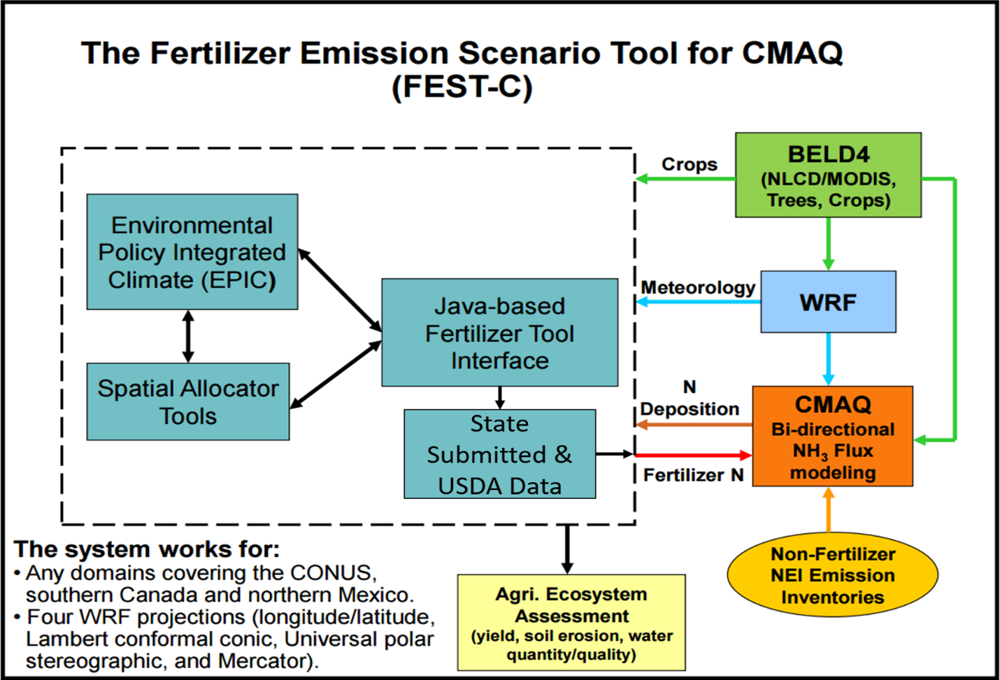
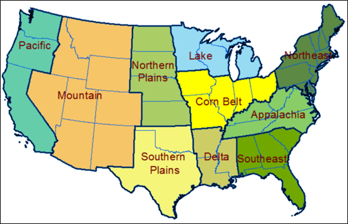
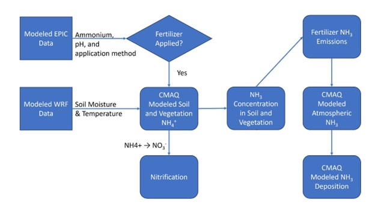
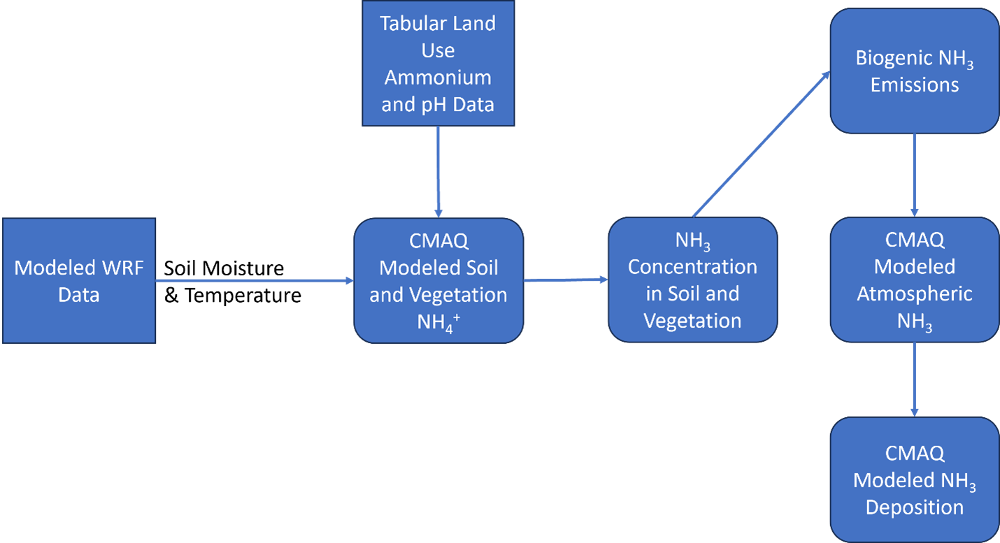
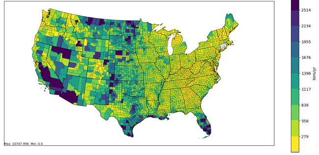
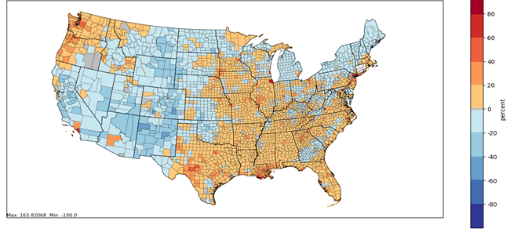
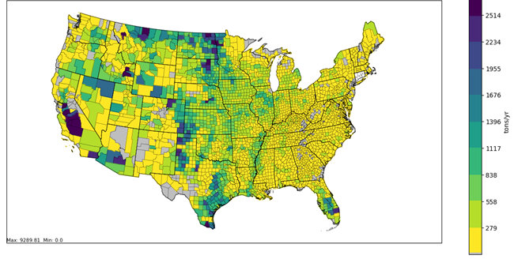
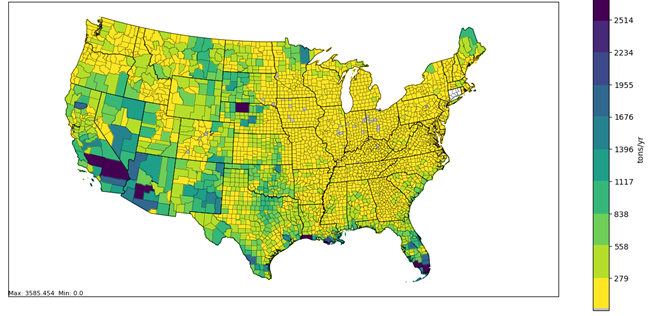

```{r, include=FALSE}
library(readxl)
library(knitr)
library(kableExtra)
library(readr)
library(ggplot2)
library(dplyr)
library(scales)
library(glue)
```

# Agricultural and Non-agricultural Lands (STAGE) Emissions: NH3 {#STAGE}

## Sector Descriptions and Overview 

Soils and vegetation can be a source or sink for atmospheric ammonia (NH3) emissions due to nitrogen input rates, atmospheric conditions and biological processes. In other words, their flux is bidirectional. The direction and magnitude of the exchange depend on the concentration gradient between the canopy and the atmosphere.  Natural vegetation and soils will emit NH3 as a result of biogenic processes. Vegetation and soil associated with agricultural croplands will receive a higher input of nitrogen than non-agricultural lands during periods of fertilizer application (which refers to any nitrogen-based compound, or mixture containing such a compound, that is applied to land to improve plant fitness) and can emit NH3 similarly.

The SCCs that compose this sector in the 2023 NEI are provided in Table \@ref(tab:STAGE-sccs).  EPA-estimated emissions of these SCCs are discussed further below.

```{r, include=FALSE}
df <- read_excel("./tables/Section-8/STAGE-SCCs.xlsx")
df[is.na(df)] <- ""
```

```{r STAGE-sccs, tidy=FALSE, echo=FALSE, booktabs = TRUE}
kableExtra::kbl(
  df, booktabs = TRUE,
  caption = 'SCCs in the agricultural and non-agricultural lands NH3 emissions sector.',
  format.args = list(scientific = FALSE, trim = TRUE)
) %>%
kable_styling(full_width = FALSE, position = "center", latex_options = c("hold_position", "scale_down"))
```

## EPA-developed estimates

### Methodology Overview

The approach to calculating NH3 emissions from agricultural lands in 2023 is consistent with the 2020 NEI, however, in the 2023 NEI, agricultural land emissions were tabulated separately from the non-agricultural land biogenic NH3 emissions based on the National Land Cover Database (NLCD) agricultural land use fraction data from the driving meteorological model.  The bidirectional (“bidi”) version of CMAQ (v5.4) [[ref 1](#STAGE-references)] and the Fertilizer Emissions Scenario Tool for CMAQ (FEST-C; v1.4) [[ref 2](#STAGE-references)] were used to estimate NH3 emissions from cropland soils. The estimates are specific to the Biogenic Emissions Landuse Dataset (BELD4) simulated land use category and are scaled based on the percent areal coverage in each grid cell of that category (e.g., “Hay” or “Alfalfa”). These estimates were then loaded into EIS for use in the 2023 NEI. In summary, the approach to estimate 2023 agricultural land emissions consists of these steps:

- Run FEST-C to produce nitrate (NO3), ammonium (NH4+, including urea), and organic (manure) nitrogen (N) fertilizer usage estimates.
- Run CMAQ v 5.4 model with the Surface Tiled Aerosol and Gaseous Exchange (STAGE) deposition option, which includes bidirectional NH3 exchange to generate gaseous NH3 fertilizer application emission estimates.
- Calculate county-level emission factors as the ratio of bidirectional CMAQ NH3 fertilizer emissions to FEST-C total N fertilizer application.  
- Assign the NH3 agricultural land emissions to SCC: 2801700100.

FEST-C is a software program that processes land use and agricultural activity data to develop inputs for the CMAQ model when run with bidirectional exchange. FEST-C reads land use data from the BELD4, meteorological variables from the Weather Research and Forecasting (WRF) model [[ref 3](#STAGE-references)], and nitrogen deposition data from a previous or historical average CMAQ simulation. FEST-C then uses the USDA’s Environmental Policy Integrated Climate (EPIC) modeling system [[ref 4](#STAGE-references)] to simulate the agricultural practices and soil biogeochemistry and provides information regarding fertilizer timing, composition, application method and amount. Figure \@ref(fig:FEST-C) below provides a comprehensive flowchart of the complete EPIC/FEST-C bidirectional modeling system. 

For 2023, we estimate fertilizer application by crop type for 2023 using FEST-C modeled data since 2023 USDA Economic Research Service crop-specific fertilization data is not yet available, and we did not receive state estimated data. In the future, the FEST-C simulations could be evaluated using the USDA Economic Research Service and U.N. Food and Agriculture national fertilizer application estimates.  

```{r FEST-C, fig.cap="Bidirectional modeling system used to compute 2023 agricultural land emissions", fig.alt="This figure shows the FEST-C bidirectional modeling system", echo=FALSE, out.width="75%", fig.pos="H"}

```
<a href="figures/Section-8/fig1.png" download="figures/Section-8/fig1.png" class="btn btn-primary">Download Figure</a>

The following activity parameters were input into the EPIC model:

- Meteorology from WRF model (WRF) 
- Initial soil profiles/soil selection
- Presence of 21 major crops, with each either irrigated or rain-fed: hay, alfalfa, grass, barley, beans, grain and forage corn, grain and forage cotton, oats, peanuts, potatoes, rice, rye, grain and forage sorghum, soybeans, grain and forage  wheat, canola, and other grain and forage crops (e.g. lettuce, tomatoes, etc.).
- Fertilizer sales to establish the type/composition of nutrients applied
- Management scenarios for the 10 USDA production regions in Figure \@ref(fig:USDA) [[ref 5](#STAGE-references)]. These include irrigation, tile drainage, intervals between forage harvest, fertilizer application method (injected versus surface applied), and equipment commonly used in these production regions. 

```{r USDA, fig.cap="USDA farm production regions used in FEST-C simulations", fig.alt="This figure shows the USDA farm production regions used in FEST-C simulations", echo=FALSE, out.width="75%", fig.pos="H"}

```
<a href="figures/Section-8/fig2.png" download="figures/Section-8/fig1.png" class="btn btn-primary">Download Figure</a>

WRF v4.6 simulations were processed with the Meteorology-Chemistry Interface Processor (MCIP) version 5.3.3. MCIP output provides grid cell meteorology for 2023 using a national 12-km rectangular grid covering the continental U.S. More information on MCIP is available here: https://www.epa.gov/cmaq/meteorology-chemistry-interface-processor. The meteorological parameters in Table \@ref(tab:env-vars) below were used as EPIC model inputs.

```{r, include=FALSE}
df <- read_excel("./tables/Section-8/env-vars.xlsx")
df[is.na(df)] <- ""
```

```{r env-vars, tidy=FALSE, echo=FALSE, booktabs = TRUE}
kableExtra::kbl(
  df, booktabs = TRUE, longtable = TRUE,
  caption = 'Environmental variables needed for an EPIC simulation.',
  format.args = list(scientific = FALSE, trim = TRUE)
) %>%
kable_styling(full_width = FALSE, position = "center", latex_options = c("hold_position"))
```

Initial soil nutrient and pH conditions in EPIC are based on a USDA Soil Conservation Service Soils-5 survey [[ref 6](#STAGE-references)]. Following a spin-up period to generate initial soils conditions, the EPIC model then is run using current fertilization and agricultural cropping techniques to estimate soil nutrient content and pH for the 2023 WRF-CMAQ simulation. 

The presence of crops in each model grid cell was determined using USDA Census of Agriculture data [[ref 7](#STAGE-references)] and USGS National Land Cover data [[ref 8](#STAGE-references)]. These two data sources were used to compute the fraction of agricultural land in a model grid cell and the mix of crops grown on that land.

Fertilizer sales data and the 6-month period in which they were sold were extracted from the Association of American Plant Food Control Officials (AAPFCO) [[ref 9](#STAGE-references)]. AAPFCO data are used to identify the composition (e.g. urea, nitrate, organic) of the fertilizer used, and the amount applied is estimated using the modeled crop demand. These data are used to assign what kind of fertilizer is being applied to which crops.

### Activity Data

There were four different types of activity data used to estimate emissions. These were plant date (day of year), yield of grain or forage (ton/ha) and fertilization rates (kg/ha), which were obtained from the EPIC model. All activity data was at the state level and were provided to our stakeholders to enable review and comment during the 2023 NEI process. The data covered 10 USDA production regions and provides management schemes for hay, alfalfa, grass, barley, beans, grain and forage corn, grain and forage cotton, oats, peanuts, potatoes, rice, rye, grain and forage sorghum, soybeans, grain and forage wheat, canola, and other grain and forage crops (e.g. lettuce, tomatoes, etc.). 

### Emission Factors

The emission factors were derived from the 2023 CMAQ FEST-C outputs. Total agricultural land emission factors for each month and county were computed by taking the ratio of total agricultural land NH3 emissions (short tons) to total nitrogen fertilizer application (short tons).

Gridded NH3 emissions on a 12 km by 12 km scale were mapped to a county shape file polygon. The cell was assigned to a county if the grid centroid fell within the county boundary. County-level agricultural land emissions (NH3) are derived from the diagnostic emission output from the CMAQ FEST-C model simulation (for details see [[ref 10](#STAGE-references)]). With this modeling system, it would be difficult to perform a sample calculation; this is not something that could be demonstrated in a spreadsheet. These emissions are computed via the full chemical transport model with a bidirectional deposition parameterization, as illustrated in Figure \@ref(fig:ag-framework).

```{r ag-framework, fig.cap="Modeling framework flow of operations in estimating agricultural land NH3 emissions. Agricultural land NH3 emissions are used by regional chemical transport models, such as CMAQ and CAMx, and are the sole option if the model is configured with a unidirectional depositional framework.", fig.alt="This figure shows the modeling framework flow of operations in estimating agricultural land NH3 emissions. Agricultural land NH3 emissions are used by regional chemical transport models, such as CMAQ and CAMx, and are the sole option if the model is configured with a unidirectional depositional framework.", echo=FALSE, out.width="75%", fig.pos="H"}

```
<a href="figures/Section-8/fig3.jpg" download="figures/Section-8/fig3.jpg" class="btn btn-primary">Download Figure</a>

## EPA-developed Non-agricultural Land NH3 Emissions

### Methodology Overview

Since the 2020 NEI, EPA has developed an approach for estimating biogenic non-agricultural land NH3 emissions from soils and vegetation constrained with recent flux observations from EPA-ORD measurement programs [[ref 11, 12](#STAGE-references)]. These measurements indicated that NH3 emissions from biogenic sources were underestimated by the bidirectional exchange parameterization in CMAQ v5.3 and earlier. This was rectified in CMAQ v5.4 through the incorporation of revised NH3 emission potentials, which were based on soil and vegetation surveys at some Ammonia Monitoring Network (AMoN) sites and soil and vegetation NH4+ observations in the global TRY plant trait database [[ref 13](#STAGE-references)]. The ground and vegetation emission potentials for non-agricultural lands may be found in the “STAGE_LU_DATA” table of STAGE’s CMAQ control namelist ([CMAQ_Control_STAGE.nml](https://github.com/USEPA/CMAQ/blob/5.4/CCTM/src/depv/stage/CMAQ_Control_STAGE.nml)) and are listed in Table \@ref(tab:emis-potentials). Emission potentials represent the ratio of leaf or soil surface NH4+ and H+ and govern the emissions of NH3 from aqueous media following Henry’s Law [[ref 14, 15](#STAGE-references)]. The emission potentials and the approach to calculating NH3 emissions from biogenic sources in 2023 are consistent with the 2020 NEI but is tabulated separately with a unique SCC.  

```{r, include=FALSE}
df <- read_excel("./tables/Section-8/emis-potentials.xlsx")
df[is.na(df)] <- ""
```

```{r emis-potentials, tidy=FALSE, echo=FALSE, booktabs = TRUE}
kableExtra::kbl(
  df, booktabs = TRUE, longtable = TRUE,
  caption = 'Ground and vegetation NH3 emission potentials for non-agricultural lands.',
  format.args = list(scientific = FALSE, trim = TRUE)
) %>%
kable_styling(position = "center", latex_options = c("hold_position", "repeat_header"), font_size = 11) %>%
  column_spec(1, width = "4cm") %>%
  column_spec(2, width = "4cm") %>%
  column_spec(3, width = "4cm")
```
* The agricultural NH3 flux uses soil ammonium simulated with FEST-C.

The approach to estimate 2023 non-agricultural land emissions of NH3 is illustrated in Figure \@ref(fig:nonag-framework) and consists of these steps:

- CMAQ v5.4 was modified to output non-agricultural land biogenic NH3 emissions separately from agricultural land emissions. 
- Run CMAQ v 5.4 model with the Surface Tiled Aerosol and Gaseous Exchange (STAGE) deposition option with bidirectional (“bidi”) NH3 exchange to generate gaseous biogenic ammonia NH3 emission estimates.
- Calculate the month- and county-specific total non-agricultural land biogenic NH3 emissions (short tons)
- Assign the non-agricultural land biogenic NH3 emissions from soil and vegetation to SCC: 2803001000

```{r nonag-framework, fig.cap="Simplified CMAQ system flow of operations in estimating non-agricultural land biogenic NH3 emissions. Note that the role of deposition as a source of soil nitrogen is not currently represented due to the lack of a FEST-C-like biogeochemical model for non-agricultural land uses", fig.alt="This figure shows the simplified CMAQ system flow of operations in estimating non-agricultural land biogenic NH3 emissions. Note that the role of deposition as a source of soil nitrogen is not currently represented due to the lack of a FEST-C-like biogeochemical model for non-agricultural land uses", echo=FALSE, out.width="75%", fig.pos="H"}

```
<a href="figures/Section-8/fig4.png" download="figures/Section-8/fig4.png" class="btn btn-primary">Download Figure</a>

## NH3 Emission Summaries and Analysis

Total NH3 emissions from agricultural land and non-agricultural land (biogenic emissions from soil and vegetation) were similar to the NEI 2020 total emissions (1.8 million tons), also yielding reported emissions of 1.8 million tons. The spatial distribution of NEI 2023 NEI emissions was also broadly similar to NEI 2020 with greatest emissions in the Great Plains and in Western U.S. (Figure \@ref(fig:total-NH3)). In comparison to the 2020 NEI, 2023 NEI emissions increased by less than 20 percent in the South-East, Mississippi Basin and Pacific Northwest (Figure \@ref(fig:percent-diff)). For the Southwest, Rockies and Northeast regions of the U.S. NEI 2023 emissions generally decreased by up to 20 percent in comparison to 2020 (Figure \@ref(fig:percent-diff)).

Total emission contributions were 59 percent (1.1 million tons) for agricultural lands and 41 percent (0.7 million tons) for non-agricultural land. The distribution of emissions between agricultural and non-agricultural sources is uncertain due to a lack of observational constraints, especially in non-agricultural areas. Emissions from agricultural land were generally highest in the Mid-West with hot spots in agricultural cropland counties (Figure \@ref(fig:ag-emis)). Our inventory doesn’t represent the role of livestock as a source of soil nitrogen. However, bi-directional exchange is likely a negligible contributor to NH3 emissions from livestock overall (inferred from results at the Wendell site in [[ref 16](#STAGE-references)]). Non-agricultural land emissions are generally highest in the Great Plains and western portion of the U.S. with hotspots in the Nebraska Sandhills, Southern California and Arizona and South Florida (Figure \@ref(fig:nonag-emis)). For the Nebraska Sandhills, the emissions are likely driven by the local soil biogeochemistry, which has a strong potential for emitting NH3 because it is both sandy and alkaline. Additional measurements over this region and/or similar soils could provide evidence for refining the model representation of this process. Additionally, there is not currently a feedback mechanism for deposited nitrogen to contribute to emissions in later time steps. This may be influential in areas where deposition is a large contributor to total soil nitrogen. 

```{r total-NH3, fig.cap="Distribution of total agricultural land NH3 emissions and non-agricultural land NH3 emissions (biogenic emissions from soil and vegetation) in the 2023 NEI", fig.alt="This figure shows the distribution of total agricultural land NH3 emissions and non-agricultural land NH3 emissions (biogenic emissions from soil and vegetation) in the 2023 NEI", echo=FALSE, out.width="75%", fig.pos="H"}

```
<a href="figures/Section-8/fig5.png" download="figures/Section-8/fig5.png" class="btn btn-primary">Download Figure</a>

```{r percent-diff, fig.cap="Percent difference between NEI 2023 and NEI 2020 total agricultural land NH3 emissions and non-agricultural land NH3 emissions (biogenic emissions from soil and vegetation)", fig.alt="This figure shows the percent difference between NEI 2023 and NEI 2020 total agricultural land NH3 emissions and non-agricultural land NH3 emissions (biogenic emissions from soil and vegetation)", echo=FALSE, out.width="75%", fig.pos="H"}

```
<a href="figures/Section-8/fig6.png" download="figures/Section-8/fig6.png" class="btn btn-primary">Download Figure</a>

```{r ag-emis, fig.cap="Distribution of NH3 emissions from agricultural land in the 2023 NEI", fig.alt="This figure shows the distribution of NH3 emissions from agricultural land in the 2023 NEI", echo=FALSE, out.width="75%", fig.pos="H"}

```
<a href="figures/Section-8/fig7.png" download="figures/Section-8/fig7.png" class="btn btn-primary">Download Figure</a>

```{r nonag-emis, fig.cap="Distribution of non-agricultural land NH3 emissions (biogenic emissions from soil and vegetation) in the 2023 NEI", fig.alt="This figure shows the distribution of non-agricultural land NH3 emissions (biogenic emissions from soil and vegetation) in the 2023 NEI", echo=FALSE, out.width="75%", fig.pos="H"}

```
<a href="figures/Section-8/fig8.png" download="figures/Section-8/fig8.png" class="btn btn-primary">Download Figure</a>

## Improvements/Changes to 2023 NEI

The 2023 NEI reports the emissions from agricultural lands and non-agricultural lands differently from the 2020 NEI. In the 2020 NEI, emissions from agricultural and non-agricultural lands are represented by a single SCC (i.e., “Total Fertilizers”) whereas in the 2023, emissions are tabulated using two separate SCCs (agricultural land and non-agricultural lands). This improvement more accurately quantifies anthropogenic and biogenic emissions.

## References {#STAGE-references}

1. U.S. EPA, 2022. CMAQ (Version 5.4), Zenodo [software]. Available at [https://doi.org/10.5281/zenodo.7218076](https://doi.org/10.5281/zenodo.7218076)
2. U.S. EPA, 2018. Fertilizer Emission Scenario Tool for CMAQ (FEST-C) (Version 1.4), Community Modeling and Analysis system [software]. Available at [https://www.cmascenter.org/fest-c/](https://www.cmascenter.org/fest-c/) 
3. National Center for Atmospheric Research (NCAR), 2024. Weather Research Model (Version 4.6), Github [software]. Available at [https://github.com/wrf-model/WRF/releases/tag/v4.6.0](https://github.com/wrf-model/WRF/releases/tag/v4.6.0) 
4. Williams, J.R., 1995. The EPIC model. In V. P. Singh (Ed.), Computer models in watershed hydrology (Chapter 25, (pp. 909–1000). Littleton, CO: Water Resources Publications.
5. Cooter, E.J., Bash, J.O., Benson V., Ran, L.-M, 2012. Linking agricultural crop management and air-quality models for regional to national-scale nitrogen deposition assessments. Biogeosciences, 9, 4023-4035, [https://doi.org/10.5194/bg-9-4023-2012](https://doi.org/10.5194/bg-9-4023-2012) 
6. Baumer, O.M., 1992. Predicting unsaturated hydraulic parameters, In Proc. Int. Workshop on Indirect Methods for Estimating the Hydraulic Properties of Unsaturated Soils, University of California, Riverside, 341‐354.
7. USDA Census of Agriculture data, 2012. Available at [https://quickstats.nass.usda.gov](https://quickstats.nass.usda.gov/)
8. Homer, C., Dewitz, J., Yang, L., Jin, S., Danielson, P., Xian, G., et al. (2015). Completion of the 2011 National Land Cover Database for the conterminous United States–representing a decade of land cover change information. Photogrammetric Engineering & Remote Sensing,
81(5), 345–354. 
9. Brakebill, J.W., & Gronberg, J.M., 2017. County‐level estimates of nitrogen and phosphorus from commercial fertilizer for the conterminous United States, 1987‐2012. Retrieved from U.S. Geological Survey data release. Baltimore, MD: Water Science Center, U.S. Geological Survey. [doi.org/10.5066/F7H41PKX](https://doi.org/10.5066/F7H41PKX)
10. Bash, J.O., Cooter, E.J., Dennis. R.W., Walker, J.T., Pleim. J.E., 2013. Evaluation of a regional air-quality model with bi-directional NH3 exchange coupled to an agro-ecosystem model, Biogeosciences, 10, 1635-1645, [doi.org/10.5194/bg-10-1635-2013](https://doi.org/10.5194/bg-10-1635-2013)
11. Rumsey, I.C., Walker, J.T., 2016. Application of an online ion-chromatography-based instrument for gradient flux measurements of speciated nitrogen and sulfur, Atmos. Meas. Tech. 9, 2581-2592, doi:10.5194/amt-9-2581-2016 
12. Walker, J.T., Chen, X., Wu, Z., Schwede, D., Daly, R., Djurkovic, A., Oishi, A.C., Edgerton, E., Bash, J., Knoepp, J., Puchalski, M., Iiames, J., and Miniat, C.F., 2023. Atmospheric Deposition of Reactive Nitrogen to a Deciduous Forest in the Southern Appalachian Mountains, Biogeosciences 20, 971-995, doi.org/10.5194/bg-20-971-2023.
13. Future Earth and Max Planck Institute for Biogeochemistry, 2022. TRY Plant Trait Database, available at [https://www.try-db.org/](https://www.try-db.org/)
14. Bash, J.O., Walker, J.T., Rao, V., Wu, Z., Baublitz, C., Rumsey, I., 2023. Updates to Fertilizer and Biogenic NH3 emissions for the National Emissions Inventory, 2023 International Emission Inventory Conference, September 26-29, Seattle, WA. Available at [https://www.epa.gov/system/files/documents/2023-11/200pm_bash.pdf](https://www.epa.gov/system/files/documents/2023-11/200pm_bash.pdf)
15. Massad, R-S., Nemitz, E., Sutton, M.A., 2010. Review and parameterization of bi-directional ammonia exchange between vegetation and the atmosphere, Atmos. Chem. Phys., 10, 10359-10386, doi.org/10.5194/acp-10-10359-2010.
16. Leytem, A.B, Walker, J.T, Wu, Z., Nouwakpo, K., Baublitz, C., Bash, J., Beachley, G., Spatial distribution of ammonia concentrations and modeled dry deposition in an intensive dairy production region, 2024. Atmosphere,15, 15, doi: 10.3390/atmos15010015.