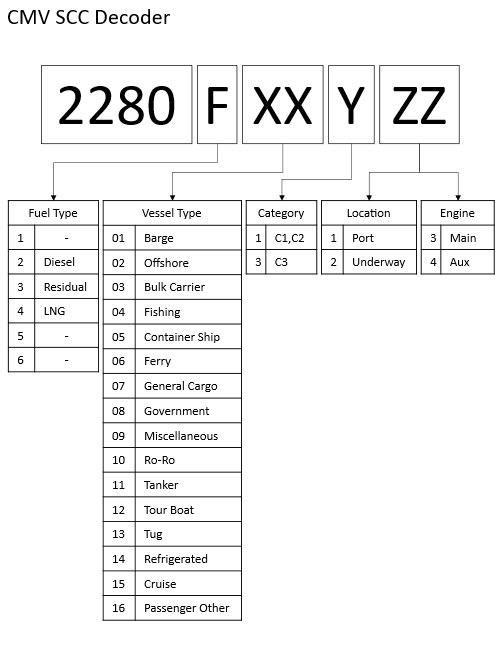

```{r, include=FALSE}
library(readxl)
library(knitr)
library(kableExtra)
library(readr)
library(ggplot2)
library(dplyr)
library(scales)
library(glue)
```

# Commercial Marine Vessels {#CMVs}

This section documents (CMV) emissions in the nonpoint data category. 

## Sector Descriptions and Overview 

The CMV sector includes boats (excluding pleasure craft that are covered by the MOVES-Nonroad model) and ships used either directly or indirectly in the conduct of commerce or military activity. Most vessels in this category are powered by marine compression-ignition (diesel) engines that are fueled with either distillate or residual fuel oil blends. In previous NEIs, we assumed that Category 3 (C3) vessels primarily used residual blends while Category 1 and 2 (C1 and C2) vessels typically used distillate fuels. The 2023 NEI uses updated CMV SCCs that include information about vessel type. Fuel details and emission factors are the same as were used in the 2020 NEI.
 
The C3 inventory includes vessels which use marine compression-ignition engines for propulsion. C3 engines are defined as having displacement above 30 liters per cylinder. The resulting inventory includes emissions from both propulsion and auxiliary engines used on these vessels, as well as those using diesel or residual diesel fuel. Geographically, the inventories include port and interport emissions that occur within the area that extends 200 nautical miles (nm) from the official U.S. shoreline, which is roughly equivalent to the border of the U.S. Exclusive Economic Zone. Only some of these emissions are allocated to states based on official state boundaries that typically extend 3 to 9 miles offshore.

The C1 and C2 vessels are smaller ships with marine compression-ignition engines less than 30 liters per cylinder. These vessels tend to operate closer to shore, and along inland and intercoastal waterways. U.S. Naval vessels are not included in this inventory, though some Coast Guard vessels are included as part of the C1 and C2 inventory.

The CMV sector in the nonpoint data category does not include recreational marine vessels, which are generally less than 100 feet in length (most being less than 30 feet) and powered by either inboard or outboard engines. Emissions from these vessels are calculated by the MOVES model and are reported in the nonroad mobile data category and EIS “Mobile - Non-Road Equipment” sectors of the [2023 NEI](https://gaftp.epa.gov/Air/nei/2023/doc/supporting_data/nonpoint/CMV/).

The 2023 NEI CMV SCCs are shown in  Table \@ref(tab:CMV-SCCs) below. Emission factors vary by SCC. The SCC Levels were changed starting with EPA’s 2022 Emissions Modeling Platform to accommodate the new SCCs that include ship type. A decoder for the new SCCs can be found in Figure \@ref(fig:fig-static).

```{r, include=FALSE}
df <- read_excel("./tables/Section-9/CMV-SCCs.xlsx")
df[is.na(df)] <- ""
```

```{r CMV-SCCs, tidy=FALSE, echo=FALSE,warning=FALSE,message=FALSE}
kableExtra::landscape(
kableExtra::kbl(
  df, 
  booktabs = FALSE, 
  longtable = TRUE,
  caption = "New Commercial Marine Vessel SCCs and emission types in EPA estimates"
) %>%
  kableExtra::kable_styling(
    full_width = FALSE,
    position = "center",
    latex_options = c("hold_position", "repeat_header","scale_down")
  ) #%>%
  #kableExtra::column_spec(1, width = "1cm") %>%
  #kableExtra::column_spec(2, width = "4cm") %>%
  #kableExtra::column_spec(3, width = "4cm") %>%
  #kableExtra::column_spec(4, width = "4cm") %>%
  #kableExtra::column_spec(5, width = "4cm")
)
```

```{r fig-static, fig.cap="CMV SCC Decoder", out.width="70%", fig.align="center", fig.alt="CMV SCC Decoder diagram", echo=FALSE, fig.pos="H"}

```

<a href="figures/Section-9/CMV_SCC_decoder.png" download="figures/Section-9/CMV_SCC_decoder.png" class="btn btn-primary">Download Figure</a>

## Sources of data

EPA’s CMV estimates are computed using detailed Automatic Identification System (AIS) activity data collected by terrestrial receivers maintained by the US Coast Guard in conjunction with commercially sourced AIS data collected by satellites. The details of these calculation are available in the documents [2023NEI_C1C2_Documentation](https://gaftp.epa.gov/air/nei/2023/doc/supporting_data/nonpoint/CMV/) and [2023 C3 Marine Emissions Tool  Documentation](https://gaftp.epa.gov/air/nei/2023/doc/supporting_data/nonpoint/CMV/) on the [2023 Supporting data FTP site](https://gaftp.epa.gov/air/nei/2023/doc/supporting_data/). Two states submitted CMV emissions to EIS (California and Texas). After review, EPA determined to use EPA estimates for the 2023 NEI instead of California’s estimates. Texas’s CMV emissions were deemed acceptable. These decisions were based on both methodology and resulting estimates. 

## EPA-developed estimates

Emissions are calculated for each time interval between consecutive AIS messages for each vessel and allocated to the location of the message following the interval. Emissions are calculated according to Eqn. \@ref(eq:Emissions).

\begin{equation} 
  Emissions_{interval} = Time(hr)_{interval} \times Power(kW) \times EF(g/kWh) \times LLAF
  (\#eq:Emissions)
\end{equation}
    
<div style="margin-left: 2em;">
  Where: <br> \newline
  \( Emissions_{interval} \) = mass of emissions estimated for each time interval between AIS messages for each vessel, typically calculated in grams and then converted to tons when emissions are aggregated
  <br> \newline
  \( Time(hr) \) = length of time between AIS messages, measured in hours
  <br> \newline
  \(Power(kW) \) = calculated in kWh for each AIS message, for each vessel, for each of the three engine groups on a vessel: propulsive (main), auxiliary, and auxiliary boiler engines
  <br> \newline
  \( EF \) = assigned emission factors for each ship type and engine group on the vessel in g/kWh
  <br> \newline
  \( LAFF \) = low load adjustment factor, a unitless factor that reflects increasing propulsive emissions during low load operations and varies according to the calculated propulsive power
  <br> \newline
</div>