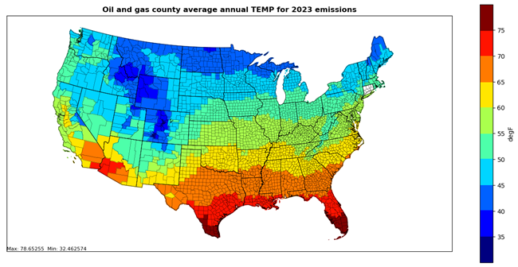

```{r, include=FALSE}
library(readxl)
library(knitr)
library(kableExtra)
library(readr)
library(ggplot2)
library(dplyr)
library(scales)
library(glue)
```

# Oil and Gas Exploration and Production {#OandG}

## Sector Descriptions and Overview 

This sector includes processes associated with the exploration and drilling at oil, gas, and coal bed methane (CBM) wells and the equipment used at the well sites to extract the product from the well and deliver it to a central collection point or processing facility. 

Table \@ref(tab:OG-SCCs) lists the processes below with their corresponding SCCs; the SCCs used by EPA to estimate nonpoint emissions are noted in the “EPA Estimates?” column. The level 1 and 2 SCC description for all SCCs in this sector is “Industrial Processes; Oil and Gas Exploration and Production”.

Note also that the SCCs in this list are only the active nonpoint SCCs that either the EPA used or the submitting State agencies submitted in the 2023 NEI. All the SCCs that the EPA oil and gas tool uses are nonpoint SCCs. Lastly, “OG Tool” marked with an asterisk (OG Tool*) denote SCCs that are produced by the tool, but only for the state of Pennsylvania, by special request. “Blowdown and Pigging” EPA estimates are generated outside of the EPA Oil and Gas Tools and are noted as “non-OG Tool” in the “EPA Estimates?” column.

```{r, include=FALSE}
df <- read_excel("./tables/Section-11/OG-SCCs.xlsx")
df[is.na(df)] <- ""
```

```{r OG-SCCs, tidy=FALSE, echo=FALSE, booktabs = TRUE}
kableExtra::kbl(
  df, booktabs = TRUE, longtable = TRUE, 
  caption = 'Nonpoint Oil and Gas Exploration and Production Sector SCCs and whether/how EPA Estimates.',
  format.args = list(scientific = FALSE, trim = TRUE)
) %>%
kable_styling(position = "center", latex_options = c("hold_position", "repeat_header")) %>%
  column_spec(1, width = "2cm") %>%
  column_spec(2, width = "2cm") %>%
  column_spec(3, width = "9cm")
```

## Sources of data

For the nonpoint data category, SLTs have four options for providing data to the NEI for the Oil and Gas Production Sector. They may: 1) accept the tool with the defaults populated in the tool by EPA, 2) choose to provide EPA with input data to incorporate in the tool, 3) run the tool themselves (presumably updating the inputs and subtracting point sources), or 4) use their own tools and methodology to provide estimates. In addition, some SLTs submit emissions data for the point data category. Table \@ref(tab:data-sources) indicates the source of Oil and Gas emissions for each SLT across both the Nonpoint and Point data categories.

```{r, include=FALSE}
df <- read_excel("./tables/Section-11/data-sources.xlsx")
df[is.na(df)] <- ""
```

```{r data-sources, tidy=FALSE, echo=FALSE, booktabs = TRUE}
kableExtra::kbl(
  df, booktabs = TRUE, longtable = TRUE, 
  caption = 'Data Source for Oil and Gas Production Data in the 2023 NEI.',
  format.args = list(scientific = FALSE, trim = TRUE)
) %>%
kable_styling(position = "center", latex_options = c("hold_position", "repeat_header"))
```

## EPA-developed estimates

There are two sets of emission estimates that EPA develops for nonpoint Oil and Gas sector contributions to the NEI: Oil and Gas “tool” estimates that were first developed for the 2011 NEI, and new for the 2023 NEI, blowdown estimates. Oil and Gas Tool estimates comprise most of the sector’s emissions and are discussed first. A brief subsection detailing blowdowns is provided later in this section.

The EPA furthered the development of the existing oil and gas emissions estimation tool that was originally developed for the 2011 NEI, which is a MS Access database that uses a bottom-up approach to build a national inventory. More information on the tool can be found in the documentation provided by ERG, entitled “2023 Nonpoint Oil and Gas Emission Estimation Tool” in the file ”[2023_Nonpoint_Oil_and_Gas_Emissions_Estimation_Tool.pdf](https://gaftp.epa.gov/Air/nei/2023/doc/supporting_data/nonpoint/oilgas/OILGAS_TOOL_V1.2/2023 Nonpoint Oil and Gas Emission Estimation Tool.pdf)”. There are two modules, as was put in place since the 2014 tool: Exploration and Production. Changes that have been incorporated in the 2023 Oil and Gas [Production](https://gaftp.epa.gov/air/nei/2023/doc/supporting_data/nonpoint/oilgas/OILGAS_TOOL_V1.2/OIL_GAS_TOOL_2023_NEI_PRODUCTION_V1_2.zip) and [Exploration](https://gaftp.epa.gov/air/nei/2023/doc/supporting_data/nonpoint/oilgas/OILGAS_TOOL_V1.2/OIL_GAS_TOOL_2023_NEI_EXPLORATION_V1_2.zip) tools since 2020 are addressed in the documentation above. In addition, a memo outlining the additional data from the GHG Reporting Program (subpart W) is entitled [2023 NEI Oil and Gas Tool Subpart W Analysis](https://gaftp.epa.gov/Air/nei/2023/doc/supporting_data/nonpoint/oilgas/EPA_collected_data_updates/2023 NEI Oil and Gas Tool Subpart W Analysis.docx).

In general, the tool calculates emissions for each piece of equipment on a well pad (like condensate tanks or dehydrators, for example) in a county or basin, based on average equipment counts taken from either surveys, literature searches, or the GHG reporting program, also accounting for control devices and gas composition in each county. County-level details are important, since well pads can vary significantly from region to region, basin to basin, and county to county. A well site in Denver, CO in the Denver-Julesburg Basin might look very different from one in the Marcellus Shale in PA, due to changes in technology over time (when the well was first drilled), geologic formations of the oil and gas reservoirs themselves (which also change over time—the ratio of oil to gas changes as pressure in the reservoir is released), and regulations in place guiding the equipment used on site.

The math used in the oil and gas tool is more complex than most other categories, as it uses equations like the ideal gas law and mass balances, in conjunction with more traditional emission rate equations (activity * EF = emissions); thus, the work is best completed in database format. Overall, there are hundreds of inputs to the oil and gas tool, and these are broken down into three basic categories: activity data, basin factors, and emission factors. These inputs to the tool are filled in by EPA, and published with the tool, along with their references. Region specific inputs are preferable and are used when available. Extrapolated inputs from nearby counties in the same basin are then used to fill in gaps in data. National defaults are filled in where no other data is available, and attempts are made to align inputs as much as possible with the GHG reporting program and emissions inventory.

### Activity data

The primary source of activity data for the 2023 Tool is the commercially available database developed by Enverus called HPDI or also called the DI Desktop database. HPDI supplies activity such as number of wells, oil, gas, condensate, and water production, feet drilled, spud counts, and other data. There are cases where this data is not complete, and in those cases, EPA supplemented with data from RIGDATA, from various state oil and gas commissions, and directly from Tool users. More details on these data can be found in the aforementioned report. Table \@ref(tab:activity-sources) shows where Enverus and SLT activity data were used in the 2023 Tool.

```{r, include=FALSE}
df <- read_excel("./tables/Section-11/activity-sources.xlsx")
df[is.na(df)] <- ""
```

```{r activity-sources, tidy=FALSE, echo=FALSE, booktabs = TRUE}
kableExtra::kbl(
  df, booktabs = TRUE, longtable = TRUE, 
  caption = 'Activity Parameter Data Sources by State for 2023 Oil and Gas Tool.',
  format.args = list(scientific = FALSE, trim = TRUE)
) %>%
kable_styling(position = "center", latex_options = c("hold_position", "repeat_header"), font_size = 11) %>%
  column_spec(1, width = "2cm") %>%
  column_spec(2, width = "2cm") %>%
  column_spec(3, width = "2cm") %>%
  column_spec(4, width = "2cm") %>%
  column_spec(5, width = "2cm") %>%
  column_spec(6, width = "2cm") %>%
  column_spec(7, width = "2cm")
```

### Temperature data

Annual average temperature at 2-meters above the ground data by county is needed by the Oil and Gas Tool to compute Loading Emissions from production activities. As shown in Figure \@ref(fig:temps), year 2023 meteorology data from the Weather Research and Forecasting (WRF) model version 4.4.2 (WRFv4.4.2) was used to calculate an annual average 2-meter temperature in degrees Fahrenheit at the county level. 

```{r temps, fig.cap="County, annual average temperatures at 2-meters above ground for year 2023", fig.alt="This figure shows the county, annual average temperatures at 2-meters above ground for year 2023", echo=FALSE, out.width="75%", fig.pos="H"}

```
<a href="figures/Section-11/fig1.png" download="figures/Section-11/fig1.png" class="btn btn-primary">Download Figure</a>

### Basin factors

Basin factors include factors that are secondary to activity and include assumptions about equipment counts on a per well basis, (e.g., the number of pneumatic controllers per well, or the average HP of an engine at a well site) as well as gas speciation profiles (fraction of benzene, toluene, xylene, or ethylbenzene in natural gas at a particular point in the well pad, e.g., post separator).

For 2023 inputs, GHGRP data gathered under subpart W was analyzed to develop updated basin factors for several source categories including storage tanks, dehydrators, fugitive equipment leaks, heaters, pneumatic devices, and wellhead compressor engines. See “[2023 NEI Tool Subpart W Data Analysis](https://gaftp.epa.gov/Air/nei/2023/doc/supporting_data/nonpoint/oilgas/EPA_collected_data_updates/2023 NEI Oil and Gas Tool Subpart W Analysis.docx)” memo dated April 15, 2025. Attachments to this memo are located on the [2023 NEI Supplemental FTP](https://gaftp.epa.gov/air/nei/2023/doc/supporting_data/nonpoint/oilgas/) site.

Other basin factor updates for the 2023 Oil and Gas Tool included the following:

- California Air Resources Board provided fraction of gas vented updates for eight counties in California.
- North Dakota DEP provided condensate tank and crude oil tank flare capture efficiency updates.
- Utah DEQ provided condensate tank and crude oil tank flare capture efficiency updates, as well as CBM basin factor updates.
- Pennsylvania DEP provided mug degassing, well completion, fugitives, liquids unloading, and pneumatic device gas composition profile updates.
- Texas Commissions on Environmental Quality (TCEQ) provided well completion, loading, and liquids unloading basin factor updates.
- US Energy Information Administration (EIA) data was used to update the volumes of gas vented/flared in the associated gas venting and flaring category.

### Emission Factors

Emission factors are also a part of the formula for estimating emissions, and in the Oil and Gas tool the nomenclature is set such that we only call the standard national factors, like from AP-42 combustion equations, “emission factors.” For the 2023 Tool, the only emissions factor update was for drilling and hydraulic fracturing engine emission factors were updated using the MOVES version 5 model for 2023.

### Point source subtraction

Some states count upstream oil and gas production processes as point sources and therefore have a need to subtract these from the nonpoint part of the inventory. The tool allows for point source subtraction on either an activity or emissions basis, and a few states have taken advantage of this feature. 

The state of New Mexico added a considerable number of sources to their oil and gas point source inventory in the NEI. New Mexico provided a county-SCC summary of emissions for use in the Tool as part of the point source subtraction functionality. Updated nonpoint emissions were generated for New Mexico after this point source subtraction and were used in the 2023NEI. This same process was done for the state of Kansas as well.

### Other State-specific correspondence

*Oklahoma*

The Oklahoma Department of Environmental Quality (OK DEQ) uses a mix of both EPA estimates (for the exploration module) and their own emissions using the oil and gas tool (production module only). OK DEQ allows EPA to do HAP augmentation for the SCCs that they submit. One difference between OK DEQ’s SCC emissions dataset and EPA’s SCCs is that OK DEQ aggregates their equipment-specific fugitive emissions into Fugitive All Process SCCs for oil, gas and CBM wells.

*Pennsylvania*

The PADEP relies on EPA to run the oil and gas tool but utilizes alternative SCCs for several source categories to differentiate their emissions for conventional and unconventional oil and gas operations. PA DEP provides unconventional well API numbers which EPA then subtracts from the tool to determine the conventional portion. The process includes the following steps:

1. Run the tool with basin factors that the Mid-Atlantic Regional Air Management Association (MARAMA) provided for the 2014 NEI oil and gas sector for:
- Artificial lifts
- Associated gas
- Condensate tanks
- Crude tanks
- Dehydrators
- Fugitives
- Gas-actuated pumps (oil and gas wells)
-	For associated gas, condensate tanks, crude oil tanks, and dehydrators, if the Tool sources were the 2023 GHGRP factors recently documented, these were not replaced. EPA also incorporated gas composition profiles provided by the PA DEP.
2. Remove the activity data related to the emissions data provided by PA using API numbers for unconventional wells.
3. Run the tool for adjusted emissions.
4. Use the “conventional only” SCCs to replace the more “general” Tool SCCs for 5 source categories:
- Drilling
- Gas Well Condensate Tanks
- Gas Well Heaters
- Gas Well Dehydrators
- Gas Well Liquids Unloading

Details regarding the Pennsylvania emissions can be found in the workbook “PA_2023_EMISSIONS_20250610.xlsx” on the [2023 NEI Supplemental FTP](https://gaftp.epa.gov/air/nei/2023/doc/supporting_data/nonpoint/oilgas/OILGAS_TOOL_V1.2/) site.

### Emissions estimates outside of the Oil and Gas Tool: Blowdowns

Blowdown/pigging emissions were reported to EPA for year 2023 for the following activities for these four industry segments:

- All other equipment with a physical volume greater than or equal 50 ft^3
- Compressors
- Emergency shutdowns
- Facility piping
- Pig launchers and receivers
- Pipeline venting
- Scrubbers/strainers

VOC and HAP-VOC emissions were estimated outside of the Oil and Gas Tool and summed to the county level for year 2023 and assigned the SCC 2310021801 (Pipeline Blowdowns and Pigging). The national total for VOC emissions from these sources was around 22,000 tons in 2023. A technical memo “2023 NEI Oil and Gas Tool GHGRP Blowdown Emissions.docx” on the [2023 NEI Supplemental FTP](https://gaftp.epa.gov/air/nei/2023/doc/supporting_data/nonpoint/oilgas/) site highlights the methodology used and the resulting emissions estimates for this source.

## References {#OG-references}

1. EPA (2024) Inventory of U.S. Greenhouse Gas Emissions and Sinks: 1990-2022. U.S. Environmental Protection Agency, EPA 430-R-24-004, available at:. [https://www.epa.gov/ghgemissions/inventory-us-greenhouse-gas-emissions-and-sinks-1990-2022](https://www.epa.gov/ghgemissions/inventory-us-greenhouse-gas-emissions-and-sinks-1990-2022).