```{r, include=FALSE}
library(readxl)
library(knitr)
library(kableExtra)
library(readr)
library(ggplot2)
library(dplyr)
library(scales)
```

# Fires -- Wild, Prescribed, and Agricultural Field Burning {#fires}

## Sector Descriptions 

Wildfires and prescribed burns (Wildland Fires in sum, WLFs) that occur
during the inventory year are included as "non-point" sources beginning
with the 2020 NEI. Previous NEIs had wildland fires labeled as "events"
sources. Emissions from these fires, as well as agricultural fires, make
up the National Fire Emissions Inventory (NFEI). Agricultural field
burning has been treated as non-point sources in previous NEIs and has
had a separate section in the NEI Technical Support Document. All these
fire types will be combined into one section of this TSD beginning with
the 2020NEI.

Estimated emissions from all these fire types in the 2023 NEI are
calculated from burned area data. Input data sets are collected from
State/Local/Tribal (S/L/T) agencies and from national agencies and
organizations. S/L/T agencies that provide input data were also asked to
complete the NEI Wildland Fire Inventory Database Questionnaire, which
consists of a self-assessment of data completeness. Raw burned area data
compiled from S/L/T agencies and national data sources are cleaned and
combined to produce a comprehensive burned area data set. Emissions are
then calculated using fire emission tools/models that rely on burned
area as well as fuel and climatological weather information. These
emissions tools/models will be described later in this section. The
resulting emissions are compiled by date and location as day-specific
emission estimates.

For purposes of emission inventory preparation, wildland fire (WLF) is
defined as "any non-structure fire that occurs in the wildland (an area
in which human activity and development are essentially non-existent,
except for roads, railroads, power lines, and similar transportation
facilities). Wildland fire activity is categorized by the conditions
under which the fire occurs. These conditions influence important
aspects of fire behavior, including smoke emissions. In the 2023 NEI,
data processing is conducted differently depending on the fire type, as
defined below:

**Wildfire (WF)**: Any fire started by an unplanned ignition caused by
lightning; volcanoes; other acts of nature; unauthorized activity; or
accidental, human-caused actions, or a prescribed fire that has
developed into a wildfire.

**Prescribed (Rx) fire**: Any fire intentionally ignited by management
actions in accordance with applicable laws, policies, and regulations to
meet specific land or resource management objectives. Prescribed fire is
one type of fuels treatment. Fuels treatments are vegetation management
activities intended to modify or reduce hazardous fuels. Fuels
treatments include prescribed fires, wildland fire use, pile burns, and
mechanical treatment.

**Agricultural burning**: A type of prescribed fire, specifically used
on land used or intended to be used for raising crops or grazing.

## Summary of changes in this NEI for fires

The 2023 NEI includes several different changes that involve source
classification code changes, burn type method changes, emissions factor
changes and tools used to generate emissions for the NEI. Here is a
summary of the changes:

-   The Bluesky Pipeline tool was used for the first time in the NEI to
    identify fuel types, consumption and emissions factors to use to
    estimate wildland fire emissions

-   Emissions factors for wildland fires moved to using the Smoke
    Emissions Repository Application (SERA) emissions factors available
    in the Bluesky Pipeline tool

-   New method introduced to estimate emissions from pile burns. Pile
    burning is a type of prescribed fire in which fuels are gathered
    into piles before burning. In this type of burning, individual piles
    are ignited separately.

-   SCC changes included adding codes for wildland emissions by forest
    region and adding pile burns for prescribed burns and ditch burning
    on agricultural lands

## Wildfire season summary for 2023

The 2023 wildfire season was quiet when comparing acres burned
information from the National Interagency Fire Center (NIFC) in Figure 
\@ref(fig:nifc). According to NIFC, the year 2023 was the quietest wildfire season
in the last 25 years with only about 2.7 million acres burned nationally
including Alaska. Table \@ref(tab:topwf) provides the top 10 states for wildfire
acres burned in 2023 as reported by NIFC. The states of Texas and
Louisiana saw above average annual activity for wildfires.

```{r nifc, fig.cap="Annual, national acres burned by wildfires in USA according to NIFC (1983-2023)", fig.alt="This figure shows Annual, national acres burned by wildfires in USA according to NIFC (1983-2023)", echo=FALSE, out.width="75%", fig.pos="H"}
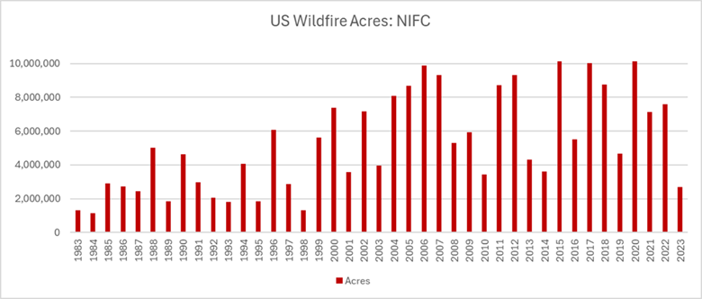
```
<a href="figures/Section-13/image001.png" download="figures/Section-13/image001.png" class="btn btn-primary">Download Figure</a>

```{r, include=FALSE}
df <- read_excel("./tables/Section-13/top_nifc_states.xlsx")
df[is.na(df)] <- ""
```

```{r topwf, echo=FALSE, tidy=FALSE, booktabs=TRUE}
kableExtra::kbl(
  df, booktabs = TRUE, 
  caption = 'Top 10 states for wildfires acres burned in year 2023 as reported by NIFC.', 
) %>% kable_styling(full_width = FALSE, position = "center", latex_options = c("hold_position", "scale_down"))
```

## Sources of year-2023 activity information

### SLT activity data and feedback submittals -all fires

As in previous NEI years, S/L/Ts were asked to submit fire
occurrence/activity data for the 2023 NEI. A template form containing
the desired format for data submittals was provided to S/L/T air
agencies. In total, 38 SLTs submitted fire activity for at least one
fire type (prescribed burns, wildfire or agricultural burns). When fire
activity were provided by S/L/Ts the data were evaluated by EPA and
further feedback on the data submitted by the state was requested at
times. Table \@ref(tab:sltactivity) provides a summary of the type of data submitted by
each S/L/T agency.

```{r, include=FALSE}
df <- read_excel("./tables/Section-13/slt_fire_activity.xlsx")
df[is.na(df)] <- ""
```

```{r sltactivity, echo=FALSE, tidy=FALSE, booktabs=TRUE}
kableExtra::kbl(
  df, booktabs = TRUE, longtable=TRUE,
  caption = 'SLT fire activity information for 2023 NEI inventory use', 
) %>% kable_styling(full_width = FALSE, position = "center", latex_options = c("repeat_header"), font_size = 11)
```

Certain preprocessing steps were taken with the S/L/T submitted datasets
In order to develop a format that could be ingested into the
reconciliation or the emissions estimation tools used by EPA. The names
of columns and formats were changed to match what the processors
required. Additionally, all datasets were reviewed for invalid locations
or those that were spatially identified as occurring outside the
submitting state. Obvious location errors, such as those where the
latitude and longitude were swapped or a sign was missing, were fixed.
Without additional information identifying an activity location within
the respective state, these records were dropped. Overall, the records
dropped accounted for a very small portion of the total activity.

The temporal approach for the S/L/T varied based on the information
provided in the submitted data and direction from the individual
agencies. Some states submitted activity without end dates. Each of
these states provided directions to assume that all fires lasted for a
single day. Where a multi-day event could be matched to HMS detections
the number of HMS detections on each day within the event were used to
apportion the total event activity. When a spatial and temporal match
could not be made between the submitted data a flat approach was used
for the multi-day event.

The following states required additional preprocessing steps:

-   **Kansas and Oklahoma Flint Hills Regions:** The Flint Hills
    grasslands typically have 1 to 2 million acres of prescribed burns
    each year usually between late February to early May. Kansas
    Department of Health Environment provided county acres burned
    information for these prescribed burns for 2023 (Figure \@ref(fig:fh2023)) that
    cover most of eastern Kansas and 4 additional counties in eastern
    Oklahoma. Between February 3-May 1 about 1.2M acres were burned in
    the Flint Hills. The HMS detects for this time period and for these
    counties (about 22700 detects) were used to temporally and spatially
    allocate these prescribed burns and the associated estimated
    emissions.

```{r fh2023, fig.cap="Flint Hill prescribed burn acres by county for year 2023 (KS Dept of Health and Environment).", fig.alt="This figure shows Flint Hill prescribed burn acres by county for year 2023 (KS Dept of Health and Environment)", echo=FALSE, out.width="75%", fig.pos="H"}
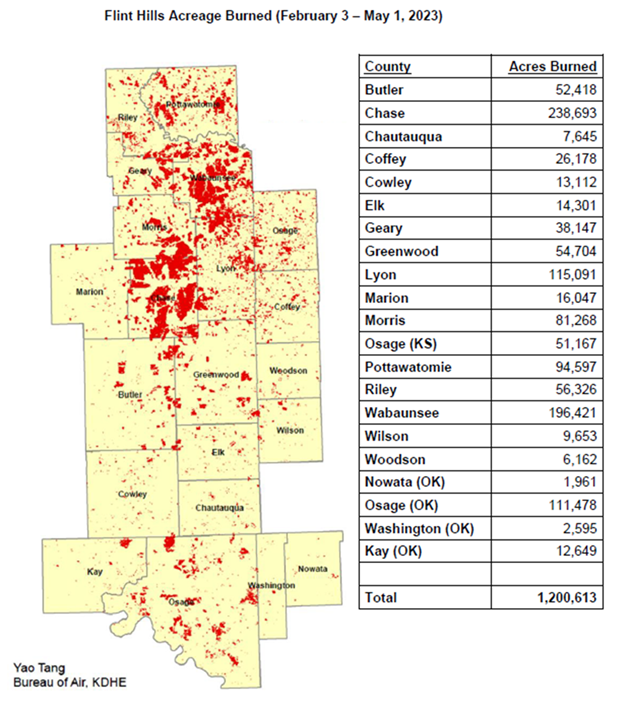
```
<a href="figures/Section-13/image002.png" download="figures/Section-13/image002.png" class="btn btn-primary">Download Figure</a>

Preparation of the EPA WLF emissions begins with raw input activity data
and ends with daily estimates of emissions from flaming combustion and
smoldering combustion phases. The daily estimates were summed to monthly
and annual for use in the NEI. Flaming combustion is combustion that
occurs with a flame. Flaming combustion is more complete combustion and
is more prevalent with fuels that have a high surface-to-volume ratio, a
low bulk density, and low moisture content. Smoldering combustion is
combustion that occurs without a flame. Smoldering combustion is less
complete and produces some pollutants, such as PM~2.5~, VOCs, and CO at
higher rates than flaming combustion. Smoldering combustion is more
prevalent with fuels that have low surface--to-volume ratios, high bulk
density, and high moisture content. Models sometimes differentiate
between smoldering emissions that are lofted with a smoke plume and
those that remain near the ground (residual emissions). In the 2023 NEI,
all flaming emissions are made up of any component that has a flaming
component to it while the smoldering emissions are the residual
smoldering component that is generated by the CONSUME model. The
emissions estimates were estimated and compiled separately for flaming
and smoldering combustion phases of fire to facilitate air quality
modeling and fine-scale research in areas such as health impacts of
smoke emissions, where the known impacts of varying PM and VOC
composition by combustion phase likely play a role.

In the 2023 NEI process, EPA developed draft 2023 emission estimates
based just on default information. S/L/Ts had an opportunity to review
these estimates and: 1) deem them acceptable, 2) submit activity data
and a questionnaire (as detailed below), or 3) provide comments. In
developing final 2023 WLF estimates, EPA took into consideration all 3
of these items. If an S/L/T accepted the draft estimates, those
estimates were not changed in the process to develop final estimates.

### National Fire Information Data

Numerous fire information databases are available from U.S. national
government agencies. The national fire information databases that were
used for the EPA's 2023 NEI methods for wildland fire emissions
estimates include the following:

-   Hazard Mapping System (HMS)

    -   Agency: NOAA

    -   Format: Comma-delimited

    -   Geographic coverage: North America

    -   Source: [Hazard Mapping System Fire and Smoke
        Product](https://www.ospo.noaa.gov/Products/land/hms.html)

    -   Supports all fire type characterization

-   Wildland Fire Interagency Geospatial Services (WFIGS) Group fire
    perimeter data

    -   Agency: Multi-federal agency

    -   Format: Shapefiles

    -   Geographic coverage: Entire United States

    -   Source:
        <https://data-nifc.opendata.arcgis.com/datasets/nifc::wfigs-interagency-fire-perimeters/about>

    -   Supports mainly wildfires characterization

-   Incident Command System Form 209: Incident Status Summary (ICS-209)

    -   Agency: Multi-federal agency

    -   Format: Comma-delimited

    -   Geographic coverage: Entire United States

    -   Source: <https://www.wildfire.gov/application/sit209>

    -   Supports mainly wildfires characterization but some prescribed
        fires

-   Interagency Fire Occurrence Reporting Modules (InFORM) Application

    -   Agency: Multi-agency (federal and state)

    -   Format: Comma-delimited

    -   Geographic coverage: portions of the United States

    -   Source: <https://data-nifc.opendata.arcgis.com/search?tags=historic_wildlandfire_opendata%2CCategory>

    -   Provides additional prescribed burns and wildfire activity not
        included in above databases

-   Forest Service Activity Tracking System (FACTS)

    -   Agency: US Forest Service

    -   Format: Shapefiles

    -   Geographic coverage: USFS lands only

    -   Source: <https://data.fs.usda.gov/geodata/edw/datasets.php>

    -   Supports mainly prescribed burn characterization

-   US Department of Interior

    -   Agency: DOI

    -   Format: Comma-delimited

    -   Geographic coverage: DOI lands only

    -   Source:
        <https://ifprs.firenet.gov/arcgis/rest/services/OpenData/IFPRS_Open_Data/FeatureServer>

        -   <https://www.nfpors.gov/> no longer operational and replaced
            with above

    -   Supports mainly prescribed burn characterization

The Hazard Mapping System (HMS) was developed in 2001 by the National
Oceanic and Atmospheric Administration's (NOAA) National Environmental
Satellite and Data Information Service (NESDIS) as a tool to identify
fires over North America in an operational environment. The system
utilizes geostationary and polar orbiting environmental satellites.
Automated fire detection algorithms are employed for each of the
sensors. When possible, HMS data analysts apply quality control
procedures for the automated fire detections by eliminating those that
are deemed to be false and adding hotspots that the algorithms have not
detected via a thorough examination of the satellite imagery.

The HMS product used for the 2023 NEI inventory consisted of daily
comma-delimited files containing fire detect information including
latitude-longitude, satellite used, time detected, and other
information. Duplicates and those HMS detects estimated to be associated
with anthropogenic activity (e.g. solar farms, landfills, mines) were
removed before input into SmartFire2 reconciliation tool. HMS detects
associated with Flint Hills burning (Figure \@ref(fig:fh2023)) were also removed
before input into SmartFire2. The total number of HMS detects used
totalled roughly 731,000 with about 24,000 of those detects associated
with the Flint Hills burning.

Wildland Fire Interagency Geospatial Services (WFIGS) Group fire
perimeter data is an online wildfire mapping application designed for
fire managers to access maps of current U.S. fire locations and
perimeters. The wildfire perimeter data is based upon input from
incident intelligence sources from multiple agencies, GPS data, and
infrared (IR) imagery from fixed wing and satellite platforms. Fires in
the year-specific WFIGS shapefile with dates outside of 2023 were
removed. Some polygons have geometries which cause errors in SmartFire2
processing. These problematic polygons were simplified using standard
GIS methods.

The Incident Status Summary, also known as the "ICS-209" is used for
reporting specific information on significant fire incidents. The
ICS-209 report is a critical interagency incident reporting tool giving
daily 'snapshots' of the wildland fire management situation and
individual incident information which include fire behavior, size,
location, cost, and other information. Data from two tables in the
ICS-209 database were merged and used for the EPA's 2023 NEI wildland
fire emissions estimates: the SIT209\_HISTORY\_INCIDENT\_209\_REPORTS
table contained daily 209 data records for large fires, and the
SIT209\_HISTORY\_INCIDENTS table contained summary data for additional
smaller fires. Some entries in the ICS-209 database contained location
and date errors. In situations where the errors were obvious in nature,
such as swapped latitude and longitudes or a typo in the year of the
data, then appropriate corrections were made. Fires with unclear
location and date issues or those fires without an associated burned
area were removed. Some fires had unreasonable lengths in the reports
based on the available fields. Estimated fire lengths were adjusted
based on fire size.

The Interagency Fire Occurrence Reporting Modules (InFORM) Application
produces a dataset that represents the Fire Occurrence Data Record
(FODR) for five major federal fire management agencies and some state
agencies. The FODR also includes records that are bulk uploaded by state
agencies that are not InFORM participators, thus providing another
database to obtain state activity data as well. EPA selectively pulled
data from InFORM that included states that did not formally submit
activity to EPA as part of the NEI process.

The US Forest Service (USFS) compiles a variety of fire information
every year. Year 2023 data from the USFS Natural Resource Manager (NRM)
Forest Activity Tracking System (FACTS) were acquired and used for 2023
NEI emissions inventory development. This database includes information
about activities related to fire/fuels, silviculture, and invasive
species. The FACTS database consists of shapefiles for prescribed burns
including pile burns that provide acres burned and start and end time
information.

The Department of Interior (DOI) also compiles wildfire and prescribed
burn activity, including pile burns, on their federal lands every year.
Year 2023 data were acquired from DOI and were used for 2023 NEI
emissions inventory development.

## Emissions methodology and information

### Source Classification Codes

Table \@ref(tab:firescc) lists the new Source Classification Codes (SCCs) that define
the different types of WLFs in the 2023 NEI. There are new SCCs by
forest regions (e.g. Eastern, Boreal, Shrubland, etc.) added to this
NEI. These new SCCs will enable improved chemical speciation in future
Emissions Modeling Platforms (EMPs) used in air quality modeling
simulations. The new SCCs also include separate codes for Coarse Woody
Debris (CWD) and duff fuels. A new SCC 2811016000 was added to support
the new method for estimating emissions from pile burns. Note that we
continue to include a specific SCC (2801500170) that houses the
grassland fires of "Flint Hills," which occur over much of eastern
Kansas and a small part of eastern Oklahoma. In addition, other
grassland fires (other than "Flint Hills" fires) are processed via the
SmartFire2/BlueSky Pipeline (SF2/BSP) process described below and
inventoried along with other wildland fires.

```{r, include=FALSE}
df <- read_excel("./tables/Section-13/wlf_sccs.xlsx")
df[is.na(df)] <- ""
```

```{r firescc, echo=FALSE, tidy=FALSE, booktabs=TRUE}
kableExtra::kbl(
  df, booktabs = TRUE, longtable = TRUE,
  caption = 'SCCs for wildland fires', 
) %>% kable_styling(full_width = FALSE, position = "center", latex_options = c("hold_position", "repeat_header"), font_size = 11) %>%
  column_spec(1, width = "3cm") %>%
  column_spec(2, width = "3cm") %>%
  column_spec(3, width = "7cm")
```

Agricultural burning refers to fires that occur over land used for
cultivating crops and agriculture. Another term for this sector is crop
residue burning. In past NEIs for this sector, it was exclusively
limited to emissions resulting in the burning of crops. However, in the
2014 NEI, we included pasture/grass burning SCCs into this sector.
However, for technical reasons, we have moved the grass/pasture burning
to the wildland fires category for the 2017, 2020 and 2023 NEIs, thereby
causing this sector to once again only house emissions resulting from
burning of crops.

Table \@ref(tab:agscc) shows the agricultural field burning SCCs covered by the EPA
estimates and by the State/Local and Tribal agencies that submitted
data. The leading SCC description is "Miscellaneous Area Sources;
Agriculture Production - Crops - as nonpoint; Agricultural Field Burning
- whole field set on fire;" for all SCCs in the table. Note that many
general crops are included in the SCC 2801500000, and it also is the SCC
to report into for "crops unknown." A new SCC was added 2801540000 to
support the new method used to estimate emissions from ditch burns on
agricultural lands. Previously, these ditch burns were in the prescribed
burn sector in the 2020NEI. The assumed area of the ditch burns was
reduced to 5 acres per satellite detection based on analysis of active
ditch fires.

```{r, include=FALSE}
df <- read_excel("./tables/Section-13/agburn_sccs.xlsx")
df[is.na(df)] <- ""
```

```{r agscc, echo=FALSE, tidy=FALSE, booktabs=TRUE}
kableExtra::kbl(
  df, booktabs = TRUE, longtable=TRUE,
  caption = 'Nonpoint Agricultural Field Burning SCCs in the 2023 NEI', 
) %>% kable_styling(full_width = FALSE, position = "center", latex_options = c("repeat_header"), font_size = 11)
```

### Wildland Fires Emissions Estimation Methodology

The national and S/L/T activity data mentioned earlier were used to
estimate daily wildfire and prescribed burn emissions from flaming
combustion and smoldering combustion phases for the 2023 NEI inventory.
Flaming combustion is more complete combustion than smoldering and is
more prevalent with fuels that have a high surface-to-volume ratio, a
low bulk density, and low moisture content. Smoldering combustion occurs
without a flame, is a less complete burn, and produces some pollutants,
such as PM~2.5~, VOCs, and CO, at higher rates than flaming combustion.
Smoldering combustion is more prevalent with fuels that have low
surface-to-volume ratios, high bulk density, and high moisture content.

Figure \@ref(fig:workflow) is a schematic of data processing stream for the 2023 NEI
inventory for wildfire and prescribe burn sources. The EPA's 2023 NEI
wildland fire emissions estimates were estimated using a modified
Satellite Mapping Automated Reanalysis Tool for Fire Incident
Reconciliation version 2 (Smartfire2) and US Forest Service's BlueSky
Pipeline (BSP) system. Smartfire2 is an algorithm and database system
that operates within a geographic information system (GIS). Smartfire2
combines multiple sources of fire information and reconciles them into a
unified GIS database. It reconciles fire data from space-borne sensors
and ground-based reports, thus drawing on the strengths of both data
types while avoiding double-counting of fire events. At its core,
Smartfire2 is an association engine that links reports covering the same
fire in any number of multiple databases. In this process, all input
information is preserved, and no attempt is made to reconcile
conflicting or potentially contradictory information (for example, the
existence of a fire in one database but not another). Further details of
the Smartfire2 process as applied to NEI development can be found in the
literature [[ref 1](#fire_references)].

For the 2023 NEI inventory, the national and S/L/T fire information was
input into Smartfire2 and then merged and reconciled together based on
user-defined weights for each fire information dataset. The relative
weights used for the national data stream are shown in Table \@ref(tab:sf2weights). A
dataset type with a higher ranking gets preference for that attribute in
the reconciled activity. The uncertainty of each dataset is used to
generate date and spatial buffers when reconciling fire activity 
(\@ref(tab:sf2uncertain)). The output from Smartfire2 was daily acres burned by fire type,
and latitude-longitude coordinates for each fire. The fire type
assignments were made using the fire information datasets. If the only
information for a fire was a satellite detect for fire activity, then
the fire was assumed to be a prescribed burn with the only exceptions
being the following month-state assumptions where the fire was then
assumed to be a wildfire:

-   Arizona, California, Nevada, and New Mexico: June through August

-   Oregon, Washington, Idaho, Montana, Colorado, Utah and Wyoming: July
    through September

```{r workflow, fig.cap="Processing flow for fire emission estimates in the 2023 NEI inventory. Input, Data Prep, Data aggregation and reconciliation, USFS Bluesky Pipeline, Emissions Post-Processing, final Inventory", fig.alt="This figure shows the Processing flow for fire emission estimates in the 2023 NEI inventory", echo=FALSE, out.width="75%", fig.pos="H"}
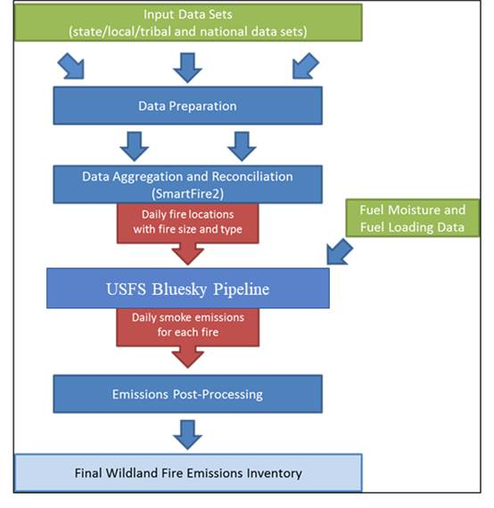
```
<a href="figures/Section-13/image003.jpg" download="figures/Section-13/image003.jpg" class="btn btn-primary">Download Figure</a>

```{r, include=FALSE}
df <- read_excel("./tables/Section-13/sf2_nei2023_weights.xlsx")
df[is.na(df)] <- ""
```

```{r sf2weights, echo=FALSE, tidy=FALSE, booktabs=TRUE}
kableExtra::kbl(
  df, booktabs = TRUE, longtable=TRUE,
  caption = '2023 National SmartFire2 Reconciliation Weights', 
) %>% kable_styling(full_width = FALSE, position = "center", latex_options = c("repeat_header"), font_size = 11)
```

```{r, include=FALSE}
df <- read_excel("./tables/Section-13/sf2_nei2023_uncertainty.xlsx")
df[is.na(df)] <- ""
```

```{r sf2uncertain, echo=FALSE, tidy=FALSE, booktabs=TRUE}
kableExtra::kbl(
  df, booktabs = TRUE,
  caption = '2023 National SmartFire2 Dataset Uncertainty', 
) %>% kable_styling(full_width = FALSE, position = "center", latex_options = c("repeat_header"), font_size = 11) %>%
  column_spec(1, width = "2cm") %>%
  column_spec(2, width = "2cm") %>%
  column_spec(3, width = "2cm") %>%
  column_spec(4, width = "2cm") %>%
  column_spec(5, width = "2cm") %>%
  column_spec(6, width = "2cm")
```

States that submitted complete activity datasets were not processed
through SmartFire2 with the default national activity. An exception is
for those states that used HMS fire detections for daily apportionment
of activity data. All resulting activity that was identified only
through HMS was removed from the final activity dataset so that only
state-submitted event values were used for emissions estimates.
State-submitted activity from Georgia and North Carolina were not
processed through SmartFire2. Instead, each activity dataset was
converted into daily activity files in a format that can be read
directly by Bluesky Pipeline.

The BlueSky Pipeline (BSP version 4.2.13) was used to calculate fuel
loading and consumption, and emissions using various models depending on
the available inputs as well as the desired results. BSP is open source
at <https://github.com/pnwairfire/bluesky>. The conterminous United
States, Alaska, and Hawaii, where Fuel Characteristic Classification
System (FCCS) fuel loading data are available, were processed using the
modeling chain described in Figure \@ref(fig:bspmodules). The Smoke Emissions Reference
Application (SERA) emissions factors for CAPs are included in the BSP
version used in the 2023 NEI. SERA is a searchable online database
coordinated by the US Forest Service and University of Washington
(<https://depts.washington.edu/nwfire/sera/index.php>) that consists of
existing peer-reviewed emission factors (EFs) of 276 known air
pollutants. The SERA database enables the analysis and summaries of
existing emissions factors, and creation of average emissions factors to
be used in decision support tools for smoke management, including BSP.
Fire Emissions Production Simulator (FEPS) emissions factors were used
in previous NEIs. The HAP emission factors used in this work came from
Urbanski, 2014 [[ref 3](#fire_references)]. These emission factors were regionalized and
handled differently by wild and prescribed fire. Table \@ref(tab:efregions) below
outlines the regionalization scheme used while Table \@ref(tab:hapefs)
shows the HAP EFs employed in this work for wildland fires.

```{r, include=FALSE}
df <- read_excel("./tables/Section-13/wlf_hap_regions.xlsx")
df[is.na(df)] <- ""
```

```{r efregions, tidy=FALSE, echo=FALSE, booktabs=TRUE}
kableExtra::kbl(
  df, booktabs = TRUE, longtable = TRUE,
  caption = 'Emission factor regions used to assign HAP emission factors for the 2023 NEI',
) %>%
kable_styling(full_width = FALSE, position = "center", latex_options = c("repeat_header"), font_size = 11) %>%
  column_spec(1, width = "2cm") %>%
  column_spec(2, width = "5cm") %>%
  column_spec(3, width = "5cm")
```

```{r, include=FALSE}
df <- read_excel("./tables/Section-13/wlf_hap_efs.xlsx")
df[is.na(df)] <- ""
```

```{r hapefs, echo=FALSE, tidy=FALSE, booktabs=TRUE}
kableExtra::kbl(
  df, booktabs = TRUE, longtable = TRUE,
  caption = 'Wildland fire HAP emission factors (lb/ton fuel consumed) for the 2023 NEI', 
) %>% kable_styling(full_width = FALSE, position = "center", latex_options = c("repeat_header"), font_size = 10) %>%
  column_spec(1, width = "4.5cm") %>%
  column_spec(2, width = "1.5cm") %>%
  column_spec(3, width = "1.5cm") %>%
  column_spec(4, width = "1.5cm") %>%
  column_spec(5, width = "1.5cm") %>%
  column_spec(6, width = "1.5cm") %>%
  column_spec(7, width = "1.5cm") %>%
  column_spec(8, width = "1.5cm")
```

```{r bspmodules, fig.cap="BlueSky Pipeline Modules", fig.alt="This figure shows the BlueSky Pipeline Modules", echo=FALSE, out.width="75%", fig.pos="H"}
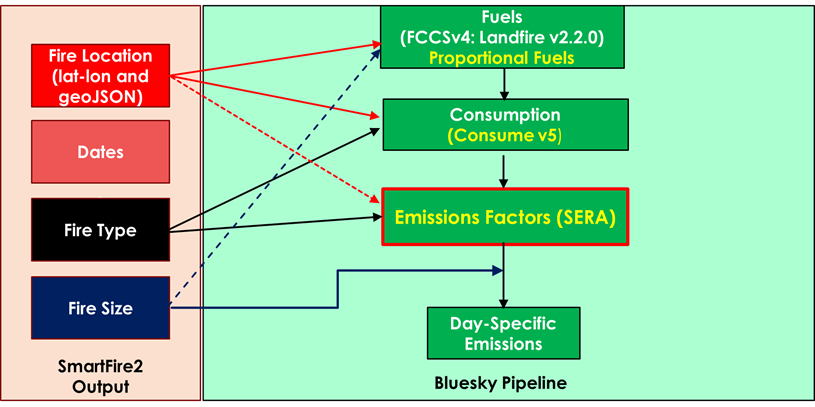
```
<a href="figures/Section-13/image004.png" download="figures/Section-13/image004.png" class="btn btn-primary">Download Figure</a>

For the 2023 NEI inventory, the FCCSv4 spatial vegetation cover was
upgraded to the [LANDFIRE v2.2.0 fuel vegetation
cover](https://www.landfire.gov/fccs.php). The FCCSv4 fuel bed
characteristics were implemented along with LANDFIREv2.2.0 to provide
better fuel classification for the BlueSky Pipeline. The LANDFIREv2.2.0
raster data were aggregated from the native resolution and projection to
120-meter resolution using a nearest-neighbor methodology. Aggregation
and reprojection was required to allow these data to work in the BlueSky
Pipeline.

Outputs from each BlueSky Pipeline processing stream were aggregated
into an annual file. Fires identified as being over water by FCCS were
removed because they produce no fuel consumption in the CONSUME model
and thus no emissions.

In August 2023, a wildfire occurred in Maui County that spread to the
nearby city of Lahaina. This fire was a Wildland Urban Interface (WUI)
fire where a fire spread across both an urban area and undeveloped land.
Thousands of structures and vehicles were burned in Lahaina. The current
wildland emissions methodology for the NEI does not include a method for
estimating emissions from WUIs. However, for the 2023 NEI the emissions
for the wildland part of this WUI fire was estimated in BSP. This
consisted of about 2000 acres of shrubland. The emissions from the
structures and vehicles burned were estimated for the NEI but are
explained in the new Structures and Motor Vehicle Fies section of the
2023 NEI TSD.

### Pile burn methodology

For the 2023 NEI, pile burn (PB) emissions were estimated using a
combination of federal, state, local, and Tribal activity data. This
activity data was supplied in the form of daily estimates of area
treated, pile volume, pile dimensions, or mass piled by location,
varying by data source. As with the prescribed burn and wildfire S/L/T
activity data, the pile burn data was imported into Smartfire2 so that
it could be reconciled with other data sources to avoid duplication of
activity and emissions. HMS satellite detects that reconciled only with
the location of the PB activity were removed from the BSP workflow as
pile burns. The PB activity data was then directly imported into a
calculator script outside of BSP that estimates the amount of biomass
consumed at each location and the resulting emissions. The consumption
calculations made are consistent with those used in the University of
Washington pile burn calculator
(<https://depts.washington.edu/nwfire/piles/>). For activity data where
only, a treated area is provided a default fuel loading of 4.5 tons per
acre is used based on an analysis of California and Washington
historical pile burn permits. A consumption efficiency of 90% is assumed
unless otherwise specified in the activity data. Emissions factors
averaged over pile burn studies in the SERA database [[ref 2](#fire_references)] were applied to
estimate CAPs from the consumed piled biomass.

### Flint Hills prescribed burns methodology

For the 2023 NEI, the emissions from the Flint Hills prescribed burns
continued to be calculated outside of BSP. The emissions were calculated
for the period of February 3 through May 1, 2023, for the Kansas and
Oklahoma counties that make up the Flint Hills region. All "Grass" HMS
detects in these counties for this period were used to calculate per
county acres per HMS detect. The range for these Flint Hills counties
was \~ 50 -160 acres per detect. SERA grass emission factors were used
to estimate emissions for all pollutants except PM~2.5~, which were
derived from a field study of Flint Hills prescribed fires [[ref 9](#fire_references)].
Wildfires did occur during this period in the Flint Hills. Osage County,
Oklahoma had about 85,000 acres burned due to wildfires during this
time. These wildfires were inserted back into the BSP processing and
emissions estimated using the BSP.

### Agricultural Field Burning Emissions Methodology

The approach developed for use previous NEIs [[ref 6](#fire_references)], and was generally used
again for the 2023 NEI with some modifications:

-   Multiple satellite detections are used to locate fires using an
    operational product

-   Field Size estimates are based on field work studies in multiple
    states (rather than a one size fits all approach)

-   This method allows for intra-annual as well as annual changes in
    crop land use

-   This method uses 2023 USDA NASS Crop Sequence Boundaries (CSB)
    shapefiles
    (<https://www.nass.usda.gov/Research_and_Science/Crop-Sequence-Boundaries/index.php>) to separate grass/pasture lands, which include Pasture/Grass,
    Grassland Herbaceous, and Pasture/Hay lands from all other
    agricultural burning and to identify the crop type. The 2020NEI used
    Cropland Data Layer (CDL) (USDA, 2015a) information instead of CSB
    shapefiles.

-   In the 2020NEI, removal of agricultural fires from the Hazard
    Mapping System (HMS) dataset was done before the application of the
    Smartfire2 system for wildfires and prescribed fires in an attempt
    to eliminate double counting in the NEI and the use of state
    information to further identify fires as crop residue burning rather
    than another type of fire. However, this did not eliminate all
    double counting cases. In the 2023 NEI, HMS detects and SLT
    agricultural burn activity were allowed as input into Smartfire2.
    The CSB shapefiles were used post-Smartfire2 to determine which
    satellite-only detected fires were to be assigned as agricultural
    burns.

-   EPA designed a new crop burning module for use in BSP for the
    2023 NEI. This BSP module calculated consumption and emissions for
    all agricultural burns except ditch burns which were calculated
    outside of BSP.

Based on field reconnaissance of McCarty (2013) [[ref 8](#fire_references)], a "typical"
field size was assumed for each burn location, which varied by region of
the country. The assumed field sizes by state are shown in Table \@ref(tab:agsize).
For the S/L/T agencies that submitted agricultural field burning
activity that include acres burned those data were used instead of the
data shown in Table \@ref(tab:agsize).

```{r, include=FALSE}
df <- read_excel("./tables/Section-13/ag_field_acres.xlsx")
df[is.na(df)] <- ""
```

```{r agsize, echo=FALSE, tidy=FALSE, booktabs=TRUE}
kableExtra::kbl(df, booktabs = TRUE, 
      caption='Assumed agricultural field sizes burned by state in 2023 NEI', 
      ) %>% kable_styling(full_width=FALSE, position="center", latex_options=c("hold_position", "scale_down"))
```

Emission Factors for agricultural burns for CO, NOx, SO~2~, PM~2.5~ and
PM~10~ were based on Table 1 from McCarty (2011) [[ref 5](#fire_references)]. The emission
factors in McCarty (2011) were based on mean values from all available
literature at the time. Emission Factors for NH~3~ were derived from the
2002 NEI crop residue emission estimates using the ratio of NH~3~/NOx
and the NOx emission factor in Table 1 from McCarty (2011). The
emissions factors used in the 2023 NEI are shown below in Table \@ref(tab:agvoc).

A subset of the HAP emission factors is shown in Table \@ref(tab:aghap). These are
based on updated VOC work mentioned above. The full set of HAP emission
factors, available on the [[2020 NEI Supplemental data FTP
site]](ftp://newftp.epa.gov/air/nei/2020/doc/supporting_data/nonpoint/2020_ag_burn_factors_assumptions.xlsx),
also includes the following HAPs: isopropylbenzene, n-hexane, o-xylene,
propionaldehyde, styrene, toluene, 2,2,4-trimethylpentane, and m,
p-xylenes. The sugarcane emissions factors were updated for the 2020NEI
and used again in 2023 NEI.

```{r, include=FALSE}
df <- read_excel("./tables/Section-13/ag_cap_efs.xlsx")
df[is.na(df)] <- ""
```

```{r agvoc, echo=FALSE, tidy=FALSE, booktabs=TRUE}
kableExtra::kbl(
  df, booktabs = TRUE, longtable = TRUE, 
  caption = 'Revised Ag Burning Emission factors (lbs/ton) for VOC', 
) %>% kable_styling(full_width = FALSE, position = "center", latex_options = c("repeat_header"), font_size = 11)
```

```{r, include=FALSE}
df <- read_excel("./tables/Section-13/ag_hap_efs.xlsx")
df[is.na(df)] <- ""
```

```{r aghap, echo=FALSE, tidy=FALSE, booktabs=TRUE}
kableExtra::kbl(
  df, booktabs = TRUE, longtable = TRUE, 
  caption = 'Select HAP Emission factors (lb/ton) used in EPA Methods by crop type for entire US', 
) %>% kable_styling(full_width = FALSE, position = "center", latex_options = c("repeat_header"), font_size = 11) %>%
  column_spec(1, width = "2cm") %>%
  column_spec(2, width = "2cm") %>%
  column_spec(3, width = "2cm") %>%
  column_spec(4, width = "2cm") %>%
  column_spec(5, width = "2cm") %>%
  column_spec(6, width = "2cm") %>%
  column_spec(7, width = "2cm")
```

### SLT direct emissions submittals -agricultural field burning

S/L/Ts were encouraged only to supply activity for wildland fires for
2023 NEI but could submit agricultural burn emissions. The agencies
listed in Table \@ref(tab:agslt) submitted PM~2.5~ emissions for this sector;
agencies not listed used EPA estimates for the entire sector. As we will
discuss below, some agencies provided agricultural field burning
activity that was used in estimating emissions using EPA's methodology.
Some agencies submitted emissions for the entire sector while others
submitted only a portion of this sector. When an agency submits less
than 100%, their Nonpoint Survey responses, along with other general
business rules for building the NEI, are used to backfill with EPA
estimates as appropriate.

```{r, include=FALSE}
df <- read_excel("./tables/Section-13/ag_nei2023_slt.xlsx")
df[is.na(df)] <- ""
```

```{r agslt, echo=FALSE, tidy=FALSE, booktabs=TRUE}
kableExtra::kbl(
  df, booktabs = TRUE,
  caption = 'Emissions submitted by reporting agency for agricultural field burning', 
) %>% kable_styling(full_width = FALSE, position = "center", latex_options = c("hold_position", "scale_down"))
```

### PM speciation for all fires

The S/L/Ts were not permitted to submit PM~2.5~ speciated emissions,
which are required in the NEI. These PM species pollutants include EC,
OC, SO4, NO3, and "other" (PMFINE). These were estimated for all
nonpoint data -including those states that submitted direct emissions by
EPA using the fractions from SPECIATE v5.0 [[ref 4](#fire_references)] shown in 
\@ref(tab:wlfpm).

```{r, include=FALSE}
df <- read_excel("./tables/Section-13/wlf_pm_speciation.xlsx")
df[is.na(df)] <- ""
```

```{r wlfpm, echo=FALSE, tidy=FALSE, booktabs=TRUE}
kableExtra::kbl(
  df, booktabs = TRUE,
  caption = 'PM species for all wildland fires, computed as fraction of total PM~2.5~', 
) %>% kable_styling(full_width = FALSE, position = "center", latex_options = c("hold_position", "scale_down"))
```

### Quality Assurance (QA) of Final Results

Different types of QA were generally applied for wildland fires. The
summary below briefly describes the QA checks used in these processes:

-   Reviewed input data sets to identify data gaps.

-   Identified fire incidents that appeared to be double counted in
    individual data sets and removed duplicate records.

-   Examined fires with long durations or conflicts between date fields
    such as start date and report date to identify fires that may have
    erroneous dates and made necessary corrections.

-   Reviewed fire locations to ensure that they fell within the United
    States. Obvious errors in data entry such as the reversal of
    latitude and longitude were corrected where possible.

-   Reviewed large wildfires in each data set for validity.

-   Modified distant fires (in different states) with the same names to
    ensure that the events were not associated.

Quality assurance actions applied to daily fire locations from
SmartFire2 included:

-   Checked the location, fire type, duration, underlying fire activity
    input data, final shape, and final size for large fire events (i.e.,
    area burned \>10,000 acres) to ensure that the results were
    reasonable.

-   Checked large fire events by state and by name, removed duplicate
    events, and renamed fires as needed.

-   Reviewed large fire events with multiple data sources to ensure that
    SmartFire2 reconciliation rankings were correct and produced
    sensible results.

-   Identified and removed fire event duplicates incorrectly created by
    the SmartFire2 reconciliation process.

-   Checked fire events with large differences between the calculated
    fire area and the geometric fire area. Since the shape and area are
    calculated separately in SmartFire2, a large discrepancy can
    indicate errors in reconciliation.

Quality assurance actions applied to resulting emissions estimates
included:

-   Checked the location of all final fires and emission estimates.
    Fires falling outside of the United States were removed. Some fires
    near the border were retained if fuel information was available in
    that location.

-   Identified fire records that were incorrectly associated and
    adjusted fire event size and emissions proportionally.

-   Produced and reviewed summary tables and plots of the 2023 fire
    inventory data.

-   Compared wildfire acres burned by state and individual major
    wildfires to National Interagency Fire Center (NIFC) data to ensure
    the summary values were within reasonable range.

WLF emissions developed using the methods described above were compared
to previous years estimates including the 2020NEI and the recent year
2022 inventory generated by EPA, SLTs, MJOs and other federal agencies.
The spatial (and temporal) patterns seen in the data correspond to what
was expected in 2023. In general, 2023 was a very quiet fire year than
many previous years, so the emissions are expected to be lower
nationally.

All revisions due to the quality assurance steps were processed through
the Emissions Inventory System (EIS) and summary files were posted on
the EPA ftp site
<https://gaftp.epa.gov/Air/nei/2023/doc/supporting_data/events/v1/> on
September 4, 2025.

### Quality Assurance of Agricultural field burning

Review of the quality of EPA's data included addressing of S/L/T
comments as we received them during the 2023 NEI process. In addition,
the following checks were done on EPA data:

-   Comparison to past NEI estimates, and explaining differences noted

-   Check of diurnal profile using day specific data generated by EPA
    methods with existing profiles used for air quality modeling

-   Using past comments received from S/L/Ts for this sector to ground
    truth estimates

-   Ensuring HAPs and VOC speciation line up as expected

The QA of S/L/T-submitted data included checking with EPA estimates,
working with S/L/Ts to understand why differences exist, and making sure
pollutant coverage is complete.

## Emissions Summaries

### Wildland Fires

This section shows several graphics and tables that describe emissions
of wild and prescribed fires in the 2023 NEI based on the methods
discussed above. Table \@ref(tab:wlfacres) provides national totals of acres burned
and CAPs emissions for wildfires, prescribed burns and pile burns. Pile
burns are part of the prescribed burn category but are show separately
here since it is a new method for the 2023 NEI. Activity and emissions of prescribed 
fires identified only from HMS satellite data are shown as a percentage of the 
total prescribed fire values.

```{r, include=FALSE}
df <- read_excel("./tables/Section-13/national_wf_acres_caps.xlsx")
df[is.na(df)] <- ""
df[[4]] <- ifelse(
  is.na(df[[4]]), "",
  sprintf("%.1f%%", as.numeric(df[[4]]) * 100))
```

```{r wlfacres, echo=FALSE, tidy=FALSE, booktabs=TRUE}
kableExtra::kbl(
  df, booktabs = TRUE, longtable = TRUE, 
  caption = 'National wildland fire acres burned and emissions for the 2023 NEI', 
) %>% kable_styling(full_width = FALSE, position = "center", latex_options = c("hold_position", "repeat_header"), font_size = 10) %>%
  column_spec(1, width = "2cm") %>%
  column_spec(2, width = "3cm") %>%
  column_spec(3, width = "3cm") %>%
  column_spec(4, width = "2cm") %>%
  column_spec(5, width = "2cm") %>%
  column_spec(6, width = "3cm")
```

Table \@ref(tab:wlfregion) provides national totals for burned acres and CAPs for each
forest/ecoregion and fire type. The newly added SCCs allow for further
analyses like this table. As mentioned earlier in the year 2023 was a
very quiet wildfire season. It is unusual for the prescribed burns
PM~2.5~ emissions to be higher than wildfire emissions but this case can
occur during very quiet wildfire seasons. Most of the Boreal Forest
emissions occurred in Alaska. Note grassland acres burned make up a good
portion of the acres burned for the US but grasses have a lower PM~2.5~
emissions factor. Figure \@ref(fig:neipm) provides an illustration of just the
PM~2.5~ emissions nationally and by forest/ecoregion for year 2023.

```{r, include=FALSE}
df <- read_excel("./tables/Section-13/regional_wf_acres_caps.xlsx")
df[is.na(df)] <- ""
```

```{r wlfregion, echo=FALSE, tidy=FALSE, booktabs=TRUE}
kableExtra::kbl(
  df, booktabs = TRUE,
  caption = 'Wildland fire acres burned and emissions for the 2023 NEI by forest/ecoregion.', 
) %>% kable_styling(full_width = FALSE, position = "center", latex_options = c("hold_position", "scale_down"))
```

```{r neipm, fig.cap="2023 NEI PM~2.5~ emissions by forest/ecoregion and fire type category", fig.alt="This figure shows 2023 NEI PM~2.5~ emissions by forest/ecoregion and fire type category", echo=FALSE, out.width="75%", fig.pos="H"}
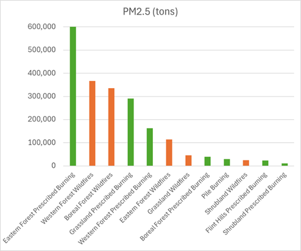
```
<a href="figures/Section-13/image005.png" download="figures/Section-13/image005.png" class="btn btn-primary">Download Figure</a>

Figures \@ref(fig:monthlyacres) and \@ref(fig:pmfiretype) show acres burned and PM~2.5~ emissions for
all fires by month in 2023. The total emissions that result from
month-to-month result from a combination of different fuels that burn in
different fires. It is seen that wildfires (WF) are more prevalent in
the hotter months, and prescribed fires (RX) occur more often in the
cooler months of 2023. Flint Hills prescribed burns are show separately
to mark when those occurred over eastern Kansas and Oklahoma. Pile burns
(PB) emissions are also shown but are very minor in most
months.[]{#_Hlk815896 .anchor}

```{r monthlyacres, fig.cap="Monthly acres burned by fire type for 2023 NEI CONUS Wildland Fires", fig.alt="This figure shows Monthly acres burned by fire type for 2023 NEI CONUS Wildland Fires", echo=FALSE, out.width="75%", fig.pos="H"}
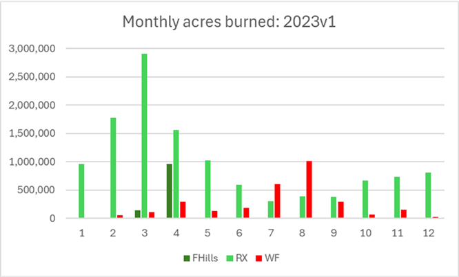
```
<a href="figures/Section-13/image006.png" download="figures/Section-13/image006.png" class="btn btn-primary">Download Figure</a>

```{r pmfiretype, fig.cap="Monthly PM~2.5~ by fire type for 2023 NEI CONUS Wildland Fires", fig.alt="This figure shows Monthly PM~2.5~ by fire type for 2023 NEI CONUS Wildland Fires", echo=FALSE, out.width="75%", fig.pos="H"}
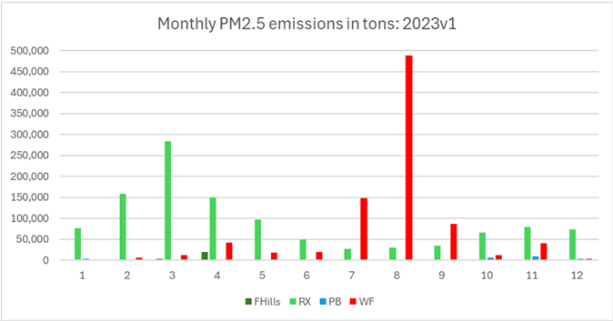
```
<a href="figures/Section-13/image007.png" download="figures/Section-13/image007.png" class="btn btn-primary">Download Figure</a>

Next, Table \@ref(tab:stateacres) shows a summary of acres burned and PM~2.5~ by state,
fire type and combustion phase. In terms of total WLF acres burned,
several states are shown to have more than one million acres burned in
2023, with FL, GA, KS and TX being the highest acres burned states.
However, due to the nature of fuels burned and the type of fire that
occurs in the various States, AK and OR are highest for estimated
PM~2.5~ emissions**.**

```{r, include=FALSE}
df <- read_excel("./tables/Section-13/wlf_state_type_acres_pm.xlsx")
df[is.na(df)] <- ""
df[[3]] <- ifelse(
  is.na(df[[3]]), "",
  sprintf("%.1f%%", as.numeric(df[[3]]) * 100))

df[[5]] <- ifelse(
  is.na(df[[5]]), "",
  sprintf("%.1f%%", as.numeric(df[[5]]) * 100))
```

```{r stateacres, tidy=FALSE, echo=FALSE, warning=FALSE, message=FALSE}
kableExtra::landscape(
kableExtra::kbl(
  df, 
  booktabs = FALSE, 
  longtable = TRUE,
  caption = "Summary of acres burned and PM~2.5~ emissions by state and fire type"
) %>%
  kableExtra::kable_styling(
    full_width = FALSE,
    position = "center",
    latex_options = c("hold_position", "repeat_header","scale_down"), font_size = 11) %>%
  column_spec(1, width = "1cm") %>%
  column_spec(2, width = "2cm") %>%
  column_spec(3, width = "2cm") %>%
  column_spec(4, width = "2cm") %>%
  column_spec(5, width = "2cm") %>%
  column_spec(6, width = "2cm") %>%
  column_spec(7, width = "2cm") %>%
  column_spec(8, width = "2cm") %>%
  column_spec(9, width = "2cm"))
```

Figures \@ref(fig:burndensity) and \@ref(fig:countypm) show 2023 county total area (acres) burned
and PM~2.5~ emissions for wildfires, respectively. Even though 2023 was
a quiet wildfire season the western portion of the country had the
higher emitting counties. Figures \@ref(fig:rxdensity) and \@ref(fig:rxpm) show 2023 county
total area (acres) burned and PM~2.5~ emissions for prescribed burns,
respectively. The Southeast states are seen to be dominated by
prescribed fires. This is a typical pattern we see from NEI-to-NEI.

```{r burndensity, fig.cap="2023 NEI wildland fires county area burned density map", fig.alt="This figure shows 2023 NEI wildland fires county area burned density map", echo=FALSE, out.width="75%", fig.pos="H"}
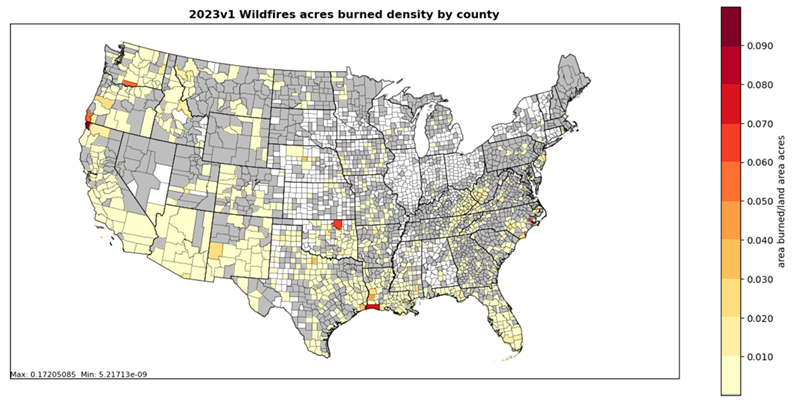
```
<a href="figures/Section-13/image008.png" download="figures/Section-13/image008.png" class="btn btn-primary">Download Figure</a>

```{r countypm, fig.cap="PM~2.5~ county emissions for wildfires for 2023 NEI", fig.alt="This figure shows 2PM~2.5~ county emissions for wildfires for 2023 NEI", echo=FALSE, out.width="75%", fig.pos="H"}
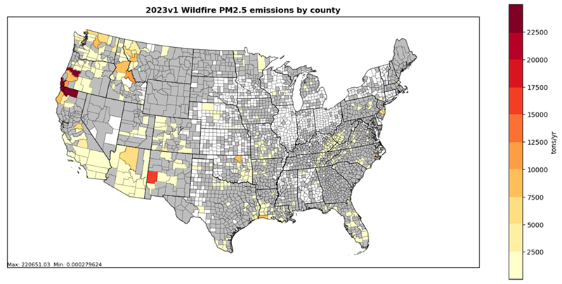
```
<a href="figures/Section-13/image009.png" download="figures/Section-13/image009.png" class="btn btn-primary">Download Figure</a>

```{r rxdensity, fig.cap="2023 NEI prescribed burns acres burned density map", fig.alt="This figure shows 2023 NEI prescribed burns acres burned density map", echo=FALSE, out.width="75%", fig.pos="H"}
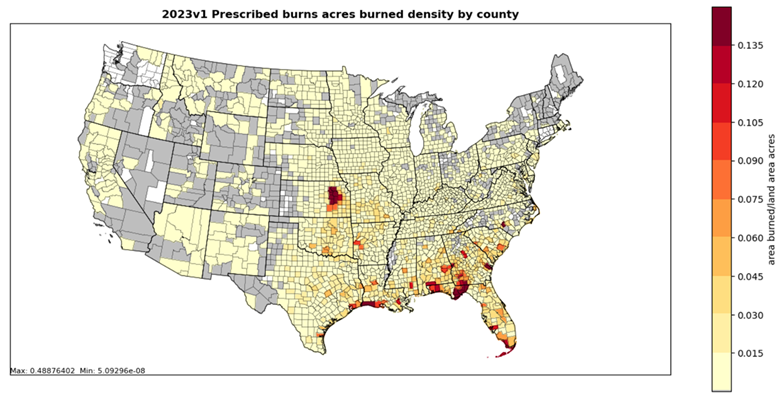
```
<a href="figures/Section-13/image010.png" download="figures/Section-13/image010.png" class="btn btn-primary">Download Figure</a>

```{r rxpm, fig.cap="PM~2.5~ county emissions for prescribed burns for 2023 NEI", fig.alt="This figure shows PM~2.5~ county emissions for prescribed burns for 2023 NEI", echo=FALSE, out.width="75%", fig.pos="H"}
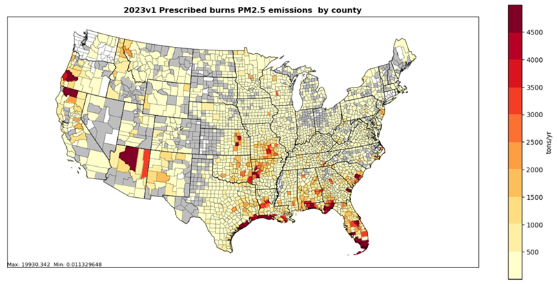
```
<a href="figures/Section-13/image011.png" download="figures/Section-13/image011.png" class="btn btn-primary">Download Figure</a>

The amount of fire activity acquired by EPA for the NEI effort continues
to increase with each NEI. When Smartfire2 doesn't have any national or
S/L/T activity to reconcile with it, it is then labeled as a
satellite-only detected fire or HMS-only detected fire. Due to the
location and months of these HMS-only detected fires they are assigned
the prescribed burn fire type. If the HMS-only detect occurs on
agricultural lands it is assigned an agricultural burn SCC. Table \@ref(tab:hmsacres) 
provides a summary of the total acres and emissions from these HMS-only
detected fires by fire type. Note that about 40% of the acres burned and
emissions for prescribed burns (RX) are from HMS-only detected fires. In
previous NEIs, this percentage approached or exceeded 50%. In future
NEIs, if even more prescribed fire activity data is provided this
percentage should continue to be reduced. The wildfire activity is much
more complete thanks to national attention and detailed datasets. The
HMS-only detects in summer months in western states are assumed to be
wildfires and this only adds up to about 7% of the total wildfire acres
burned and about 3% of the total emissions.

```{r, include=FALSE}
df <- read_excel("./tables/Section-13/hms_only_acres.xlsx")
df[is.na(df)] <- ""
```

```{r hmsacres, echo=FALSE, tidy=FALSE, booktabs=TRUE}
kableExtra::kbl(
  df, booktabs = TRUE,
  caption = 'Summary of acres burned and emissions by fire type for satellite-detected (HMS) only fires versus all fires totals', 
) %>% kable_styling(full_width = FALSE, position = "center", latex_options = c("hold_position", "scale_down"))
```

Figure \@ref(fig:hmsonly) provides a county map of the total HMS-only acres burned
for prescribed burns in the 2023 NEI. The map shows that most of the
HMS-only acres burned are in the southern central parts of the US. These
are areas where there is a lack of prescribed burn activity available
for use in the NEI. Table \@ref(tab:hmstop) provides state totals of HMS-only acres
burned versus total acres burned for prescribed burns. There are
numerous states in the southern central part of the country that have
HMS-only acres burned about 80+% of their total acres burned by
prescribed burns.

```{r hmsonly, fig.cap="Satellite-only (HMS) detected county acres burned for prescribed burns", echo=FALSE, out.width="75%", fig.pos="H"}
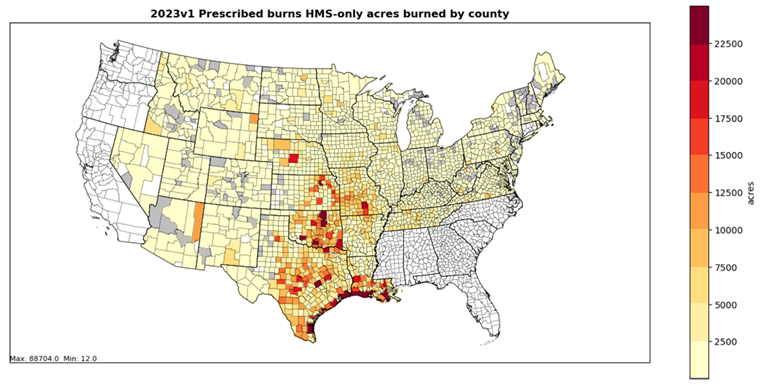
```
<a href="figures/Section-13/image012.png" download="figures/Section-13/image012.png" class="btn btn-primary">Download Figure</a>

```{r, include=FALSE}
df <- read_excel("./tables/Section-13/hms_only_acres_state.xlsx")
df[is.na(df)] <- ""
```

```{r hmstop, echo=FALSE, tidy=FALSE, booktabs=TRUE}
kableExtra::kbl(
  df, booktabs = TRUE,
  caption = 'Summary of acres burned by state for satellite-detected (HMS) only fires', 
) %>% kable_styling(full_width = FALSE, position = "center", latex_options = c("hold_position", "repeat_header"))
```

### Agricultural field burning

The NEI uses numerous SCC to classify agricultural burns. Table \@ref(tab:agpmscc)
provides a national summary by SCC for the EPA default 2023 NEI
emissions. A total of about 54,500 tons of PM~2.5~ are estimated to be
emitted by this sector. Figure \@ref(fig:cropres) provides a county map of
agricultural burn PM~2.5~ emissions for year 2023 using the EPA
methodology. Note higher emissions are estimated for portions of
southern Florida and parts of California and Washington. Figure \@ref(fig:croppm)
provides monthly PM~2.5~ emissions for agricultural field burning in
tons. Note emissions are smaller during the summer months with peaks in
April, August and October. Table \@ref(tab:topag) lists the top ten states for
PM~2.5~ emissions with Florida being the state with highest emissions.
Shown in Table \@ref(tab:agsltpm): are comparisons of PM~2.5~ emissions for those
states that submitted PM~2.5~ vs EPA estimates. Only a few S/L/Ts
submitted emissions.

```{r, include=FALSE}
df <- read_excel("./tables/Section-13/national_scc_ag_pm.xlsx")
df[is.na(df)] <- ""
```

```{r agpmscc, echo=FALSE, tidy=FALSE, booktabs=TRUE}
kableExtra::kbl(
  df, booktabs = TRUE, longtable = TRUE, 
  caption = 'National Agricultural burning PM~2.5~ emissions by SCC for 2023 EPA default emissions', 
) %>% kable_styling(position = "center", latex_options = c("repeat_header"), font_size = 11) %>%
  column_spec(1, width = "2cm") %>%
  column_spec(2, width = "5cm") %>%
  column_spec(3, width = "3cm")
```

```{r cropres, fig.cap="2023 NEI annual, county PM~2.5~ emissions for crop residue burns", echo=FALSE, out.width="75%", fig.pos="H"}
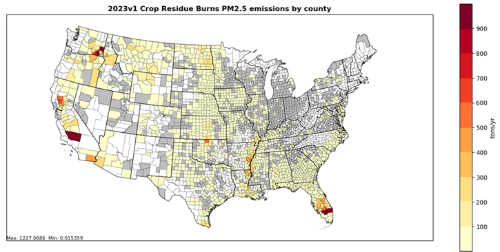
```
<a href="figures/Section-13/image013.png" download="figures/Section-13/image013.png" class="btn btn-primary">Download Figure</a>

```{r croppm, fig.cap="2023 NEI monthly PM~2.5~ emissions (tons) for crop residue burns", echo=FALSE, out.width="75%", fig.pos="H"}
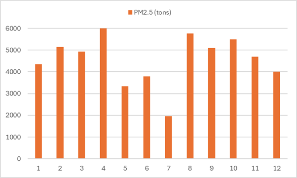
```
<a href="figures/Section-13/image014.png" download="figures/Section-13/image014.png" class="btn btn-primary">Download Figure</a>

```{r, include=FALSE}
df <- read_excel("./tables/Section-13/state_ag_pm_topten.xlsx")
df[is.na(df)] <- ""
```

```{r topag, echo=FALSE, tidy=FALSE, booktabs=TRUE}
kableExtra::kbl(
  df, booktabs = TRUE, longtable = TRUE,
  caption = 'Top ten states: 2023 EPA-default agricultural burning PM~2.5~ emissions', 
) %>% kable_styling(full_width = FALSE, position = "center", latex_options = c("repeat_header"))
```

```{r, include=FALSE}
df <- read_excel("./tables/Section-13/ag_epa_slt_pm.xlsx")
df[is.na(df)] <- ""
```

```{r agsltpm, echo=FALSE, tidy=FALSE, booktabs=TRUE}
kableExtra::kbl(
  df, booktabs = TRUE, longtable = TRUE,
  caption = 'Comparison of State vs EPA 2023 PM~2.5~ emissions (tons) for agencies that submitted.', 
) %>% kable_styling(position = "center", latex_options = c("repeat_header"), font_size = 11)
```

## References {#fire_references}

1.  Larkin, N.K., S. M. Raffuse, S. Huang, N. Pavlovic, and V.
    Rao, *The Comprehensive Fire Information Reconciled Emissions
    (CFIRE) Inventory: Wildland Fire Emissions Developed for the 2011
    and 2014 U.S. National Emissions Inventory*, submitted to JAWMA,
    Dec 2019.

2.  Prichard Susan J., O'Neill Susan M., Eagle Paige, Andreu Anne G., Drye Brian,
    Dubowy Joel, Urbanski Shawn, Strand Tara M. (2020) Wildland fire
    emission factors in North America: synthesis of existing data,
    measurement needs and management applications. International Journal
    of Wildland Fire 29, 132-147. <https://doi.org/10.1071/WF19066>

3.  Urbanski S.P. (2014) [Wildland fire emissions, carbon, and climate: emissions factors](https://doi.org/10.1016/j.foreco.2013.05.045).
    Forest Ecology and Management, 317, 51-60.

4.  EPA's [SPECIATE 5.0](https://www.epa.gov/air-emissions-modeling/speciate),
    June 2020.

5.  McCarty, J. L. 2011. *Remote Sensing-Based Estimates of Annual and Seasonal Emissions from Crop Residue Burning in the Contiguous United States*. Journal of the Air & Waste Management Association 61 (1), 22-34.

6.  Pouliot, G., Rao, V., McCarty, J. L., and A. Soja. 2017. *Development of the crop residue and rangeland
    burning in the 2014 National Emissions Inventory using information
    from multiple sources*. Journal of the Air & Waste Management
    Association Vol. 67, Issue 5.

7.  Aurell, J., Gullett, B., Grier, G., Holder, A., and I. George. 2023.
    *Seasonal emission factors from rangeland prescribed burns in the
    Kansas Flint Hills grasslands*. Atmospheric Environment. 304 (2023) 119769.

8. Personal communication with Dr J. McCarty, 2013, Michigan Technological Institute.
