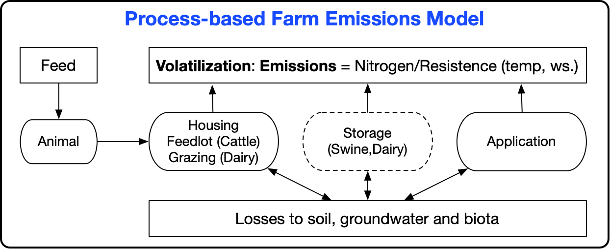
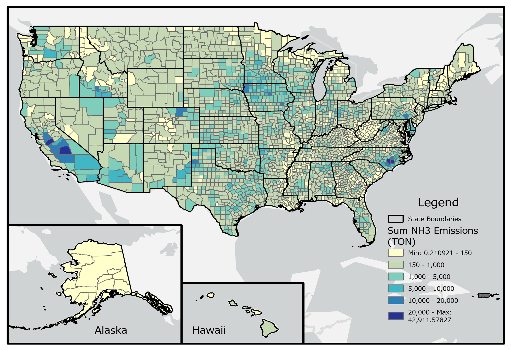

```{r, include=FALSE}
library(readxl)
library(knitr)
library(kableExtra)
library(readr)
library(ggplot2)
library(dplyr)
library(scales)
library(glue)
```

# Agriculture - Livestock Waste {#aglivestockwaste}

## Sector Descriptions and Overview 

The emissions from this category are primarily from domesticated animals intentionally raised for the production of food, fiber, or other goods or for the use of their labor. The livestock included in the EPA–estimated emissions include beef cattle, dairy cattle, swine, poultry (layers and broilers), turkeys, goats, horses/ponies and sheep/lambs. We use the Farm Emissions Model (FEM; [[ref 1, 2](#aglivestockwaste-references)]) developed by Carnegie Mellon University (CMU) to estimate the EFs from swine, layers, broilers, beef cattle and dairy cattle.  For the other animals estimated by EPA methods, we employ a nationwide average EF multiplied by appropriate activity data.  The pollutants that EPA reports using its methods for this sector are NH3, VOCs, and some VOC-HAPs by animal type as described further below.

The SCCs shown in Table \@ref(tab:aglivestockwaste-table1) represent those for which EPA provides nationwide estimates. SCC level 1 are “Miscellaneous Area Sources” and SCC level 2 are “Agricultural Production – Livestock” for all SCCs.

```{r, include=FALSE}
df <- read_excel("./tables/Section-17/Table_01_sccs.xlsx",
  col_types = rep("text"))
df[is.na(df)] <- ""
```

```{r aglivestockwaste-table1, tidy=FALSE, echo=FALSE,warning=FALSE, message=FALSE}
kableExtra::kbl(
  df, 
  booktabs = TRUE,
  longtable = TRUE,
  caption = 'Livestock Waste SCCs that are estimated by EPA methods for 2023 NEI',
  col.names = c("SCC", "SCC Level 3", "SCC Level 4")
) %>%
kable_styling(
  full_width = FALSE, 
  position = "center", 
  latex_options = c("repeat_header", "hold_position", "scale_down")
  )
```

It should be noted that there are other SCCs that make up this sector in the NEI, and SLTs can report them. However, they will be minor contributors to the overall emission levels from this sector and many of those data are removed via our “tagging” process and are reviewed carefully via our QA process so there is no double counting with emissions the EPA estimates and reports to the NEI.

## EPA-developed emissions

The general approach to calculating NH3 emissions due to livestock is to multiply the emission factor (in kg per year per animal) by the number of animals in the county. The county-level NH3 emissions factors are estimated using the FEM and county-level daily average meteorology (ambient temperature, wind speed, and precipitation) [[ref 1, 2](#aglivestockwaste-references)]. Once the FEM estimates NH3 emission factors by animal type, the county-level NH3 emission factors (EF~c,a~) will be multiplied with the latest NEI animal population (A~c,a~) to compute the county-level NH3 emissions (E~c,a~) for all animal types.

\begin{equation}
\text{E}_{c,a}
= \text{EF}_{c,a}
\times \text{A}_{c,a}
\times \frac{2.2}{2000}
(\#eq:emissions-equation1)
\end{equation}

<div style="margin-left: 2em;">
  Where: <br> \newline
  \( \text{E}_{c,a} \) = NH3 emissions for animal type a and county c (short ton) <br> \newline
  \( \text{EF}_{c,a} \) = NH3 emissions factor from the FEM model for animal type a and county c (kg/head) <br> \newline
  \( \text{A}_{c,a} \) = animal count for animal type a and county c (head) <br> \newline
  \( \frac{2.2}{2000} \) = conversion factor from kg to short tons <br> \newline
</div>

VOC emissions were estimated by multiplying a constant national VOC/NH3 emissions ratio of 0.08 to county-level NH3 emissions. Hazardous air pollutants (HAP) emissions were estimated by multiplying the county-level VOC emissions by HAP/VOC ratios, which are obtained from the literature and can vary by animal type.  The VOC emissions (E~VOC,c,a~) are calculated using the ratio of VOC to NH3 emissions from livestock.  That ratio is 0.08 kg of VOC for every kg of NH3.  HAP emissions were estimated by multiplying the county-level VOC emissions by HAP/VOC ratios.

\begin{equation}
\text{E}_{VOC,c,a}
= \frac{\text{VOC}}{\text{NH3}}
\times \text{E}_{c,a}
(\#eq:emissions-equation2)
\end{equation}

<div style="margin-left: 2em;">
  Where: <br> \newline
  \( \text{E}_{VOC,c,a} \) = VOC emissions for animal type a and county c (ton) <br> \newline
  \( \frac{\text{VOC}}{\text{NH3}} \) = 0.08 (Ratio of VOC/NH3) <br> \newline
  \( \text{E}_{c,a} \) = NH3 emissions for animal type a and county c (ton) <br> \newline
</div>

### Activity data

The activity data for this source category is based on livestock counts (average annual number of standing heads) and population information by state and county used to develop U.S. EPA’s Greenhouse Gas (GHG) Inventory [[ref 3](#aglivestockwaste-references)]. This data set is derived from multiple data sets from the United States Department of Agriculture (USDA), particularly the National Agricultural Statistics Service (NASS) survey and census [[ref 4](#aglivestockwaste-references)]. The USDA NASS survey dataset, which represents the latest available, 2023 national livestock data, is used to obtain the livestock counts for as many counties as possible across the United States.  For a full description of the GHG livestock population estimation methodology, the reader should refer to the referenced citation for the EPA’s GHG inventory document [[ref 3](#aglivestockwaste-references)].

Generally, counties not specifically included in the NASS survey data set (e.g., due to business confidentially reasons) are known as “D counties”. They were gap-filled based on the difference in the reported state total animal counts, and the sum of all county-level reported animal counts. State-level data on animal counts from the GHG inventory were distributed to counties based on the proportion of animal counts in those counties from the 2023 NASS census. Equation \@ref(eq:emissions-equation3) is used to allocate animal population to county, as needed:

\begin{equation}
\text{P}_{a,c}
= \text{P}_{a,s}
\times \text{r}_{a,c}
(\#eq:emissions-equation3)
\end{equation}

<div style="margin-left: 2em;">
  Where: <br> \newline
  \( \text{P}_{a,c} \) = Estimated population of animal type a in county c <br> \newline
  \( \text{P}_{a,s} \) = NASS survey reported state-level population of animal type a in state s <br> \newline
  \( \text{r}_{a,c} \) = Ratio of animal county- to state-level animal counts from the NASS census for animal type a in county c <br> \newline
</div>

When we come across any “D counties”, the county-level methodology relies on evenly distributing the ‘available’ population (the difference between the state population and the sum of the “non-D counties”) to each D county in the state. So, for example, if Broward, Orange, and Polk counties in Florida are “D” and the sum of the non-D counties is 6,000 compared to a reported 9,000 population for a given animal in FL, each of those counties each get 1,000 head. The point of determining the county population is to get a ratio for each county/year/animal. That ratio is multiplied by the NASS population (the goal is to always match the NASS data). That resulting value is then the estimated county-level population.  This procedure is the same as how we handled these data in the 2020 NEI.  

Please note that as with other sectors that rely on animal counts for activity, we allow SLTs to submit activity information. Those SLT-submitted activity data are quality assured and used over EPA estimates as appropriate.  Please consult other parts of this document for the SLT data that were used over EPA’s for animal count activity.  The final animal count data used in the 2023 NEI data for the CMU FEM model animals are shown in Table \@ref(tab:aglivestockwaste-table10).  Animal population decreased slightly for all animal types apart from layers, which had a slight increase.

### Methodology overview

Many of the methods and data described for this sector mirror exactly what was done in the 2017 and 2020 NEI, except that 2023 inventory information was used and the CMU FEM model was run for 2023 meteorological conditions. Due to the similarly of the 2023 NEI methodology in comparison to previous NEI’s, a brief discussion of EPA methods used in 2014, 2017 and 2020 NEI is beneficial, however, for this section the reader should refer to the [2017 NEI TSD](https://www.epa.gov/sites/default/files/2021-02/documents/nei2017_tsd_full_jan2021.pdf) (section 4.5) for any further details above and beyond what’s provided in this document. 

In 2004, Carnegie Mellon University (CMU) developed the FEM (Farm Emissions Model) to first estimate NH3 emissions from only dairy farms [[ref 5, 6, 7](#aglivestockwaste-references)]. Over time, this model was modified to include all major animal types, such as swine, dairy cattle, beef cattle, poultry layers, and poultry broilers [[ref 1, 2](#aglivestockwaste-references)]. In the 2014 NEI, EPA implemented the FEM which is a semi-empirical process-based emissions model, as the model is based on a nitrogen mass balance with inputs of meteorological parameters and management practices to obtain the desired output of ammonia emissions as a function of time but also be constrained through the use of tuned parameters to ensure agreement with previously reported ammonia emission factors (see general diagram Figure \@ref(fig:aglivestockwaste-figure1) below and references [[ref 1, 2](#aglivestockwaste-references)] for more details). The semi-empirical process-based emission modeling approach allows us to evaluate the model for consistency with measured emission factors, maintain consistency by tracking the actual nitrogen available for emission and also estimate uncertainty in our model’s estimates of ammonia emissions, producing daily (and seasonally) variable EFs by animal type.  Note that for the NEI, we aggregate emissions to the county level on annual basis as required by the nonpoint sector.

```{r aglivestockwaste-figure1, fig.align = "center", fig.pos="H", fig.cap="Nitrogen flow in the FEM, used to estimate livestock waste NH3 emissions in 2023 NEI", fig.alt="This figure shows Nitrogen flow in the FEM, used to estimate livestock waste NH3 emissions in 2023 NEI.", echo=FALSE, out.width="75%"}

```

<a href="figures/Section-17/Figure_01_flowchart.png" download="figures/Section-17/Figure_01_flowchart.png" class="btn btn-primary">Download Figure</a>

In the 2014 NEI, our estimates were developed by a graduate student working at CMU. While she passed on the code and input files to EPA, when we attempted to use these in the 2017 NEI, we were not successful in reproducing some of her estimates; thus, we went to a simple ratioing technique (using meteorology changes from 2014 to 2017) to estimate emissions for this sector in the 2017 NEI.  For the 2020 NEI, we were able to better reproduce the 2014 results and used the original FEM code provided by CMU with some improvements to estimate NH3 emissions for this sector. In this TSD, we summarize the 2023 NEI Process, leaving out a lot of the details which can be found in the 2017 NEI TSD, since they are unchanged.  The 2023 NEI improvements section (Section \@ref(aglivestockwaste-changes)) details new items that were added in the 2023 cycle.

In the 2023 NEI, the EPA methodology for ammonia emissions that results from the use of the CMU model, includes all processes from the housing/grazing, storage and application of manure from beef cattle, dairy cattle, swine, broiler chicken, and layer chicken production, and these are assigned to the “EPA” SCCs listed in Table \@ref(tab:aglivestockwaste-table1). It is assumed the EFs used also account for, on average, all the management practices that are used in waste treatment for each of those animals.

### Emissions factor development

CMU developed a model to estimate NH3 emissions from livestock [[ref 1, 2, 5](#aglivestockwaste-references)]. This model produces daily resolved climate level emissions factors for a particular distribution of management practices for each county and animal type (for dairy cows, beef cattle, swine, poultry layers, and poultry broilers only), as expressed as emissions/animal. These county level emission factors are then combined together to create a state level emissions factor for each animal type. Thus, the CMU model provides a state specific emission factor for each animal type (NH3 emissions/head). For the non-CMU model animals that EPA estimates emissions for, we are reliant on use of population counts that come from the same source as described above combined with one national EF for each animal type (horses, goats, turkeys, and sheep) [[ref 8](#aglivestockwaste-references)].  VOC emissions are always a constant 8% of NH3 emissions.

To develop emissions factors for the 2023 NEI for the CMU-based animals, the CMU model was modified to use hourly meteorological data. HAP emissions were estimated by multiplying county-specific VOC emissions by speciation factors that are animal-specific as shown in Table \@ref(tab:aglivestockwaste-table2) below. The HAP emissions are animal-specific and come from the SPECIATE database, as described in the 2017 NEI TSD for this sector. The HAP fractions found in SPECIATE are multiplied by the VOC estimates, record-by-record, to estimate HAPs for this sector.  

```{r, include=FALSE}
df <- read_excel("./tables/Section-17/Table_02_vocfractions.xlsx",
  col_types = rep("text"))
df[is.na(df)] <- ""
```

```{r aglivestockwaste-table2, tidy=FALSE, echo=FALSE,warning=FALSE, message=FALSE}
kableExtra::kbl(
  df, 
  booktabs = TRUE,
  longtable = TRUE,
  caption = 'Animal-specific VOC fractions used to estimate HAPs for cattle, layers, broilers, and swine'
) %>%
kable_styling(
  full_width = FALSE, 
  position = "center", 
  latex_options = c("repeat_header", "hold_position", "scale_down"), font_size = 11
  )
```

For the non-FEM animals (goats, sheep, horses/ponies, and turkeys), animal-specific HAP speciation profiles were not available in the literature, so the assignments in Table \@ref(tab:aglivestockwaste-table3) were made.

```{r, include=FALSE}
df <- read_excel("./tables/Section-17/Table_03_vochapprofiles.xlsx",
  col_types = rep("text"))
df[is.na(df)] <- ""
```

```{r aglivestockwaste-table3, tidy=FALSE, echo=FALSE,warning=FALSE, message=FALSE}
kableExtra::kbl(
  df, 
  booktabs = TRUE,
  longtable = TRUE,
  caption = 'VOC HAP Profiles used for sheep, goats, turkeys, and horses/ponies'
) %>%
kable_styling(
  full_width = FALSE, 
  position = "center", 
  latex_options = c("repeat_header", "hold_position", "scale_down")
  )
```

### Process for estimating emissions

From a modeling perspective, the 2023 NEI for livestock waste emissions shadows what was done in the 2020 NEI by using the FEM model but uses 2023 animal populations and county-level meteorology as inputs.

The remainder of this section details high-level procedures used to arrive at the 2023 NEI estimates as well as presenting a summary of the model parameters derived for the 2023 process. 

The basic steps in developing the 2023 inventory involved these basic steps:

- Develop county-specific daily meteorology inputs based on the MCIP meteorology over the US domain
- Run FEM to produce daily NH3 emission factors with county-specific meteorology and farm management practices, and animal-specific model parameters
  - Repeat for all farm processes (housing, storage, application, and/or grazing)
  - Compute a county composite process-specific EF as a weighted average across all manure management practices in that county.
  - Repeat for all animal types
- County-based Emissions = (Emissions Factor from CMU model) x (Animal Population)
  - Resulting data has structure of emissions = f(county, day, livestock type, “practice”) where “practice” is shorthand for the different housing/storage/application configurations that prevail in a county.
- Result is ammonia emissions with:
  - Daily temporal resolution 
  - County spatial resolution
  - By livestock type and management practice

In the overall process described above, note that the FEM gets seasonal/daily variability due to the resistance parameters in each sub model (see 2017 NEI TSD) being dependent on meteorology.  The model gets variability due to management practices because there is a separate resistance sub-model for each livestock type, by manure management stage (housing, storage, etc.), and by major practice (e.g., how often there are cleanouts). Regional variation comes from both meteorology effects and from differences in practices across the country.  It should be noted that the 3 meteorological variables that matter the most are temperature, wind speed and precipitation.

Note that the FEM model does not cover Alaska, Hawaii, Virgin Islands, or Puerto Rico (only the lower 48 states) due to the lack of meteorology, we would thus be reliant on SLT submissions to cover this sector for those states. 

#### Meteorology

Similarly to the 2020 NEI, an SMOKE-based (Spare Matrix Operator Kerner Emission) utility programs, called GenTPro (Generating Temporal Profiles) was updated to generate county-level daily average meteorological inputs for the FEM based on the gridded hourly meteorology data from Meteorology-Chemistry Interface Processor (MCIP) model simulations over the U.S. [[ref 9](#aglivestockwaste-references)]. The MCIP modeling process relies on hourly meteorological measurements across the US as well as other information to obtain meteorological parameters. The reader should consult the reference above for how these data are formatted and available for download and access. Utilizing the MCIP hourly meteorology for FEM simulations allows spatial and temporal representations of meteorology on NH3 emissions from the agricultural livestock sector. GenTPro generates the spatially and temporally resolved county-level daily average meteorology inputs (e.g., temperatures, wind speed, and precipitation) for use in generating daily FEM EFs for over 3,100 counties in the U.S. 

#### Animal practice documentation

The animal practice documentation used here is a summary of the information provided in McQuilling and Adams, [[ref 1](#aglivestockwaste-references)] and McQuilling, [[ref 2](#aglivestockwaste-references)].  The reader should consult those references [[ref 1, 2](#aglivestockwaste-references)] for further information. 

Ammonia emissions from livestock depend on two major factors—the management practices employed by the producers (i.e., what housing, storage and application methods are used) and the environmental conditions of location where the farm is situated (i.e., temperatures, wind speeds, precipitation). All these factors have significant impacts on the conditions of the manure and waste (e.g., water content, total ammoniacal nitrogen concentration) and as a result can enhance or reduce the emissions of ammonia from these sources. The CMU model requires farm-type inputs which describe the type of animal housing, manure storage and application methods used for a particular location. Each location is expected to have some combination of management practices.

In order to understand the differences in regional preferences for particular manure management strategies, information was extracted from the most recent National Animal Health Monitoring Surveys (NAHMS) done by the USDA [[ref 1, 2, 10-30](#aglivestockwaste-references)]. The beef cattle NAHMS was completed in 2007 and feedlot beef in 2011; dairy cattle data was from 2002 and 2007; swine data were collected for 2006 and 2012, and the most recent poultry NAHMS was completed for 2010. The most recent data available had limited spatial resolution and so the model is only able to resolve large-scale regional differences in practices. For beef and dairy cattle systems, the United States was divided into four regions and two regions, respectively.  For swine, the country was divided into three regions—Midwest, East, and South, and for layers, there were four regions—Northeast, Southeast, Central and West. An additional limitation in the data available for the characterization of the farm practices was that for some of the questions asked by the study, results were only reported in terms of percent of operations which used a particular practice. This may give too much weight to the practices used on smaller farms which have a relatively small contribution to the overall level of ammonia emissions from a particular livestock type or practice. Thus, some uncertainty is expected as a result of the limited quantity of data available regarding manure management practices throughout the country. As was previously discussed by Pinder et al. [[ref 5-7](#aglivestockwaste-references)], one of the main factors most limiting to the FEM’s skill is the lack of information about manure management practices throughout the country. It is unclear whether these uncertainties result in the overprediction or underprediction of total ammonia emissions from livestock in the United States. For more detail on the NAHMS by animal type, the reader is referred to the 2017 NEI TSD, as that information has not changed in going from 2017 to 2023 NEIs. 

For the 2023 NEI, we have used the same Python-based Farm Practices Probability Tool (FP2) as described in the 2020 NEI.  This tool will allow the user to generate the FEM-ready county-level farm manure management practice configuration probability table based on a combination of manure management practices distribution within the county, state, or region from the USDA-based NAHMS [[ref 10-30](#aglivestockwaste-references)] reports. The format of the farm configuration probability table is described in Table \@ref(tab:aglivestockwaste-table4). For each county, the FP2 tool generates a default probability table that attempts to represent all types of manure management practices for that county based on NAHMS data. A value of 1 indicates that configuration exists for a county, while a value of 0 indicates it does not (Table \@ref(tab:aglivestockwaste-table4)). A farm configuration is a unique combination of manure management practices that describe the operation of the farm. Each farm configuration is executed by the FEM, and the county-level daily NH3 emission factor is the average of all farm configuration FEM simulations, weighted by farm size and probability of occurrence. For 2023, a survey was conducted to collect detailed information on local animal and farm management practices for the major agricultural states of MN, MO, NC, NE, OK and TX, in addition to dairy operations in CA, which was incorporated into the FEM configuration and replaced the NAHMS data for these states (see section \@ref(aglivestockwaste-survey) for more information).

```{r, include=FALSE}
df <- read_excel("./tables/Section-17/Table_04_FEMconfiguration.xlsx",
  col_types = rep("text"))
df[is.na(df)] <- ""
```

```{r aglivestockwaste-table4, tidy=FALSE, echo=FALSE,warning=FALSE, message=FALSE}
kableExtra::kbl(
  df, 
  booktabs = TRUE,
  longtable = TRUE,
  caption = 'FEM farm manure management practice configuration probability table.'
) %>%
kable_styling(
  full_width = FALSE, 
  position = "center", 
  latex_options = c("repeat_header", "hold_position", "scale_down")
  )%>%
  column_spec(1, width = "3cm") %>%
  column_spec(2, width = "3cm")%>%
  column_spec(3, width = "3cm") %>%
  column_spec(4, width = "6cm")
```

#### Model parameters

The FEM is a tuned model that applies adjustments to approximate observed data. However, the model evaluation does not reflect the ability of the FEM to predict completely independent measurements but the ability of a relatively simple process-based model, with a single set of mass transfer parameters for each manure management practice, to describe the full range of observed variability.

The National Air Emissions Monitoring Study (NAEMS) data [[ref 31](#aglivestockwaste-references)] and literature data are used to both tune the mass balances for different types of animal management practices as well as help set the parameters the model needs to conduct the mass balance and estimate ammonia.  The NAEMS information is outlined in the 2017 and 2020 NEI TSDs, so the reader is referred to those documents for more information.  It should be noted that literature data beyond the NAEMS data is required, because the NAEMS dataset does not cover emissions measurements for beef cattle operations, nor does it cover several specific animal manure management practices for some animals.  

#### Manure Characteristics

Manure characteristics are important input parameters to the model because they govern the amount of nitrogen available for emission, whether or not the nitrogen present is likely to be volatilized, and how well the waste can infiltrate into the soil during manure application. These parameters have been selected based on information extracted from published literature as well as reports from the NAEMS study. Table \@ref(tab:aglivestockwaste-table5) describes the types of parameters and inputs critical to the model and Table \@ref(tab:aglivestockwaste-table6) presents information about manure volume, nitrogen concentration and pH levels in the waste from each type of animal included in the model. The parameter values in Table \@ref(tab:aglivestockwaste-table6) are the same values used in NEI 2020.

```{r, include=FALSE}
df <- read_excel("./tables/Section-17/Table_05_modelinputs.xlsx",
  col_types = rep("text"))
df[is.na(df)] <- ""
```

```{r aglivestockwaste-table5, tidy=FALSE, echo=FALSE,warning=FALSE, message=FALSE}
if (knitr::is_latex_output()) {
  # LaTeX/PDF: horizontal rule between all rows (booktabs style), no vertical rules
  kbl(
    df,
    booktabs  = TRUE,
    longtable = TRUE,
    caption   = 'Description and sources of model inputs and parameters.',
    linesep   = "\\midrule"          # horizontal line after every row
  ) |>
    kable_styling(
      full_width   = FALSE,
      position     = "center",
      latex_options = c("repeat_header", "hold_position", "scale_down"),
      font_size    = 11
    ) |>
    column_spec(1, width = "2cm") |>
    column_spec(2, width = "3cm") |>
    column_spec(3, width = "4cm") |>
    column_spec(4, width = "4cm")

} else {
  # HTML: add a top border on every body row; no vertical borders
  kbl(
    df,
    caption = 'Description and sources of model inputs and parameters.'
  ) |>
    kable_styling(
      full_width = FALSE,
      position   = "center",
      bootstrap_options = c("condensed"),  # no default borders
      font_size  = 11
    ) |>
    # Thick border under header row
    row_spec(0, extra_css = "border-bottom: 2px solid #999;") |>
    # Thin border above each body row (i.e., between rows)
    row_spec(1:nrow(df), extra_css = "border-top: 1px solid #ddd;") |>
    # Optional: set widths for HTML using em
    column_spec(1, width = "10em") |>
    column_spec(2, width = "15em") |>
    column_spec(3, width = "20em") |>
    column_spec(4, width = "20em")
}
```

```{r results='asis', echo=FALSE}
if (knitr::is_latex_output()) {
  # Add vertical space between tables in PDF
  cat("\\vspace{0.75\\baselineskip}\n")
} else {
  # Add vertical space between tables in HTML
  cat('<div style="height:0.75em;"></div>\n')
}
```

```{r, include=FALSE}
df <- read_excel("./tables/Section-17/Table_06_inputparameters.xlsx",
  col_types = rep("text"))
df[is.na(df)] <- ""
```

```{r aglivestockwaste-table6, tidy=FALSE, echo=FALSE,warning=FALSE, message=FALSE}
kableExtra::kbl(
  df, 
  booktabs = TRUE,
  longtable = TRUE,
  caption = 'Model Input parameters related to manure characteristics.'
) %>%
kable_styling(
  full_width = FALSE, 
  position = "center", 
  latex_options = c("repeat_header", "hold_position", "scale_down"), font_size = 11) %>%
  column_spec(1, width = "3cm") %>%
  column_spec(2, width = "3cm") %>%
  column_spec(3, width = "2cm") %>%
  column_spec(4, width = "6cm")
```

There are only a very limited number of studies which describe the manure nitrogen and manure pH for each animal type. As a result, there is considerable uncertainty in these input values which can result in significant uncertainty in predicted emissions from the model.

#### Tunable Parameters

The FEM is a balance between an empirical approach and first-principles process-based model. A nitrogen mass balance and a process description of ammonia losses are used, but the FEM model parameters are tuned to reproduce measured emissions factors. Model complexity is limited to the most important emissions processes and to inputs that are typically available. The strategy pursued for developing process-based models is guided by the need to build emissions inventories, and the requirements and data limitations associated with this application. Previous measurement campaigns also often sampled emissions from a single part of the production process. This means that information about the emissions process from the start to end of production might be lacking, making nitrogen mass balance in the system difficult. The lack of whole-farm measurements is one gap in much of the literature available and a benefit of the estimates of ammonia emissions produced by the FEM.

There are 2-3 tunable parameters associated with each sub-model in the farm emissions model. These tunable parameters allow adjustment of model-predicted emissions and to correct for the unknowns and uncertainties of the input parameters and to ensure that the model-predicted values are consistent with those that have been reported in the literature and in the National Air Emissions monitoring study; they are constant for a particular farm type—tuning is not done for a particular farm—and as a result, there can be significant disagreement between model predictions and the measured emissions for a single farm. The goal of the FEM is not necessarily to capture the emissions of single farms perfectly, but rather to capture the effects of various parameters on emissions on a farm typical of a certain set of practices.

In the FEM, as previously described [[ref 1](#aglivestockwaste-references)], ammonia emissions are estimated as a function of the nitrogen present in the waste and the mass transfer resistance.  This resistance is made up of the following three parts:  the aerodynamic (ra), quasi-laminar (rb), and surface resistances (rs) [[ref 32](#aglivestockwaste-references)]. Aerodynamic and quasi-laminar resistances are used to describe the resistance to transport in the gaseous layer above the animal wastes [[ref 33, 34, 35](#aglivestockwaste-references)]. These parameters are based on widely used theoretical formulas and are not tuned. The third part of the resistance is the surface resistance from diffusion closest to the gas-liquid (manure) interface.  Here, the surface resistance is a function of tuned parameters as well as temperature which ensures the modeled ammonia emission factors are consistent with observations; Table \@ref(tab:aglivestockwaste-table7) lists which tunable parameters are used for each animal and each sub-model. 

```{r, include=FALSE}
df <- data.frame(
  Model = c("Housing","Storage","Application","Grazing"),
  `Animal Type` = c("Beef-Cattle, Dairy-Cattle, Swine, Poultry-Broiler, Poultry-Layer",
                    "Dairy-Cattle, Swine",
                    "Beef-Cattle, Dairy-Cattle, Swine, Poultry-Broiler, Poultry-Layer",
                    "Beef-Cattle, Dairy-Cattle"),
    Description = c("Resistance parameters: $H_{1}$,$H_{2}$",
                    "Resistance parameters: $S_{1}$,$S_{2}$",
                    "Resistance parameters: $A_{1}$,$A_{2}$,$A_{3}$",
                    "Resistance parameters: $G_{1}$,$G_{2}$"),
  stringsAsFactors = FALSE
)
```

```{r aglivestockwaste-table7, tidy=FALSE, echo=FALSE,warning=FALSE}
kableExtra::kbl(
  df, 
  booktabs = TRUE,
  longtable = TRUE, escape = FALSE,  
  caption = "Tuned model parameters for beef, swine, and poultry",
  col.names = c("Model", "Animal Type", "Description")
) %>%
kable_styling(position = "center", latex_options = c("hold_position", "repeat_header"), font_size = 11) %>%
  column_spec(1, width = "2cm") %>%
  column_spec(2, width = "6cm") %>%
  column_spec(3, width = "4cm")
```

These values are specific to a particular practice for a particular animal type. This means that a free stall dairy with lagoon storage and injection application would employ the same tuned parameters whether it was located in New York or California. Conversely, two farms in the same location but utilizing different manure management practices would have different tuned parameters in their sub-models. The values that have been used for each of these parameters can be found in Table \@ref(tab:aglivestockwaste-table8) [[ref 1, 2](#aglivestockwaste-references)].  The 2017 NEI TSD provides further references for the values presented in Table \@ref(tab:aglivestockwaste-table8).

There are no controls assumed for this source category. Example calculations based on the sequence of steps listed in the “2023 Process for estimating emissions” section shown above can be very involved, but the 2017 NEI TSD section 4.5 shows an example of how these calculations are made. 

```{r, include=FALSE}
df <- data.frame(
  Model = c("Housing","Housing","Housing","Housing","Housing",
            "Storage","Storage",
            "Application","Application","Application","Application",
            "Grazing","Grazing"
            ),
  Description = c("Resistance parameters: $H_{1}$,$H_{2}$","Resistance parameters: $H_{1}$,$H_{2}$","Resistance parameters: $H_{1}$,$H_{2}$","Resistance parameters: $H_{1}$,$H_{2}$","Resistance parameters: $H_{1}$,$H_{2}$",
                  "Resistance parameters: $S_{1}$,$S_{2}$","Resistance parameters: $S_{1}$,$S_{2}$",
                  "Resistance parameters: $A_{1}$,$A_{2}$,$A_{3}$","Resistance parameters: $A_{1}$,$A_{2}$,$A_{3}$","Resistance parameters: $A_{1}$,$A_{2}$,$A_{3}$","Resistance parameters: $A_{1}$,$A_{2}$,$A_{3}$",
                  "Resistance parameters: $G_{1}$,$G_{2}$","Resistance parameters: $G_{1}$,$G_{2}$"
                  ),
  `Animal Type` = c("Beef Cattle","Dairy Cattle","Swine","Poultry-Broiler","Poultry-Layer",
                    "Dairy Cattle","Swine",
                    "Beef Cattle","Dairy Cattle","Swine","Poultry",
                    "Beef Cattle","Dairy Cattle"
                    ),
  `Tuning/Evaluation Sources` = c(
    "$H_{1} = 0.1 \\big(s \\times m^{-1} \\times °C^{-1}\\big)$, $H_{2} = 0.008 \\big(s^{2}m^{-2}\\big)$",
    "$H_{1} = 0.1 \\big(s \\times m^{-1} \\times °C^{-1}\\big)$, $H_{2} = 0.016 \\big(s^{2}m^{-2}\\big)$",
    "$H_{1} = 0.1 \\big(s \\times m^{-1} \\times °C^{-1}\\big)$, $H_{2} = 0.008 \\big(s^{2}m^{-2}\\big)$",
    "$H_{1} = 0.15 \\big(s \\times m^{-1} \\times °C^{-1}\\big)$, $H_{2} = 0.0035 \\big(s^{2}m^{-2}\\big)$",
    "$H_{1} = 0.1 \\big(s \\times m^{-1} \\times °C^{-1}\\big)$, $H_{2} = 0.008 \\big(s^{2}m^{-2}\\big)$",
    "$S_{1} = 0.1 \\big(s \\times m^{-1}\\big)$, $S_{2} = 1.00 \\big(s \\times m^{-1}\\times °C^{-1}\\big)$",
    "$S_{1} = 0.2 \\big(s \\times m^{-1}\\big)$, $S_{2} = 4.00 \\big(s \\times m^{-1}\\times °C^{-1}\\big)$",
    "$A_{1} = 0.001 \\big(s \\times m^{-1}\\big)$, $A_{2} = 10$, $A_{3} = 20$",
    "$A_{1} = 0.0004 \\big(s \\times m^{-1}\\big)$, $A_{2} = 8.8$, $A_{3} = 1.4$",
    "$A_{1} = 0.001 \\big(s \\times m^{-1}\\big)$, $A_{2} = 10$, $A_{3} = 20$",
    "$A_{1} = 0.001 \\big(s \\times m^{-1}\\big)$, $A_{2} = 0.01$, $A_{3} = 0.2$",
    "$G_{1} = 0.12 \\big(s \\times m^{-1}\\big)$, $G_{2} = 5.4$",
    "$G_{1} = 0.12 \\big(s \\times m^{-1}\\big)$, $G_{2} = 5.4$"
  ),
  stringsAsFactors = FALSE
)
```

```{r aglivestockwaste-table8, tidy=FALSE, echo=FALSE, booktabs = TRUE}
kableExtra::landscape(
  kableExtra::kbl(
    df,
    booktabs = TRUE,
    longtable = TRUE,
    escape = FALSE,  
    caption = "Tuned Parameter Values by practice and animal type for the 2020 NEI",
    col.names = c("Sub-Model", "Description", "Animal Type", "Tuning Evaluation Sources")
  ) %>%
    kableExtra::kable_styling(position = "center",
      latex_options = c("repeat_header", "hold_position"),
      font_size = 10) #%>%
    #kableExtra::column_spec(1, latex_column_spec = "p{2cm}") %>%
    #kableExtra::column_spec(2, latex_column_spec = "p{8cm}") %>%
    #kableExtra::column_spec(3, latex_column_spec = "p{5cm}") %>%
    #kableExtra::column_spec(4, latex_column_spec = "p{5cm}")
)
```

#### Sheep/lambs, goats, turkeys, and horses/ponies

In addition to the emissions from the large NH3-emitting from beef cattle, dairy cattle, swine, poultry layers and broilers estimated via the CMU FEM model described above, the EPA also estimates emissions from a set of smaller NH3-emitting animals, which include sheep/lambs, goats, horses/ponies, and turkeys.  These emissions are not estimated via the FEM model, but rather estimated with the simple approach of [Emission factors*activity], where the activity is a county-based animal count based on USDA data referenced earlier in this section.  These default animal counts are reviewed by the SLTs and replaced with better local counts as appropriate.  The EFs are constant for every county in the US and come from an earlier EPA report by Battye et al. [[ref 8](#aglivestockwaste-references)].  VOC speciation for these non-FEM animal types is applied according to the information provided earlier in this section. Nationwide animal counts, emission factors, and 2023 NEI NH3totals are shown for each of these animal type combinations below in Table \@ref(tab:aglivestockwaste-table9). VOC is estimated at 8% of NH3 as with the other animal types. And all other assumptions are as stated for the CMU animal emission estimates discussed earlier.

```{r, include=FALSE}
df <- read_excel("./tables/Section-17/Table_09_animalcountsefemissions.xlsx",
  col_types = rep("text"))
df[is.na(df)] <- ""
```

```{r aglivestockwaste-table9, tidy=FALSE, echo=FALSE,warning=FALSE, message=FALSE}
kableExtra::kbl(
  df, 
  booktabs = TRUE,
  longtable = TRUE,
  caption = 'Animal counts, emission factors, and total NH3 emission estimates in 2023 NEI for goats/sheep and lambs/horses, goats, and ponies/turkeys.'
) %>%
kable_styling(
  full_width = FALSE, 
  position = "center", 
  latex_options = c("repeat_header", "hold_position", "scale_down")
  )%>%
  column_spec(1, width = "4cm") %>%
  column_spec(2, width = "4cm")%>%
  column_spec(3, width = "4cm")%>%
  column_spec(4, width = "4cm")
```

## Emissions Summaries

Table \@ref(tab:aglivestockwaste-table10) below shows the comparison of animal population and national NH3 emissions total between NEI 2020 and 2023 NEI EPA estimates. The average national ammonia emissions changes (tons/year) between 2020 and 2023 NEI EPA estimates range from -15% (Dairy), -5% (Beef Cattle), +6% (Swine), +8% (Layer) to +18% (Broiler). These changes in emissions result from a combination of differences in meteorology, animal counts, and some updated manure management practice information.  

```{r, include=FALSE}
df <- read_excel("./tables/Section-17/Table_10_animalpopulationnationalemissions.xlsx",
  col_types = rep("text"))
df[is.na(df)] <- ""
```

```{r aglivestockwaste-table10, tidy=FALSE, echo=FALSE,warning=FALSE, message=FALSE}
kableExtra::kbl(
  df, 
  booktabs = TRUE,
  longtable = TRUE,
  caption = 'Animal population and national NH3 total emissions from 2020 and 2023 NEI EPA estimates'
) %>%
kable_styling(position = "center", latex_options = c("hold_position", "repeat_header"), font_size = 11) %>%
  column_spec(1, width = "2cm") %>%
  column_spec(2, width = "2cm") %>%
  column_spec(3, width = "5cm") %>%
  column_spec(4, width = "4cm")
```

2023 NEI EPA estimates results are shown as total NH3 emissions by county in Figure \@ref(fig:aglivestockwaste-figure2). The hotspots are seen to be in the San Joaquin Valley in CA, parts of the Midwest and eastern NC. Beef and dairy cattle emissions drive the hotspots in California mostly. Poultry emissions dominate the southeastern US hotspots, and swine emissions are very prevalent in NC. Turkeys (which are not estimated outside of the FEM model) are important in both NC and in MN areas of the country.

In general, there is very little change (< 0.01 % decrease) in ammonia emissions from 2020 to 2023 NEI EPA estimates as the increases and decreases in emissions from different animal types balance out which is the result of the increases or decreases by different animal types across the states.

```{r aglivestockwaste-figure2, fig.align = "center", fig.pos="H", fig.cap="Total EPA estimated NH3 emissions from the 2023 livestock waste sector.", fig.alt="Total NH3 emissions from the 2023 livestock waste sector.", echo=FALSE, out.width="75%"}

```

<a href="figures/Section-17/Figure_02_emissionsmap.png" download="figures/Section-17/Figure_02_emissionsmap.png" class="btn btn-primary">Download Figure</a>

### Improvements/Changes in the 2023 NEI {#aglivestockwaste-changes}

From the 2020 to 2023 NEI, the only change in methodology was the use of farm management practice survey information for a selection of states. More details are provided below.  

#### Farm Manure Management Practices Information Improvements {#aglivestockwaste-survey}

For the 2023 NEI, a survey was conducted to collect information on farm and manure management practices in the following 7 states and animal types:

- North Carolina: beef/dairy/swine/broilers/layers
- Oklahoma: beef/dairy/swine/broilers/layers
- Minnesota: beef/dairy/swine/broilers/layers
- Nebraska: beef/dairy/swine/broilers/layers
- California: dairy only
- Missouri: beef/dairy/swine/broilers/layers
- Texas: beef/dairy/swine/broilers/layers

This survey has several sub-sections based on animal type, including housing type, manure storage, manure cleanout and handling, manure land application, animal management (if applicable), and other information. The responses from the survey questions provided input data to the farm probabilities input files and FEM configuration. The information on the 7 survey states was used in 2023 NEI for the 7 states accordingly. For the rest of the states, FEM configuration was kept at default values which means the same values as the 2020 NEI, which was based on the NAHMS.

## References {#aglivestockwaste-references}

1.	A. M. McQuilling and P. J. Adams, “Semi-empirical process-based models for ammonia emissions from beef, swine, and poultry operations in the United States,” Atmos. Environ., vol. 120, pp. 127–136, Nov. 2015.
2.	A. McQuilling, 2016, Ammonia Emissions from Livestock in the United States: From Farm-Level Models to a New National Inventory, Thesis, Carnegie Mellon University, available at: https://kilthub.cmu.edu/articles/Ammonia_Emissions_from_Livestock_in_the_United_States_From_Farm-Level_Models_to_a_New_National_Inventory/6714665
3.	U.S. EPA, 2025. Draft Inventory of U.S. Greenhouse Gas Emissions and Sinks: 1990-2023, Chapter 5, Agriculture. EPA-HQ-OAR-2024-0591-0003. Available at https://www.regulations.gov/document/EPA-HQ-OAR-2024-0591-0003  
4.	United States Department of Agriculture National Agricultural Statistics Service Quick Stats. https://quickstats.nass.usda.gov/ 
5.	R. W. Pinder, N. J. Pekney, C. I. Davidson, and P. J. Adams, “A process-based model of ammonia emissions from dairy cows: improved temporal and spatial resolution,” Atmos. Environ., vol. 38, no. 9, pp. 1357–1365, Mar. 2004.
6.	R. W. Pinder, R. Strader, C. I. Davidson, and P. J. Adams, “A temporally and spatially resolved ammonia emission inventory for dairy cows in the United States,” Atmos. Environ., vol. 38, no. 23, pp. 3747–3756, Jul. 2004.
7.	R. W. Pinder, P. J. Adams, S. N. Pandis, and A. B. Gilliland, “Temporally resolved ammonia emission inventories: Current estimates, evaluation tools, and measurement needs,” J. Geophys. Res. Atmospheres, vol. 111, no. D16, p. D16310, Aug. 2006.
8.	Battye, R. W. Battye, C. Overcash, S. Fudge, 1994. Development and Selection of Ammonia Emission Factors, Final Report. EPA Contract 68-D3-0034, Work Assignment 0-3. Available at: https://nepis.epa.gov/
9.	https://www.cmascenter.org/smoke/
10.	USDA-APHIS, “[Feedlot 2011 -- Part I: Management Practices on US Feedlots with a Capacity of 1000 or More Head](https://www.aphis.usda.gov/sites/default/files/feed11_dr_parti.pdf),” 2013. 
11.	USDA-APHIS, “[Feedlot 2011 -- Part II: Management Practices on US Feedlots with a capacity of Fewer than 1000 Head](https://www.aphis.usda.gov/sites/default/files/feed11_dr_partii.pdf),” 2013.
12.	USDA-APHIS, “[Beef 2007-2008 -- Part I: Reference of Beef Cow-calf Management Practices in the United States, 2007-08](https://www.aphis.usda.gov/sites/default/files/beef0708_dr_parti_rev_1.pdf),” 2009. 
13.	USDA-APHIS, “[Beef 2007-2008-- Part II: Reference of Beef Cow-calf Management Practices in the United States, 2007-08](https://www.aphis.usda.gov/sites/default/files/beef0708_dr_partii_1.pdf),” 2009. 
14.	USDA-APHIS, “[Beef 2007-08 -- Part III: Changes in the US Beef Cow-calf Industry, 1993-2008](https://www.aphis.usda.gov/sites/default/files/beef0708_dr_partiii_1.pdf),” 2009.
15.	USDA-APHIS, “[Dairy 2007-- Part V: Changes in Dairy Cattle Health and Management Practices in the United States, 1996-2007](https://www.aphis.usda.gov/sites/default/files/dairy07_dr_partv_rev.pdf),” 2007. 
16.	USDA-APHIS, “[Dairy 2007-- Part III: Reference of Dairy Cattle Health and Management Practices in the United States, 2007](https://www.aphis.usda.gov/sites/default/files/dairy07_dr_partiii_rev.pdf),” 2007. 
17.	USDA-APHIS, “[Dairy 2007-- Part II: Changes in the US Dairy Cattle Industry, 1991-2007](https://www.aphis.usda.gov/sites/default/files/dairy07_dr_partii.pdf),” 2007. 
18.	USDA-APHIS, “[Dairy 2002-- Part II: Changes in the United States Dairy Industry, 1991-2002](https://www.aphis.usda.gov/sites/default/files/dairy02_dr_partii.pdf),” 2002. 
19.	USDA-APHIS, “[Dairy 2002-- Part 1: Reference of Dairy Health and Management in the United States, 2002](https://www.aphis.usda.gov/sites/default/files/dairy02_dr_parti.pdf),” 2002. 
20.	USDA-APHIS, “[Swine 2006 -- Part I: Reference of Swine Health and Management Practices in the United States, 2006](https://www.aphis.usda.gov/sites/default/files/swine2006-dr-parti.pdf),” 2007. 
21.	USDA-APHIS, “[Swine 2006 -- Part II: Reference of Swine Health and Health Management Practices in the United States, 2006](https://www.aphis.usda.gov/sites/default/files/swine2006-dr-partii.pdf),” 2008. 
22.	USDA-APHIS, “[Swine 2006 -- Part III: Reference of Swine Health, Productivity, and General Management in the United States, 2006](https://www.aphis.usda.gov/sites/default/files/swine2006-dr-partiii.pdf),” 2008. 
23.	USDA-APHIS, “[Swine 2006 -- Part IV: Changes in the US Pork Industry, 1990-2006](https://www.aphis.usda.gov/sites/default/files/swine2006-dr-partiv.pdf),” 2008. 
24.	USDA-APHIS, “[Poultry ’04 -- Part II: Reference of Health and Management of Gamefowl Breeder Flocks in the United States, 2004](https://www.aphis.usda.gov/sites/default/files/poultry04_dr_partii.pdf),” 2005. 
25.	USDA-APHIS, “[Poultry ’04 -- Part III: Reference of Management Practices in Live-Poultry Markets in the United States, 2004](https://www.aphis.usda.gov/sites/default/files/poultry04_dr_partiii.pdf),” 2005. 
26.	USDA-APHIS, “[Poultry 2010 -- Reference of Health and Management Practices on Breeder Chicken Farms in the United States, 2010](https://www.aphis.usda.gov/sites/default/files/poultry10_dr_breeder.pdf),” 2005. 
27.	USDA-APHIS, “[Poultry 2010: Structure of the US Poultry Industry, 2010](https://www.aphis.usda.gov/sites/default/files/poultry10_dr_structure.pdf),” 2011. 
28.	USDA-APHIS, “[Part II: Reference of 1999 Table Egg Layer Management in the US](https://www.aphis.usda.gov/sites/default/files/layers99_dr_parti.pdf),” 2000.
29.	USDA-APHIS, “[Layers 2013--Part 1: Reference of Health and Management Practices on Table-Egg Farms in the United States 2013](https://www.aphis.usda.gov/sites/default/files/layers2013-dr-parti.pdf),” 2014.
30.	USDA-APHIS, “[Layers 2013 -- Part III: Trends in Health and Management Practices on Table-Egg Farms in the United States, 1999-2013](https://www.aphis.usda.gov/sites/default/files/layers2013-dr-partiii.pdf),” 2014. 
31.	US EPA’s National Air Emissions Monitoring Study (NAEMS), https://www.epa.gov/afos-air/national-air-emissions-monitoring-study
32.	M. Wesely and B. Hicks, “Some factors that affect the deposition rates of sulfur dioxide and similar gases on vegetation,” J. Air Pollut. Control Assoc., vol. 27.11, pp. 1110–1116, 1977.
33.	N. Hutchings, S. Sommer, and S. Jarvis, “A model of ammonia volatilization from a grazing livestock farm,” Atmos. Environ., vol. 30.4, pp. 589–599, 1996.
34.	S. Sommer and N. Hutchings, “Ammonia emission from field applied manure and its reduction—invited paper,” Eur. J. Agron., vol. 15.1, pp. 1–15, 2001.
35.	J. Olesen and S. Sommer, “Modelling effects of wind speed and surface cover on ammonia volatilization from stored pig slurry,” Atmos. Environ., vol. 27.16, pp. 2567–2574, 1993.