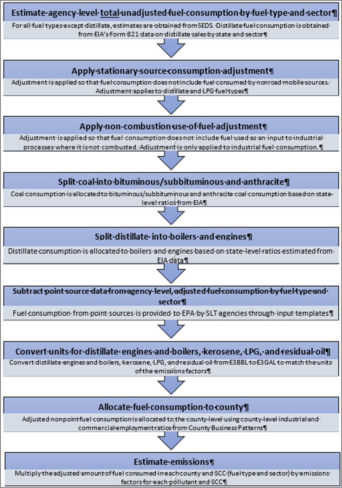

```{r, include=FALSE}
library(readxl)
library(knitr)
library(kableExtra)
library(readr)
library(ggplot2)
library(dplyr)
library(scales)
library(glue)
```

# Fuel Combustion – Nonpoint Industrial and Commercial/Institutional Boilers and ICEs {#ICI}

## Sector Descriptions and Overview 

Industrial, Commercial, and Institutional (ICI) fuel combustion sources are a significant portion of the total emissions inventory for many areas and include emissions from boilers, engines, and other combustion sources from the industrial, commercial, and institutional sectors that are not reported as point sources. This source category includes emissions from combustion of coal, distillate fuel oil, residual fuel oil, kerosene, liquefied petroleum gas (LPG), natural gas, and wood. Unless all ICI combustion emission sources are provided in an S/L/T point inventory submittal, it is necessary for inventory preparers to estimate ICI combustion nonpoint source emissions.

The EIS sectors documented in this section include these nonpoint emissions from ICI fuel combustion:

•	Fuel Comb - Industrial Boilers, ICEs - Biomass  \
•	Fuel Comb - Industrial Boilers, ICEs - Coal  \
•	Fuel Comb - Industrial Boilers, ICEs - Natural Gas  \
•	Fuel Comb - Industrial Boilers, ICEs - Oil  \
•	Fuel Comb - Industrial Boilers, ICEs - Other  \
•	Fuel Comb - Comm/Institutional - Biomass  \
•	Fuel Comb - Comm/Institutional - Coal  \
•	Fuel Comb - Comm/Institutional - Natural Gas  \
•	Fuel Comb - Comm/Institutional - Oil  \
•	Fuel Comb - Comm/Institutional - Other  \

We document all these sectors in this section because EPA generates all the nonpoint emissions from these EIS sectors via the “ICI Tool” module. S/L/Ts were encouraged to submit Point inventory activity data -via many options reflecting sector and fuel type- in order to compute the “remaining” nonpoint emissions component to these sectors. 

Table \@ref(tab:ICI-sccs) shows, for ICI fuel combustion, the nonpoint SCCs covered by the EPA ICI Tool as well emissions directly submitted by State/Local and Tribal agencies for the 2020 NEI. The SCC level 2, 3 and 4 descriptions are also provided except for the last SCC (2801520000), where the full SCC description is provided. The SCC level 1 description is “Stationary Source Fuel Combustion” for all SCCs except the last one. The leading sector description is “Fuel Comb” for all SCCs. 

```{r, include=FALSE}
df <- read_excel("./tables/Section-26/ICI-SCCs.xlsx")
df[is.na(df)] <- ""
```

```{r ICI-sccs, tidy=FALSE, echo=FALSE, booktabs = TRUE}
kableExtra::kbl(
  df, booktabs = TRUE, longtable = TRUE,
  caption = 'Nonpoint ICI SCCs',
) %>%

kableExtra::kable_styling(
    full_width = FALSE, position = "center",
    latex_options = c("hold_position", "repeat_header"),
  ) %>%
  kableExtra::column_spec(1, width = "2cm") %>%
  kableExtra::column_spec(2, width = "6cm") %>%
  kableExtra::column_spec(3, width = "4cm") %>%
  kableExtra::column_spec(4, width = "1cm") %>%
  kableExtra::column_spec(5, width = "1cm")
```

## EPA-developed estimates

The calculations for estimating emissions from the ICI sectors include estimating the total fuel consumption by sector for each agency, using data from the Energy Information Administration (EIA) State Energy Data System (SEDS) [[ref 1](#ICI-references)]. Total fuel consumption is adjusted to account for fuel consumed by mobile sources in each sector and fuel used as an input to industrial processes but is not combusted. Fuel consumption from nonpoint sources in each state is determined by subtracting fuel consumption from point sources from total fuel consumption. Estimated nonpoint source fuel consumption in each state is distributed to the county level based on the proportion of employment in the industrial and commercial sectors.  

### Activity Data 

The activity data for this source category is total fuel consumption in the industrial and commercial/institutional sectors. The default data for this category are obtained from the total state-level fuel consumption in each sector from EIA SEDS [[ref 1](#ICI-references)] for all fuel types except distillate. Distillate fuel consumption is taken from EIA’s Form 821 data, which reports distillate sales by state and sector [[ref 2](#ICI-references)]. State-level fuel consumption is allocated to agencies using the ratio of employment in the county corresponding to the local agency to employment in the state. Agency-level fuel consumption is calculated because some states also have local agencies that submit emissions to the NEI, and state, local, and tribal (SLT) agencies are expected to submit fuel consumption data from point sources in these sectors. The agency-level point source fuel consumption is subtracted from the total fuel consumption to estimate the fuel consumption from nonpoint sources. If agencies do not submit fuel consumption data from point sources, EPA default values are used. The point source subtraction method is described in more detail below.

Total, agency-level fuel consumption is adjusted to account for the fraction of fuel consumed by nonroad mobile sources, whose emissions are included in the nonroad inventory. This fraction is based on results from the National Mobile Inventory Model (NMIM), a precursor to EPA’s Motor Vehicle Emission Simulator (MOVES). This adjustment is particularly important for distillate fuel oil consumption. The ICI tool uses distillate consumption data from Form 821 rather than SEDS because Form 821 reports more detailed data by sector, and the ICI tool uses different stationary source fuel consumption assumptions by sector, including the industrial, commercial, farm, off-highway, and oil company sectors. Note that fuel consumption in the farm, off-highway, and oil company sectors are mapped to the industrial sector in the ICI tool. Assumptions about the fraction of fuel consumed by stationary sources are shown in an appendix. The Form 821 data was last released in 2020. To estimate the subsector-level distillate fuel consumption for 2023, the values from the 2020 Form 821 were grown using the state- and sector-level ratio of distillate consumption between 2020 and 2023 from SEDS. 

The total fuel consumption is also adjusted to account for fuel used as an input to industrial processes where it is not combusted. These assumptions are based on the EIA Manufacturing Energy Consumption Survey (MECS) [[ref 3](#ICI-references)], which reports total fuel consumption, energy consumption as nonfuel, and energy consumption as by fuel type and Census region. Assumptions about non-combustion use of fuel are shown in Table \@ref(tab:ICI-nonfuel-use). In some cases, EIA withholds the regional-level data on non-combustion use of fuel because it is less than 0.5 million barrels. Where possible in these cases, non-combustion use of fuel is estimated as the difference between total fuel consumption and energy consumption as fuel. A value of 0.25 million barrels is used as the amount of regional-level non-combustion use of fuels for all other cases. 

Note that the stationary source adjustment is performed for fuel consumption from both the industrial and commercial/institutional sectors, while the non-combustion use of fuel adjustment is performed only for fuel consumption in the industrial sector. 

\begin{equation} 
  AF_{f,s,x} = TF_{f,s,x} \times SS_{f,s,x} \times (1 - nc_{f,s,industrial})
  (\#eq:ICI-stationary-consumption)
\end{equation} 

<div style="margin-left: 2em;">
  Where: <br> \newline
  \( AF_{f,s,x} \) = Consumption of fuel *f* by stationary sources for agency *s* in sector *x* <br> \newline
  \( TF_{f,s,x} \) = Total consumption of fuel *f* for agency *s* in sector *x*, from EIA SEDS <br> \newline
  \( SS_{f,s,x} \) = Fraction of fuel *f* consumed by stationary sources for agency *s* in sector *x*  <br> \newline
  \( nc_{f,s,industrial} \) = Fraction of fuel *f* used as an industrial input and is not combusted in the state corresponding to agency *s* in the industrial sector, from Table \@ref(tab:ICI-nonfuel-use) <br> \newline
</div>

```{r, include=FALSE}
df <- read_excel("./tables/Section-26/ICI-nonfuel-use.xlsx")
df[is.na(df)] <- ""
```

```{r ICI-nonfuel-use, tidy=FALSE, echo=FALSE, booktabs = TRUE}
kableExtra::kbl(
  df, booktabs = TRUE, longtable = TRUE,
  caption = 'Assumed fraction of non-combustion use of fuel by fuel type and state',
) %>%
  
kableExtra::kable_styling(
    full_width = FALSE, position = "center",
    latex_options = c("hold_position", "repeat_header"),
  ) %>%
  kableExtra::column_spec(1, width = "2cm") %>%
  kableExtra::column_spec(2, width = "2cm") %>%
  kableExtra::column_spec(3, width = "2cm") %>%
  kableExtra::column_spec(4, width = "2cm") %>%
  kableExtra::column_spec(5, width = "2cm") %>%
  kableExtra::column_spec(6, width = "2cm") %>%
  kableExtra::column_spec(7, width = "2cm")
```

The SEDS data do not distinguish between anthracite and bituminous/subbituminous coal consumption estimates. The EIA table “Domestic Distribution of U.S. Coal by Destination State, Consumer, Origin and Method of Transportation” [[ref 4](#ICI-references)] provides state-level coal distribution data for 2006 that is used to estimate the fraction of coal consumption that is anthracite and bituminous/subbituminous. Table \@ref(tab:ICI-coal-distribution) presents these anthracite and bituminous coal ratios for each state.

```{r, include=FALSE}
df <- read_excel("./tables/Section-26/ICI-coal-distribution.xlsx")
df[is.na(df)] <- ""
```

```{r ICI-coal-distribution, tidy=FALSE, echo=FALSE, booktabs = TRUE}
kableExtra::kbl(
  df, booktabs = TRUE, longtable = TRUE,
  caption = 'Anthracite and Bituminous Coal Distribution for the Residential and Commercial Sectors',
) %>%
  
kableExtra::kable_styling(
    full_width = FALSE, position = "center",
    latex_options = c("hold_position", "repeat_header"),
  ) %>%
  kableExtra::column_spec(1, width = "3cm") %>%
  kableExtra::column_spec(2, width = "3cm") %>%
  kableExtra::column_spec(3, width = "3cm")
```
The SEDS data on industrial and commercial coal consumption are split into consumption of anthracite and bituminous/subbituminous coal based on the ratios in Table \@ref(tab:ICI-coal-distribution).

\begin{equation} 
  AF_{ant/bit,s,x} = AF_{coal,s,x} \times R_{ant/bit,s}
  (\#eq:ICI-bit-ant-distribution)
\end{equation} 

<div style="margin-left: 2em;">
  Where: <br> \newline
  \( AF_{ant/bit,s,x} \) = Adjusted anthracite or bituminous coal consumption for agency *s* in sector *x* <br> \newline
  \( AF_{coal,s,x} \) = Total adjusted coal consumption for agency *s* in sector *x*, from equation \@ref(eq:ICI-stationary-consumption) <br> \newline
  \( R_{ant/bit,s} \) = Ratio of anthracite or bituminous coal to total coal in state corresponding to agency *s*, from Table \@ref(tab:ICI-coal-distribution) <br> \newline
</div>

The EIA Form 821 data report total distillate consumption, but the NEI requires data separately on consumption by boilers and engines, because there are substantially different emissions factors for distillate boilers and engines. The ICI tool uses assumptions based on the EIA MECS [[ref 3](#ICI-references)] and the EIA Commercial Building Energy Consumption Survey (CBECS) [[ref 5](#ICI-references)]. These data sources suggest that in the industrial sector, 60 percent of distillate consumption is by boilers and 40 percent by engines, and in the commercial sector, 95 percent is by boilers and 5 percent is by engines. 

\begin{equation} 
  AF_{boiler/engine,s,x} = AF_{distillate,s,x} \times R_{boiler/engine,s,x}
  (\#eq:ICI-boiler-engine)
\end{equation} 

<div style="margin-left: 2em;">
  Where: <br> \newline
  \( AF_{boiler/engine,s,x} \) = Adjusted distillate consumption in boilers or engines for agency *s* in sector *x* <br> \newline
  \( AF_{distillate,s,x} \) = Total adjusted distillate consumption for agency *s* in sector *x*, from equation \@ref(eq:ICI-stationary-consumption) <br> \newline
  \( R_{boiler/engine,s,x} \) = Ratio of distillate consumption by boilers or engines in state corresponding to agency *s* in sector *x* <br> \newline
</div>

Following the adjustments to the total fuel consumption, the total fuel consumption data is also adjusted to subtract fuel consumption from point sources, which is accounted for in the point source inventory. Point source fuel consumption data by fuel type and sector is submitted by SLT agencies and supplemented by EPA defaults. This point source subtraction procedure is described in more detail below. The point source subtraction step is performed at the state level, and it is done before the allocation procedure discussed in the following section and before the emissions calculations discussed below. 

### Allocation Procedure 

SEDS data are reported at the state level. Following the allocation to agencies and the adjustments to the agency-level fuel consumption discussed above and the point source subtraction discussed below, the estimated agency-level nonpoint source activity data in each state is distributed to the county level based on employment in the industrial or commercial sector from the Census Bureau’s County Business Patterns [[ref 6](ICI-references)]. Employment in each sector is determined based on the crosswalk between North American Industrial Classification System (NAICS) codes in the Point inventory and sectors, as shown in Table \@ref(tab:ICI-NAICS-codes), where “Commercial” is interchangeable with the EIS “Commercial/Institutional” sector definition.

```{r, include=FALSE}
df <- read_excel("./tables/Section-26/ICI-NAICS-codes.xlsx")
df[is.na(df)] <- ""
```

```{r ICI-NAICS-codes, tidy=FALSE, echo=FALSE, booktabs = TRUE}
kableExtra::kbl(
  df, booktabs = TRUE, longtable = TRUE,
  caption = 'Mapping of NAICS codes to ICI sectors',
) %>%
  
kableExtra::kable_styling(
    full_width = FALSE, position = "center",
    latex_options = c("hold_position", "repeat_header"),
  ) %>%
  kableExtra::column_spec(1, width = "3cm") %>%
  kableExtra::column_spec(2, width = "3cm")
```

The adjusted nonpoint fuel consumption in each state is distributed to the county based on the proportion of employment in each county in each sector to the total employment at the state level in each sector. Figure \@ref(fig:ICI-overview) outlines the steps to calculate activity and ICI emissions, including adjusted fuel consumption and the allocation procedures described here.

\begin{equation} 
  NPF_{f,c,x} = NPF_{f,s,x} \times \frac{emp_{c,x}}{emp_{s,x}}
  (\#eq:ICI-county-distribution)
\end{equation} 

<div style="margin-left: 2em;">
  Where: <br> \newline
  \( NPF_{f,c,x} \) = Adjusted nonpoint consumption of fuel *f* in county *c* in sector *x* <br> \newline
  \( NPF_{f,s,x} \) = Adjusted nonpoint consumption of fuel *f* in county *c* in sector *x*, from equation \@ref(eq:ICI-PS-subtraction) <br> \newline
  \( emp_{c,x} \) = Employment in county *c* in sector *x* <br> \newline
  \( emp_{s,x} \) = Employment in state *s* in sector *x* <br> \newline
</div>

```{r ICI-overview, fig.cap="Overview of ICI Calculations", fig.alt="This figure shows an overview of the steps in the ICI calculations", echo=FALSE, out.width="75%", fig.pos="H"}

```
<a href="figures/Section-26/ICI-overview.png" download="figures/Section-26/ICI-overview.png" class="btn btn-primary">Download Figure</a>

### Emission Factors

The emissions factors for ICI sectors are from AP-42 [[ref 7](#ICI-references)] and a spreadsheet developed in 2010 by EPA and the Eastern Regional Technical Advisory Committee [[ref 8](#ICI-references)]. The emissions factors for ammonia are taken from one of two reports from EPA on ammonia emissions in the ICI sectors [[ref 9, ref 10](#ICI-references)].  The emissions factors for hazardous air pollutants from wood combustion in the ICI sectors are taken from EPA’s SPECIATE database [[ref 11](#ICI-references)]. These emission factors are provided in the “Wagon Wheel Emission Factor Compendium (NEI_Wagon_Wheel_Efs_FINAL)” on the [2023 NEI Supporting Data and Summaries site](https://gaftp.epa.gov/air/nei/2023/doc/supporting_data/nonpoint/).

The SO2 emissions factors for commercial and industrial bituminous coal are calculated using sulfur content of fuel. State-level sulfur content of bituminous coal is reported by EIA’s Coal Data Browser and applied at the county level [[ref 12](#ICI-references)]. Bituminous sulfur content data can be found in the Coal Consumption and Quality Data Set, filtered to only account for commercial and institutional sources. For states where bituminous sulfur content data is not reported by EIA, the bituminous sulfur content for the region corresponding to that state is used.

### Controls

There are no controls assumed for this category. However, the ICI tool includes options for SLT agencies to submit pollutant-, SCC-, and county- or state-specific control factors if needed. These control factors are a number between 0 and 1 that is multiplied by the emissions for that pollutant, SCC, and county. These factors allow SLT agencies to “fine tune” emissions estimates based on their understanding of how specific national and local rules combined with their penetration/effectiveness could lead to “composite-rule” emission factors for specific counties and pollutants. The relative difference between these “composite-rule” and default ICI tool emission factors can then be used to compute SCC-, county-, and pollutant-specific “controls.” 

### Emissions

Emissions in each ICI sector are estimated by multiplying the county-level nonpoint source fuel consumption by the emission factors from the “Wagon Wheel Emission Factor Compendium (NEI_Wagon_Wheel_Efs_FINAL)” on the [2023 NEI Supporting Data and Summaries site](https://gaftp.epa.gov/air/nei/2023/doc/supporting_data/nonpoint/).
 
\begin{equation} 
  E_{p,f,c,x} =  NPF_{f,c,x} \times EF_{p,f,x} 
  (\#eq:ICI-emissions)
\end{equation}
 
<div style="margin-left: 2em;">
  Where: <br> \newline
  \( E_{p,f,c,x} \) = Annual emissions of pollutant *p* from fuel type *f* in county *c* in sector *x* <br> \newline
  \( NPF_{f,c,x} \) = Nonpoint source consumption of fuel type *f* in county *c* in sector *x* <br> \newline
  \( EF_{p,f,x} \) = Emissions factor for pollutant *p*, fuel type *f*, and sector *x* <br> \newline
</div>

### Point Source Subtraction

The adjusted fuel consumption discussed above in the section on activity data is an estimate of the agency-level total fuel combusted for all sources, including point and nonpoint sources. To estimate the fuel consumption from only nonpoint sources, the fuel consumption from point sources is subtracted from the total adjusted fuel consumption. The fuel consumption from point sources is provided to EPA by SLT agencies. Starting with the 2020 NEI, EPA developed default point source fuel consumption by sector and fuel type for states that did not submit point source data in input templates. The EPA default data is estimated based on SLT agency submissions to the point inventory.

The starting point for computing state-level point fuel consumption (PFf,s,x) begins by matching NEI (EIS/state) facility identifier codes with EIA facilities in EIA-923 data [[ref 13](#ICI-references)] to identify facilities that are in the industrial, commercial, or electric utility sectors. NEI facilities that match EIA-923 facilities with EIA sector assignments of 4 (Commercial NAICS Non-Co-gen) or 5 (Commercial NAICS Cogen) are assigned as “Commercial/Institutional” whose point source throughput activity data (consumption) are subject to Point subtraction from EIA SEDS. Similarly, NEI facilities that match EIA-923 facilities with EIA sector assignments of 6 (Industrial NAICS Non-Co-gen) or 7 (Industrial NAICS Cogen) are assigned as “Commercial/Institutional” whose point source throughput activity data (consumption) are subject to Point subtraction from EIA SEDS. NEI facilities that match EIA-923 facilities with EIA sector assignments of 1, 2 or 3 (Electric Utility, NAICS-22 Non-Cogen, and NAICS-22 Cogen, respectively) are assigned as “EGU” and thus not subject to Point “ICI” subtraction. An existing EIA 923 to NEI (EIS/state) facility ID cross-reference to EIA ICI sectors is available for each state “ICI_sector_assignments_2023SLT_EIA923_then_NAICS_fixed_4862_22may25” on the [2023 NEI Supplemental Nonpoint data FTP site](https://gaftp.epa.gov/air/nei/2023/doc/supporting_data/nonpoint/).

The remaining facilities that are not matched to EIA-923 facilities are then assigned to “Industrial”, “Commercial/Institutional” or “N/A” based on facility NAICS codes provided in Table \@ref(tab:ICI-NAICS-codes).

Once all point facilities have been mapped to the appropriate sector via either the EIA-923 or the NAICS assignments, the point inventory fuel consumption data are then aggregated by fuels using one of four different options to identify the fuel: 

•	_Option A_: By NAICS and SCC. In this option, SLT agencies submit state-level point source data aggregated by NAICS code and SCC. NAICS codes are used to map the point source fuel consumption to the appropriate ICI sector according to the mapping in Table \@ref(tab:ICI-NAICS-codes). SCCs are used to identify the type of fuel consumed, according to the mapping “ICI_OptionA_MSN_SectorFuel_xwalk.xlsx” available on the [2023 NEI Supplemental Nonpoint data FTP site](https://gaftp.epa.gov/air/nei/2023/doc/supporting_data/nonpoint/).  \
•	_Option B_: By NAICS and Fuel Type. If the SLT agency knows the type of fuel consumed at each facility, the agency can submit fuel consumption by fuel type and NAICS. As with option A, the NAICS code will be used to map the fuel consumption to the appropriate sector.  \
•	_Option C_: Point Source Fuel Consumption By Sector and Fuel Type. If the SLT agency has an alternative approach for determining the state-level fuel consumption by point sources in the industrial and commercial/institutional sectors by fuel type, the agency can submit this data directly.  \
•	_Option D_: Nonpoint Source Fuel Consumption By Sector and Fuel Type. If the SLT agency has an alternative approach for determining the state-level fuel consumption by nonpoint sources in the industrial and commercial/institutional sectors by fuel type, the agency can submit this data directly. If the SLT agency chooses this option, point source subtraction is not needed, and the nonpoint source fuel consumption will be used directly to estimate emissions without further adjustment.   \

\begin{equation} 
  NPF_{f,s,x} =  AF_{f,s,x} - PF_{f,s,x} 
  (\#eq:ICI-PS-subtraction)
\end{equation}
 
<div style="margin-left: 2em;">
  Where: <br> \newline
  \( NPF_{f,s,x} \) = Adjusted nonpoint consumption of fuel *f* in state *s* in sector *x* <br> \newline
  \( AF_{f,s,x} \) = Total consumption of fuel *f* in state *s* in sector *x* <br> \newline
  \( PF_{f,s,x} \) = Consumption of fuel *f* by point sources in state*s* in sector *x* <br> \newline
</div>

Following point source subtraction at the state level, the estimated state-level nonpoint source fuel consumption is distributed to the states based on employment in the industrial and commercial sectors, as discussed above in the section on the allocation procedures.

### Sample Calculations

Table \@ref(tab:ICI-sample-calculations) lists sample calculations to determine PM25-PRI emissions from nonpoint source bituminous/subbituminous coal combustion in the industrial sector. Note that the equations in the table are listed in the order of the calculations, not in the order in which they are presented in this document. The values in these equations are demonstrating program logic and are not representative of any specific NEI year or county.

```{r, include=FALSE}
df <- data.frame(
  Eq = c(1:3, 6, 4:5),
  Equation = c("$AF_{f,s,x} = TF_{f,s,x} \\times SS_{f,s,x} \\times (1 - nc_{f,s,industrial})$",
               "$AF_{ant/bit,s,x} = AF_{coal,s,x} \\times R_{ant/bit,s}$",
               "$AF_{boiler/engine,s,x} = AF_{distillate,s,x} \\times R_{boiler/engine,s,x}$",
               "$NPF_{f,s,x} =  AF_{f,s,x} - PF_{f,s,x}$",
               "$NPF_{f,c,x} = NPF_{f,s,x} \\times frac{emp_{c,x}}{emp_{s,x}}$",
               "$E_{p,f,c,x} =  NPF_{f,c,x} \\times EF_{p,f,x}$"),
  Values = c("$454 \\text{ thousand tons} \\times 1 \\times (1 - 0.2632)$",
             "$334.5 \\text{ thousand tons} \\times 1$",
             "$N/A$",
             "$334.5 \\text{ thousand tons} - 300 \\text{ thousand tons}$",
             "$34.5 \\text{ thousand tons} \\times \\frac{17,733 \\text{ county-level industrial employees}}{861,292 \\text{ state-level industrial employees}}$",
             "$0.71 \\text{ thousand tons} \\times 2.44 \\text{ lbs. PM25-PRI per ton}$"),
  Result = c("334.5 thousand tons adjusted industrial coal consumption in the state",
             "334.5 thousand tons industrial bituminous/ subbituminous coal consumption in the state",
             "Not needed for coal consumption",
             "34.5 thousand tons industrial nonpoint source bituminous/ subbituminous coal consumption",
             "0.71 thousand tons industrial nonpoint source bituminous/ subbituminous coal consumption in the county",
             "1,732 lbs. (0.866 tons) PM25-PRI emissions from industrial nonpoint source bituminous/ subbituminous coal consumption in the county")
)
```
```{r ICI-sample-calculations, tidy=FALSE, echo=FALSE, booktabs = TRUE}
kableExtra::landscape(
  kableExtra::kbl(
    df,booktabs = TRUE,longtable = TRUE,
    escape = FALSE,  # allow LaTeX in cells
    caption = "Sample Calculations",
    col.names = c("Eq. \\#", "Equation", "Values", "Result"),
  ) %>%
    kableExtra::kable_styling(position = "center",
      latex_options = c("repeat_header"),font_size = 10) %>%
    kableExtra::column_spec(1, latex_column_spec = "p{2cm}") %>%
    kableExtra::column_spec(2, latex_column_spec = "p{7cm}") %>%
    kableExtra::column_spec(3, latex_column_spec = "p{6cm}") %>%
    kableExtra::column_spec(4, latex_column_spec = "p{6cm}")
)
```
### Improvements/Changes in the 2023 NEI

The Form 821 data on distillate consumption by state and subsector has not been updated by EIA since 2020. In order to estimate the state- and subsector-level distillate consumption in 2023, the 2020 data from Form 821 was grown based on state- and sector-level ratios between 2020 and 2023 distillate consumption from SEDS.

### Puerto Rico and U.S. Virgin Islands
Since insufficient data exists to calculate emissions for the counties in Puerto Rico and the U.S. Virgin Islands, we based emissions for those domains on two proxy counties in Florida: 12011, Broward County for Puerto Rico and 12087, Monroe County for the U.S. Virgin Islands. The total emissions in pounds for these two Florida counties are divided by their respective populations creating a pound per capita emission factor. For each Puerto Rico and U.S. Virgin Island county, the pound per capita emission factor is multiplied by the county population (from the same year as the inventory’s activity data) which serves as the activity data. In these cases, the throughput (activity data) unit and the emissions denominator unit are “EACH”.

## References {#ICI-references}

1.	Energy Information Administration, 2025. [State Energy Data System](https://www.eia.gov/state/seds/), 2023 data.
2.	Energy Information Administration. 2022. [Form 821: Sales of Distillate Fuel Oil by End Use](https://www.eia.gov/petroleum/fueloilkerosene/), 2020 data.
3.	Energy Information Administration. 2021. [Manufacturing Energy Consumption Survey](https://www.eia.gov/consumption/manufacturing/), 2018 data.
4.	Energy Information Administration. 2025. [Annual Coal Distribution Report](https://www.eia.gov/coal/distribution/annual/), 2023 data.
5.	Energy Information Administration. 2015. [Commercial Building Energy Consumption Survey](https://www.eia.gov/consumption/commercial/), 2012 data.
6.	U.S. Census Bureau. 2025. [County Business Patterns](https://www.census.gov/programs-surveys/cbp.html), 2023 data.
7.	U.S. Environmental Protection Agency.  1996. [Compilation of Air Pollutant Emission Factors, 5th Edition, AP-42, Volume I:  Stationary Point and Area Sources](https://www.epa.gov/air-emissions-factors-and-quantification/ap-42-compilation-air-emissions-factors-stationary-sources).  Research Triangle Park, North Carolina.
8.	[EPA and Eastern Regional Technical Advisory Committee](https://gaftp.epa.gov/Air/nei/2023/doc/supporting_data/nonpoint/state_comparison%20ERTAC%20SS_version7_5%20Mar%2016%202010.xls). 2010.
9.	Battye, W. Battye, C. Overcash, and S. Fudge. 1994. [Development and Selection of Ammonia Emission Factors: Final Report](https://nepis.epa.gov/Exe/ZyNET.exe/P100ERTR.TXT?ZyActionD=ZyDocument&Client=EPA&Index=1991+Thru+1994&Docs=&Query=&Time=&EndTime=&SearchMethod=1&TocRestrict=n&Toc=&TocEntry=&QField=&QFieldYear=&QFieldMonth=&QFieldDay=&IntQFieldOp=0&ExtQFieldOp=0&XmlQuery=&File=D%3A%5Czyfiles%5CIndex%20Data%5C91thru94%5CTxt%5C00000028%5CP100ERTR.txt&User=ANONYMOUS&Password=anonymous&SortMethod=h%7C-&MaximumDocuments=1&FuzzyDegree=0&ImageQuality=r75g8/r75g8/x150y150g16/i425&Display=hpfr&DefSeekPage=x&SearchBack=ZyActionL&Back=ZyActionS&BackDesc=Results%20page&MaximumPages=1&ZyEntry=1&SeekPage=x&ZyPURL).  Durham, NC: EC/R Incorporated.  Prepared for USEPA Office of Research and Development.
10.	E.H. Pechan and Associates, Inc. 2004. [Estimating Ammonia Emissions from Anthropogenic Nonagricultural Sources](https://www.epa.gov/sites/default/files/2015-08/documents/eiip_areasourcesnh3.pdf). Durham, NC. Prepared for USEPA Emission Factor and Inventory Group.
11.	EPA. 2016. [SPECIATE](https://www.epa.gov/air-emissions-modeling/speciate) v4.5. Fireplace wood combustion – pine wood.
12.	Energy Information Administration. 2022. [Coal Data Browser](https://www.eia.gov/coal/data/browser/), 2023 data. 
13.	Energy Information Administration. 2024. [Form 923 Electricity Sector Data](https://www.eia.gov/electricity/data/eia923/), 2023 data.
