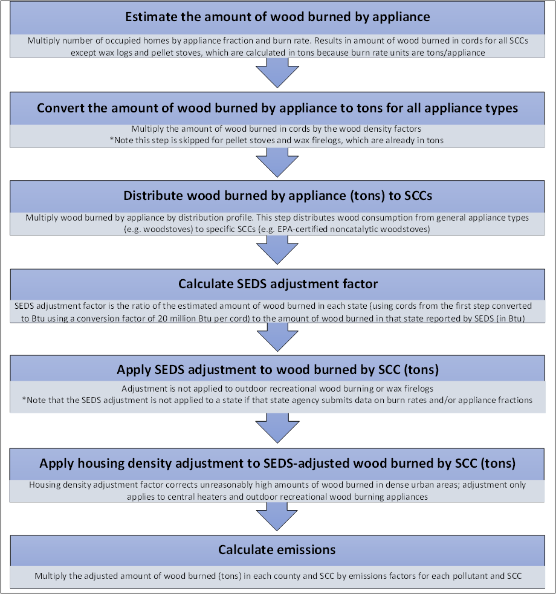

```{r, include=FALSE}
library(readxl)
library(knitr)
library(kableExtra)
library(readr)
library(ggplot2)
library(dplyr)
library(scales)
library(glue)
```

# Fuel Combustion – Residential Heating: Wood {#RWC}

## Sector Descriptions and Overview 

Residential wood combustion (RWC) appliances, such as wood-burning fireplaces, woodstoves, and wood-burning hydronic heaters, are significant sources of air pollution in the United States—especially during winter months. The appliances create heat or ambience by combusting wood, firelogs or wood pellets. RWC emits large amounts of fine particulate matter (PM25-PRI), volatile organic compounds (VOCs), and hazardous air pollutants (HAPs) that are known to contribute to poor human health, air quality, and visibility. 

All active SCCs for the RWC sector are provided in Table \@ref(tab:RWC-sccs); the last column indicates the SCCs that EPA estimates (as “X”). The SCC level 1 and 2 descriptions are “Stationary Source Fuel Combustion; Residential” for all SCCs.


```{r, include=FALSE}
df <- read_excel("./tables/Section-28/RWC-SCCs.xlsx")
df[is.na(df)] <- ""
```

```{r RWC-sccs, tidy=FALSE, echo=FALSE, booktabs = TRUE}
kableExtra::kbl(
  df, booktabs = TRUE, longtable = TRUE,
  caption = 'Active RWC SCCs, with EPA-estimated SCCs highlighted',
) %>%
kableExtra::kable_styling(
    full_width = FALSE, position = "center",
    latex_options = c("hold_position", "repeat_header"),
  ) %>%
  kableExtra::column_spec(1, width = "2cm") %>%
  kableExtra::column_spec(2, width = "2cm") %>%
  kableExtra::column_spec(3, width = "5cm") %>%
  kableExtra::column_spec(4, width = "4cm") %>%
  kableExtra::column_spec(5, width = "1cm")
```

## EPA-developed estimates

To improve estimates in this sector from the 2017 NEI forward, the EPA, along with the Commission on Environmental Cooperation (CEC), the Northeast States for Coordinated Air Use Management (NESCAUM), and Abt Associates, conducted a national survey of wood-burning activity in 2018. The results of this survey [[ref 1](#RWC-references)] were used to estimate county-level burning activity, as discussed in more detail below.

The activity data for this category is the amount of wood burned in each county, which is based on data from the CEC survey on the fraction of homes in each county that use each wood-burning appliance and the average amount of wood burned in each appliance [[ref 1](#RWC-references)]. These assumptions are used with the number of occupied homes in each county [[ref 8](#RWC-references)] to estimate the total amount of wood burned in each county, in cords for cordwood appliances and tons for pellet appliances. Cords of wood are converted to tons using county-level density factors calculated based on USDA firewood density by tree species and USDA state surveys on county-level counts of trees [[ref 3](#RWC-references)]; these wood density factors are available in the file “RWC_Wood_Density_USDA_WW_feb2022.xlsx”, and USDA state survey on tree populations in the file “Number of trees by county and species CONUS most recent_Feb2022.xlsx” on the [2023 NEI Supplemental nonpoint data FTP site](https://gaftp.epa.gov/air/nei/2023/doc/supporting_data/nonpoint/). Emissions are calculated by multiplying the tons of wood burned by emissions factors. To calculate emissions in this sector, some adjustments are made to the county-level tons of wood calculated. An overview of the calculations to estimate emissions can be found in Figure \@ref(fig:RWC-overview).

```{r RWC-overview, fig.cap="Overview of Calculations to Estimate Emissions from Residential Wood Combustion", fig.alt="This figure shows an overview of the steps in the RWC calculations", echo=FALSE, out.width="75%", fig.pos="H"}

```
<a href="figures/Section-28/RWC-overview.png" download="figures/Section-28/RWC-overview.png" class="btn btn-primary">Download Figure</a>

### Activity Data

The activity data (amount of wood burned) for RWC relies on a regression model developed from the CEC survey, along with other sources of data and assumptions that are used to make adjustments to the regression model’s results. The CEC survey received 2,984 responses, and it asked questions about whether and how often the respondent used the different wood burning appliances and how much wood they burned annually. Note that the survey didn’t ask how many appliances of each type were in the home, just the amount of wood by appliance type. It also asked demographic questions about the respondents. EPA used statistical regression approaches to develop appliance fractions and burn rates for each county, based on predictor variables from the survey responses. These predictor variables include:

•	The number of heating degree days in 2017, by county, associated with the climate zone where the respondent lives, from the National Oceanic and Atmospheric Administration (NOAA) [[ref 4](#RWC-references)].  \
•	The population density (people per square mile) in 2017 of the county the respondent lives in, from the Census Bureau [[ref 5](#RWC-references)].  \
•	Whether the zip code where the respondent lives is considered urban or rural, according to data from the Census Bureau [[ref 6](#RWC-references)].  \
•	The percentage of forest cover in the county whether the respondent lives, according to the Biogenic Emissions Landuse Database (BELD, v4.1) [[ref 7](#RWC-references)].  \
•	The fraction of homes that use natural gas as a primary heat source in 2017 in the county where the respondent lives, according to data from the American Community Survey [[ref 8](#RWC-references)].  \
•	The type of home the respondent lives in (single family detached, single family attached, multifamily, mobile), based on responses in the CEC survey.  \

The regression analysis compared all respondents who said they used a given appliance type, such as a woodstove, to develop an equation based on each of these predictor variables. For example, survey respondents who lived in areas with more heating degree days (i.e. colder climates) or areas where few homes used natural gas as a primary heat source (i.e. they might not have much natural gas service) tended to be more likely to say that they used a given wood-burning appliance. 

Table \@ref(tab:RWC-appliance-predictors) lists the predictor variables used in the regression models to develop appliance fractions for each appliance type, along with the sign and significance of the coefficient. A plus sign indicates a positive coefficient, meaning a positive relationship between the variable and the fraction of homes in a county that use the appliance. For example, in the regression model for woodstoves, there is a positive relationship between homes that use woodstoves and heating degree days. This means that areas with more heating degree days (i.e., colder areas) are more likely to use woodstoves. Type of home (e.g., single family detached, multi-family) was also used as a predictor variable. In most cases, single family detached homes are more likely to use woodburning appliances and multifamily homes are less likely to use woodburning appliances. 

Note that not all predictor variables were used for each regression model. If the coefficient of a predictor variable was significant at the 0.05 level (indicted in Table \@ref(tab:RWC-appliance-predictors) by an asterisk), it was used in the model. If the sign on the coefficient matched expectations, it was used in the model, even if the coefficient was not statistically significant. For example, it was expected that there would be a negative relationship between percent of homes that use natural gas as a primary heat source and homes that burn wood, indicating that areas with more natural gas availability would be less likely to burn wood. The models for fireplace inserts, hydronic heaters, and furnaces found this relationship, but it was not statistically significant. Nevertheless, this predictor variable was retained in the models for these appliances to improve the predictive ability of the regression equations. 


```{r, include=FALSE}
df <- read_excel("./tables/Section-28/RWC-appliance-predictors.xlsx")
df[is.na(df)] <- ""
```

```{r RWC-appliance-predictors, tidy=FALSE, echo=FALSE, booktabs = TRUE}
kableExtra::kbl(
  df, booktabs = TRUE, longtable = TRUE,
  caption = 'Predictor variables used to develop appliance fractions, along with the sign and significance of the coefficient estimated by the regression analysis',
) %>%
kableExtra::kable_styling(
    full_width = FALSE, position = "center",
    latex_options = c("hold_position", "repeat_header"),
  ) %>%
  kableExtra::column_spec(1, width = "3cm") %>%
  kableExtra::column_spec(2, width = "1.5cm") %>%
  kableExtra::column_spec(3, width = "2cm") %>%
  kableExtra::column_spec(4, width = "2cm") %>%
  kableExtra::column_spec(5, width = "2cm") %>%
  kableExtra::column_spec(6, width = "1.5cm") %>%
  kableExtra::column_spec(7, width = "2cm")
```
_\* Indicates the coefficient is significant at the 0.05 level  _

The regression equation estimates the probability that a home in a given county, with a given set of predictor variables (using data from the inventory year), will use each type of wood-burning appliance. Therefore, when values of the predictor variables from each county are plugged into the equation, the result is a county-specific appliance fraction, which represents the fraction of homes in that county that use each type of wood-burning appliance. For example, urban counties with a low number of heating degree days, high population density, low forest cover, and many homes using natural gas tend to have a low appliance fraction for most appliances. County-specific appliance fractions are calculated separately for six appliance types: fireplaces, fireplace inserts, free-standing woodstoves, pellet stoves, central heaters (e.g. wood hydronic heaters or furnaces), and outdoor recreational equipment (such as fire pits). The process for splitting or aggregating these appliance types into each of the 15 SCCs is discussed below. Wax firelogs were not included in the survey and therefore appliance fractions for that SCC were pulled forward from the 2014 NEI, which was mostly based on expert judgment.

Burn rates, which represent the annual average amount of wood burned by each type of appliance in a home, are also calculated using regression analysis and the same predictor variables listed above. When county-level values of the predictor variables are plugged into the burn rate regression equation, the result is county-specific burn rates for each appliance type. The burn rates are estimated for each of the same 6 appliance types as the appliance fractions. Predictor variables and the sign and significance of the estimated coefficients are shown in Table \@ref(tab:RWC-burn-predictors).

```{r, include=FALSE}
df <- read_excel("./tables/Section-28/RWC-burn-predictors.xlsx")
df[is.na(df)] <- ""
```

```{r RWC-burn-predictors, tidy=FALSE, echo=FALSE, booktabs = TRUE}
kableExtra::kbl(
  df, booktabs = TRUE, longtable = TRUE,
  caption = 'Predictor variables used to develop burn rates, along with the sign and significance of the coefficient estimated by the regression analysis',
) %>%
kableExtra::kable_styling(
    full_width = FALSE, position = "center",
    latex_options = c("hold_position", "repeat_header"),
  ) %>%
  kableExtra::column_spec(1, width = "3cm") %>%
  kableExtra::column_spec(2, width = "1.5cm") %>%
  kableExtra::column_spec(3, width = "2cm") %>%
  kableExtra::column_spec(4, width = "2cm") %>%
  kableExtra::column_spec(5, width = "2cm") %>%
  kableExtra::column_spec(6, width = "1.5cm") %>%
  kableExtra::column_spec(7, width = "2cm")
```
_\* Indicates the coefficient is significant at the 0.05 level  _

Note that starting with the 2023 NEI, a new SCC structure is used in which freestanding woodstoves and fireplace inserts are aggregated into a single set of SCCs for all woodstoves (with separate SCCs for non-catalytic, catalytic, and non-EPA certified), as shown in Table \@ref(tab:RWC-sccs). The appliance fractions and burn rates are estimated separately for freestanding woodstoves and fireplace inserts, and the total amount of wood consumed by both appliance types in each county is summed together.

After an initial review of the wood-burning activity predicted by the appliance fractions and burn rates developed from the CEC survey data, EPA decided to make two adjustments to the estimates. The first adjustment applies to central heaters and outdoor recreational equipment. After an initial review of predicted wood-burning activity, EPA felt that the estimated amount of wood burned in these appliances in dense urban areas was unreasonably high. Therefore, EPA developed an adjustment factor based on the housing density (homes/mi2) in each county, based on the equation for a sigmoid curve. The housing density adjustment factor is calibrated such that it approaches 0 when county-level housing density approaches 1,000 homes/mi2. The housing density adjustment factor is multiplied by the predicted wood-burning activity only for central heating appliances (wood hydronic heaters and furnaces) and outdoor recreational wood-burning appliances. 

\begin{equation} 
  HAF_{c} = - \frac{1}{1 + e^{-0.01(HD_{c}-500)}} + 1
  (\#eq:RWC-housing-adjustment)
\end{equation} 

<div style="margin-left: 2em;">
  Where: <br> \newline
  \( HAF_{c} \) = Housing density adjustment factor for county *c* <br> \newline
  \( HD_{c} \) = Housing density in county *c*, in homes per square mile <br> \newline
</div>

The appliance fractions are then adjusted using the housing density adjustment factor. 

\begin{equation} 
  AF_{c,a} = HAF_{c} \times AF_{unadj,c,a}
  (\#eq:RWC-adj-app-frac)
\end{equation} 

<div style="margin-left: 2em;">
  Where: <br> \newline
  \( AF_{c,a} \) = Adjusted appliance fraction for appliance type *a* in county *c* <br> \newline
  \( HAF_{c} \) = Housing density adjustment factor for county *c* <br> \newline
  \( AF_{unadj,c,a} \) = Appliance fraction for appliance type *a* in county *c*, determined from the CEC survey <br> \newline
</div>

In some cases, the regression model predicts appliance fractions of 0 for certain counties and appliance types, particularly in dense urban areas. In these cases, the burn rates for those counties and appliances are also set to 0. 

The appliance fractions and burn rates are multiplied by the number of occupied homes in each county from the 2023 American Community Survey [[ref 9](#RWC-references)]  using the 5-year average for the current data year to estimate the amount of wood burned in each county, in cords or tons, depending on whether the appliance burns cordwood or pellets. For devices that burn cordwood, the estimated number of cords burned in each county is multiplied by a county-level wood density factor from the U.S. Forest Service.

\begin{equation} 
  W_{c,a} = H_{c} \times AF_{c,a} \times BR_{c,a} \times D_{c}
  (\#eq:RWC-wood-burned)
\end{equation} 

<div style="margin-left: 2em;">
  Where: <br> \newline
  \( W_{c,a} \) = Amount of wood burned in appliance type *a* in county *c*, in tons per year <br> \newline
  \( H_{c} \) = Number of occupied homes in county *c* <br> \newline
  \( AF_{c,a} \) = Adjusted appliance fraction for appliance type *a* in county *c* <br> \newline
  \( BR_{c,a} \) = Burn rate for appliance type *a* in county *c*, determined from the CEC survey, in cords or tons burned per appliance <br> \newline
  \( D_{c} \) = Wood density factor for county *c*, in tons per cord of wood (used only for cordwood appliance types) <br> \newline
</div>

As discussed above, the appliance fractions and burn rates are used to estimate wood-burning activity at the appliance level in each county. This activity for certain appliance types must be distributed from the appliance level to the specific SCC level. For example, wood burned in “woodstoves” must be apportioned to three SCCs: non-EPA certified stoves, EPA certified non-catalytic stoves, and EPA certified catalytic stoves. For woodstoves and fireplace inserts, EPA used distribution profiles based on a combination of census-region-level data from the EIA Residential Energy Consumption Survey (RECS) to determine whether woodstoves or fireplace inserts are EPA certified. Although RECS does not specifically ask whether the woodstove is EPA certified, it does ask the age of the appliance. It is assumed that any appliance in the oldest age bin in RECS (20 years or older) is uncertified.^[A 20-year-old appliance in the 2020 RECS would have been manufactured in 2000, which is after the 1988 NSPS for wood stoves. However, this is the oldest age bin in RECS. EPA lacks data on the fraction of appliances in this age bin that were manufacturer before or after 1988. Therefore, EPA assumed that all appliances in this age bin were uncertified.]  All appliances less than 20 years old are assumed to be EPA certified. The split between EPA certified non-catalytic and catalytic stoves is based on an analysis of stove sales data from 2017 to 2021 [[ref 10](#RWC-references)], which suggests that certified stoves are 80 percent non-catalytic and 20 percent catalytic. The distribution profiles for woodstoves and fireplace inserts are shown in Table \@ref(tab:distr-profile-stoves). 

The CEC survey data were seen to be more reliable for developing distribution profiles for central heaters, i.e., wood hydronic heaters and furnaces. Survey respondents listed whether they owned a furnace or a hydronic heater, whether it was located inside or outside the home, and whether it burned cordwood or pellets. These responses were used to develop distribution profiles for the central heaters, which are shown in Table \@ref(tab:distr-profile-central-CEC). However, because the SCCs for the 2023 NEI were expanded to delineate certified versus uncertified units for hydronic heaters (as they have different emission factors), the Table \@ref(tab:distr-profile-central-CEC) distribution factors need to be further disaggregated. To do this, we assumed that 95% of hydronic heaters are uncertified cordwood and the remaining hydronic heater types are equally distributed across the remaining 5%. The resulting central heater distributions (with adjustments to ensure the sum of the factors is equal to 1) is provided in Table \@ref(tab:distr-profile-central-adjusted).

The default distribution profiles are estimated at the Census Region level for woodstoves and fireplace inserts and nationally for central heaters, but the RWC tool allows the profiles to be adjusted for each county. Not all appliance types need to be distributed. Appliance populations of fireplaces, pellet stoves, and outdoor recreational equipment are estimated directly from the regression equations and are not multiplied distribution fractions. 

The amount of wood-burning activity in each SCC in each county is determined by multiplying the county-level wood-burning activity by appliance type by the distribution profile for each SCC. 

\begin{equation} 
  W_{c,SCC} = W_{c,a} \times DP_{SCC}
  (\#eq:RWC-wood-burned)
\end{equation} 

<div style="margin-left: 2em;">
  Where: <br> \newline
  \( W_{c,SCC} \) = Amount of wood burned in each SCC in county *c*, in tons per year <br> \newline
  \( W_{c,a} \) = Amount of wood burned in appliance type *a* in county *c*, in tons per year <br> \newline
  \( DP_{SCC} \) = Distribution profile for each SCC from Table \@ref(tab:distr-profile-stoves) or Table \@ref(tab:distr-profile-central-adjusted), depending on the appliance type <br> \newline
</div>

```{r, include=FALSE}
df <- read_excel("./tables/Section-28/distr-profile-stoves.xlsx")
df[is.na(df)] <- ""
```

```{r distr-profile-stoves, tidy=FALSE, echo=FALSE, booktabs = TRUE}
kableExtra::kbl(
  df, booktabs = TRUE,
  caption = 'Distribution profiles for woodstoves and fireplace inserts by Census Region',
) %>%
kable_styling(full_width = FALSE, position = "center", latex_options = c("hold_position", "scale_down"))
```

```{r, include=FALSE}
df <- read_excel("./tables/Section-28/distr-profile-central-CEC.xlsx")
df[is.na(df)] <- ""
```

```{r distr-profile-central-CEC, tidy=FALSE, echo=FALSE, booktabs = TRUE}
kableExtra::kbl(
  df, booktabs = TRUE,
  caption = 'Distribution profiles for central heaters from the CEC Survey',
) %>%
kable_styling(full_width = FALSE, position = "center", latex_options = c("hold_position", "scale_down"))
```

```{r, include=FALSE}
df <- read_excel("./tables/Section-28/distr-profile-central-adjusted.xlsx")
df[is.na(df)] <- ""
```

```{r distr-profile-central-adjusted, tidy=FALSE, echo=FALSE, booktabs = TRUE}
kableExtra::kbl(
  df, booktabs = TRUE,
  caption = 'Resulting distribution profiles for all central heaters SCCs',
) %>%
kable_styling(full_width = FALSE, position = "center", latex_options = c("hold_position", "scale_down"))
```

The second adjustment EPA made to the predicted wood consumption corrects the total wood-burning activity in each state. The amount of residential wood-burning activity initially predicted by the appliance fractions and burn rates was significantly higher than the state-level totals reported by EIA’s State Energy Data System (SEDS) [[ref 2](#RWC-references)] for most states. As a result, EPA developed an adjustment factor to normalize the state-level residential wood-burning activity predicted by the tool to the amount predicted by SEDS. The SEDS adjustment factor is developed by summing the predicted amount of wood-burning activity to the state level in each state and dividing it by the state-level amount of residential wood consumption reported by SEDS. SEDS reports wood consumption in Btu, rather than cords; therefore the wood-burning activity predicted by the RWC tool is converted from cords to Btu using a conversion factor of 20 million Btu per cord, from the SEDS documentation [[ref 11](#RWC-references)], or 16.4 million Btu per ton of pellets [[ref 12](#RWC-references)]. In addition, SEDS only includes wood consumption for residential heating; therefore, predicted wood consumption from outdoor recreational wood-burning (2104008700) and wax firelogs (2104009000) are not summed to calculate the SEDS adjustment. 

In 2018, SEDS updated the methodology for estimating state-level residential wood consumption. Previously, SEDS estimated residential wood consumption using state-level data from the 2009 Residential Energy Consumption Survey (RECS), and for states that did not have data, using ACS data on housing units to allocate the national estimate of wood consumption from RECS. From 2018 forward, SEDS began using national-level data on wood consumption from the Monthly Energy Review (MER), which, for the version of 2023 SEDS used for the NEI, is based on data from the 2020 RECS, with projections based on the Annual Energy Outlook. SEDS allocates the national-level wood consumption to the state level using a combination of data from the American Community Survey on the number of housing units that use wood as a primary heat source and data on heating degree days [[ref 13](#RWC-references)]. 

\begin{equation} 
  SAF_{s} = \frac{W_{s,SEDS}}{\sum{W_{c,SCC}}}
  (\#eq:SEDS-adjustment)
\end{equation} 

<div style="margin-left: 2em;">
  Where: <br> \newline
  \( SAF_{s} \) = SEDS adjustment factor for state *s* <br> \newline
  \( W_{s,SEDS} \) = Amount of wood burned in state *s*, as reported by SEDS, in BBtu <br> \newline
  \( W_{c,SCC} \) = Amount of wood burned in each SCC in county *c*, in BBtu <br> \newline
</div>

Analysis of the RECS microdata shows that both the fraction of homes burning wood and the amount of wood burned in urban areas tends to be lower than the fraction of urban wood burning homes estimated by the Wagon Wheel for most states. Similarly, rural wood burning fractions among RECS survey respondents tend to be higher than urban wood burning fractions estimated by the Wagon Wheel for most states. To better align with state-level urban and rural wood burning fractions calculated using RECS microdata, an urban/rural adjustment is applied. 
The RECS microdata indicates the amount of wood burned by respondent and whether the respondent lives in an urban or rural census tract, as defined by the Census Bureau. RECS rural and urban consumption across respondents is summed to the state level to calculate the urban and rural fractions. 

\begin{equation} 
  Frac_{s,\frac{urban}{rural},RECS} = \frac{\sum{W_{s,\frac{urban}{rural},RECS}}}{\sum{W_{s,total,RECS}}}
  (\#eq:urban-rural-adjustment-RECS)
\end{equation} 

<div style="margin-left: 2em;">
  Where: <br> \newline
  \( Frac_{s,urban/rural,RECS} \) = Fraction of wood consumption in state *s* that is urban or rural according to the RECS survey <br> \newline
  \( W_{s,urban/rural,RECS} \) = Wood consumption in state *s* that is urban or rural from the RECS survey <br> \newline
  \( W_{s,total,RECS} \) = Total wood consumption in state *s* from the RECS survey <br> \newline
</div>

The RECS urban and rural fractions are compared to those derived from the Wagon Wheel data. To do this we first determine the amount of urban and rural wood consumption estimated by the Wagon Wheel, based on the fraction of urban and rural homes in each county. Note that because the RECS survey is focused on wood consumption for heating, outdoor recreational burning and wax firelogs are excluded from these calculations.

\begin{equation} 
  W_{c,\frac{urban}{rural},WW} = W_{c,total,WW} \times \frac{OccupiedHomes_{c,\frac{urban}{rural}}}{OccupiedHomes_{c,total}}
  (\#eq:urban-rural-adjustment-WW)
\end{equation} 

<div style="margin-left: 2em;">
  Where: <br> \newline
  \( W_{c,urban/rural,WW} \) = Fraction of wood consumption in county *c* that is urban or rural according to the Wagon Wheel <br> \newline
  \( W_{c,total,WW} \) = Total wood consumption (tons) in county *c* from the Wagon Wheel <br> \newline
  \( OccupiedHomes_{c,urban/rural} \) = Number of urban or rural occupied homes in county *c* <br> \newline
  \( OccupiedHomes_{c,total} \) = Total number of occupied homes in county *c* <br> \newline
</div>

Urban and rural wood consumption is then summed to the state level and divided by the total wood consumption in the state to develop urban and rural fractions for the Wagon Wheel estimations.

\begin{equation} 
  Frac_{s,\frac{urban}{rural},WW} = \frac{\sum{W_{c,\frac{urban}{rural},WW}}}{\sum{W_{c,total,WW}}}
  (\#eq:urban-rural-adjustment-WW-frac)
\end{equation} 

<div style="margin-left: 2em;">
  Where: <br> \newline
  \( Frac_{s,urban/rural,WW} \) = Fraction of wood consumption in state *s* that is urban or rural according to the Wagon Wheel <br> \newline
  \( W_{c,urban/rural,WW} \) = Fraction of wood consumption in county *c* that is urban or rural according to the Wagon Wheel <br> \newline
  \( W_{c,total,WW} \) = Total wood consumption (tons) in county *c* from the Wagon Wheel <br> \newline
</div>

The adjustment factor is calculated by dividing the RECS urban or rural wood consumption by the WW urban or rural wood consumption for the state (Table \@ref(tab:urban-rural-adj-factor)). 

\begin{equation} 
  AF_{s,\frac{urban}{rural}} = \frac{Frac_{s,\frac{urban}{rural},RECS}}{Frac_{s,\frac{urban}{rural},WW}}
  (\#eq:urban-rural-adjustment-factor)
\end{equation} 

<div style="margin-left: 2em;">
  Where: <br> \newline
  \( AF_{s,urban/rural} \) = Urban or rural adjustment factor for state *s* <br> \newline
  \( Frac_{s,urban/rural,RECS} \) = Fraction of wood consumption in state *s* that is urban or rural according to RECS <br> \newline
  \( Frac_{s,urban/rural,WW} \) = Fraction of wood consumption in state *s* that is urban or rural according to the Wagon Wheel <br> \newline
</div>

```{r, include=FALSE}
df <- read_excel("./tables/Section-28/urban-rural-adj-factor.xlsx")
df[is.na(df)] <- ""
```

```{r urban-rural-adj-factor, tidy=FALSE, echo=FALSE, booktabs = TRUE}
kableExtra::kbl(
  df, booktabs = TRUE, longtable = TRUE,
  caption = 'State-level urban and rural adjustment factors',
) %>%
kableExtra::kable_styling(
    full_width = FALSE, position = "center",
    latex_options = c("hold_position", "repeat_header"),
  ) %>%
  kableExtra::column_spec(1, width = "1cm") %>%
  kableExtra::column_spec(2, width = "3cm") %>%
  kableExtra::column_spec(3, width = "3cm")
```

Urban and rural wood consumption in each county is multiplied by the urban or rural adjustment factor for that state along with the SEDS adjustment factor. Note that the wood consumption in this calculation has already been adjusted using the housing adjustment factor, in equations \@ref(eq:RWC-housing-adjustment) through \@ref(eq:RWC-wood-burned). This following calculation further adjusts the wood consumption to redistribute consumption to match urban and rural consumption patterns from RECS and to align with EIA’s SEDS estimates. 

\begin{equation} 
  Wadj_{c,\frac{urban}{rural}} = W_{c,\frac{urban}{rural},WW} \times AF_{s,\frac{urban}{rural}} \times SAF_{s}
  (\#eq:adjusted-wood-burned)
\end{equation} 

<div style="margin-left: 2em;">
  Where: <br> \newline
  \( Wadj_{c,urban/rural} \) = Adjusted urban or rural wood burned in county *c* <br> \newline
  \( W_{c,urban/rural,WW} \) = Unadjusted urban or rural wood burned in county *c*, according to the Wagon Wheel <br> \newline
  \( AF_{s,urban/rural} \) = Urban or rural adjustment factor for state *s* <br> \newline
  \( SAF_{s} \) = SEDS adjustment factor for state *s* <br> \newline
</div>

Finally, the total adjusted wood consumption in each county is determined by adding the adjusted urban and rural wood consumption in each county.

\begin{equation} 
  AW_{c,SCC} = Wadj_{c,urban,WW} + Wadj_{c,rural,WW}
  (\#eq:total-adjusted-wood-burned)
\end{equation} 

<div style="margin-left: 2em;">
  Where: <br> \newline
  \( AW_{c,SCC} \) = Adjusted wood burned in each SCC in county *c*, in tons per year <br> \newline
  \( Wadj_{c,urban} \) = Adjusted urban wood burned in county *c* in tons <br> \newline
  \( Wadj_{c,rural} \) = Adjusted rural wood burned in county *c* in tons  <br> \newline
</div>

In summary, regression data from the CEC survey was used to estimate wood activity, with several adjustments applied at different stages in the process.  For convenience, the adjustments that impact the each of the SCCs is in Table \@ref(tab:RWC-adjustment-summary) provided below.

```{r, include=FALSE}
df <- read_excel("./tables/Section-28/RWC-adjustment-summary.xlsx")
df[is.na(df)] <- ""
```

```{r RWC-adjustment-summary, tidy=FALSE, echo=FALSE, booktabs = TRUE}
kableExtra::kbl(
  df, booktabs = TRUE, longtable = TRUE,
  caption = 'Summary of adjustments for all Wagon Wheel RWC SCCs',
) %>%
kableExtra::kable_styling(
    full_width = FALSE, position = "center",
    latex_options = c("hold_position", "repeat_header"),
  ) %>%
  kableExtra::column_spec(1, width = "2cm") %>%
  kableExtra::column_spec(2, width = "1cm") %>%
  kableExtra::column_spec(3, width = "4cm") %>%
  kableExtra::column_spec(4, width = "2cm") %>%
  kableExtra::column_spec(5, width = "2cm") %>%
  kableExtra::column_spec(6, width = "1.5cm") %>%
  kableExtra::column_spec(7, width = "1.5cm")
```

### Allocation Procedure 

Appliance fractions and burn rates are calculated at the county-level. There is no need to allocate data to the county level for this category.

### Emission Factors

Emissions factors for RWC come primarily from AP-42 [[ref 14](#RWC-references)] and Houck and Eagle (2006) [[ref 15](#RWC-references)], but also from Traviss et al. (2024) [[ref 16](#RWC-references)]. Emissions factors for wax firelogs are from Li and Rosenthal (2006) [[ref 17](#RWC-references)]. Additional emission factors are taken from Houck et al. (2001) [[ref 18](#RWC-references)] and Aurell et al. (2012) [[ref 19](#RWC-references)]. Emission factors for condensable PM (PM-CON) were developed using EPA’s PM Augmentation Tool, and emission factors for filterable PM (PM25-FIL and PM10-FIL) were calculated by taking the difference between the primary PM emission factors and the PM-CON factor for each appliance. 

A complete list of emission factors for all RWC SCCs and pollutants are provided in the “RWC EFs” worksheet in the workbook “RWC 2023 EF compendium_15nov2024.xlsx” available on the [2023 NEI Supplemental nonpoint data FTP site](https://gaftp.epa.gov/air/nei/2023/doc/supporting_data/nonpoint/). Emission factors and sources for 2020 emission factors are also provided for comparison in this worksheet.

### Controls

There are no controls assumed for this category. However, SLT agencies may submit state- or county-level control factors that will adjust the emissions by SCC.

### Emissions

For pollutants that are not estimated by HAP augmentation, emissions from RWC are calculated by multiplying the adjusted amount of wood burned in each SCC in each county by SCC- and pollutant-specific emissions factors.
 
\begin{equation} 
  E_{c,SCC,p} =  AW_{c,SCC} \times EF_{SCC,p}
  (\#eq:emissions-RWC)
\end{equation}
 
<div style="margin-left: 2em;">
  Where: <br> \newline
  \( E_{c,SCC,p} \) = Emissions of pollutant *p* from each SCC in county *c* <br> \newline
  \( AW_{c,SCC} \) = Adjusted wood burned in each SCC in county *c*, in tons per year <br> \newline
  \( EF_{SCC,p} \) = Emissions factor for pollutant *p* for each SCC <br> \newline
</div>

### Sample Calculations

Table \@ref(tab:rwc-sample-calculations) lists sample calculations for the estimation of emissions of PM25-PRI from non-EPA certified wood stoves. The values in these equations are demonstrating program logic and are not representative of any specific NEI year or county.

```{r, include=FALSE}
df <- data.frame(
  Eq = c("1","2","3","4","5",6.1, 6.2, 7.1, 7.2, 8.1, 8.2, 9.1, 9.2, 10.1, 10.2, "11", "12"),
  Equation = c("$HAF_{c} = - \\frac{1}{1 + e^{-0.01(HD_{c}-500)}} + 1$",
               "$AF_{c,a} = HAF_{c} \\times AF_{unadj,c,a}$",
               "$W_{c,a} = H_{c} \\times AF_{c,a} \\times BR_{c,a} \\times D_{c}$",
               "$W_{c,SCC} = W_{c,a} \\times DP_{SCC}$",
               "$SAF_{s} = \\frac{W_{s,SEDS}}{\\sum{W_{c,SCC}}}$",
               "$Frac_{s,urban,RECS} = \\frac{\\sum{W_{s,urban,RECS}}}{\\sum{W_{s,total,RECS}}}$",
               "$Frac_{s,rural,RECS} = \\frac{\\sum{W_{s,rural,RECS}}}{\\sum{W_{s,total,RECS}}}$",
               "$W_{c,urban,WW} = W_{c,total,WW} \\times \\frac{OccupiedHomes_{c,urban}}{OccupiedHomes_{c,total}}$",
               "$W_{c,rural,WW} = W_{c,total,WW} \\times \\frac{OccupiedHomes_{c,rural}}{OccupiedHomes_{c,total}}$",
               "$Frac_{s,urban,WW} = \\frac{\\sum{W_{c,urban,WW}}}{\\sum{W_{c,total,WW}}}$",
               "$Frac_{s,rural,WW} = \\frac{\\sum{W_{c,rural,WW}}}{\\sum{W_{c,total,WW}}}$",
               "$AF_{s,urban} = \\frac{Frac_{s,urban,RECS}}{Frac_{s,urban,WW}}$",
               "$AF_{s,rural} = \\frac{Frac_{s,rural,RECS}}{Frac_{s,rural,WW}}$",
               "$Wadj_{c,urban} = W_{c,urban,WW} \\times AF_{s,urban} \\times SAF_{s}$",
               "$Wadj_{c,rural} = W_{c,rural,WW} \\times AF_{s,rural} \\times SAF_{s}$",
               "$AW_{c,SCC} = Wadj_{c,urban,WW} + Wadj_{c,rural,WW}$",
               "$E_{c,SCC,p} =  AW_{c,SCC} \\times EF_{SCC,p}$"),
  Values = c("$\\text{This equation is not applied for woodstoves}$",
             "$\\text{This equation is not applied for woodstoves}$",
             "$71,521 \\text{ homes} \\times 0.0751 \\times 1.9304 \\times 1.643 \\text{tons per cord}$",
             "$17,028 \\times 0.12$",
             "$\\frac{18,147 \\text{ BBtu}}{17,780 \\text{ BBtu}}$",
             "$\\frac{2,9000,545,796.7}{22,232,155,310.8}$",
             "$\\frac{19,331,609,514}{22,232,155,310.8}$",
             "$2,043.4 \\times 0.8$",
             "$2,043.4 \\times 0.2$",
             "$\\frac{1,641.8}{2,043.4}$",
             "$\\frac{401.8}{2,043.4}$",
             "$\\frac{0.13}{0.68}$",
             "$\\frac{0.87}{0.32}$",
             "$1,641.6 \\times 0.19 \\times 1.02$",
             "$401.8 \\times 2.75 \\times 1.02$",
             "$1,129.6 + 319.4$",
             "$1,446 \\times 30.6 \\text{ lbs per ton}$"),
  Result = c("n/a",
             "n/a",
             "17,028 tons of wood burned in woodstoves",
             "2,043.4 tons of wood burned in non-EPA certified woodstoves",
             "1.02 SEDS adjustment factor",
             "0.13 RECS urban fraction",
             "0.87 RECS rural fraction",
             "1,641.6 tons of wood burned in urban counties",
             "401.8 tons of wood burned in rural counties",
             "0.68 WW urban fraction",
             "0.32 WW rural fraction",
             "0.19 urban adjustment",
             "2.75 rural adjustment",
             "319.4 tons of urban wood",
             "1,129.6 tons of rural wood",
             "1,449 tons of wood burned",
             "44,339 lbs. (22.17 tons) PM25-PRI from non-EPA certified woodstoves ≤ 4 ft3")
)
```
```{r rwc-sample-calculations, tidy=FALSE, echo=FALSE, booktabs = TRUE}
kableExtra::landscape(
  kableExtra::kbl(
    df,booktabs = TRUE,longtable = TRUE,
    escape = FALSE,  # allow LaTeX in cells
    caption = "Sample Calculations",
    col.names = c("Eq. \\#", "Equation", "Values", "Result"),
  ) %>%
    kableExtra::kable_styling(position = "center",
      latex_options = c("repeat_header"),font_size = 10) %>%
    kableExtra::column_spec(1, latex_column_spec = "p{2cm}") %>%
    kableExtra::column_spec(2, latex_column_spec = "p{7cm}") %>%
    kableExtra::column_spec(3, latex_column_spec = "p{6cm}") %>%
    kableExtra::column_spec(4, latex_column_spec = "p{6cm}")
)
```
### Improvements/Changes in the 2023 NEI

The SCCs were updated for the residential wood combustion sector in the 2023 NEI. In addition, emission factors were updated for CAPs and HAPs. 

Based on an analysis of RECS microdata that suggested the NEI has historically overestimated wood burning in urban areas and underestimated wood burning in rural areas, the methodology was updated in 2023 to include an urban/rural adjustment. This adjustment redistributes wood consumption and associated emissions in most states from urban areas to rural areas.

In addition, based on a review of stove sales data, the distribution profiles for stoves were updated to reflect an assumption that certified stoves are 80% non-catalytic and 20% catalytic.  Distribution profiles for hydronic heaters were added in order to estimate wood burned associated with the new hydronic heater SCCs (which break out the indoor and outdoor hydronic heaters into certified and uncertified types) based on an assumption that 95% of wood-burning hydronic heaters are certified and 5% are uncertified.


### Puerto Rico and U.S. Virgin Islands
Since insufficient data exists to calculate emissions for the counties in Puerto Rico and the U.S. Virgin Islands, we based emissions for those domains on two proxy counties in Florida: 12011, Broward County for Puerto Rico and 12087, Monroe County for the U.S. Virgin Islands. The total emissions in pounds for these two Florida counties are divided by their respective populations creating a pound per capita emission factor. For each Puerto Rico and U.S. Virgin Island county, the pound per capita emission factor is multiplied by the county population (from the same year as the inventory’s activity data) which serves as the activity data. In these cases, the throughput (activity data) unit and the emissions denominator unit are “EACH”.

## References {#RWC-references}

1.	CEC. 2019. [Residential Wood Use Survey to Improve Black Carbon Emissions Inventory Data for Small-Scale Biomass Combustion](https://www.nescaum.org/documents/cec-abt-nescaum-residential-wood-survey-final-report-201904.pdf). Montreal, Canada: Commission for Environmental Cooperation.
2.	Energy Information Administration. 2023. [State Energy Data System](https://www.eia.gov/state/seds/).
3.	U.S. Department of Agriculture (USDA). 2009. [Timber Products Output Survey](https://www.fs.usda.gov/srsfia/php/tpo_2009/tpo_rpa_int1.php). U.S. Forest Service. 
4.	NOAA. 2019. [Degree Days Statistics](https://www.cpc.ncep.noaa.gov/products/analysis_monitoring/cdus/degree_days/). Washington, DC: National Weather Service, Climate Prediction Center. 
5.	U.S. Census Bureau. 2019. [County Population Totals and Components of Change: 2010-2018](https://www.census.gov/programs-surveys/popest/data/data-sets.2017.html). Washington, DC. 
6.	U.S. Census Bureau. 2018. [Urban and Rural](https://www.census.gov/programs-surveys/geography/guidance/geo-areas/urban-rural.html). Washington, DC. 
7.	U.S. Environmental Protection Agency. 2018. [Biogenic Emissions Sources](https://www.epa.gov/air-emissions-modeling/biogenic-emission-sources).
8.	U.S. Census Bureau. 2018. [American Community Survey](https://www.census.gov/programs-surveys/acs). Washington, DC. 
9.	U.S. Census Bureau. 2024. [American Community Survey](https://www.census.gov/programs-surveys/acs.). Washington, DC. 
10.	Email correspondence between John Crouch, HPBA and Madeleine Strum, EPA “RE catalytic vs noncatalytic question – for the national emissions inventory.msg”, available on the 2023 NEI Supplemental nonpoint data FTP site
11.	Energy Information Administration. 2022. [State Energy Data System 2020: Consumption Technical Notes](https://www.eia.gov/state/seds/sep_use/notes/use_technotes.pdf).
12.	U.S. Forest Service. 2024. [Tech Line: Fuel Value Calculator](https://www.fpl.fs.usda.gov/documnts/techline/fuel-value-calculator.pdf).
13.	Energy Information Administration. 2024. [State Energy Data System 2023: Consumption Technical Notes, Section 5: Renewable Energy](https://www.eia.gov/state/seds/sep_use/notes/use_renew.pdf).
14.	U.S. Environmental Protection Agency. 1996. [AP-42, Fifth Edition, Chapter 1 External Combustion Sources, Sections 1.9 Residential Fireplaces and 1.10 Residential Wood Stove](https://www.epa.gov/air-emissions-factors-and-quantification/ap-42-fifth-edition-volume-i-chapter-1-external-0).
15.	Houck, J.E. and B.N. Eagle. 2006. [Task 6 Technical Memorandum 4 (Final Report): Control Analysis and Documentation for Residential Wood Combustion in the MANE-VU Region](https://www.regulations.gov/document/EPA-HQ-OAR-2009-0734-0031). Prepared for MARAMA.
16.	Traviss, N., G. Allen, and M. Ahmadi. 2024. [Criteria, Greenhouse Gas, and Hazardous Air Pollutant Emissions Factors from Residential Cordwood and Pellet Stoves Using an Integrated Duty Cycle Test Protocol](https://doi.org/10.1021/acsestair.4c00135). ACS ES&T Air, 1(9), 1190-1202. 
17.	Li, V.S. and S.R. Rosenthal. 2006. [Content and Emission Characteristics of Artificial Wax Firelogs](https://www.structuretech1.com/wp-content/uploads/2011/08/EPA-Study-on-wax-fire-logs.pdf). Poster presentation at 15th International Emission Inventory Conference. New Orleans, Louisiana. May 15-18, 2006.
18.	Houck, J.E., J. Crouch, and R.H. Huntley. 2001. [Review of Wood Heater and Fireplace Emission Factors](https://www.researchgate.net/publication/237396509_Review_of_Wood_Heater_and_Fireplace_Emission_Factors). Technical presentation at the International Emission Inventory Conference. Denver, CO.
19. Aurell, J., B.K. Gullett, D. Tabor, et al. 2012. [Semivolatile and Volatile Organic Compound Emissions from Wood-Fired Hydronic Heaters](https://pubs.acs.org/doi/10.1021/es301197d). Environmental Science and Technology, 46: 7898-7904.
